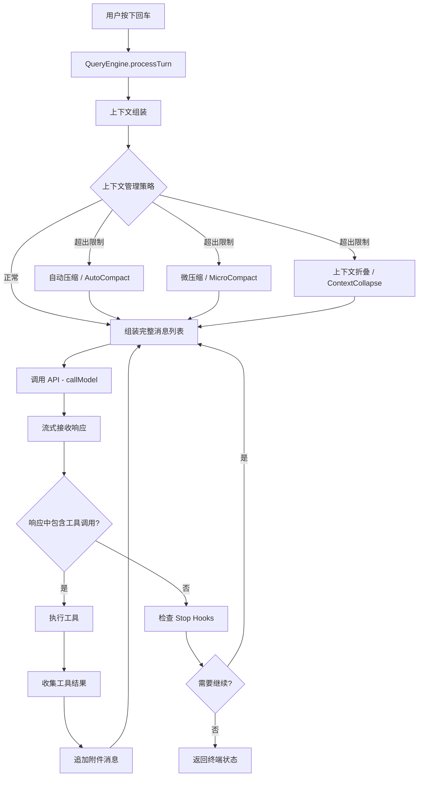
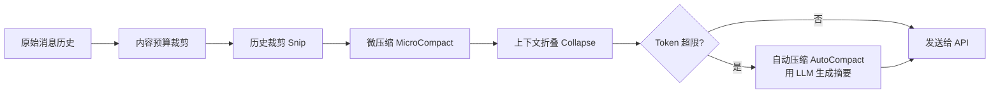
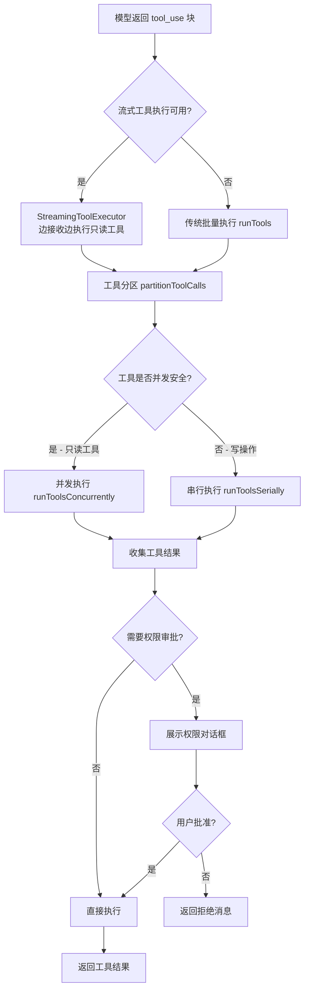
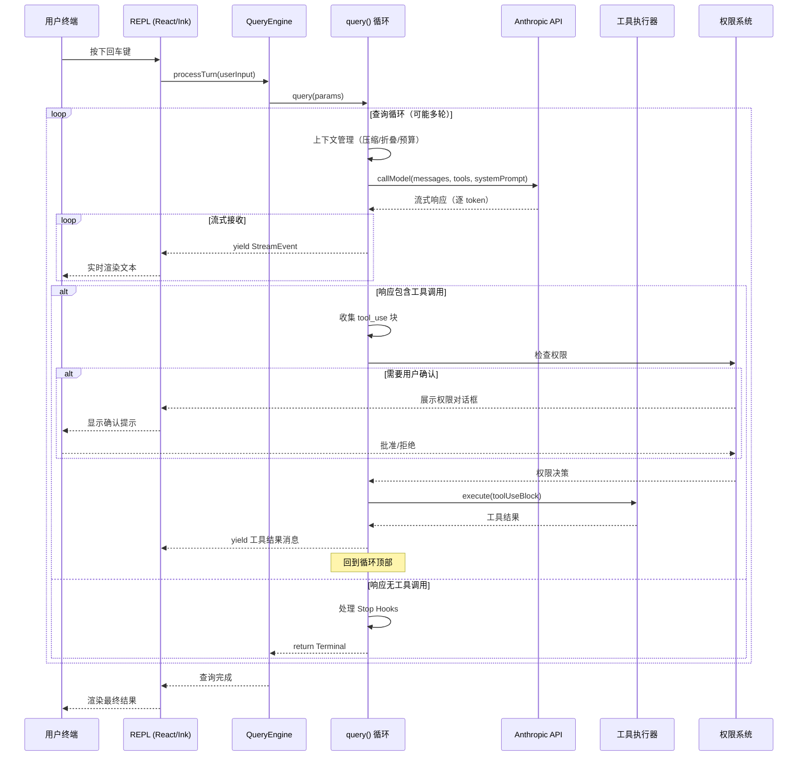

# 第 1 章：一次请求的完整旅程

## 从回车键到终端渲染——追踪一条消息的生命周期

理解一个复杂系统最好的方式，不是逐个阅读每个模块的文档，而是追踪一次完整的请求流过整个系统的全过程。本章我们将从用户在终端按下回车键的那一刻开始，跟随一条消息穿越输入处理、上下文组装、API 调用、流式响应、工具执行、结果回传，直到最终在终端屏幕上渲染出来。通过这一条主线，你将建立起对 Claude Code 整个系统的直觉。

## 1.1 起点：从终端输入到 REPL

当用户在终端中运行 `claude` 命令时，整个系统的启动链路是这样的：

1. **命令行解析**（`main.tsx`）：使用 Commander.js 解析 CLI 参数，确定运行模式（交互式 REPL、非交互式 `--print`、SDK 模式等）。
2. **环境初始化**（`setup.ts`）：在首次用户交互之前完成关键的环境准备工作——设置工作目录、Node 版本检查、捕获 Hook 配置快照、预取 API Key、初始化文件变更监视器。
3. **渲染 REPL**（`replLauncher.tsx`）：动态导入 `App` 组件和 `REPL` 屏幕，调用 Ink 的渲染引擎将 React 组件树挂载到终端。

值得注意的是 `main.tsx` 中精心安排的启动顺序。文件最顶部有一系列"副作用导入"——`startMdmRawRead()`、`startKeychainPrefetch()`——它们在模块加载阶段就开始并行执行 I/O 操作，与后续约 135ms 的模块导入过程重叠。这种"尽早启动、延后等待"的策略，是将"用户感知到的启动延迟"压缩到最低的关键。具体而言，`startKeychainPrefetch` 并行触发 macOS 钥匙串的两个读取操作（OAuth token 和 legacy API key），否则这些操作会在 `applySafeConfigEnvironmentVariables` 中串行执行，额外增加约 65ms 的启动延迟。

```
源码位置：
  main.tsx         — CLI 入口、命令行解析、启动编排
  setup.ts         — 环境初始化（Node 版本检查、权限验证、后台任务）
  replLauncher.tsx  — REPL 渲染入口
```

## 1.2 用户输入处理

在 REPL 界面中，用户按下回车键后，输入的文本不是直接发送给 API 的。它首先经过 `QueryEngine` 的处理：

1. **用户输入预处理**（`utils/processUserInput/processUserInput.ts`）：解析斜杠命令（如 `/compact`、`/clear`）、处理文件附件、识别特殊的输入模式。
2. **消息创建**（`utils/messages.ts`）：将用户的原始输入包装成结构化的 `UserMessage` 对象，包含消息类型、内容块、时间戳等元数据。

这个预处理步骤是一个关键的架构决策——它将"用户想做什么"和"系统如何执行"解耦。斜杠命令不需要经过 LLM，直接在本地处理；而普通对话消息则进入查询循环。

```
源码位置：
  QueryEngine.ts              — 查询引擎，协调一次完整的用户交互
  utils/processUserInput/     — 输入预处理管道
  utils/messages.ts           — 消息工厂函数
```

## 1.3 查询循环：系统的心脏

`query.ts` 中的 `query()` 函数是整个系统最核心的部分——它是一个 **AsyncGenerator**，实现了一个可能执行多轮的查询循环。这个设计选择非常关键：



### 为什么用 AsyncGenerator？

`query()` 函数的签名是 `async function* query(): AsyncGenerator<StreamEvent | Message, Terminal>`。这是一个 **异步生成器**——它在 `yield` 点将控制权交还给调用者，同时保留自己的执行状态。

这个设计解决了三个核心问题：

1. **流式传输**：API 的响应是逐 token 到达的。生成器可以在每收到一个事件时立即 `yield`，让 UI 层实时渲染，而不必等待整个响应完成。
2. **状态保持**：当模型调用工具后，循环需要带着工具结果回到 API。生成器的闭包天然地保留了 `messages`、`toolUseContext` 等跨迭代状态。
3. **可中断性**：调用者可以通过生成器的 `.return()` 方法随时中断循环，生成器内部的 `AbortController` 会传播取消信号到 API 调用和工具执行。

### 循环的状态管理

`query.ts` 中的 `State` 类型定义了跨迭代携带的可变状态：

- `messages`：当前对话的完整消息历史
- `toolUseContext`：工具执行上下文（权限、配置等）
- `autoCompactTracking`：自动压缩的追踪状态
- `maxOutputTokensRecoveryCount`：输出 token 超限后的恢复计数
- `pendingToolUseSummary`：上一轮工具调用的摘要（异步生成中）

每次循环继续时，通过 `state = { ... }` 创建新的状态对象（而非原地修改），这是一种轻量的不可变模式，让状态变化清晰可追踪。

```
源码位置：
  query.ts         — 核心查询循环（~1700 行）
  query/config.ts  — 查询配置构建
  query/deps.ts    — 依赖注入（可测试性）
```

值得注意的是 `query/config.ts` 中的 `buildQueryConfig()`——它在循环入口处一次性快照所有运行时配置（Statsig 特性门、环境变量等），生成一个不可变的 `QueryConfig` 对象。这样设计是为了防止配置在循环迭代之间发生变化导致不一致。但 `feature()` 门控（Bun 的编译时条件）被刻意排除在外，因为它们是构建时的死代码消除边界，必须保留在代码中才能被 tree-shake。这种"运行时配置快照一次、编译时门控就地使用"的混合策略，是 Claude Code 在可测试性和构建优化之间找到的平衡。

## 1.4 上下文管理：对话历史的智能控制

在每次调用 API 之前，系统会对上下文（对话历史）进行多层处理，确保既不超出 token 限制，又尽量保留最有价值的信息。这个处理管道的顺序非常重要：

1. **内容预算**（`applyToolResultBudget`）：对累计工具结果大小施加每条消息的预算限制。在微压缩之前运行，因为微压缩按 `tool_use_id` 做缓存匹配，内容替换对它不可见。
2. **历史裁剪**（`snipCompact`，受 `HISTORY_SNIP` feature 门控）：移除过远的旧消息，释放 token 空间。释放的 token 数传递给自动压缩的阈值检查。
3. **微压缩**（`microcompact`）：用缓存的摘要替换旧的工具调用/结果对。
4. **上下文折叠**（`contextCollapse`，受 `CONTEXT_COLLAPSE` feature 门控）：将消息历史投影到一个压缩视图。折叠是一种"读时投影"——摘要消息存储在折叠存储中而非 REPL 数组中，这使得折叠可以跨轮次持久化。
5. **自动压缩**（`autoCompact`）：当上下文仍然过大时，使用 LLM 生成整个对话的摘要。包含连续失败计数器作为熔断器，防止无限重试。



这个多层设计的智慧在于：越靠前的步骤成本越低。内容预算裁剪是纯计算操作，几乎零成本；自动压缩则需要一次额外的 API 调用，成本最高。系统优先尝试廉价操作，只有在必要时才动用昂贵的手段。

```
源码位置：
  services/compact/compact.ts          — 压缩核心逻辑
  services/compact/autoCompact.ts      — 自动压缩触发判断
  services/compact/reactiveCompact.ts  — 响应式压缩（API 返回 413 后触发）
  services/contextCollapse/index.js    — 上下文折叠
```

## 1.5 API 调用：与 Claude 模型对话

上下文准备就绪后，系统通过 `callModel()` 发起 API 请求。这个函数定义在 `services/api/claude.ts` 中，负责：

1. 将内部消息格式转换为 Anthropic API 的消息格式（`MessageParam`）
2. 将内部工具定义转换为 API 的工具 schema（`BetaToolUnion`）
3. 配置流式传输参数（`stream: true`）
4. 处理思考模式（thinking mode）配置
5. 发送请求并通过 `for await...of` 消费流式响应

API 调用中还包含一个精巧的**模型降级机制**：当主模型（如 Opus）因负载过高返回错误时，`FallbackTriggeredError` 会被捕获，系统自动切换到备用模型（如 Sonnet）重试整个请求。

```
源码位置：
  services/api/claude.ts   — API 调用核心
  services/api/client.ts   — Anthropic SDK 客户端配置
  services/api/withRetry.ts — 重试与降级逻辑
```

## 1.6 流式响应处理

API 返回的流式事件在 `query.ts` 的 `for await` 循环中被逐个处理。引擎通过 `deps.callModel()` 调用 API——这里的 `deps` 是一个**依赖注入**对象（定义在 `query/deps.ts`），将 `callModel`、`autocompact`、`microcompact`、`uuid` 等核心操作抽象为可替换的函数接口，使得测试可以直接注入模拟实现，而不需要通过 `spyOn` 去逐个 mock 模块。

每个流式事件可能是：
- **助手消息**（`assistant`）：包含文本或工具调用块。文本块立即 `yield` 给 UI 渲染。
- **工具调用块**（`tool_use`）：被收集到 `toolUseBlocks` 数组中，同时如果有 `StreamingToolExecutor`，只读工具会立即开始执行。
- **可恢复错误**（如 `max_output_tokens`、`prompt_too_long`）：被特殊处理——先"扣留"（withhold）不发送给 UI，尝试自动恢复（如提高 token 上限、触发上下文坍缩或响应式压缩），仅在恢复失败后才展示给用户。

扣留机制的实现非常精巧：每个可恢复错误都有对应的 `isWithheld*` 判断函数，在流式循环中检查。如果错误被扣留，它仍然被推入 `assistantMessages` 数组（用于后续恢复逻辑），但不会被 `yield` 出去。这种"扣留-恢复"模式是系统**优雅降级**思想的典型体现。

## 1.7 工具执行：从模型意图到实际行动

当模型请求调用工具时（`stop_reason === 'tool_use'`），系统进入工具执行阶段：



工具执行的分区设计（`partitionToolCalls`）非常巧妙：系统将工具分为**并发安全**（如 `FileRead`、`Glob`）和**非并发安全**（如 `FileEdit`、`Bash`）两类。只读工具可以并行执行，而写操作必须串行执行以避免冲突。

更进一步的优化是 `StreamingToolExecutor`——它允许在模型仍在流式输出的同时，就开始执行已经完整接收的只读工具。这种"流水线"执行将模型输出与工具执行的时间重叠起来，显著降低了端到端延迟。

```
源码位置：
  services/tools/toolOrchestration.ts  — 工具编排（分区、并发/串行调度）
  services/tools/toolExecution.ts      — 单个工具的执行流程
  services/tools/StreamingToolExecutor.ts — 流式工具执行器
  tools.ts                             — 工具注册表
```

## 1.8 工具注册表：30+ 工具的统一管理

`tools.ts` 中的 `getAllBaseTools()` 函数是工具注册表的入口。它返回一个包含所有可用工具的数组——从基础的 `BashTool`、`FileReadTool`、`FileEditTool`，到高级的 `AgentTool`、`WebSearchTool`、`SkillTool`。

工具注册表的设计体现了几个重要的架构思想：

1. **条件注册**：通过 `process.env.USER_TYPE`、`feature()` 门控等机制，不同的构建版本和运行环境包含不同的工具集。Ant 内部版本包含额外的工具（如 `REPLTool`、`SuggestBackgroundPRTool`），而外部版本则不包含。
2. **延迟加载打破循环依赖**：部分工具使用 `require()` 而非静态 `import`。例如 `TeamCreateTool` 和 `TeamDeleteTool` 使用 lazy require——因为它们的依赖链会反向引用 `tools.ts`，静态导入会形成循环。`SendMessageTool` 也是如此。
3. **统一接口**：所有工具都实现 `Tool` 接口（定义在 `Tool.ts`），包含 `name`、`description`、`inputSchema`、`execute()` 等标准方法。`inputSchema` 使用 Zod 定义，既提供 JSON Schema 给 API，又在执行时做参数校验。
4. **权限过滤**：`filterToolsByDenyRules()` 在工具展示给模型之前，就根据权限规则过滤掉被禁止的工具。

```
源码位置：
  tools.ts    — 工具注册与组装
  Tool.ts     — Tool 接口定义（工具的元数据与执行契约）
```

## 1.9 结果回传与循环继续

工具执行完成后，结果被包装成 `UserMessage`（包含 `tool_result` 类型内容块），追加到消息历史中。然后系统回到循环顶部，重新进行上下文管理、调用 API——模型看到工具结果后，决定是继续调用工具还是给出最终回复。

在回到循环顶部之前，还有一个重要的步骤：**附件注入**。系统会检查是否有排队中的消息（来自用户的后续输入、文件变更通知、团队消息等），如果有，将它们作为"附件消息"注入到下一轮对话中。这意味着模型在下一轮不仅能看到工具结果，还能看到用户在工具执行期间输入的新消息。

## 1.10 UI 渲染：从数据到像素

整个数据流通过 `yield` 从 `query()` 生成器传递到 `REPL` 组件。REPL 是一个 React 组件，运行在 Ink（React for CLI）渲染引擎中：

- **助手文本**：通过 `MessageBuffer` 组件实时渲染，支持逐字打字效果。
- **工具调用**：通过 `ToolUseMessage` 组件显示工具名称、参数和执行状态。
- **权限对话框**：通过 `PermissionDialog` 组件展示，等待用户确认。
- **状态指示器**：通过 `Spinner` 组件显示当前正在进行的操作。

Ink 的 React 模型意味着每次 `yield` 产生新消息时，React 的 reconciliation 会高效地更新终端输出，只重绘发生变化的部分。

```
源码位置：
  screens/REPL.tsx        — 主 REPL 界面
  components/App.tsx      — App 根组件
  ink/                    — 定制版 Ink 渲染引擎
```

## 1.11 端到端请求流转全景图



## 1.12 本章小结

通过追踪一次请求的完整旅程，我们看到了 Claude Code 的几个核心设计思想：

1. **生成器驱动的流式架构**：`query()` 作为 AsyncGenerator，将流式传输、状态保持和可中断性统一在一个优雅的语言原语中。
2. **多层上下文管理**：从廉价到昂贵的渐进式策略，确保在 token 限制内保留最有价值的信息。
3. **工具分区执行**：只读工具并发、写操作串行，加上流式工具执行器的流水线优化，最大化了执行效率。
4. **扣留-恢复的错误处理**：对可恢复的错误（如 token 超限）先静默重试，仅在确实无法恢复时才展示给用户。

在下一章中，我们将从这条"请求旅程"上升到更高层面，审视整个系统的架构分层和模块划分。
