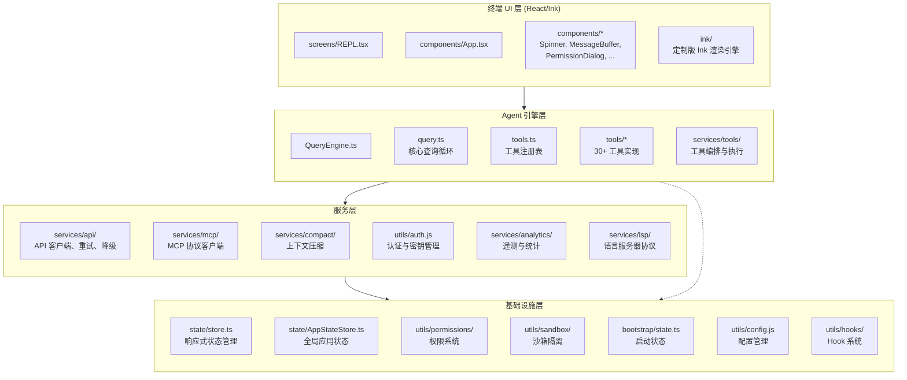
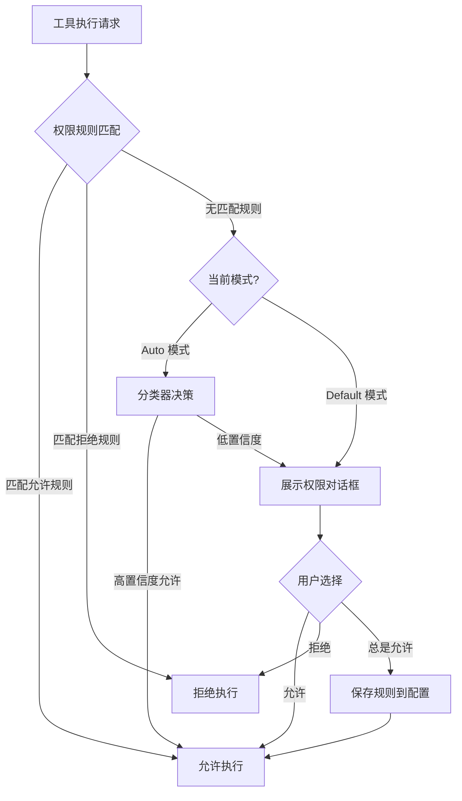
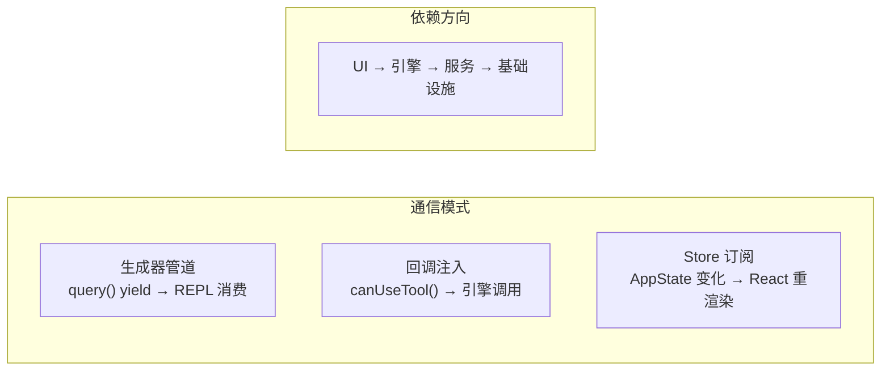

# 第 2 章：架构分层与模块划分

## 四层架构的设计哲学

一个 AI Agent 系统面临的根本挑战是：如何在一个进程中同时管理终端 UI 渲染、AI 推理编排、外部服务集成和安全隔离。Claude Code 的回答是一个清晰的四层架构，每一层都有明确的职责边界和依赖方向。



## 2.1 第一层：终端 UI 层

Claude Code 选择了一条在终端应用中不常见的技术路线：**React + Ink**。这不是一个随意的决定。

### 为什么是 React？

终端 UI 本质上是一个状态驱动的界面：消息列表在变化、加载指示器在切换、权限对话框在弹出/消失、工具执行状态在更新。用命令式的终端渲染库来管理这些状态变化会非常痛苦——你需要手动追踪哪些部分需要重绘、何时重绘、如何高效地只更新变化的部分。

React 的声明式模型天然适合这个场景：你只需要描述"给定这个状态，UI 应该长什么样"，React 的 reconciliation 算法会自动计算差异并高效更新。

Ink 是 React 在终端上的实现。它用 Yoga（Flexbox 引擎）做布局，将 React 组件树渲染为终端字符。Claude Code 并没有直接使用 Ink 官方版本，而是在 `ink/` 目录下维护了一个**深度定制的 fork**，包含了选择支持、搜索高亮、替代屏幕、点击事件处理等高级功能。

### UI 层的组成

UI 层的核心组件结构如下：

- **`App.tsx`**：根组件，提供全局上下文（终端尺寸、FPS 指标、状态存储）。
- **`REPL.tsx`**：主屏幕，管理消息列表的显示、输入框、工具执行状态。这是 UI 层最复杂的组件。
- **组件库**（`components/`）：包括 `Spinner`（加载动画）、`MessageBuffer`（消息流渲染）、`PermissionDialog`（权限确认）、`Box`/`Text`（基础布局）等。

UI 层遵循一个严格的规则：**不包含任何业务逻辑**。它只负责两件事——渲染状态和转发用户操作。当用户按下回车键，REPL 组件不会自己处理消息，而是通过回调将输入传递给 `QueryEngine`。当查询引擎 yield 事件，REPL 只是将它们渲染到屏幕上。

```
源码位置：
  screens/REPL.tsx      — 主 REPL 屏幕
  components/App.tsx    — 根组件
  components/           — 可复用 UI 组件
  ink/                  — 定制 Ink 引擎
    ├── components/     — Ink 基础组件（Box, Text, ScrollBox 等）
    ├── hooks/          — Ink 钩子（useInput, useStdin 等）
    ├── layout/         — Yoga 布局引擎集成
    ├── events/         — 终端事件系统
    └── termio/         — 终端 I/O 解析（ANSI/CSI/OSC 序列）
```

## 2.2 第二层：Agent 引擎层

这是整个系统最核心的一层，负责 AI Agent 的"智能"——查询循环、工具调度、上下文管理。

### QueryEngine：引擎的门面

`QueryEngine.ts` 是引擎层的门面（Facade）。它封装了 `query()` 函数的复杂性，提供了更高级的接口：`processTurn()` 处理一次完整的用户交互，管理对话历史、工具上下文、权限模式的初始化。

QueryEngine 还负责一些不在查询循环内部处理的横切关注点：
- 对话历史的持久化（`recordTranscript`、`flushSessionStorage`）
- 文件快照管理（`fileHistoryMakeSnapshot`）
- 成本追踪（`cost-tracker.ts`）
- SDK 消息转换（将内部 `Message` 格式转换为 SDK 消费者需要的格式）

### 查询循环：引擎的心脏

`query.ts` 是引擎层的核心，也是上一章详细追踪的"请求旅程"的承载者。它的职责非常明确：执行"调用 API -> 处理响应 -> 执行工具 -> 回到 API"的循环，直到模型不再需要调用工具或达到其他终止条件。

查询循环通过 `yield` 将所有中间状态（流式事件、工具结果、错误消息）传递给上层，但不关心这些状态如何被展示。这种**生产者-消费者**的解耦是系统分层清晰的关键。

### 依赖注入：可测试性的保障

`query/deps.ts` 定义了查询循环的核心外部依赖接口 `QueryDeps`——只有 4 个函数：`callModel`、`microcompact`、`autocompact`、`uuid`。这种极窄的接口范围是刻意设计的：它证明了依赖注入的可行性，同时为后续扩展留下了空间。

这种设计使得测试可以直接注入模拟实现（fakes），而不需要通过 `spyOn` 去逐个 mock 模块。在快速迭代的项目中，测试的稳定性与代码的变更频率成反比——依赖注入让测试只依赖于行为契约，而非实现细节。

### 工具系统

工具系统由三个部分组成：

1. **工具注册表**（`tools.ts`）：定义所有可用工具的清单，处理条件注册、权限过滤。
2. **工具实现**（`tools/*/`）：每个工具一个目录，包含工具定义、输入 schema、执行逻辑。
3. **工具编排**（`services/tools/`）：工具执行的调度器，负责分区（并发/串行）、权限检查、Hook 调用。

工具系统的设计遵循**开闭原则**：添加一个新工具只需要在 `tools/` 下新建一个目录、实现 `Tool` 接口、在 `tools.ts` 中注册即可，不需要修改查询循环或工具编排的代码。

```
源码位置：
  QueryEngine.ts                    — 引擎门面
  query.ts                          — 查询循环
  tools.ts                          — 工具注册表
  tools/                            — 30+ 工具实现
    ├── BashTool/                   — Shell 命令执行
    ├── FileReadTool/               — 文件读取
    ├── FileEditTool/               — 文件编辑
    ├── FileWriteTool/              — 文件写入
    ├── AgentTool/                  — 子 Agent 调用
    ├── WebSearchTool/              — Web 搜索
    ├── SkillTool/                  — 技能调用
    └── ...
  services/tools/                   — 工具编排
    ├── toolOrchestration.ts        — 工具分区与调度
    ├── toolExecution.ts            — 单工具执行
    ├── StreamingToolExecutor.ts    — 流式工具执行
    └── toolHooks.ts                — 工具 Hook
```

## 2.3 第三层：服务层

服务层封装了所有与外部系统的交互，为引擎层提供干净、统一的接口。

### API 服务

`services/api/claude.ts` 是 API 服务的核心，负责将引擎层的内部数据结构转换为 Anthropic API 的请求格式，并将 API 的流式响应转换回内部的消息类型。

API 服务还包含：
- **重试与降级**（`withRetry.ts`）：指数退避重试、模型降级切换。
- **错误处理**（`errors.ts`）：统一的错误分类和用户友好的错误消息。
- **Bootstrap 数据**（`bootstrap.ts`）：获取初始配置和模型能力信息。

### MCP（Model Context Protocol）服务

`services/mcp/` 实现了 MCP 协议客户端，允许 Claude Code 连接外部工具服务器。这是系统**可扩展性**的关键——第三方可以通过 MCP 协议注册自定义工具，无需修改 Claude Code 本身的代码。

MCP 的架构设计体现了清晰的职责分离：`MCPConnectionManager.tsx` 管理所有 MCP 服务器连接的生命周期，`client.ts` 处理协议通信，`config.ts` 管理配置解析。传输层通过 `InProcessTransport.ts` 和 `SdkControlTransport.ts` 支持**进程内传输**和 **SDK 控制传输**两种模式——前者用于嵌入式场景（如 VS Code 扩展），后者用于 SDK 模式下的程序控制。每个 MCP 服务器连接后，其工具、命令和资源被集成到全局工具注册表中。

### 上下文压缩服务

`services/compact/` 实现了多层上下文管理策略：
- **自动压缩**（`autoCompact.ts`）：当 token 使用接近上限时，自动生成对话摘要。包含连续失败计数器作为熔断器，当连续失败次数超过阈值时停止尝试。
- **微压缩**（`microCompact.ts`）：用缓存的摘要替换旧的工具调用对，通过编辑 prompt cache 来节省 token。
- **API 微压缩**（`apiMicrocompact.ts`）：基于 API 返回的实际 token 数据而非客户端估算来做压缩决策。
- **响应式压缩**（`reactiveCompact`，受 `REACTIVE_COMPACT` feature 门控）：当 API 返回 `prompt-too-long` 错误时，即时压缩并重试。这是一个"被动"策略——不在错误发生前主动压缩，而是在错误发生后立即响应。

```
源码位置：
  services/api/              — API 客户端服务
    ├── claude.ts            — 核心 API 调用
    ├── client.ts            — SDK 客户端
    ├── withRetry.ts         — 重试与降级
    └── errors.ts            — 错误分类
  services/mcp/              — MCP 协议服务
    ├── client.ts            — MCP 客户端
    ├── types.ts             — MCP 类型定义
    └── config.ts            — MCP 配置管理
  services/compact/          — 上下文压缩
    ├── compact.ts           — 压缩核心
    ├── autoCompact.ts       — 自动压缩
    └── reactiveCompact.ts   — 响应式压缩
  services/analytics/        — 遥测与统计
  services/lsp/              — LSP 服务
```

## 2.4 第四层：基础设施层

基础设施层提供所有上层共用的基础能力，它们是系统运行的基石。

### 响应式状态管理

Claude Code 没有使用 Redux、Zustand 或任何第三方状态管理库。相反，它在 `state/store.ts` 中实现了一个极简的响应式 Store：

```typescript
export type Store<T> = {
  getState: () => T
  setState: (updater: (prev: T) => T) => void
  subscribe: (listener: Listener) => () => void
}
```

只有 30 多行代码，但提供了完整的状态管理能力：不可变更新（通过 `updater` 函数返回新对象）、变更通知（通过 `subscribe`）、取消订阅（返回的函数）。`setState` 中还有一个优化——如果 updater 返回与之前相同的引用（`Object.is(next, prev)`），则跳过通知。

`AppStateStore.ts` 定义了全局应用状态 `AppState` 的类型和默认值。这个类型非常庞大——包含了设置、工具权限上下文、MCP 连接、插件状态、团队上下文、权限队列等几十个字段。这反映了一个事实：Claude Code 是一个高度有状态的交互式应用，几乎所有组件都需要访问某些共享状态。

### 权限系统

`utils/permissions/` 是 Claude Code 安全模型的核心。它实现了一个多层权限决策引擎：

1. **规则匹配**（`permissions.ts`）：根据工具名称、参数模式匹配允许/拒绝规则。
2. **分类器**（`classifierDecision.ts`、`yoloClassifier.ts`）：在 Auto 模式下，使用本地分类器自动决定是否允许工具执行。
3. **权限模式**（`PermissionMode.ts`）：定义了 `default`、`plan`、`auto`、`bypassPermissions` 等模式。
4. **拒绝追踪**（`denialTracking.ts`）：追踪权限拒绝次数，超过阈值后回退到交互式确认。



### 沙箱隔离

`utils/sandbox/sandbox-adapter.ts` 封装了 `@anthropic-ai/sandbox-runtime`，为工具执行提供安全隔离。沙箱系统可以限制文件系统访问（读/写路径白名单）、网络访问（主机名黑名单/白名单），并处理违规事件。

### Hook 系统

Hook 系统允许用户在特定事件发生时执行自定义脚本：
- `SessionStart`：会话开始时
- `PreToolUse`：工具执行前
- `PostToolUse`：工具执行后
- `Stop`：查询完成时
- `FileChanged`：文件变更时

Hook 是 Claude Code **可扩展性**的另一个重要维度。用户可以通过配置文件注册 Hook，在无需修改代码的情况下定制行为。

### Bootstrap 状态

`bootstrap/state.ts` 是一个有趣的设计。它在所有模块之间共享一组全局可变状态——Session ID、工作目录、主循环模型等。这些状态使用模块级变量而非 Store 管理，因为它们在 React 渲染之前就需要被设置和读取。

```
源码位置：
  state/store.ts              — 极简响应式 Store（30 行）
  state/AppStateStore.ts      — 全局应用状态定义
  state/onChangeAppState.ts   — 状态变更副作用
  utils/permissions/          — 权限系统
  utils/sandbox/              — 沙箱隔离
  bootstrap/state.ts          — 启动期全局状态
  utils/config.js             — 配置管理
  utils/hooks/                — Hook 系统
```

## 2.5 层间通信模式

理解了四层架构后，一个关键问题是：**层与层之间如何通信？**

### 自上而下的数据流

主要的依赖方向是严格的单向依赖：UI 层依赖引擎层，引擎层依赖服务层，服务层依赖基础设施层。但存在少量的反向依赖（图中虚线），这些通常通过依赖注入或回调接口来解耦。

### 模式一：生成器管道

引擎层和 UI 层之间通过 AsyncGenerator 通信。`query()` yield 事件，REPL 消费事件并渲染。这是一种**推-拉混合**模式——引擎推数据出来，UI 在自己的节奏下消费。

### 模式二：回调注入

引擎层需要与 UI 层交互的场景（如权限确认对话框），通过回调函数注入。`canUseTool` 函数在 REPL 中创建，传递给 QueryEngine，再传递给 `query()`。这样，引擎层不需要知道 UI 的存在，只需要调用一个函数并等待结果。

### 模式三：Store 订阅

基础设施层的 Store 通过发布-订阅模式与 UI 层连接。Ink 的 `useStore` 钩子将 Store 的状态变化映射到 React 组件的重渲染。这意味着当 `AppState` 中的任何字段变化时，订阅了该状态的组件会自动更新。



## 2.6 为什么选择这样的分层？

### 分层的核心考量

1. **UI 与引擎分离**：终端 UI 的渲染逻辑（React/Ink）和 AI 推理的编排逻辑（查询循环）是完全不同的关注点。将它们分离意味着：
   - 引擎可以在非交互模式下运行（`--print`、SDK 模式），不需要启动 React 渲染。
   - UI 可以独立演进，添加新的可视化效果不影响查询逻辑。

2. **引擎与服务分离**：查询循环不应该关心 API 的认证方式、MCP 的传输协议、压缩的实现细节。它只需要知道"调用模型"、"压缩上下文"、"执行工具"这些高层操作。这种分离让服务层可以独立替换——比如将 Anthropic API 替换为其他提供商，只需要修改 `services/api/` 目录。

3. **基础设施横向复用**：状态管理、权限系统、沙箱隔离是所有上层都需要的通用能力。将它们放在最底层，通过清晰的接口暴露，避免了代码重复和职责混淆。

### 分层的代价

没有任何架构是免费的。这种分层的代价是：
- **间接层**：一个简单的"读文件"操作需要穿越 Tool 接口 → 工具编排 → 权限检查 → 实际执行 → 结果包装 → yield 到 UI，路径较长。
- **状态分散**：全局状态分布在 Store、Bootstrap State、QueryEngine 的闭包中，理解"状态在哪里"需要一定的学习曲线。

但 Claude Code 的实践证明，对于一个快速演进的 AI Agent 系统，这些代价是值得的。清晰的分层让新功能（如 Agent Swarms、Context Collapse、Stream Tool Execution）可以以增量方式加入，而不需要重构整个系统。

## 2.7 本章小结

Claude Code 的四层架构不是学术上的分层模式，而是在实际工程约束下做出的务实选择：

| 层次 | 职责 | 关键设计 |
|------|------|----------|
| UI 层 | 渲染与用户交互 | React/Ink 声明式渲染，不含业务逻辑 |
| 引擎层 | AI 推理编排 | AsyncGenerator 查询循环，工具注册表 |
| 服务层 | 外部系统交互 | API 客户端、MCP 协议、上下文压缩 |
| 基础设施层 | 通用基础能力 | 极简 Store、权限系统、沙箱、Hook |

在下一章中，我们将从这些架构细节中抽离出来，审视指导每一个设计决策的核心原则。
