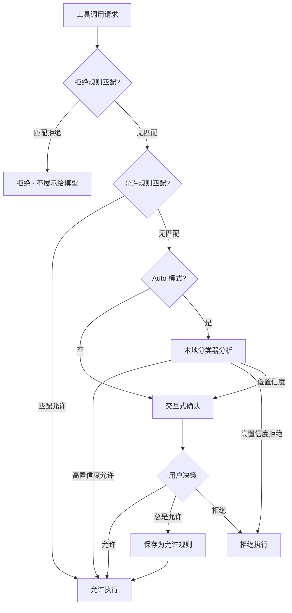
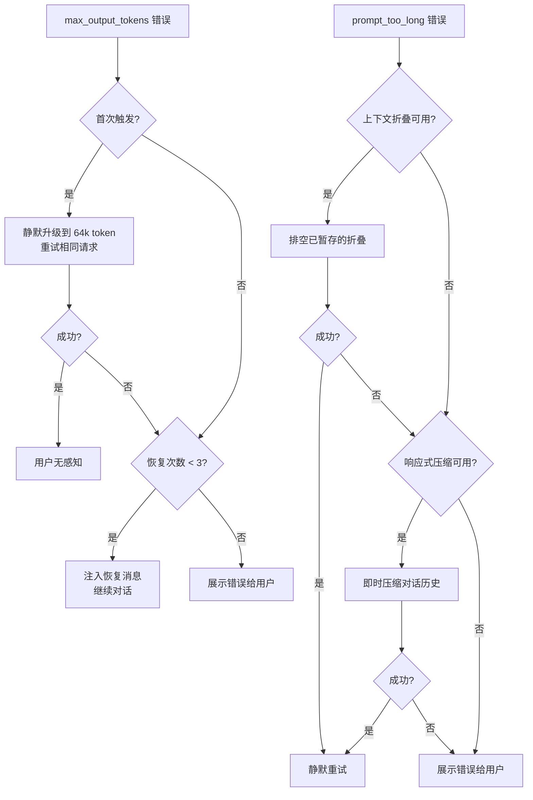
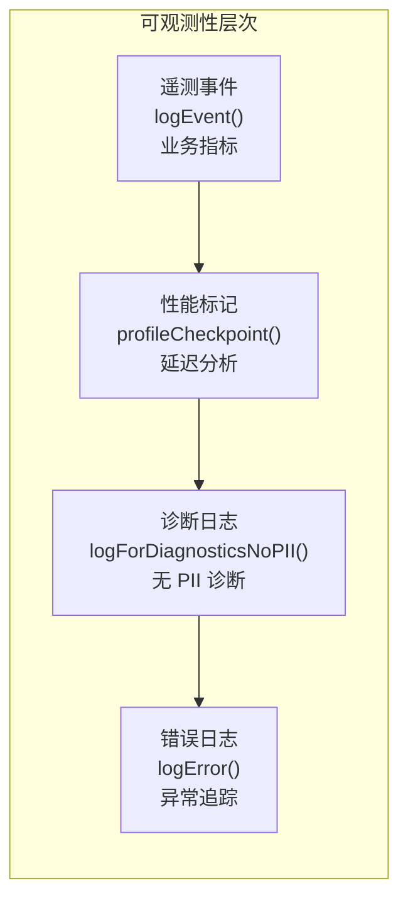

# 第 3 章：核心设计原则

## 七条原则如何指导每一个设计决策

架构不是一组随意的选择，而是在明确的原则指导下做出的系统化决策。通过阅读 Claude Code 的源码，我们可以提炼出七条贯穿整个系统的设计原则。这些原则不是写在文档里的抽象教条，而是深深嵌入在每一个文件、每一个函数、每一个数据结构中的具体实践。

```mermaid
flowchart TD
    A[Claude Code 设计原则] --> B[流式优先]
    A --> C[默认隔离]
    A --> D[权限最小化]
    A --> E[渐进增强]
    A --> F[用户始终可控]
    A --> G[优雅降级]
    A --> H[可观测性]

    B --> B1[AsyncGenerator 查询循环]
    B --> B2[流式工具执行]
    B --> B3[逐 token UI 渲染]

    C --> C1[沙箱运行时]
    C --> C2[文件系统限制]
    C --> C3[网络访问控制]

    D --> D1[多层权限决策]
    D --> D2[分类器辅助]
    D --> D3[渐进式授权]

    E --> E1[功能门控 feature]
    E --> E2[条件工具注册]
    E --> E3[多层上下文管理]

    F --> F1[实时中断 AbortController]
    F --> F2[权限确认对话框]
    F --> F3[Hook 系统]

    G --> G1[模型降级 FallbackTriggeredError]
    G --> G2[Token 超限恢复]
    G --> G3[压缩失败熔断]

    H --> H1[结构化日志 logEvent]
    H --> H2[启动性能分析 profileCheckpoint]
    H --> H3[遥测事件覆盖全生命周期]
```



## 3.1 原则一：流式优先

**核心思想**：数据应该以流的方式产生和消费，而非等待全部就绪后一次性处理。

AI Agent 系统有一个独特的时间特征：API 调用可能需要 5-30 秒才能完成，但用户的耐心是以秒计算的。如果系统等到整个响应完成后再展示，用户体验将无法接受。

### 源码中的体现

**查询循环的生成器设计**（`query.ts`）：`query()` 是一个 AsyncGenerator，在 API 响应流中的每个事件到达时立即 `yield`：

```typescript
for await (const message of deps.callModel({...})) {
    yield yieldMessage  // 每个流式事件立即传递给 UI
}
```

**流式工具执行**（`StreamingToolExecutor.ts`）：当模型在流式输出中包含工具调用时，系统不需要等待整个响应完成——只读工具（如 `FileRead`、`Glob`）可以在工具块完整接收后立即开始执行，与模型继续输出其他内容并行进行。

**工具结果的流式回传**（`toolOrchestration.ts`）：工具执行的结果也是通过 `AsyncGenerator` 逐个产生的，而不是等待所有工具完成后再一起返回。这意味着 UI 可以在第一个工具完成时就展示结果，而不必等最后一个工具。

### 学到了什么

流式优先不仅是一种性能优化，更是一种**架构约束**。当你从第一天就以流的方式设计数据管道，整个系统自然会倾向于低延迟和高响应性。如果事后才想"加上流式支持"，往往会面临大规模重构。

```
源码位置：
  query.ts                              — AsyncGenerator 查询循环
  services/tools/StreamingToolExecutor.ts — 流式工具执行器
  services/tools/toolOrchestration.ts    — 工具结果流式回传
  services/api/claude.ts                — 流式 API 调用
```

## 3.2 原则二：默认隔离

**核心思想**：所有可能产生副作用的操作都应该在隔离环境中执行，除非明确获得授权。

AI Agent 拥有执行任意代码的能力（通过 `BashTool`），这在安全上是一个巨大的风险。Claude Code 的应对策略是"默认隔离"——假设每个操作都是危险的，除非有明确的证据表明它是安全的。

### 源码中的体现

**沙箱适配器**（`utils/sandbox/sandbox-adapter.ts`）：系统集成了 `@anthropic-ai/sandbox-runtime`，可以限制工具执行的文件系统访问和网络访问。沙箱配置包括：

- 文件系统读/写路径白名单
- 网络主机名黑名单/白名单
- 违规事件的处理策略

**`--dangerously-skip-permissions` 的安全门**（`setup.ts`）：即使使用这个标志跳过权限检查，系统仍然会验证运行环境的安全性：

```typescript
if (!isSandboxed || hasInternet) {
    console.error(
        '--dangerously-skip-permissions can only be used in Docker/sandbox containers with no internet access'
    )
    process.exit(1)
}
```

这意味着：即使在最宽松的权限模式下，系统也会拒绝在非隔离的互联网可达环境中运行。这是一个纵深防御的设计——一层安全措施被绕过时，下一层仍然有效。

**工具结果的预算限制**（`applyToolResultBudget`）：工具的输出被施加了大小限制，防止一个工具的巨大输出（如 `cat /dev/urandom`）挤占整个上下文窗口。

### 学到了什么

"默认隔离"是一个需要勇气的原则，因为它总是在便利性上做出妥协。但 AI Agent 的特殊性在于：模型的输出是不可预测的，用户可能不理解一个命令的全部后果。在这种情况下，安全必须优先于便利。

```
源码位置：
  utils/sandbox/sandbox-adapter.ts      — 沙箱运行时适配器
  setup.ts                              — 权限旁路的安全验证
  utils/toolResultStorage.ts            — 工具结果预算
```

## 3.3 原则三：权限最小化

**核心思想**：每个操作应该只获得完成该操作所必需的最小权限集。

这不同于"默认隔离"——隔离是关于运行环境，权限最小化是关于操作授权。一个操作需要的权限越多，出错或被滥用的风险就越大。

### 源码中的体现

**多层权限决策引擎**（`utils/permissions/permissions.ts`）：权限决策不是简单的"允许/拒绝"二选一，而是一个多层的决策管道：

1. **规则匹配**：检查用户配置的允许/拒绝规则。
2. **分类器决策**：在 Auto 模式下，本地分类器分析工具参数，给出高/低置信度判断。
3. **交互式确认**：当规则和分类器都无法决定时，弹出对话框让用户确认。
4. **拒绝追踪**：追踪权限拒绝次数，当自动决策的拒绝过多时回退到交互模式。

**拒绝规则优先于允许规则**（`filterToolsByDenyRules`）：在工具展示给模型之前，被拒绝的工具就已经从工具列表中移除。模型甚至看不到这些工具的存在，自然也无法尝试调用它们。这是"最小权限"在网络层面的体现。

**Bash 命令分类**（`utils/permissions/bashClassifier.ts`）：不是所有 Bash 命令都同等危险。分类器将命令分为不同的风险等级——`ls` 和 `cat` 是低风险的，`rm -rf /` 和 `curl | bash` 是高风险的。这种细粒度的分类避免了"要么全允许，要么全拒绝"的粗暴策略。



### 学到了什么

权限系统的复杂性不在于"如何检查权限"，而在于"如何在不打扰用户的前提下提供足够的保护"。Claude Code 的分类器设计是一个很好的参考——80% 的情况由机器自动决策，只在真正不确定时才打扰用户。这是 AI 辅助安全决策的一个典范。

```
源码位置：
  utils/permissions/permissions.ts       — 权限决策引擎
  utils/permissions/bashClassifier.ts    — Bash 命令风险分类
  utils/permissions/yoloClassifier.ts    — 自动模式分类器
  utils/permissions/denialTracking.ts    — 拒绝追踪与回退
  tools.ts — filterToolsByDenyRules()    — 工具预过滤
```

## 3.4 原则四：渐进增强

**核心思想**：系统应该在基础功能可用的情况下，逐步添加更高级的能力。

Claude Code 需要在多种环境中运行——内部 Anthropic 员工、外部用户、Docker 容器、CI/CD 管道。这些环境的可用功能集差异很大。渐进增强原则确保系统在所有环境中都能工作，同时在支持的环境中提供更好的体验。

### 源码中的体现

**Feature Flag 系统**（`bun:bundle` 的 `feature()`）：Claude Code 使用 `feature()` 函数进行条件编译。这个函数在构建时被 Bun 的打包器评估，不满足条件的代码分支会被完全消除（死代码消除）：

```typescript
const REPLTool = process.env.USER_TYPE === 'ant'
    ? require('./tools/REPLTool/REPLTool.js').REPLTool
    : null
```

这意味着 Ant 内部版本和外部版本的代码实际上是不同的——内部版本包含更多的工具和功能，而外部版本不包含这些代码，减小了包体积并消除了安全隐患。

**条件工具注册**（`tools.ts`）：工具注册表根据运行环境动态决定包含哪些工具：

```typescript
...(isWorktreeModeEnabled() ? [EnterWorktreeTool, ExitWorktreeTool] : []),
...(isAgentSwarmsEnabled() ? [getTeamCreateTool(), getTeamDeleteTool()] : []),
...(isEnvTruthy(process.env.ENABLE_LSP_TOOL) ? [LSPTool] : []),
```

**多层上下文管理**（如第 1 章所述）：从免费的内容预算裁剪到昂贵的 LLM 自动压缩，每一层都是对前一层的渐进增强。如果廉价的操作就够了，就不会触发更昂贵的操作。

### 学到了什么

渐进增强不仅是一种前端开发策略，在 Agent 系统中同样重要。AI Agent 的能力在不断扩展，但不是所有用户都需要所有能力。通过门控和条件注册，系统可以保持核心功能集的稳定和可靠，同时允许新功能在不影响核心的情况下被引入和迭代。

```
源码位置：
  tools.ts                              — 条件工具注册
  query.ts  — feature() 门控           — 条件功能启用
  services/compact/autoCompact.ts       — 渐进式上下文压缩
```

## 3.5 原则五：用户始终可控

**核心思想**：用户应该能够在任何时刻了解系统的状态，并且能够中断或修改系统的行为。

AI Agent 的自主性是一把双刃剑。用户需要信任系统不会在他们不知情的情况下做出不可逆的操作。Claude Code 通过多种机制确保用户始终保持控制。

### 源码中的体现

**实时中断**（`AbortController`）：查询循环中的 `toolUseContext.abortController` 允许用户随时中断当前操作。当中断信号触发时：
- API 调用立即取消
- 正在执行的工具收到中断信号并清理
- 已产生但未完成的工具调用会收到合成的错误结果
- 用户中断消息被添加到对话历史中

```typescript
if (toolUseContext.abortController.signal.aborted) {
    // 清理并返回
    yield* yieldMissingToolResultBlocks(assistantMessages, 'Interrupted by user')
    return { reason: 'aborted_streaming' }
}
```

**Hook 系统**（`utils/hooks/`）：用户可以在关键决策点注册自定义 Hook 脚本，对系统的行为进行完全控制：
- `PreToolUse` Hook 可以阻止工具执行
- `Stop` Hook 可以阻止查询提前终止
- `PostToolUse` Hook 可以修改工具结果

**权限对话框**：即使在 Auto 模式下，当分类器不确定时，系统仍然会弹出交互式确认。用户始终是最终决策者。

### 学到了什么

"用户始终可控"在 AI Agent 中意味着：系统应该永远不进入一个用户无法干预的状态。这听起来简单，但在一个可能执行多分钟的工具调用链中实现起来并不容易。Claude Code 的 `AbortController` 传播机制是一个值得学习的模式——中断信号从 UI 层一路传播到 API 调用和工具执行，确保每一层都能干净地退出。

```
源码位置：
  query.ts — abortController 处理       — 中断传播
  utils/hooks/                           — Hook 系统
  utils/hooks/postSamplingHooks.ts       — 采样后 Hook
  utils/hooks/sessionHooks.ts            — 会话 Hook
```

## 3.6 原则六：优雅降级

**核心思想**：当系统遇到错误或资源限制时，应该尝试自动恢复，仅在无法恢复时才将错误暴露给用户。

这个原则直接关系到用户体验。一个"能工作"的系统和一个"好用"的系统之间的差距，往往就在于对错误情况的处理方式。

### 源码中的体现

**Token 超限的分层恢复**（`query.ts`）：



这个流程图展示了系统在遇到两种常见错误时的恢复策略。注意"用户无感知"这个节点——在理想情况下，用户永远不会知道后台发生了错误恢复。

**模型降级**（`FallbackTriggeredError`）：当主模型不可用时，系统自动切换到备用模型，并展示一条简短的提示：

```
Switched to [fallback model] due to high demand for [original model]
```

降级时系统还会生成"墓碑消息"（tombstone messages），将降级前已经产生的部分消息从 UI 和记录中移除，避免无效数据污染对话历史。

**压缩失败熔断**（`consecutiveFailures`）：自动压缩不是总能成功的。当连续失败次数超过阈值时，系统停止尝试压缩（熔断），避免无限重试的死亡螺旋。

**Stop Hook 死亡螺旋防护**：`query.ts` 中有一个精巧的防护——当 Stop Hook 阻塞了查询并触发重试，但重试后仍然是 prompt-too-long 时，系统不会再触发 Stop Hook，因为"Hook 注入更多 token -> 重试 -> 还是太长 -> Hook 注入更多 token"会形成无限循环。

### 学到了什么

优雅降级的核心洞察是：**大多数错误是暂时性的，可以通过重试或降级来恢复**。区分"暂时性错误"和"永久性错误"是关键。Token 超限是暂时性的（可以通过压缩或分片解决），认证失败是永久性的（重试无意义）。系统对暂时性错误应该静默恢复，对永久性错误才展示给用户。

```
源码位置：
  query.ts                              — max_output_tokens 恢复、FallbackTriggeredError 降级
  services/compact/autoCompact.ts       — 压缩熔断器（consecutiveFailures）
  services/compact/compact.ts           — 压缩核心逻辑
  services/api/withRetry.ts             — API 重试与 529 降级逻辑
```

## 3.7 原则七：可观测性

**核心思想**：系统的每个重要行为都应该产生可追踪的记录。

AI Agent 的行为具有高度的不确定性——同样的输入可能因为模型版本、上下文状态、工具执行结果的不同而产生完全不同的输出。在这种情况下，可观测性不仅是调试工具，更是理解和改进系统的基石。

### 源码中的体现

**结构化遥测事件**（`services/analytics/`）：系统通过 `logEvent()` 函数发出结构化的遥测事件，覆盖了完整的生命周期：

- `tengu_started`：进程启动
- `tengu_startup_telemetry`：启动时的环境信息
- `tengu_query_error`：查询错误
- `tengu_auto_compact_succeeded`：自动压缩成功
- `tengu_model_fallback_triggered`：模型降级触发
- `tengu_streaming_tool_execution_used`：流式工具执行使用
- `tengu_token_budget_completed`：Token 预算完成
- `tengu_exit`：进程退出（包含会话统计数据）

**启动性能分析**（`utils/startupProfiler.js`）：`profileCheckpoint()` 函数在启动流程的关键节点打标记，用于分析启动延迟的来源：

```typescript
profileCheckpoint('main_tsx_entry')
profileCheckpoint('main_tsx_imports_loaded')
profileCheckpoint('setup_before_prefetch')
profileCheckpoint('setup_after_prefetch')
```

**查询性能分析**（`utils/queryProfiler.js`）：类似地，`queryCheckpoint()` 追踪查询循环内部的性能：

```typescript
queryCheckpoint('query_fn_entry')
queryCheckpoint('query_autocompact_start')
queryCheckpoint('query_api_streaming_start')
queryCheckpoint('query_tool_execution_start')
```

**诊断日志**（`logForDiagnosticsNoPII`）：系统区分了"诊断日志"和"用户日志"。诊断日志不包含 PII（个人身份信息），可以安全地发送到 Anthropic 的分析系统。这个区分反映了对用户隐私的尊重。

### 学到了什么

可观测性不是一个可以"加上去"的功能，它必须从第一天就融入架构。Claude Code 的做法值得学习：在关键路径上的每个重要节点都有对应的遥测事件或性能标记。这使得问题可以在生产环境中被追踪和诊断，而不需要复现。



```
源码位置：
  services/analytics/index.js           — logEvent() 遥测
  utils/startupProfiler.js              — 启动性能分析
  utils/queryProfiler.js                — 查询性能分析
  utils/diagLogs.ts                     — 诊断日志
  utils/log.js                          — 错误日志
```

## 3.8 原则之间的张力与平衡

这七条原则并非总是和谐的。在实际设计中，它们之间存在张力：

- **流式优先 vs. 优雅降级**：流式处理意味着数据到达后立即转发，但优雅降级需要"扣留"某些事件等待恢复。Claude Code 通过 `withheld` 标志解决了这个张力——错误事件仍然被推入内部数组（用于后续恢复逻辑），但不被 `yield`，直到恢复决策做出后才决定是暴露还是静默重试。多个扣留判断函数（`isWithheldMaxOutputTokens`、`contextCollapse.isWithheldPromptTooLong`、`reactiveCompact.isWithheldPromptTooLong`）独立工作，任一触发即扣留。

- **权限最小化 vs. 用户始终可控**：权限系统应该最小化授权，但用户应该有能力覆盖任何决策。通过"总是允许"按钮和规则持久化，用户可以将临时决策转化为永久规则。

- **默认隔离 vs. 渐进增强**：隔离限制了功能，增强扩展了功能。通过"沙箱内放宽限制"（`--dangerously-skip-permissions` 仅在沙箱内允许），两个原则可以共存。

这些张力不是缺陷，而是设计的边界条件。一个好的架构不是消除了所有张力的架构，而是在张力中找到了恰当的平衡点。

## 3.9 本章小结

| 原则 | 一句话总结 | 最典型的源码体现 |
|------|-----------|-----------------|
| 流式优先 | 数据产生后立即传递 | `query()` AsyncGenerator |
| 默认隔离 | 副作用操作在沙箱中执行 | `sandbox-adapter.ts` |
| 权限最小化 | 只授予操作所需的最小权限 | 多层权限决策引擎 |
| 渐进增强 | 基础功能可用，高级功能按需加载 | `feature()` 门控 |
| 用户始终可控 | 用户可随时中断和覆盖 | `AbortController` + Hook |
| 优雅降级 | 静默恢复优先，错误展示兜底 | Token 超限分层恢复 |
| 可观测性 | 重要行为产生可追踪记录 | `logEvent()` 全生命周期覆盖 |

这七条原则不是孤立的规则，而是相互支撑的系统。流式优先使得优雅降级成为可能（因为可以在数据流中"扣留"事件）；权限最小化和默认隔离共同构成了安全基础；可观测性为所有其他原则的效果提供了验证手段。

在下一章中，我们将讨论实现这些原则的技术选型——为什么选择 TypeScript 而不是 Go，为什么选择 Bun 而不是 Node，以及这些选择如何塑造了整个系统。
