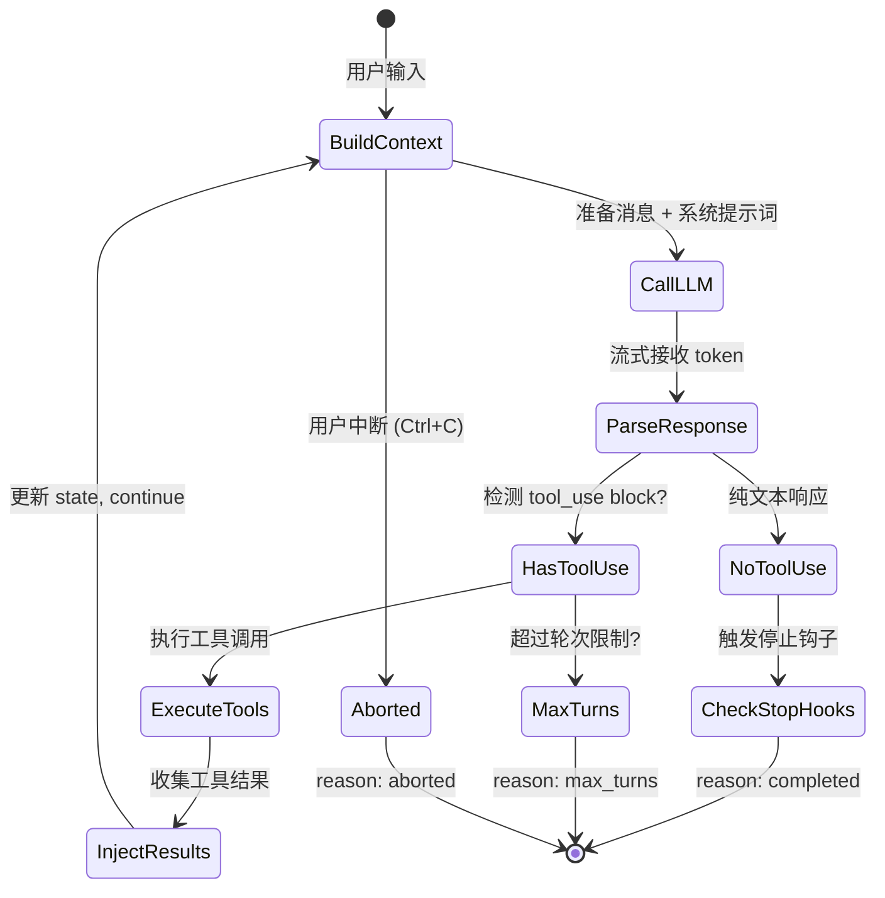
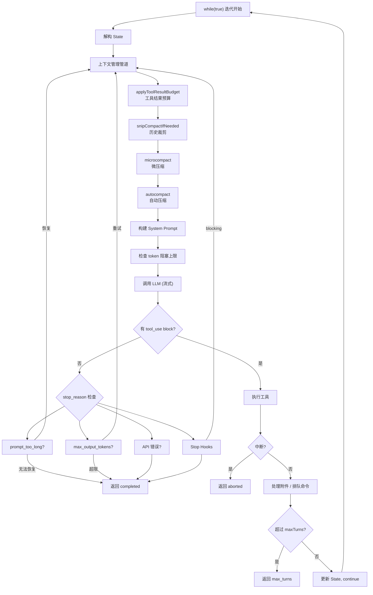
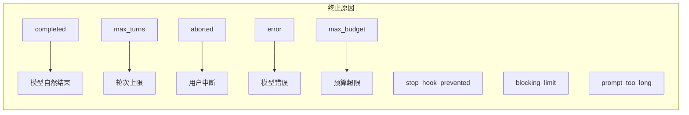
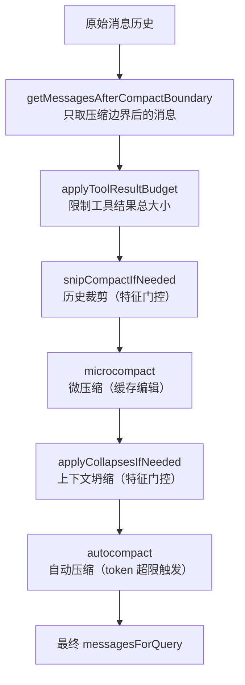

# 第 5 章：Agentic Loop——Agent 的心脏

## 核心设计问题

一个 AI Agent 的本质是什么？不是 LLM 调用，不是工具定义，而是一个**循环**。Claude Code 的核心是一个 `while(true)` 循环——它接收用户消息、调用 LLM、解析响应、执行工具、将工具结果注入上下文、再次调用 LLM，直到模型认为任务完成。

这个循环的每一次迭代称为一个 **turn**（轮次）。一个复杂的编程任务可能需要 10-50 个 turn，涉及数十次工具调用。`query.ts` 中的 `query()` 函数就是这个循环的具现化。



## 为什么用 AsyncGenerator 实现？

`query()` 函数的签名是 `async function* query(): AsyncGenerator`。这是一个深思熟虑的架构选择。

传统设计可能返回一个 Promise，但这有一个致命问题：**用户无法实时看到 Agent 的思考过程**。Agent 的一个 turn 可能持续 30 秒到数分钟——在这期间，用户面对一个空白的终端。

AsyncGenerator（`async function*`）通过 `yield` 关键字解决了这个问题。每当循环中有新的事件产生——一个流式 token、一个工具调用、一个进度更新——就立刻 `yield` 出去，让调用方（UI 层、SDK 消费者）能够实时渲染。

```typescript
// query.ts 的核心结构
export async function* query(params: QueryParams): AsyncGenerator<...> {
  const terminal = yield* queryLoop(params, consumedCommandUuids)
  return terminal
}
```

这种设计的另一层含义是**背压（backpressure）天然存在**。如果消费者处理不过来（比如 UI 渲染慢），Generator 会自动暂停，不会导致内存溢出。这比回调或事件发射器（EventEmitter）更安全。

### 设计启示

> 当构建一个长时间运行的 Agent 系统时，优先考虑 `AsyncGenerator` 而非 `Promise` 或 `Observable`。它提供了天然的单向数据流、自动背压控制，以及与 `for await...of` 语法的完美配合。

## 循环状态机

循环的核心是一个 `while(true)` 结构，配合一个可变的 `State` 对象在迭代间传递状态。让我们看看每一次迭代到底发生了什么。



State 对象的设计简洁但信息密集：

```typescript
type State = {
  messages: Message[]           // 当前消息历史
  toolUseContext: ToolUseContext // 工具执行上下文
  autoCompactTracking: AutoCompactTrackingState | undefined
  maxOutputTokensRecoveryCount: number
  hasAttemptedReactiveCompact: boolean
  maxOutputTokensOverride: number | undefined
  pendingToolUseSummary: Promise<ToolUseSummaryMessage | null> | undefined
  stopHookActive: boolean | undefined
  turnCount: number             // 当前轮次计数
  transition: Continue | undefined  // 上一次 continue 的原因
}
```

注意 `transition` 字段——它记录了上一次循环为什么 `continue`。这不是调试信息，而是**逻辑门控**。例如，当 `transition.reason === 'collapse_drain_retry'` 时，说明上一次迭代尝试了上下文坍缩恢复但仍失败，所以这次不应再尝试同一路径。

### 设计启示

> 不要用零散的 boolean flag 追踪循环状态。用一个结构化的 `State` 对象 + `transition` 原因字段，可以让 continue 路径有清晰的决策依据，避免无限重试循环。

## 循环终止条件

Agent 循环必须能够终止，否则就是一个无限循环的噩梦。Claude Code 有多个终止路径，每个都有不同的语义。

### 1. 自然终止：模型输出纯文本

当 LLM 的响应中不包含任何 `tool_use` block 时（`needsFollowUp === false`），循环准备终止。但"准备终止"不等于"终止"——还有一系列检查：

```typescript
if (!needsFollowUp) {
  // 检查 prompt_too_long 恢复
  // 检查 max_output_tokens 恢复
  // 检查 API 错误
  // 执行 Stop Hooks
  // 检查 Token Budget
  return { reason: 'completed' }
}
```

### 2. 轮次限制：maxTurns

SDK 调用者可以设置 `maxTurns` 参数。每个 turn（一次 LLM 调用 + 工具执行）计数一次。超出限制时，循环 yield 一个 `max_turns_reached` 附件消息后终止：

```typescript
if (maxTurns && nextTurnCount > maxTurns) {
  yield createAttachmentMessage({
    type: 'max_turns_reached',
    maxTurns,
    turnCount: nextTurnCount,
  })
  return { reason: 'max_turns', turnCount: nextTurnCount }
}
```

### 3. 用户中断：AbortController

用户按 Ctrl+C 时，`abortController.signal.aborted` 变为 true。循环在多个关键点检查这个信号：

- 流式接收中：中断后，StreamingToolExecutor 生成合成的错误 tool_result
- 工具执行中：子进程收到 SIGTERM，正在排队的工具收到取消消息
- 工具执行后：检查信号，yield 中断消息后返回

```typescript
if (toolUseContext.abortController.signal.aborted) {
  // 处理中断...
  return { reason: 'aborted_streaming' }
}
```

### 4. 预算限制：maxBudgetUsd

SDK 调用者可以设置美元预算上限。每次 yield 后，循环检查累计花费：

```typescript
if (maxBudgetUsd !== undefined && getTotalCost() >= maxBudgetUsd) {
  yield { type: 'result', subtype: 'error_max_budget_usd', ... }
  return
}
```

### 5. 错误终止

- **模型错误**：API 调用异常、图片过大等
- **阻塞限制**：上下文 token 数超过硬性上限
- **Stop Hook 阻止**：外部钩子判定不应继续



## 中断机制的精妙设计

中断不是简单的"停止一切"。Claude Code 的中断处理是一个多层次的系统。

### 层次一：AbortController 级联

`AbortController` 是 Web 标准 API，但 Claude Code 对它进行了扩展。`toolUseContext.abortController` 是父控制器，每个工具执行会创建**子控制器**（`createChildAbortController`）。这意味着：

- 中断父控制器 → 所有子控制器被中断
- 中断子控制器 → 父控制器不受影响（除非特定条件）
- StreamingToolExecutor 还有一个 `siblingAbortController`——当一个 Bash 工具出错时，兄弟工具被取消，但整个查询不终止

### 层次二：合成错误消息

中断时，所有未完成的 `tool_use` block 都需要一个配对的 `tool_result`，否则 API 会在下次调用时报错。循环通过 `yieldMissingToolResultBlocks` 生成合成的错误结果：

```typescript
function* yieldMissingToolResultBlocks(
  assistantMessages: AssistantMessage[],
  errorMessage: string,
) {
  for (const assistantMessage of assistantMessages) {
    const toolUseBlocks = assistantMessage.message.content.filter(
      content => content.type === 'tool_use',
    ) as ToolUseBlock[]
    for (const toolUse of toolUseBlocks) {
      yield createUserMessage({
        content: [{
          type: 'tool_result',
          content: errorMessage,
          is_error: true,
          tool_use_id: toolUse.id,
        }],
      })
    }
  }
}
```

### 层次三：优雅中断 vs 强制中断

当用户发送新消息（而非按 Esc）中断时，`abortController.signal.reason` 为 `'interrupt'`。此时循环跳过"用户中断"消息，因为排队的新消息本身提供了足够的上下文：

```typescript
if (toolUseContext.abortController.signal.reason !== 'interrupt') {
  yield createUserInterruptionMessage({ toolUse: false })
}
```

### 设计启示

> Agent 系统的中断设计不能是简单的 kill -9。需要：(1) 确保所有 tool_use 都有配对的 tool_result，(2) 区分用户主动中断和新消息提交，(3) 在流式接收和工具执行两个阶段分别处理。AbortController 的父子级联是管理这种复杂性的利器。

## 上下文管理管道

在每次循环迭代的开头，有一段容易被忽视但极其重要的代码——**上下文管理管道**。它决定了模型在这次调用中"看到"什么。



这个管道的执行顺序至关重要：

1. **工具结果预算**先于压缩——压缩依赖 `tool_use_id` 做缓存匹配，内容替换对它不可见
2. **裁剪（Snip）**先于微压缩——裁剪释放的 token 数需要传递给自动压缩的阈值检查
3. **微压缩**先于自动压缩——如果微压缩已经足够，就避免代价更高的自动压缩
4. **上下文坍缩**先于自动压缩——坍缩保留粒度更细的上下文

### 设计启示

> 当系统的多个阶段都可能修改同一份数据时，执行顺序不只是"先来后到"——它是正确性的保证。显式地用管道（pipeline）模式组织这些阶段，比隐式地散落在代码各处要安全得多。

## max_output_tokens 恢复机制

这是循环中一个巧妙的自愈机制。当模型的输出 token 达到上限时，响应被截断——模型可能正写到一半。Claude Code 不会直接告诉用户"输出被截断"，而是：

1. **扣留（withhold）错误消息**：在流式接收期间，检测到 `max_output_tokens` 错误时不立即 yield
2. **尝试升级**：第一次重试时，将 `maxOutputTokensOverride` 从默认的 ~8K 提升到 ~64K
3. **注入恢复消息**：如果升级后仍然超限，注入一条元消息告诉模型"直接继续，不要道歉，不要回顾"
4. **限制重试次数**：最多 3 次恢复尝试

```typescript
if (maxOutputTokensRecoveryCount < MAX_OUTPUT_TOKENS_RECOVERY_LIMIT) {
  const recoveryMessage = createUserMessage({
    content: 'Output token limit hit. Resume directly — no apology, no recap...',
    isMeta: true,
  })
  // 更新 state, continue
}
```

### 设计启示

> Agent 系统必须优雅处理 LLM 的各种限制条件。不要把错误直接暴露给用户——在用户看到之前，尝试自动恢复。但恢复本身也必须有上限，否则就会陷入恢复循环。

## 模型回退（Fallback）

当主模型（如 Opus）过载返回 529 错误时，系统会回退到备选模型（如 Sonnet）。回退处理极其细致：

```typescript
catch (innerError) {
  if (innerError instanceof FallbackTriggeredError && fallbackModel) {
    // 切换模型
    currentModel = fallbackModel
    // 清理旧的 assistant 消息——不同模型的 thinking 签名不兼容
    assistantMessages.length = 0
    toolResults.length = 0
    toolUseBlocks.length = 0
    // 丢弃 StreamingToolExecutor 的结果
    if (streamingToolExecutor) {
      streamingToolExecutor.discard()
      streamingToolExecutor = new StreamingToolExecutor(...)
    }
    // 剥离签名块（模型特定）
    messagesForQuery = stripSignatureBlocks(messagesForQuery)
    // 通知用户
    yield createSystemMessage(`Switched to ${fallbackModel}...`)
  }
}
```

关键细节：不同模型的 thinking block 有不同的加密签名。如果将 Opus 的签名 thinking block 发送给 Sonnet，API 会返回 400 错误。因此回退时必须 `stripSignatureBlocks`。

## 与 QueryEngine 的分工

`query.ts` 中的 `query()` 函数是纯粹的**循环逻辑**——它不知道会话持久化、成本追踪、消息重放等概念。这些责任由上层的 `QueryEngine`（`QueryEngine.ts`）承担。

这种分离的好处是：

- `query.ts` 可以被不同场景复用（REPL 交互模式、SDK 调用、子 Agent）
- `QueryEngine` 处理一次完整的用户提交，`query()` 处理内部的 agentic 循环
- 测试时可以单独测试循环逻辑，不必模拟整个会话基础设施

在下一章，我们将深入流式响应架构——这个让 `yield` 实时到达用户屏幕的管道系统。
