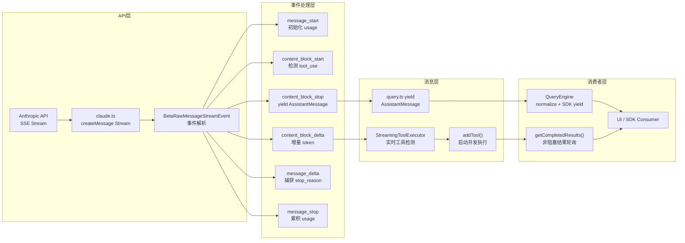
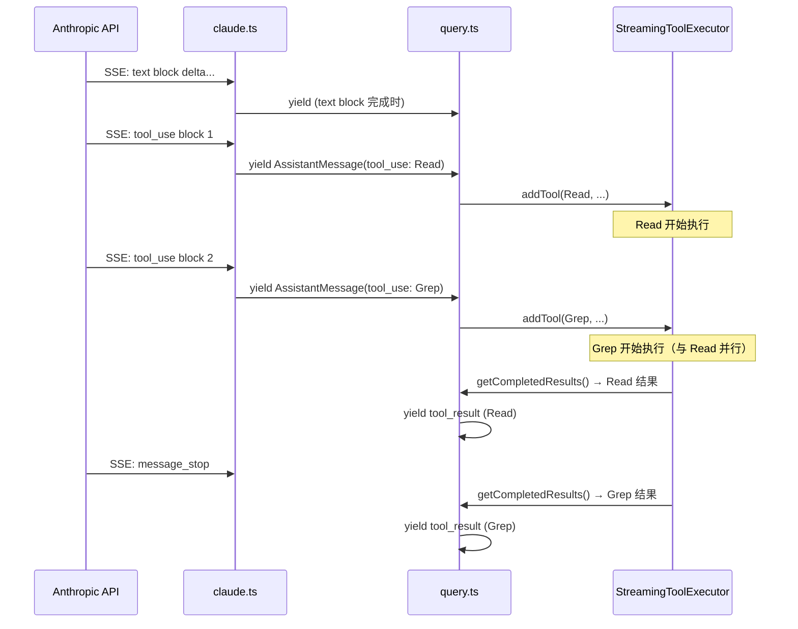
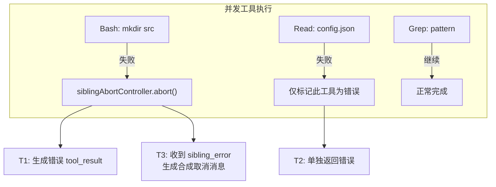

# 第 6 章：流式响应架构

## 核心设计问题

为什么 Agent 必须是流式的？因为一个 Agent turn 的生命周期可能是 5 秒到 5 分钟。如果用户在这段时间只看到一个旋转的光标，信任感会迅速消失。更关键的是，**工具调用是嵌入在流式响应中的**——必须实时检测 `tool_use` block 的出现，才能在模型仍在输出时就开始执行工具。

Claude Code 的流式架构不是简单的"SSE 解析 + 逐字输出"。它是一个多层的管线，包含：流式 token 处理、工具调用实时检测、扣留（withholding）机制、UI 实时更新、背压控制和错误恢复。

## 流式数据管线总览



## 依赖注入：可测试的流式架构

在深入数据旅程之前，值得注意一个关键的架构决策：`query.ts` 并不直接调用 `claude.ts` 的 API 函数。它通过 `deps.callModel()` 进行依赖注入：

```typescript
// query.ts
const deps = params.deps ?? productionDeps()

for await (const message of deps.callModel({...})) {
  // 处理流式消息
}
```

`productionDeps()` 返回真实的 API 调用实现，而测试可以注入模拟实现。同样的模式也用于 `deps.autocompact`、`deps.microcompact` 等。这意味着：

1. **Agent 循环不绑定具体 API 实现**——不同的 API 提供商（Anthropic 直连、Bedrock、Vertex）可以注入不同的实现
2. **测试不需要 mock 网络**——直接注入生成预设消息的 generator
3. **循环逻辑与副作用完全解耦**——循环只关心"给我一个 AsyncGenerator<Message>"

这种依赖注入模式在工业级 Agent 系统中至关重要。Agent 循环是最核心、最复杂的逻辑，如果它和具体的 API 调用耦合在一起，测试将极其困难。

## 从 API 到 Generator：数据的旅程

### 第一层：SSE 流解析

`claude.ts` 中的 API 调用使用 Anthropic SDK 的流式接口，返回一个 `Stream<BetaRawMessageStreamEvent>`。SSE（Server-Sent Events）协议将模型响应拆分为一系列事件：

| 事件类型 | 含义 | 触发动作 |
|---------|------|---------|
| `message_start` | 新消息开始 | 初始化 usage 计数器 |
| `content_block_start` | 新内容块开始 | 检测是 `text`、`thinking` 还是 `tool_use` |
| `content_block_delta` | 内容增量 | 文本：逐字输出；tool_use：增量 JSON 解析 |
| `content_block_stop` | 内容块结束 | yield 完整的 AssistantMessage |
| `message_delta` | 消息级更新 | 捕获 `stop_reason` |
| `message_stop` | 消息结束 | 累积 usage 到会话总计 |

### 第二层：AssistantMessage 构建

`claude.ts` 的 `queryModelWithStreaming()` 函数是一个 AsyncGenerator，它消费 SSE 事件并 yield 结构化的 `AssistantMessage`。关键设计：

**每个 `content_block_stop` 事件触发一次 yield**。这意味着一条 LLM 响应可能产生多个 `AssistantMessage`——一个 text block 一个，一个 tool_use block 一个。这种粒度的选择是有意的：

```typescript
// 伪代码：content_block_stop 处理
if (event.type === 'content_block_stop') {
  yield {
    type: 'assistant',
    message: {
      id: currentMessageId,
      content: [completedBlock],
      // stop_reason 此时为 null——真实值在 message_delta 中才到
    },
    uuid: ...,
  }
}
```

为什么不在 `message_stop` 时才 yield？因为**工具执行不能等**。当第一个 `tool_use` block 完成时，`StreamingToolExecutor` 就可以开始执行它，而模型可能还在输出第二个 `tool_use` block。

### 设计启示

> 流式系统中，yield 的粒度决定了系统的响应性。对于 Agent 系统，在 `content_block_stop`（而非 `message_stop`）时 yield 是关键——它允许工具执行与模型输出并行进行。

### 上下文管理管道：压缩的多层防线

在流式接收循环之前，`query.ts` 还运行了一个精心设计的上下文管理管道。这些步骤在每次循环迭代开始时执行，确保发送给 API 的消息不会超出上下文窗口：

```
消息输入 → 工具结果预算裁剪 → Snip 压缩 → Microcompact → Context Collapse → AutoCompact → 发送 API
```

这是一种渐进式回收策略：先用最轻量的方式回收空间（删除旧工具结果），不够再用更重的方式（摘要），最后才用最重的完全压缩。第 10 章将详细分析每一层的具体实现和设计思想。

## 工具调用的实时检测

这是流式架构中最精妙的部分。传统的"先接收完整个响应，再执行工具"模式有一个致命缺点：**延迟叠加**。如果模型输出了 5 个工具调用，每个执行 10 秒，传统模式需要 50 秒；流式模式只需 10 秒。

### StreamingToolExecutor 的集成

在 `query.ts` 的流式接收循环中，每当一个 `tool_use` block 完成：

```typescript
if (message.type === 'assistant') {
  assistantMessages.push(message)

  const msgToolUseBlocks = message.message.content.filter(
    content => content.type === 'tool_use',
  ) as ToolUseBlock[]

  if (msgToolUseBlocks.length > 0) {
    toolUseBlocks.push(...msgToolUseBlocks)
    needsFollowUp = true
  }

  // 流式工具执行：立即将 tool_use block 交给 executor
  if (streamingToolExecutor && !toolUseContext.abortController.signal.aborted) {
    for (const toolBlock of msgToolUseBlocks) {
      streamingToolExecutor.addTool(toolBlock, message)
    }
  }
}
```

同时，在每次流式事件处理后，检查是否有工具已经执行完毕：

```typescript
if (streamingToolExecutor && !toolUseContext.abortController.signal.aborted) {
  for (const result of streamingToolExecutor.getCompletedResults()) {
    if (result.message) {
      yield result.message
      toolResults.push(...)
    }
  }
}
```



## 扣留（Withholding）机制

不是所有的流式输出都应该立刻到达消费者。Claude Code 有一个精心设计的扣留机制，用于以下场景：

### 1. max_output_tokens 错误扣留

当模型的输出达到 token 上限时，API 会返回一个错误标记。但此时恢复机制可能还在运行——如果先把错误 yield 给 SDK 消费者（如 Claude Desktop），消费者会立即终止会话，而恢复循环还在继续但没人听。

```typescript
let withheld = false
// 检查是否是可恢复错误
if (isWithheldMaxOutputTokens(message)) {
  withheld = true
}
if (!withheld) {
  yield yieldMessage
}
```

只有当恢复机制确认无法修复时，错误才会被"释放"给消费者。

### 2. prompt_too_long 错误扣留

类似地，上下文过长导致的 413 错误也会被扣留。系统先尝试上下文坍缩恢复或响应式压缩（reactive compact），只有在所有恢复路径都失败后才 yield 错误。

### 3. 媒体大小错误扣留

当用户提交的图片/PDF 过大时，响应式压缩可以自动剥离媒体并重试。在此之前，错误消息被扣留。

### 设计启示

> 在 Agent 的流式管道中，不是所有数据都应该立刻向下传递。引入"扣留 + 条件释放"机制，可以在用户看到错误之前尝试自动恢复。但这种机制必须严格对齐：扣留条件（withhold gate）和释放条件（recovery check）必须一致，否则消息就会丢失。

## 背压（Backpressure）处理

AsyncGenerator 天然提供背压——消费者不调用 `next()` 时，生产者自动暂停。但在 Claude Code 的架构中，还有几个额外的背压场景需要处理。

### 会话持久化的背压

`QueryEngine` 在每次 yield 后可能需要将消息持久化到磁盘（`recordTranscript`）。对于 assistant 消息，持久化是 fire-and-forget（不阻塞）：

```typescript
if (message.type === 'assistant') {
  void recordTranscript(messages)  // 不 await
} else {
  await recordTranscript(messages)  // 阻塞等待
}
```

为什么 assistant 消息不 await？因为 `claude.ts` 在每个 content_block_stop 时 yield，然后在 message_delta 时修改最后一个消息的 usage/stop_reason。如果这里 await，就会阻塞 `query()` 的 generator，导致 message_delta 事件无法处理。

但用户消息必须 await，因为它出现在流式接收之前——确保写入完成后才进入下一轮 LLM 调用，避免进程崩溃时丢失数据。

### StreamingToolExecutor 的背压

`StreamingToolExecutor.getRemainingResults()` 使用 `Promise.race` 等待工具完成：

```typescript
while (this.hasUnfinishedTools()) {
  await this.processQueue()
  for (const result of this.getCompletedResults()) {
    yield result
  }
  // 如果有工具在执行但没完成，等待任意一个完成或进度可用
  if (this.hasExecutingTools() && !this.hasCompletedResults()) {
    await Promise.race([...executingPromises, progressPromise])
  }
}
```

这个循环不是忙等待——它在没有结果时阻塞，在有结果时立刻唤醒。`progressPromise` 是一个额外的唤醒通道，确保进度消息（如 Bash 命令的实时输出）不会因为 `Promise.race` 等待工具完成而延迟。

## 流式错误恢复

流式场景下的错误比非流式更复杂——因为部分数据已经 yield 出去了。

### 模型回退时的消息清理

当流式接收过程中触发模型回退（Fallback），已经 yield 的 assistant 消息需要被"撤回"。但 AsyncGenerator 的 yield 是不可逆的——消息已经到达了消费者。

Claude Code 使用双重清理策略：

1. **tombstone 消息**：对已经 yield 的消息发送 tombstone（墓碑标记）

```typescript
if (streamingFallbackOccured) {
  // 对已经 yield 的消息发送 tombstone（墓碑）
  for (const msg of assistantMessages) {
    yield { type: 'tombstone' as const, message: msg }
  }
  // 清理内部状态
  assistantMessages.length = 0
  toolResults.length = 0
  toolUseBlocks.length = 0
}
```

`tombstone` 消息告诉消费者"请从 UI 和 transcript 中移除这条消息"。这是一种优雅的软删除机制——消费者可以选择如何处理（移除、标记为过期等）。

2. **discard + 重建 StreamingToolExecutor**：当回退发生时，旧的 executor 被丢弃（`discard()`），新请求使用全新的 executor。这防止了旧请求的 `tool_use_id` 泄漏到重试中：

```typescript
if (streamingToolExecutor) {
  streamingToolExecutor.discard()
  streamingToolExecutor = new StreamingToolExecutor(
    toolUseContext.options.tools,
    canUseTool,
    toolUseContext,
  )
}
```

3. **合成的配对 tool_result**：对于非流式路径（`FallbackTriggeredError` 被抛出的场景），`yieldMissingToolResultBlocks()` 为每个孤儿 `tool_use` 生成合成的错误 `tool_result`，确保 API 要求的消息配对完整性。

### 工具执行中的错误隔离

当一个并发执行的 Bash 工具出错时，不应该把所有并行工具都杀掉。`StreamingToolExecutor` 的错误隔离策略是：

- **Bash 错误会取消兄弟进程**：因为 Bash 命令之间常有隐式依赖（如 mkdir 失败后，后续命令无意义）
- **其他工具错误不影响兄弟**：Read、WebFetch 等是独立的——一个失败不应影响其余



### 设计启示

> 流式系统的错误处理比批处理复杂一个数量级。你不能简单回滚——部分数据已经离开了系统。需要：(1) tombstone 机制标记已发出的无效数据，(2) 合成的 tool_result 确保消息配对完整，(3) 精细化的错误隔离——不是所有错误都应该级联。

## 进度消息的实时管道

工具执行的进度（如 Bash 命令的 stdout、文件读取进度）需要实时到达 UI，但不能打断消息的有序性。

### 独立的进度通道

`StreamingToolExecutor` 为每个工具维护 `pendingProgress` 数组：

```typescript
// 工具产生的进度消息不进入 results，而是进入 pendingProgress
if (update.message.type === 'progress') {
  tool.pendingProgress.push(update.message)
  // 唤醒等待中的 getRemainingResults
  if (this.progressAvailableResolve) {
    this.progressAvailableResolve()
    this.progressAvailableResolve = undefined
  }
}
```

`getCompletedResults()` 总是先 yield 进度消息，再处理完成结果：

```typescript
*getCompletedResults(): Generator<MessageUpdate, void> {
  for (const tool of this.tools) {
    // 进度消息优先 yield，无论工具状态
    while (tool.pendingProgress.length > 0) {
      yield { message: tool.pendingProgress.shift()!, ... }
    }
    // 然后处理完成结果...
  }
}
```

### 设计启示

> 在流式系统中，不同类型的数据有不同的优先级和有序性要求。进度消息是"fire-and-forget"的——顺序不重要，实时性是第一优先级。而工具结果是必须有序的——它们会作为下一条 LLM 消息的内容。用独立的通道处理这两种数据，可以同时满足实时性和有序性。

## 与 query.ts 循环的协作

回到第 5 章的 Agent 循环，流式架构与循环的协作点在于：

1. **循环入口**：`yield { type: 'stream_request_start' }` 标记 API 请求开始
2. **流式接收**：`for await (const message of deps.callModel({...}))` 消费 SSE 事件
3. **实时工具执行**：流式接收中，每有 tool_use block 完成就调用 `streamingToolExecutor.addTool()`
4. **实时结果轮询**：每处理一个流式事件后，调用 `streamingToolExecutor.getCompletedResults()`
5. **循环出口**：流式接收结束后，调用 `streamingToolExecutor.getRemainingResults()` 等待所有工具完成

```mermaid
sequenceDiagram
    participant Loop as query.ts 循环
    participant API as claude.ts
    participant Executor as StreamingToolExecutor

    Loop->>Loop: yield stream_request_start
    loop 流式接收
        API->>Loop: yield AssistantMessage
        Loop->>Executor: addTool (如为 tool_use)
        Executor->>Loop: getCompletedResults()
        Loop->>Loop: yield 工具结果
    end
    Note over Loop: 流式接收结束
    Executor->>Loop: getRemainingResults()
    Loop->>Loop: yield 剩余工具结果
    Loop->>Loop: 检查中断 / 处理附件
    Loop->>Loop: 更新 State, continue
```

## 总结：流式架构的设计原则

从 Claude Code 的流式架构中，我们可以提炼出几条通用原则：

1. **粒度决定响应性**：在 `content_block_stop` 而非 `message_stop` 时 yield，使工具执行可以与模型输出并行
2. **扣留是必要的**：不是所有数据都应该立刻到达消费者——在确认无法恢复前扣留错误
3. **tombstone 代替回滚**：流式系统中无法回滚已发出的数据，用 tombstone 标记无效数据
4. **独立通道处理不同优先级**：进度消息和结果消息有不同的有序性要求，用独立通道处理
5. **背压是特性不是 bug**：AsyncGenerator 的天然背压防止内存溢出，fire-and-forget 的持久化避免阻塞
6. **错误隔离是精细化的**：不是所有错误都应该级联——Bash 错误取消兄弟，但 Read 错误只影响自己

在下一章，我们将深入工具调度的细节——Agent 如何决定什么时候调用工具，以及如何安全地并发执行多个工具。

### 设计启示

> 工业级 Agent 系统的流式架构必须考虑"失败后的清理"——不只是正常路径，更关键的是异常路径。tombstone 标记已发出的无效数据，discard 丢弃已启动的工具执行，合成 tool_result 填补消息配对空缺。这三者组合才能确保流式系统在任何失败模式下都能恢复到一致状态。
