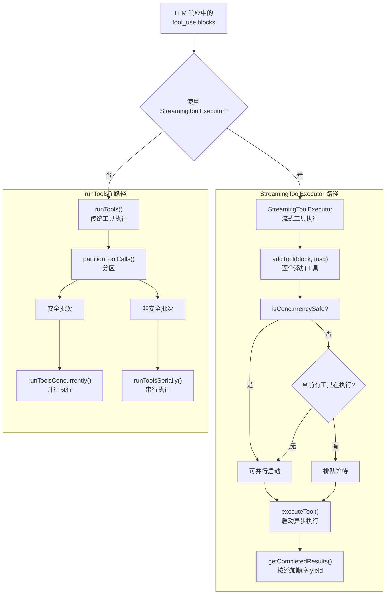
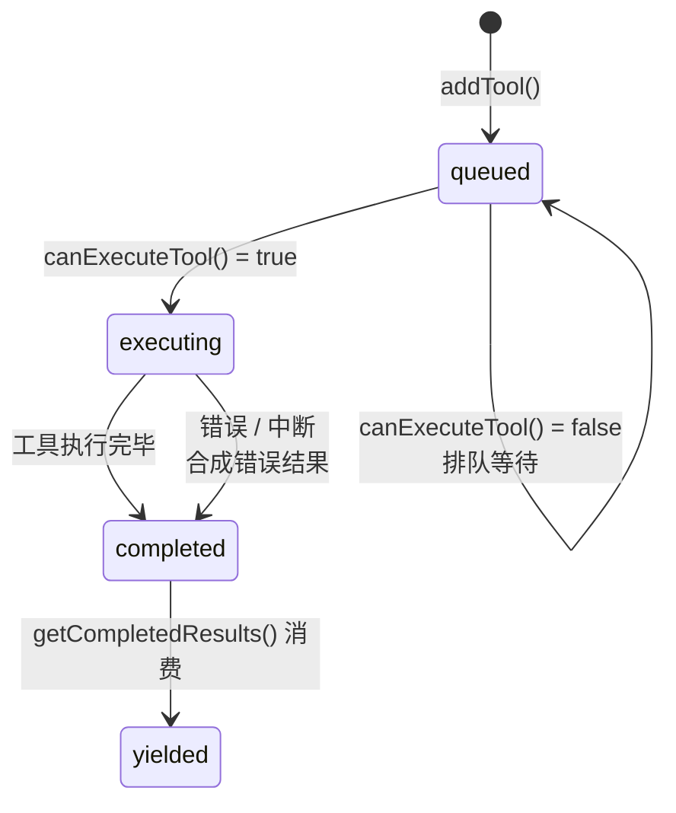
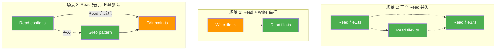
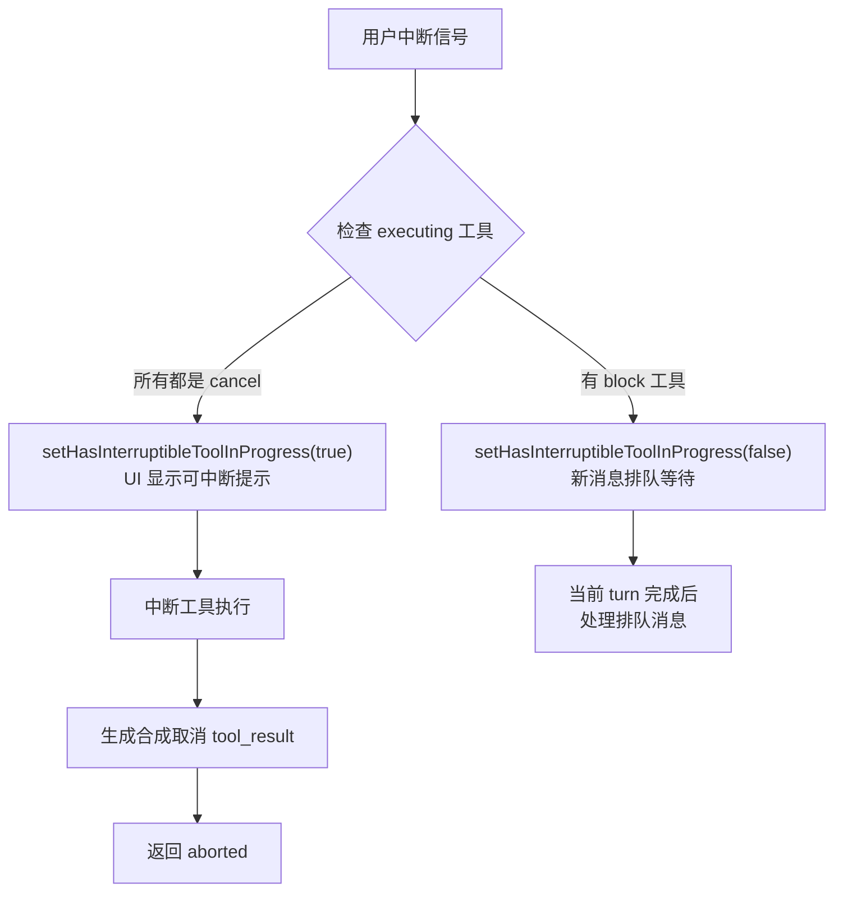

# 第 7 章：工具调度与并发执行

## 核心设计问题

当一个 Agent 同时需要读取三个文件、搜索一个模式、运行一个 Bash 命令时，它应该怎么做？串行执行需要 30 秒，并行执行只需 10 秒——但并行执行引入了复杂性：文件系统竞争、上下文污染、错误级联。

Claude Code 给出了一个精心设计的答案：**不是所有工具都应该并发，但可以并发的工具必须并发**。关键在于准确地判断"安全性"——这不仅仅是"只读 vs 写入"的简单二分法。

## 工具调度与执行流程



## 两条执行路径

Claude Code 有两条工具执行路径：**流式工具执行**（`StreamingToolExecutor`）和**传统工具执行**（`runTools`）。

### 路径一：StreamingToolExecutor

当 `config.gates.streamingToolExecution` 为 true 时使用。这是更新的路径，核心优势是**工具可以在模型流式输出时就开始执行**：

```typescript
let streamingToolExecutor = useStreamingToolExecution
  ? new StreamingToolExecutor(
      toolUseContext.options.tools,
      canUseTool,
      toolUseContext,
    )
  : null
```

### 路径二：runTools

传统路径，在流式接收完全结束后才开始执行工具。使用 `partitionToolCalls` 将工具调用分为"安全批次"和"非安全批次"：

```typescript
function partitionToolCalls(toolUseMessages, toolUseContext): Batch[] {
  return toolUseMessages.reduce((acc, toolUse) => {
    const isConcurrencySafe = /* 判断逻辑 */
    if (isConcurrencySafe && acc[acc.length - 1]?.isConcurrencySafe) {
      // 追加到当前安全批次
      acc[acc.length - 1].blocks.push(toolUse)
    } else {
      // 开启新批次
      acc.push({ isConcurrencySafe, blocks: [toolUse] })
    }
    return acc
  }, [])
}
```

这个分区算法的关键洞察是：**安全性是动态的，不是静态的**。同一个工具在不同输入下可能有不同的安全性。例如，Bash 工具执行 `ls` 是安全的，但执行 `rm -rf` 不是。

## isConcurrencySafe：安全性的动态判定

每个工具都定义了 `isConcurrencySafe(input)` 方法。这是工具安全性的最终裁决者：

```typescript
// Tool.ts 中的接口定义
type Tool = {
  isConcurrencySafe(input: z.infer<Input>): boolean
  // ...
}
```

### 默认值：安全第一

`buildTool` 函数为所有未显式定义 `isConcurrencySafe` 的工具提供默认值——**false**（不安全）：

```typescript
const TOOL_DEFAULTS = {
  isConcurrencySafe: (_input?: unknown) => false,  // 假设不安全
  isReadOnly: (_input?: unknown) => false,          // 假设写入
  // ...
}
```

这是一个**保守的设计选择**：如果不确定是否安全，就不要并发。

### 具体工具的安全性判定

| 工具 | isConcurrencySafe | 原因 |
|------|------------------|------|
| Read | true | 纯读取，无副作用 |
| Glob | true | 纯搜索，无副作用 |
| Grep | true | 纯搜索，无副作用 |
| Write | false | 修改文件系统 |
| Edit | false | 修改文件系统 |
| Bash | **取决于命令** | `ls` 安全，`npm install` 不安全 |
| WebFetch | true | 无本地副作用 |

Bash 工具的判定最为复杂——它需要解析命令内容来决定安全性：

```typescript
isConcurrencySafe(input) {
  // 解析 shell 命令，检查是否是纯读取操作
  try {
    return isReadOnlyCommand(input.command)
  } catch {
    return false  // 解析失败 → 保守处理
  }
}
```

### 设计启示

> 并发安全性不能是工具级别的静态标签，而必须是**工具 + 输入级别的动态判定**。一个 `Bash(ls)` 是安全的，`Bash(rm -rf)` 不是。将安全性判定下推到工具实现，而非集中管理，是因为只有工具自身最清楚自己的语义。

## StreamingToolExecutor 的内部架构

`StreamingToolExecutor` 是一个有状态的工具调度器。它维护一个 `TrackedTool[]` 数组，每个工具经历四种状态：



### 并发控制的三个规则

`canExecuteTool()` 方法实现了三条规则：

```typescript
private canExecuteTool(isConcurrencySafe: boolean): boolean {
  const executingTools = this.tools.filter(t => t.status === 'executing')
  return (
    executingTools.length === 0 ||
    (isConcurrencySafe && executingTools.every(t => t.isConcurrencySafe))
  )
}
```

**规则一**：如果没有工具在执行，任何工具都可以启动。

**规则二**：如果当前执行的工具都是"并发安全"的，新的"并发安全"工具可以并行启动。

**规则三**：如果当前有任何"非安全"工具在执行，或者新工具是"非安全"的，必须等待。



### 结果的有序 yield

并发执行的工具，结果必须按添加顺序 yield。这是对 API 的要求——`tool_result` 必须与 `tool_use` 的顺序一致。

`getCompletedResults()` 方法实现了这个有序性：

```typescript
*getCompletedResults(): Generator<MessageUpdate, void> {
  for (const tool of this.tools) {
    // 总是先 yield 进度消息
    while (tool.pendingProgress.length > 0) {
      yield { message: tool.pendingProgress.shift()!, ... }
    }

    if (tool.status === 'yielded') continue

    if (tool.status === 'completed' && tool.results) {
      tool.status = 'yielded'
      for (const message of tool.results) {
        yield { message, ... }
      }
    } else if (tool.status === 'executing' && !tool.isConcurrencySafe) {
      break  // 遇到未完成的非安全工具，停止——保序
    }
  }
}
```

关键点在 `break`：遇到一个正在执行的**非安全工具**时，即使后面的安全工具已经完成，也不 yield 它们的结果。这是因为非安全工具可能修改上下文（通过 `contextModifier`），后续工具的结果可能依赖于这个修改。

### contextModifier：工具对上下文的副作用

这是一个在流式工具执行中容易被忽视但至关重要的设计。某些工具（如 `ExitPlanModeTool`）不仅产生消息，还会修改全局的 `ToolUseContext`。这种修改通过 `contextModifier` 回调实现：

```typescript
type ToolResult<T> = {
  data: T
  // contextModifier 只对非并发安全工具生效
  contextModifier?: (context: ToolUseContext) => ToolUseContext
}
```

在 `StreamingToolExecutor` 中，只有**非并发安全**工具的 `contextModifier` 会被立即应用：

```typescript
if (!tool.isConcurrencySafe && contextModifiers.length > 0) {
  for (const modifier of contextModifiers) {
    this.toolUseContext = modifier(this.toolUseContext)
  }
}
```

这是一个精妙的安全保证：并发安全工具不执行 contextModifier，因为并发执行时上下文修改会互相冲突。只有排他执行的非安全工具才能安全地修改上下文。这也解释了为什么有序输出中遇到非安全工具必须 `break`——它的上下文修改可能影响后续所有工具的行为。

### 设计启示

> 并发执行 + 有序输出是 Agent 工具系统的核心矛盾。解决方案是：(1) 执行可以乱序（并发），但 (2) 输出必须有序（按添加顺序 yield），并且 (3) 遇到非安全工具时停止输出，等待它完成后再继续——因为它的结果可能改变后续工具的执行上下文。

### 并发上限与丢弃机制

传统路径 `runTools()` 中有一个可配置的并发上限，默认为 10：

```typescript
function getMaxToolUseConcurrency(): number {
  return (
    parseInt(process.env.CLAUDE_CODE_MAX_TOOL_USE_CONCURRENCY || '', 10) || 10
  )
}
```

这防止了模型一次性发出过多工具调用导致资源耗尽。在 `runToolsConcurrently` 中，它使用 `all()` 工具函数（而非 `Promise.all`）来限制同时执行的 generator 数量。

当流式回退发生时（模型失败后切换到备选模型），`StreamingToolExecutor` 提供了 `discard()` 方法：

```typescript
discard(): void {
  this.discarded = true
}
```

一旦标记为丢弃，所有后续的 `getCompletedResults()` 和 `getRemainingResults()` 都会立即返回空。排队中的工具不会启动，执行中的工具会收到合成错误。这确保了失败请求的工具执行不会泄漏到重试中。

### 设计启示

> 并发系统需要"紧急刹车"机制。当整个请求需要重试时，正在执行的工具必须能被立即丢弃。`discard()` 用一个布尔标志实现了这一点——简单但有效。所有后续操作都检查这个标志，确保不会产生孤儿结果。

## 错误级联策略

并发执行中，一个工具出错时该怎么办？Claude Code 的答案是：**取决于工具类型**。

### Bash 错误触发兄弟取消

Bash 工具的隐式依赖链（如 `mkdir` 失败后 `cp` 无意义）使得级联取消成为合理选择：

```typescript
if (isErrorResult) {
  thisToolErrored = true
  if (tool.block.name === BASH_TOOL_NAME) {
    this.hasErrored = true
    this.erroredToolDescription = this.getToolDescription(tool)
    this.siblingAbortController.abort('sibling_error')
  }
}
```

`siblingAbortController` 是 `toolUseContext.abortController` 的子控制器。取消它只会终止兄弟工具，不会终止整个查询。

### 其他工具错误不影响兄弟

Read、WebFetch、Grep 等工具是独立的——一个失败不应影响其余：

```typescript
// 只有 Bash 错误会触发 hasErrored
// Read/Grep/WebFetch 错误只标记 thisToolErrored
```

### 合成错误消息

被取消的工具不会执行真正的 `tool.call()`，而是收到一条合成错误消息：

```typescript
private createSyntheticErrorMessage(toolUseId, reason, assistantMessage) {
  if (reason === 'sibling_error') {
    return `Cancelled: parallel tool call ${desc} errored`
  }
  if (reason === 'user_interrupted') {
    return REJECT_MESSAGE  // "User rejected edit"
  }
  if (reason === 'streaming_fallback') {
    return 'Streaming fallback - tool execution discarded'
  }
}
```

这些合成消息确保了每个 `tool_use` 都有配对的 `tool_result`，即使工具从未真正执行。

### 设计启示

> 并发系统的错误策略不应该是"一刀切"。不同类型的工具有不同的错误传播语义：(1) 有状态工具（Bash）的错误应该级联，因为后续操作依赖前一步的副作用；(2) 无状态工具（Read/Grep）的错误应该隔离，因为它们之间没有隐式依赖。

## 中断处理的精细化

工具执行中的中断（用户按 Ctrl+C 或发送新消息）需要精细化处理——不同工具有不同的中断行为。

### interruptBehavior：工具级别的中断策略

```typescript
type Tool = {
  interruptBehavior?(): 'cancel' | 'block'
}
```

- **`cancel`**：工具可以被中断（如 Bash 执行中的命令应该被终止）
- **`block`**：工具不能被中断，新消息必须等待（如正在写入文件的关键操作）

默认是 `block`——如果工具没有显式定义 `interruptBehavior`，用户的中断不会打断它。



### 中断原因的区分

`getAbortReason()` 方法区分三种中断原因：

```typescript
private getAbortReason(tool: TrackedTool): 'sibling_error' | 'user_interrupted' | 'streaming_fallback' | null {
  if (this.discarded) return 'streaming_fallback'
  if (this.hasErrored) return 'sibling_error'
  if (this.toolUseContext.abortController.signal.aborted) {
    if (this.toolUseContext.abortController.signal.reason === 'interrupt') {
      return this.getToolInterruptBehavior(tool) === 'cancel'
        ? 'user_interrupted'
        : null
    }
    return 'user_interrupted'
  }
  return null
}
```

注意：当 `reason === 'interrupt'`（用户发送了新消息）时，只有 `interruptBehavior === 'cancel'` 的工具才被取消。`block` 工具返回 `null`（不中断），新消息等待 turn 结束后处理。

### 设计启示

> 中断不是全有或全无的。设计良好的 Agent 系统需要：(1) 工具级别的中断行为定义，(2) 中断原因的区分（用户主动取消 vs 发送新消息），(3) 只有可中断的工具被取消，其余工具继续执行直到完成。

## processQueue 的自动调度

`StreamingToolExecutor` 的 `processQueue()` 方法实现了自动的调度——不需要外部协调器来决定何时启动下一个工具：

```typescript
private async processQueue(): Promise<void> {
  for (const tool of this.tools) {
    if (tool.status !== 'queued') continue

    if (this.canExecuteTool(tool.isConcurrencySafe)) {
      await this.executeTool(tool)
    } else {
      // 无法执行这个工具——维护顺序
      if (!tool.isConcurrencySafe) break
      // 安全工具被非安全工具阻塞，继续检查下一个
    }
  }
}
```

它还在每个工具完成后自动重新调度：

```typescript
void promise.finally(() => {
  void this.processQueue()
})
```

这意味着：当一个非安全工具完成后，被它阻塞的安全工具会自动启动，无需外部干预。

## 总结：工具调度的设计原则

从 Claude Code 的工具调度系统中，我们可以提炼出以下原则：

1. **动态安全性判定**：并发安全性不是工具级别的静态标签，而是工具 + 输入级别的动态判定
2. **保守默认 + 精确覆盖**：默认假设不安全（`false`），只有明确判断为安全的操作才并发
3. **并发执行 + 有序输出**：执行可以乱序，但 yield 必须有序
4. **错误隔离而非错误抑制**：Bash 错误级联（因为有隐式依赖），Read 错误隔离（因为独立）
5. **工具级别中断行为**：不是所有工具都可以被中断——由 `interruptBehavior()` 决定
6. **合成错误保证配对完整性**：每个 `tool_use` 必须有配对的 `tool_result`，即使工具从未执行

在下一章，我们将探讨 Plan Mode——Claude Code 如何将"思考"和"行动"分离，以及这种分离为什么对 Agent 的可靠性至关重要。
