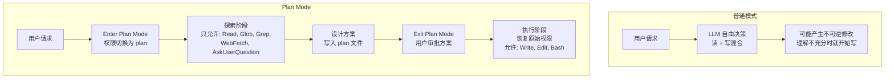
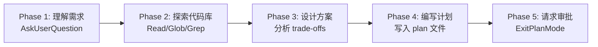
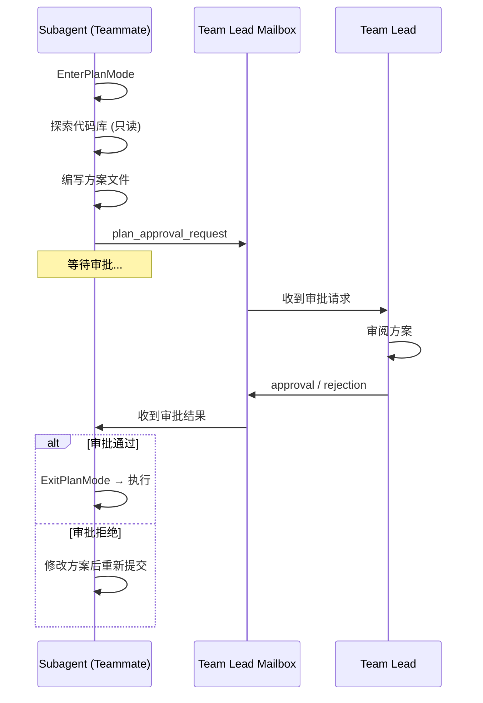

# 第 8 章：Plan Mode——思考与行动的分离

## 核心设计问题

当 AI Agent 面对一个复杂任务时，它应该先想清楚再做，还是边想边做？人类工程师知道答案是前者——先分析需求、理解代码库、设计方案，然后再动手修改。但大多数 AI Agent 系统没有这种分离：模型在同一个上下文中既思考又行动，经常在还没完全理解问题时就迫不及待地开始写代码。

Claude Code 的 Plan Mode 是对这个问题的一个优雅回答：**通过权限系统强制分离思考（只读）和行动（读写）阶段**。在 plan mode 中，Agent 只能读取和搜索；退出 plan mode 后，Agent 获得写入权限。

这不是一个简单的 UI 模式切换——它是一个深刻的设计决策，将 Agent 的可靠性从一个概率问题转化为一个结构化问题。

## Plan Mode 的本质：权限驱动的阶段分离



### Plan Mode 的权限语义

Plan mode 不是简单地"禁用某些工具"。它是一个**权限模式**（`PermissionMode`），与 `default`、`auto`、`bypassPermissions` 等模式并列：

```typescript
// PermissionMode.ts
const PERMISSION_MODE_CONFIG = {
  default: { title: 'Default', ... },
  plan: {
    title: 'Plan Mode',
    shortTitle: 'Plan',
    symbol: PAUSE_ICON,    // 暂停图标——暗示"先停一下"
    color: 'planMode',
  },
  acceptEdits: { ... },
  bypassPermissions: { ... },
  auto: { ... },
}
```

`plan` 模式的图标是 **PAUSE_ICON**（暂停）——这不是巧合。它传达的语义是："暂停执行，先想清楚"。

### EnterPlanModeTool：进入计划模式

进入 plan mode 是一个**工具调用**——模型主动请求进入，而非用户强制切换。这是一个关键的设计选择：

```typescript
// EnterPlanModeTool.ts
export const EnterPlanModeTool: Tool = buildTool({
  name: ENTER_PLAN_MODE_TOOL_NAME,
  isReadOnly() { return true },
  isConcurrencySafe() { return true },

  async call(_input, context) {
    // 1. 记录模式转换
    handlePlanModeTransition(currentMode, 'plan')

    // 2. 更新权限上下文
    context.setAppState(prev => ({
      ...prev,
      toolPermissionContext: applyPermissionUpdate(
        prepareContextForPlanMode(prev.toolPermissionContext),
        { type: 'setMode', mode: 'plan' },
      ),
    }))

    return { data: { message: 'Entered plan mode...' } }
  },
})
```

`prepareContextForPlanMode` 做了什么？它**保存当前模式到 `prePlanMode`**，以便退出时恢复：

```typescript
function prepareContextForPlanMode(ctx: ToolPermissionContext): ToolPermissionContext {
  return {
    ...ctx,
    mode: 'plan',
    prePlanMode: ctx.mode,  // 保存进入前的模式
  }
}
```

### ExitPlanModeV2Tool：退出计划模式

退出 plan mode 有**三道防护**，而非一道。这体现了深度防御的设计思想：

**第一道：`validateInput`——语义校验**

```typescript
// ExitPlanModeV2Tool.ts
async validateInput(_input, { getAppState }) {
  // 如果当前不在 plan mode，直接拒绝
  const mode = getAppState().toolPermissionContext.mode
  if (mode !== 'plan') {
    return {
      result: false,
      message: 'You are not in plan mode. This tool is only for exiting plan mode...',
      errorCode: 1,
    }
  }
  return { result: true }
}
```

`validateInput` 在 `checkPermissions` 之前运行。如果模型在非 plan mode 下调用了 ExitPlanMode（比如 compact 后"忘记"了自己已经退出），它会被立即拒绝，不会弹出权限对话框。

**第二道：`checkPermissions`——用户确认**

```typescript
// ExitPlanModeV2Tool.ts
async checkPermissions(input, context) {
  if (isTeammate()) {
    return { behavior: 'allow', updatedInput: input }
  }
  return {
    behavior: 'ask',
    message: 'Exit plan mode?',
    updatedInput: input,
  }
}
```

**第三道：`requiresUserInteraction`——UI 行为声明**

这个方法告诉 UI 层：这个工具需要显示交互式对话框。在 `--print` 等非交互模式中，这个声明决定了工具是否被自动批准。

### 恢复逻辑：比"切回原模式"更复杂

用户确认后，退出工具恢复之前的权限模式。但恢复逻辑并非简单地"切回 prePlanMode"：

```typescript
async call(input, context) {
  context.setAppState(prev => {
    let restoreMode = prev.toolPermissionContext.prePlanMode ?? 'default'

    // 安全降级：如果 prePlanMode 是 auto 但 auto gate 已关闭（熔断器触发），降级为 default
    if (restoreMode === 'auto' && !(permissionSetupModule?.isAutoModeGateEnabled() ?? false)) {
      restoreMode = 'default'
      // 通知用户为什么降级了
      context.addNotification?.({
        text: `plan exit → default · ${gateFallbackNotification}`,
        priority: 'immediate',
      })
    }

    // 如果恢复到非 auto 模式，且之前有权限被剥离，恢复它们
    if (prev.toolPermissionContext.strippedDangerousRules && restoreMode !== 'auto') {
      baseContext = permissionSetupModule?.restoreDangerousPermissions(baseContext) ?? baseContext
    }

    return {
      ...prev,
      toolPermissionContext: { ...baseContext, mode: restoreMode, prePlanMode: undefined },
    }
  })
}
```

恢复逻辑处理了三种场景：
1. **正常恢复**：`prePlanMode` 保存的模式仍然有效，直接恢复
2. **熔断器降级**：用户在 plan mode 期间触发了 auto mode 的熔断器，退出时不再恢复 auto，降级为 default
3. **权限剥离恢复**：如果从 auto 模式进入 plan mode 时剥离了危险权限，且退出后不恢复 auto，则需要把权限加回来

## Plan Mode 状态转换

```mermaid
stateDiagram-v2
    [*] --> default: 用户启动会话

    default --> plan: EnterPlanModeTool.call()
    plan --> default: ExitPlanMode + 用户批准

    auto --> plan: EnterPlanModeTool.call()
    plan --> auto: ExitPlanMode + 恢复 prePlanMode

    plan --> plan: 继续探索<br/>Read/Glob/Grep

    state plan {
        [*] --> 探索代码库
        探索代码库 --> 理解架构
        理解架构 --> 设计方案
        设计方案 --> 写入plan文件
        写入plan文件 --> 请求退出
    }

    state 恢复模式 {
        [*] --> 检查prePlanMode
        检查prePlanMode --> auto: prePlanMode=auto<br/>且gate开启
        检查prePlanMode --> default: prePlanMode=auto<br/>但gate关闭
        检查prePlanMode --> default: prePlanMode=default
    }
```

## 权限如何影响工具可用性

Plan mode 的限制不是通过"禁用工具按钮"实现的，而是通过**权限系统**。在 plan mode 下，写入类工具的权限请求会被自动拒绝（或永远不询问——取决于工具的 `checkPermissions` 实现）。

### 工具的 isReadOnly 声明与 shouldDefer 延迟加载

每个工具都声明了自己的读写性质和加载策略：

```typescript
type Tool = {
  isReadOnly(input: z.infer<Input>): boolean
  shouldDefer?: boolean  // 延迟加载标记
  // ...
}
```

`EnterPlanModeTool` 和 `ExitPlanModeV2Tool` 都设置了 `shouldDefer: true`。这意味着它们的完整 Schema 不会一开始就出现在上下文中，而是需要 ToolSearch 先搜索到才能使用。这有三个好处：

1. **节省上下文 token**：Plan mode 工具的 Schema 包含复杂的嵌套结构
2. **按需发现**：只有当模型需要规划能力时，才"发现"这些工具
3. **减少误用**：模型不会在每次对话开始时就"看到"进入计划模式的选项

同时，它们都有 `searchHint` 属性为 ToolSearch 提供关键词线索：

```typescript
// EnterPlanModeTool
searchHint: 'switch to plan mode to design an approach before coding'

// ExitPlanModeV2Tool
searchHint: 'present plan for approval and start coding (plan mode only)'
```

每个工具都声明了自己的读写性质：

```typescript
type Tool = {
  isReadOnly(input: z.infer<Input>): boolean
  // ...
}
```

| 工具 | isReadOnly | plan mode 下行为 |
|------|-----------|-----------------|
| Read | true | 正常使用 |
| Glob | true | 正常使用 |
| Grep | true | 正常使用 |
| WebFetch | true | 正常使用 |
| AskUserQuestion | true | 正常使用 |
| Bash | **取决于命令** | 只有只读命令允许 |
| Write | false | **被拒绝** |
| Edit | false | **被拒绝** |
| NotebookEdit | false | **被拒绝** |

### plan 文件的特殊地位

有一个文件在 plan mode 中可以写入——**plan 文件本身**。这是通过特定的路径白名单实现的：

```typescript
// 在 plan mode 中，只有 plan 文件路径是允许写入的
const planFilePath = getPlanFilePath(context.agentId)
```

这确保了 Agent 可以保存设计方案，但不能修改代码。

## 模型如何被引导进入 Plan Mode

Plan mode 不是一个被动的开关——系统通过多层机制引导模型主动选择进入。

### 延迟加载与工具搜索

`EnterPlanModeTool` 和 `ExitPlanModeV2Tool` 都设置了 `shouldDefer: true`，这意味着它们的完整 Schema 不会一开始就出现在上下文中。模型需要先通过 `ToolSearch` 工具搜索到这些工具，然后才能调用。

这是一个有意的设计选择：
1. **节省上下文**：Plan mode 工具的 Schema 包含复杂的嵌套结构，占用大量 token
2. **按需引导**：只有当模型需要规划能力时，才"发现"这些工具
3. **减少误用**：模型不会在每次对话开始时就"看到"进入计划模式的选项

同时，这两个工具都有 `searchHint` 属性，为 ToolSearch 的关键词匹配提供线索：

```typescript
// EnterPlanModeTool
searchHint: 'switch to plan mode to design an approach before coding'

// ExitPlanModeV2Tool
searchHint: 'present plan for approval and start coding (plan mode only)'
```

### EnterPlanModeTool 的提示词

```typescript
// EnterPlanModeTool 的 mapToolResultToToolResultBlockParam
mapToolResultToToolResultBlockParam({ message }, toolUseID) {
  return {
    type: 'tool_result',
    content: `${message}

In plan mode, you should:
1. Thoroughly explore the codebase to understand existing patterns
2. Identify similar features and architectural approaches
3. Consider multiple approaches and their trade-offs
4. Use AskUserQuestion if you need to clarify the approach
5. Design a concrete implementation strategy
6. When ready, use ExitPlanMode to present your plan for approval

Remember: DO NOT write or edit any files yet. This is a read-only exploration and planning phase.`,
    tool_use_id: toolUseID,
  }
}
```

这条消息作为 `tool_result` 返回给模型——它不是系统提示词，而是在模型调用 `EnterPlanModeTool` 后的**即时反馈**。这种设计意味着：

1. 模型不会在每次对话开始时都被"计划模式"的指令淹没
2. 只有当模型主动选择进入计划模式时，才收到详细的阶段指导
3. 指导内容作为对话的一部分（tool_result），模型更容易遵守

### ExitPlanModeTool 的反向引导

退出时，模型收到用户的审批结果和方案内容：

```typescript
mapToolResultToToolResultBlockParam({ plan, planWasEdited, filePath }) {
  const planLabel = planWasEdited
    ? 'Approved Plan (edited by user)'
    : 'Approved Plan'

  return {
    type: 'tool_result',
    content: `User has approved your plan. You can now start coding.

Your plan has been saved to: ${filePath}

## ${planLabel}:
${plan}`,
  }
}
```

如果用户编辑了方案（`planWasEdited === true`），模型知道用户修改了它的提案——这暗示它应该遵循修改后的版本。

## Plan Mode 的 Interview Phase

对于 Anthropic 内部用户，plan mode 有一个更复杂的变体——**Interview Phase**。这是一种结构化的规划流程，将计划过程分为 5 个阶段：



Interview Phase 通过 `isPlanModeInterviewPhaseEnabled()` 门控：

```typescript
export function isPlanModeInterviewPhaseEnabled(): boolean {
  if (process.env.USER_TYPE === 'ant') return true  // Anthropic 内部始终开启
  // 外部用户通过 feature flag 控制
  return getFeatureValue_CACHED_MAY_BE_STALE('tengu_plan_mode_interview_phase', false)
}
```

当 Interview Phase 启用时，进入 plan mode 的 `tool_result` 消息更简洁：

```typescript
// Interview Phase 启用时的引导
`Entered plan mode. You should now focus on exploring the codebase
and designing an implementation approach.

DO NOT write or edit any files except the plan file.
Detailed workflow instructions will follow.`
```

"详细的指令稍后提供"——意味着后续会有分阶段的提示引导模型完成每个阶段。

## Plan 文件的管理

Plan 文件是一个特殊的文件，存储在项目的 `.claude/plans/` 目录下。它的管理有一套独立于普通文件的机制。

### 文件路径规则

```typescript
function getPlanFilePath(agentId?: string): string {
  if (agentId) {
    return path.join(getCwd(), '.claude', 'plans', `${agentId}.md`)
  }
  return path.join(getCwd(), '.claude', 'plans', 'plan.md')
}
```

每个子 agent 有自己的 plan 文件（以 agent ID 命名），主线程使用 `plan.md`。

### 远程文件快照

如果文件系统是远程的，plan 文件的修改需要同步。`persistFileSnapshotIfRemote()` 处理这一同步。

用户审批方案时有两种路径：终端 UI 的 Accept/Reject/Edit 对话框，和 CCR Web UI 的在线编辑。用户编辑后的方案内容通过 `permissionResult.updatedInput.plan` 传回。

## 为什么 Plan Mode 对 Agent 可靠性至关重要？

### 问题：Agent 的冲动

没有 plan mode 的 Agent 有几个常见的失败模式：

1. **过早优化**：还没理解全貌就开始修改，导致方向错误
2. **连锁破坏**：一个错误的修改触发更多错误修改，形成恶性循环
3. **无法回退**：写入操作是不可逆的，错误修改需要人工介入
4. **token 浪费**：在错误方向上执行了大量工具调用，消耗了宝贵的上下文窗口

### 解决：结构化的思考空间

Plan mode 通过以下机制解决了这些问题：

1. **强制只读**：物理上禁止写入，消除了"冲动修改"的可能性
2. **方案审批**：用户在修改发生之前就有机会干预
3. **上下文聚焦**：探索阶段产生的中间结果不会污染代码库
4. **可回溯性**：方案文件是可编辑的，用户可以调整方向

### 设计启示

> Agent 系统的可靠性不是通过更好的模型或更严格的提示词实现的，而是通过**架构约束**。Plan mode 将 Agent 的可靠性从"模型能否做出正确决策"的概率问题，转化为"模型是否在正确的阶段做正确的事"的结构化问题。这是一个从"软约束"（提示词引导）到"硬约束"（权限系统）的转变。

## Teammate 中的 Plan Mode

Plan mode 在子 agent（teammate）中有特殊行为。对于 `isPlanModeRequired()` 的 teammate，plan mode 是强制的——必须先提交方案给团队领导审批：

```typescript
// ExitPlanModeV2Tool 中的 teammate 路径
if (isTeammate() && isPlanModeRequired()) {
  if (!plan) {
    throw new Error('No plan file found. Please write your plan first.')
  }

  // 发送审批请求到团队领导的邮箱
  await writeToMailbox('team-lead', {
    from: agentName,
    text: JSON.stringify({
      type: 'plan_approval_request',
      planContent: plan,
      requestId,
    }),
  })

  return { data: { awaitingLeaderApproval: true, requestId } }
}
```



这体现了 Plan Mode 在多 Agent 系统中的价值：**它不仅是人机交互的保障，也是 Agent 间协作的协议**。

## 总结：思考与行动分离的设计原则

1. **权限驱动而非提示词驱动**：通过权限系统（plan mode）强制分离读写，而非依赖提示词引导
2. **模型主动选择**：进入 plan mode 是模型的工具调用，而非用户强制的模式切换
3. **保存恢复语义**：`prePlanMode` 确保退出时恢复到进入前的权限模式
4. **方案审批作为检查点**：用户在不可逆操作前有干预的机会
5. **子 agent 的强制规划**：多 Agent 系统中，plan mode 是 Agent 间协作的协议
6. **plan 文件的特殊地位**：plan mode 中唯一允许写入的文件是方案本身

在下一章，我们将深入 QueryEngine——管理整个查询生命周期的编排器，它是 Agent 循环之上的管理层。
