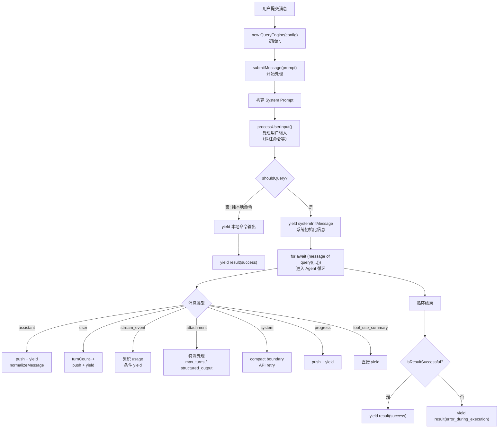
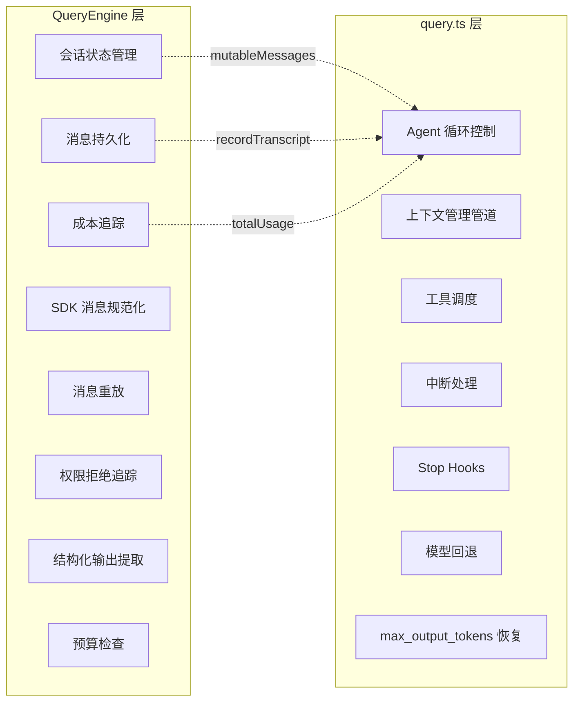
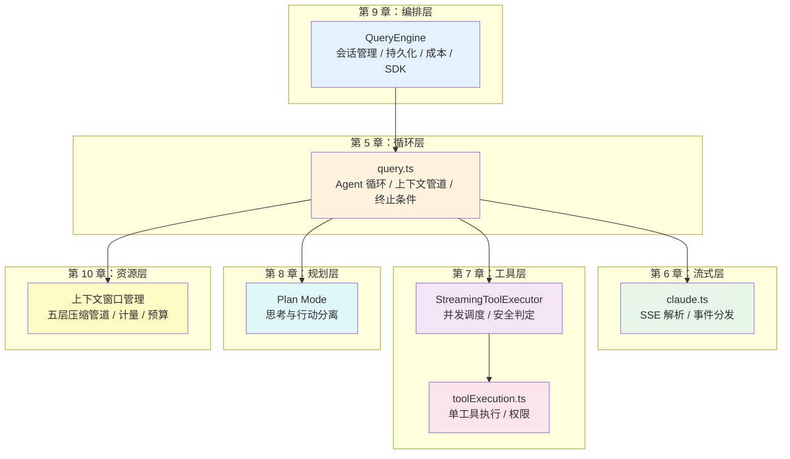

# 第 9 章：QueryEngine——查询编排器

## 核心设计问题

上一章我们看到 `query.ts` 中的 `query()` 函数是 Agent 的心脏——一个纯粹的 agentic 循环。但一个 Agent 系统不只是循环。从用户输入到最终结果，还有大量的编排工作：会话状态管理、消息持久化、成本追踪、权限审计、消息规范化、重放控制。这些工作需要一个**编排器**——它不参与循环本身，但管理着循环的整个生命周期。

`QueryEngine` 就是这个编排器。它的设计哲学是：**`query()` 处理一次 agentic turn 的内部循环，`QueryEngine` 处理一次用户提交的完整生命周期**。

## QueryEngine 生命周期



## QueryEngine vs query.ts：职责划分

理解 QueryEngine 的关键在于理解它和 `query.ts` 的分工。



| 职责 | QueryEngine | query.ts |
|------|-------------|----------|
| Agent 循环 | 消费 `for await` | 实现循环 |
| 消息存储 | `mutableMessages` 数组 | 使用 `messages` 副本 |
| 持久化 | `recordTranscript` 调用 | 不关心持久化 |
| 成本追踪 | `totalUsage` 累积 | 通过 `stream_event` 通知 |
| 用户输入处理 | `processUserInput` | 接收处理后的消息 |
| 工具执行 | 不关心 | `runTools` / `StreamingToolExecutor` |
| 中断处理 | `abortController` 管理 | 检测信号并处理 |
| SDK 消息格式 | `normalizeMessage` | 原始 `Message` 类型 |

### 设计启示

> 分离"循环逻辑"和"生命周期管理"是 Agent 系统的关键架构决策。循环逻辑应该不知道持久化、成本追踪或 SDK 格式的存在——这些是"横切关注点"，由编排器统一处理。这种分离使得循环逻辑可以在不同场景（REPL、SDK、子 Agent）中复用，而编排器根据场景定制。

## QueryEngine 的内部状态

QueryEngine 是一个有状态的对象——每个会话一个实例：

```typescript
export class QueryEngine {
  private config: QueryEngineConfig
  private mutableMessages: Message[]          // 会话消息历史
  private abortController: AbortController     // 中断控制器
  private permissionDenials: SDKPermissionDenial[]  // 权限拒绝记录
  private totalUsage: NonNullableUsage         // 累积 token 使用量
  private hasHandledOrphanedPermission: boolean // 孤儿权限标记
  private readFileState: FileStateCache        // 文件读取缓存
  private discoveredSkillNames: Set<string>    // 技能发现追踪
  private loadedNestedMemoryPaths: Set<string> // 内存路径去重
}
```

### mutableMessages：消息的双缓冲

`mutableMessages` 是 QueryEngine 持有的"真实"消息数组。`query()` 函数接收的是一个**副本**（`[...this.mutableMessages]`），循环中对副本的修改不会直接影响 `mutableMessages`。

消息的回流有两个路径：

1. **循环内**：`for await` 消费的每个 assistant/user/progress/attachment 消息都 push 到 `mutableMessages`
2. **循环外**：循环结束后，`query()` 返回的最终状态不包含中间修改

```typescript
// 循环内的消息回流
if (message.type === 'assistant') {
  this.mutableMessages.push(message)
  yield* normalizeMessage(message)  // yield 给 SDK 消费者
}
```

### 设计启示

> 当一个有状态的循环需要与外部消费者交互时，使用"副本输入 + 增量回流"模式：(1) 循环接收输入的副本，(2) 每个有意义的产出同时回流到内部状态和 yield 给消费者，(3) 消费者只能看到经过规范化处理的消息。

## submitMessage 的完整流程

`submitMessage` 是 QueryEngine 的核心方法。它是一个 AsyncGenerator，yield SDK 格式的消息。

### 阶段一：初始化

```typescript
async *submitMessage(prompt, options?): AsyncGenerator<SDKMessage> {
  this.discoveredSkillNames.clear()  // 清除上次 turn 的技能发现
  setCwd(cwd)                        // 设置工作目录
  const startTime = Date.now()       // 记录开始时间
```

### 阶段二：系统提示词构建

```typescript
  const { defaultSystemPrompt, userContext, systemContext } =
    await fetchSystemPromptParts({
      tools,
      mainLoopModel: initialMainLoopModel,
      additionalWorkingDirectories,
      mcpClients,
      customSystemPrompt,
    })

  const systemPrompt = asSystemPrompt([
    ...(customPrompt ?? defaultSystemPrompt),
    ...(memoryMechanicsPrompt ?? []),
    ...(appendSystemPrompt ?? []),
  ])
```

系统提示词的构建是分层的：默认提示词 + 内存机制提示词 + 用户自定义追加。这种分层使得 SDK 调用者可以在不同层面定制行为。

### 阶段三：用户输入处理

```typescript
  const {
    messages: messagesFromUserInput,
    shouldQuery,
    allowedTools,
    model: modelFromUserInput,
    resultText,
  } = await processUserInput({
    input: prompt,
    mode: 'prompt',
    context: processUserInputContext,
    messages: this.mutableMessages,
  })
```

`processUserInput` 处理斜杠命令（如 `/compact`、`/clear`）、附件解析、模型切换等。它可能返回 `shouldQuery: false`——意味着不需要调用 LLM（如纯本地命令）。

### 阶段四：消息持久化

```typescript
  if (persistSession && messagesFromUserInput.length > 0) {
    const transcriptPromise = recordTranscript(messages)
    if (isBareMode()) {
      void transcriptPromise  // fire-and-forget
    } else {
      await transcriptPromise  // 阻塞等待
      if (isEagerFlush) {
        await flushSessionStorage()
      }
    }
  }
```

这里有两条路径：

- **bare mode**（脚本化调用）：fire-and-forget 持久化。脚本调用不需要 `--resume`，所以延迟写入是可接受的
- **交互模式**：阻塞等待持久化。确保在 API 调用前消息已写入磁盘——如果进程在 API 调用中崩溃，用户可以通过 `--resume` 恢复

### 阶段五：进入 Agent 循环

```typescript
  for await (const message of query({
    messages,
    systemPrompt,
    userContext,
    systemContext,
    canUseTool: wrappedCanUseTool,
    toolUseContext: processUserInputContext,
    fallbackModel,
    querySource: 'sdk',
    maxTurns,
    taskBudget,
  })) {
    // 处理每种消息类型...
  }
```

`wrappedCanUseTool` 是对原始 `canUseTool` 的包装，增加了权限拒绝追踪：

```typescript
const wrappedCanUseTool: CanUseToolFn = async (...args) => {
  const result = await canUseTool(...args)
  if (result.behavior !== 'allow') {
    this.permissionDenials.push({
      tool_name: sdkCompatToolName(tool.name),
      tool_use_id: toolUseID,
      tool_input: input,
    })
  }
  return result
}
```

### 设计启示

> 在 Agent 系统中，"包装"（wrapper）是添加横切关注点的利器。QueryEngine 通过包装 `canUseTool` 函数添加了权限审计，通过包装 `setAppState` 控制状态变更。这种模式让核心逻辑保持纯粹，而编排逻辑通过包装叠加。

## 消息规范化：normalizeMessage

`query()` yield 的原始 `Message` 类型对 SDK 消费者不友好。QueryEngine 使用 `normalizeMessage` 将其转换为 `SDKMessage` 格式，添加 `session_id`、`parent_tool_use_id`、`uuid` 等元数据。这些在内部消息格式中不需要但在 SDK 接口中是必须的。

## 成本追踪

QueryEngine 通过 `stream_event` 消息累积成本——每条 API 消息的 usage 从 `message_start` 开始累积，到 `message_stop` 时合并到会话总计。`stop_reason` 在 `message_delta` 中捕获，用于最终的 `result` 消息。

## 预算检查

在循环的每个 yield 后，QueryEngine 检查美元预算：

```typescript
if (maxBudgetUsd !== undefined && getTotalCost() >= maxBudgetUsd) {
  yield {
    type: 'result',
    subtype: 'error_max_budget_usd',
    is_error: true,
    total_cost_usd: getTotalCost(),
    errors: [`Reached maximum budget ($${maxBudgetUsd})`],
  }
  return
}
```

这个检查在 `for await` 循环内部，意味着每处理一条消息后都会检查。这确保了预算超限时的及时终止，而不是等到整个 turn 结束。

## 结果判定：isResultSuccessful

循环结束后，QueryEngine 需要判断结果是否"成功"：

```typescript
if (!isResultSuccessful(result, lastStopReason)) {
  yield {
    type: 'result',
    subtype: 'error_during_execution',
    is_error: true,
    errors: [...],
  }
  return
}
```

`isResultSuccessful` 检查：
1. 最后一条消息是 assistant 且包含文本内容，或者是 user（tool_result 也是一种有效的终止状态）
2. `stop_reason` 是 `end_turn`（而非 `max_tokens` 或其他异常原因）

如果检查失败，yield 一个带诊断信息的 `error_during_execution` 结果：

```typescript
errors: [
  `[ede_diagnostic] result_type=${edeResultType} last_content_type=${edeLastContentType} stop_reason=${lastStopReason}`,
  ...errorLog.slice(start).map(_ => _.error),
]
```

这条诊断信息包含了 `result_type`、`last_content_type` 和 `stop_reason`——它们是 `isResultSuccessful` 的判定依据，帮助 SDK 消费者理解为什么结果被认为是错误的。

## 上下文预算分配

QueryEngine 配置了多个层面的预算控制：

| 预算类型 | 检查位置 | 作用 |
|---------|---------|------|
| `maxTurns` | `query.ts` 循环末尾 | 限制 Agent 的迭代次数 |
| `maxBudgetUsd` | `QueryEngine` 每次 yield 后 | 限制美元花费 |
| `taskBudget` | `query.ts` + `claude.ts` API 调用时 | 限制单次 API 调用的输出 token |

`taskBudget` 有一个特殊的跨压缩传递机制——当自动压缩触发时，压缩前的上下文消耗需要从 `remaining` 中扣除，因为压缩后 API 看不到之前的历史：

```typescript
if (params.taskBudget) {
  const preCompactContext = finalContextTokensFromLastResponse(messagesForQuery)
  taskBudgetRemaining = Math.max(
    0,
    (taskBudgetRemaining ?? params.taskBudget.total) - preCompactContext,
  )
}
```

## 消息重放（Replay）

当 SDK 消费者设置了 `replayUserMessages: true` 时，QueryEngine 在第一次 transcript 记录后重放用户消息。这让 SDK 消费者知道哪些消息已经被持久化——在分布式系统中特别有用，消费者可能在 QueryEngine 处理消息后才连接。

## 结构化输出提取

当 SDK 消费者配置了 `jsonSchema` 参数时，QueryEngine 会监控 `StructuredOutputTool` 工具的调用。这个工具的调用结果包含 JSON Schema 验证后的结构化数据：

```typescript
// 在 attachment 消息处理中
if (message.attachment.type === 'structured_output') {
  structuredOutputFromTool = message.attachment.data
}
```

最终的 `result` 消息会将 `structured_output` 字段传递给 SDK 消费者。但如果模型反复无法生成有效的结构化输出，有一个重试限制保护：

```typescript
// 在 user 消息处理中检查
if (message.type === 'user' && jsonSchema) {
  const currentCalls = countToolCalls(this.mutableMessages, SYNTHETIC_OUTPUT_TOOL_NAME)
  const callsThisQuery = currentCalls - initialStructuredOutputCalls
  if (callsThisQuery >= maxRetries) {
    yield { type: 'result', subtype: 'error_max_structured_output_retries', ... }
    return
  }
}
```

这是一个有趣的架构模式：**用工具调用来实现结构化输出**，而非依赖 API 原生的 JSON mode。模型通过调用 `StructuredOutputTool` 来"提交"结构化结果，系统在工具执行层面做验证，失败后重试。这种方式让结构化输出享受了完整的工具权限系统——可以在生成前请求用户确认。

## 总结：编排器的设计原则

从 QueryEngine 的设计中，我们可以提炼出以下原则：

1. **循环与编排分离**：`query.ts` 处理循环逻辑，`QueryEngine` 处理生命周期管理。两者通过 `AsyncGenerator` 的 yield/for-await 协议连接
2. **副本输入 + 增量回流**：循环接收输入副本，产出同时回流到内部状态和 yield 给消费者
3. **包装模式添加横切关注点**：通过包装 `canUseTool` 添加权限审计，通过包装 `setAppState` 控制状态变更
4. **多层面预算控制**：美元预算、轮次限制、token 预算在不同层面独立检查
5. **及时持久化**：在 API 调用前阻塞等待消息写入，确保崩溃后可恢复
6. **内存管理**：通过 splice 释放已压缩的消息，防止长时间运行的会话内存泄漏

## 全书架构回顾

通过这六章的分析，我们可以看到 Claude Code 的 Agent 架构是一个精心分层的系统：



每一层都有清晰的职责边界和明确定义的接口。这种分层不是过度设计——它是让一个每天处理数百万次 Agent 交互的系统能够可靠运行的基础。
