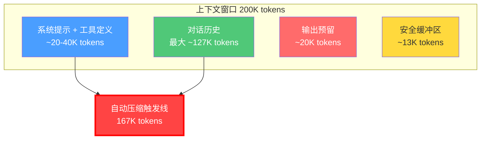
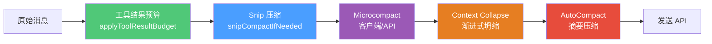
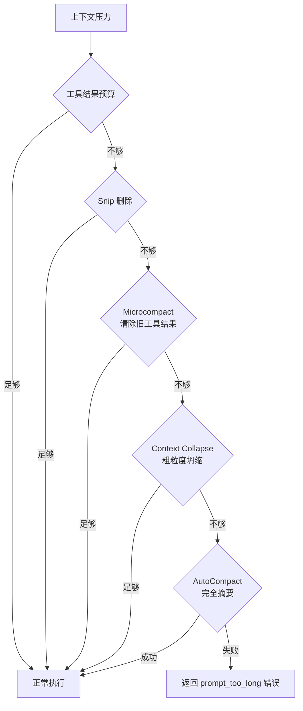
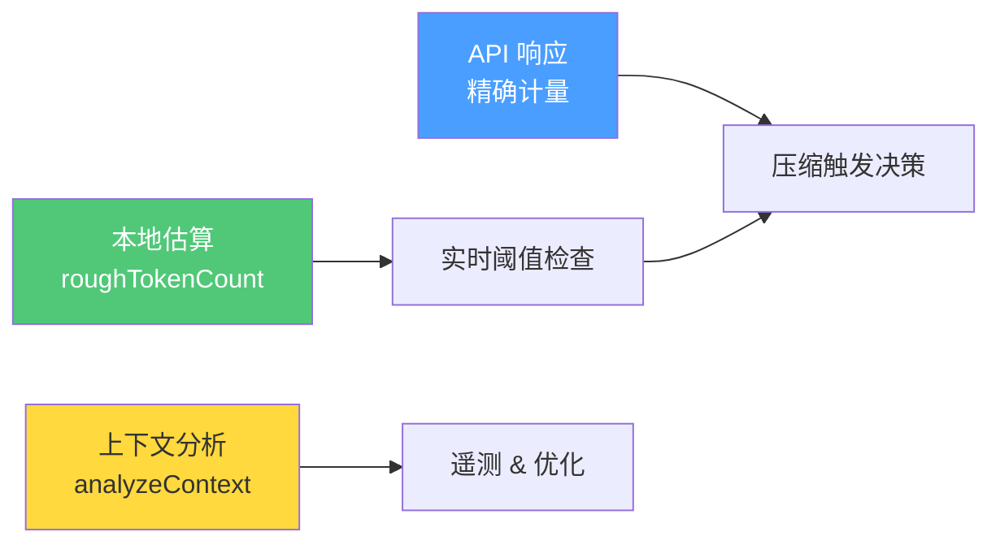

# 第 10 章：上下文窗口——Agent 最稀缺的资源

## 一个被忽视的硬约束

大语言模型的上下文窗口是有限的。这个事实如此显而易见，以至于很多 Agent 开发者在设计初期往往忽略了它——直到对话变长、Agent 开始"失忆"、工具调用开始失败，才发现上下文管理才是 Agent 架构中最核心的工程问题。

Claude Code 每次调用 LLM API 时，都需要将以下内容塞入上下文窗口：

1. **系统提示词**（System Prompt）——Agent 的身份、行为准则、工具使用指南
2. **工具定义**（Tool Schemas）——所有可用工具的 JSON Schema 描述
3. **对话历史**（Message History）——用户消息、助手回复、工具调用与结果
4. **附加信息**（Attachments）——项目配置、MCP 服务器指令、技能定义

这些内容在有限的窗口内争夺空间。如果系统提示词太长，留给对话历史的空间就少，Agent 的"记忆"就会变短。如果工具定义太多，工具结果就只能保留更少。这是一场零和博弈。

Claude Code 的上下文管理策略，展示了工业级 Agent 如何在这场博弈中做到精细、动态、优雅。

## 上下文窗口的规模与构成

在 `utils/context.ts` 中，Claude Code 定义了默认的上下文窗口大小：

```typescript
export const MODEL_CONTEXT_WINDOW_DEFAULT = 200_000
```

200K token 是 Claude 系列模型的标准窗口大小。Claude Code 还支持 1M token 的扩展窗口，通过 `getContextWindowForModel()` 函数动态解析：

```typescript
export function getContextWindowForModel(model: string, betas?: string[]): number {
  // 1. 环境变量覆盖（最高优先级，仅 ant）
  // 2. [1m] 后缀标记（显式客户端选择）
  // 3. 模型能力查询（max_input_tokens）
  // 4. Beta header 特性检测
  // 5. Sonnet 1M 实验组检测
  // 6. Ant 内部模型配置
  // 7. 回退到默认值
}
```

这个解析链的设计值得学习：它用七层优先级来决定实际的窗口大小，从最具体的覆盖（环境变量）到最通用的回退（200K）。这种分层设计让系统在不同部署环境（本地 CLI、远程 CCR、SDK 嵌入）中都能正确工作。

但 200K 仅仅是理论上的窗口大小。实际上，Agent 不能把 200K 全部用于对话历史。`autoCompact.ts` 中揭示了真正的可用空间：

```typescript
const MAX_OUTPUT_TOKENS_FOR_SUMMARY = 20_000
export const AUTOCOMPACT_BUFFER_TOKENS = 13_000

export function getEffectiveContextWindowSize(model: string): number {
  const reservedTokensForSummary = Math.min(
    getMaxOutputTokensForModel(model),
    MAX_OUTPUT_TOKENS_FOR_SUMMARY,
  )
  return contextWindow - reservedTokensForSummary
}
```

这意味着在 200K 窗口中，需要预留约 20K token 给模型输出，再减去 13K 的安全缓冲区。实际可用空间大约是 167K token。



## 预算分配的策略思维

Claude Code 的上下文预算分配体现了一个核心设计原则：**固定成本最小化，可变成本可控化**。

**系统提示词是固定成本。** 无论对话多长，系统提示词的长度基本恒定。Claude Code 通过以下策略来压缩这块开销：

- **模块化组装**：系统提示词不是一整段文本，而是由多个独立的 section 拼接而成。`getSystemPrompt()` 函数根据当前场景动态选择需要的 section。
- **静态/动态分离**：系统提示词被分为"静态"（可缓存）和"动态"（每轮重算）两部分。静态部分可以跨请求缓存，动态部分按需计算。
- **工具延迟加载**：工具定义不全部塞入上下文。ToolSearch 机制可以按需加载工具定义，而非一开始就把所有工具的 Schema 放进去。带 `shouldDefer: true` 的工具只以名称列表的形式出现，完整的 Schema 需要模型主动搜索。

**对话历史是可变成本。** 这是增长最快、最难控制的部分。

**输出预留是必要成本。** 模型需要空间来"思考"和生成回复。压缩摘要本身也需要输出空间（约 20K token），所以输出预留是不可压缩的。

## 压缩管道：五层渐进式回收

这是 Claude Code 上下文管理中最核心、也最容易被忽视的架构设计。在 `query.ts` 的每次循环迭代开始时，消息在被发送给 API 之前要经过一个五层压缩管道：



### 第一层：工具结果预算（Tool Result Budget）

`applyToolResultBudget()` 在管道的最前端运行。它对每个工具结果施加大小预算——当工具输出超过 `maxResultSizeChars` 时，内容被持久化到磁盘，上下文中只保留文件路径引用：

```typescript
// 带有 maxResultSizeChars 的工具
maxResultSizeChars: 100_000  // 例如 EnterPlanModeTool

// 不受限的工具（Read 工具——避免循环）
maxResultSizeChars: Infinity
```

这一层的设计哲学是：**工具结果是上下文膨胀的最大来源**。一个 `grep -r` 的结果可能有几十万字符，但模型通常只需要看到前几行就够了。通过在源头就限制每个工具结果的大小，后续所有层面对的压力都减轻了。

### 第二层：Snip 压缩

Snip 压缩是一种**丢弃式压缩**——它不生成摘要，直接删除旧的中间轮次消息，只保留最近的关键轮次：

```typescript
const snipResult = snipModule.snipCompactIfNeeded(messagesForQuery)
messagesForQuery = snipResult.messages
snipTokensFreed = snipResult.tokensFreed
```

Snip 的设计假设是：很多中间轮次（如多次文件搜索、逐步调试）对最终决策没有长期价值。与其花 API 调用费用生成摘要，不如直接删除。`tokensFreed` 被传递给后续的 AutoCompact 阈值计算，避免因 Snip 释放的空间被重复计算。

### 第三层：Microcompact

Microcompact 有两种实现：**客户端 Microcompact** 和 **API Microcompact**。

**客户端 Microcompact**（`microCompact.ts`）遍历消息中的工具调用结果，将旧的工具输出替换为简短的清除标记：

```typescript
export const TIME_BASED_MC_CLEARED_MESSAGE = '[Old tool result content cleared]'

const COMPACTABLE_TOOLS = new Set([
  FILE_READ_TOOL_NAME, ...SHELL_TOOL_NAMES, GREP_TOOL_NAME,
  GLOB_TOOL_NAME, WEB_SEARCH_TOOL_NAME, WEB_FETCH_TOOL_NAME,
  FILE_EDIT_TOOL_NAME, FILE_WRITE_TOOL_NAME,
])
```

只有这些"一次性"工具的结果被清除。Edit 和 Write 工具虽然也是可压缩的，但它们的结果包含文件的变更摘要，对后续决策有参考价值。

**API Microcompact**（`apiMicrocompact.ts`）利用 Anthropic API 的原生上下文管理能力：

```typescript
const TOOLS_CLEARABLE_RESULTS = [
  ...SHELL_TOOL_NAMES, GLOB_TOOL_NAME, GREP_TOOL_NAME,
  FILE_READ_TOOL_NAME, WEB_FETCH_TOOL_NAME, WEB_SEARCH_TOOL_NAME,
]
```

API 端的清理在客户端清理之后作为补充——如果客户端清理得不够，API 会在自己的层面再做一次。这是一个重要的设计模式：**客户端和服务端各自独立做上下文管理，互为补充**。

### 第四层：Context Collapse

Context Collapse 是一种介于 Microcompact 和完全 Compact 之间的机制。它不是简单地删除或完全摘要，而是将连续的消息"坍缩"成更粗粒度的摘要——但比完全 Compact 保留更多细节。

```typescript
if (feature('CONTEXT_COLLAPSE') && contextCollapse) {
  const collapseResult = await contextCollapse.applyCollapsesIfNeeded(
    messagesForQuery, toolUseContext, querySource,
  )
  messagesForQuery = collapseResult.messages
}
```

Context Collapse 还参与错误恢复：当 API 返回 `prompt-too-long` (413) 错误时，`recoverFromOverflow()` 会紧急提交所有待定的坍缩操作来回收空间。这是一种"紧急制动"——在崩溃之前尽可能回收。

### 第五层：AutoCompact

AutoCompact 是最终防线。当以上四层都无法将上下文压缩到安全阈值以下时，AutoCompact 使用一个子 Agent 生成完整的对话摘要：

```typescript
const { compactionResult, consecutiveFailures } = await deps.autocompact(
  messagesForQuery, toolUseContext, cacheSafeParams, querySource, tracking, snipTokensFreed,
)
```

AutoCompact 有一个熔断器机制——连续失败 3 次后停止重试，避免在不可恢复的上下文溢出上浪费 API 调用：

```typescript
const MAX_CONSECUTIVE_AUTOCOMPACT_FAILURES = 3
```

### 渐进式回收的设计启示



> 这五层管道体现了一个关键设计原则：**渐进式回收**。先用最快最便宜的方式（磁盘替换 + 直接删除），不够再用稍贵的（清除工具结果），再不够用更贵的（粗粒度坍缩），最后才用最贵的（完全摘要生成）。每一层都比下一层更快、更便宜、对上下文的破坏更小。当 Agent 系统规模达到每天数百万次交互时，这种分层节省的成本是巨大的。

## token 计量的三层模型

Claude Code 的 token 计量不是简单的"数一数有多少 token"。它实际上有三层计量模型，分别服务于不同的决策：

**第一层：API 响应的精确计量。** 每次 API 调用返回的 `usage` 字段包含精确的 token 数。这是最准确的数据，但只能反映过去的状态：

```typescript
export function calculateContextPercentages(currentUsage, contextWindowSize) {
  const totalInputTokens =
    currentUsage.input_tokens +
    currentUsage.cache_creation_input_tokens +
    currentUsage.cache_read_input_tokens
  const usedPercentage = Math.round((totalInputTokens / contextWindowSize) * 100)
}
```

注意这里把 `cache_creation_input_tokens` 和 `cache_read_input_tokens` 都计算在内。这些是缓存相关的 token——即使命中缓存不需要付费，它们仍然占用上下文窗口空间。

**第二层：消息级别的快速估算。** 在 `services/tokenEstimation.ts` 中，Claude Code 提供了快速的本地 token 估算。这不是精确的，但足够用于实时决策（比如是否触发压缩）：

```typescript
export function roughTokenCountEstimation(
  content: string,
  bytesPerToken: number = 4,
): number {
  return Math.round(content.length / bytesPerToken)
}
```

这个估算还考虑了文件类型的差异——JSON 文件的 token 密度更高（bytesPerToken 约为 2），而代码文件约为 4：

```typescript
export function bytesPerTokenForFileType(fileExtension: string): number {
  switch (fileExtension) {
    case 'json': case 'jsonl': case 'jsonc': return 2
    default: return 4
  }
}
```

**第三层：上下文分析。** 在 `utils/contextAnalysis.ts` 中，`analyzeContext()` 函数对整个上下文进行"尸检式"分析——分解每个工具调用、每个工具结果、每个人类消息占了多少 token。这不是实时使用的，而是用于遥测和优化，帮助团队理解上下文是如何被消耗的。



## 响应式压缩：API 错误后的紧急恢复

除了每次迭代开始时的主动压缩管道，Claude Code 还有一套**响应式压缩**机制——当 API 调用返回错误后的紧急恢复。

### prompt-too-long 的恢复路径

当 API 返回 413（prompt-too-long）错误时，流式接收中的扣留机制会拦截这个错误消息，不让它到达消费者。然后系统尝试两条恢复路径：

1. **Context Collapse 排水**（`recoverFromOverflow`）：紧急提交所有待定的坍缩操作
2. **响应式 Compact**（`tryReactiveCompact`）：生成完整的对话摘要

```typescript
if (isWithheld413) {
  // 先尝试 collapse drain（便宜，保留粒度）
  const drained = contextCollapse.recoverFromOverflow(messagesForQuery, querySource)
  if (drained.committed > 0) {
    state = { messages: drained.messages, transition: 'collapse_drain_retry' }
    continue
  }
}
// 如果 collapse 不够，尝试 reactive compact（贵，完全摘要）
if (isWithheld413 || isWithheldMedia) {
  const compacted = await reactiveCompact.tryReactiveCompact({...})
  if (compacted) {
    state = { messages: postCompactMessages, transition: 'reactive_compact_retry' }
    continue
  }
  // 所有恢复都失败了——释放扣留的错误
  yield lastMessage
  return { reason: 'prompt_too_long' }
}
```

### max-output-tokens 的恢复路径

当模型的输出达到 token 上限时，错误消息同样被扣留。恢复策略是升级式重试：

```typescript
if (isWithheldMaxOutputTokens(lastMessage)) {
  // 1. 首次尝试：升级到 64K 输出（仅当当前使用默认 8K 时）
  if (capEnabled && maxOutputTokensOverride === undefined) {
    state = { ..., maxOutputTokensOverride: ESCALATED_MAX_TOKENS }
    continue  // 重试
  }

  // 2. 多轮恢复：注入 meta 消息，让模型从断点继续
  if (maxOutputTokensRecoveryCount < MAX_OUTPUT_TOKENS_RECOVERY_LIMIT) {
    const recoveryMessage = createUserMessage({
      content: 'Output token limit hit. Resume directly — pick up mid-thought...',
      isMeta: true,
    })
    state = { messages: [...messagesForQuery, ...assistantMessages, recoveryMessage] }
    continue
  }

  // 3. 恢复耗尽——释放扣留的错误
  yield lastMessage
}
```

这个升级路径的设计很精妙：先用更大的输出上限重试同一请求（零成本），如果仍然不够，才进入多轮恢复模式（有额外 API 成本）。

## 动态调整：不是一成不变的预算

一个容易被忽视的设计是：Claude Code 的上下文预算不是静态分配的，而是根据实际情况动态调整。

**模型切换时调整。** 不同模型有不同的上下文窗口和输出上限。`getModelMaxOutputTokens()` 为每种模型定义了不同的参数：

- Opus 4.6：默认 64K，上限 128K
- Sonnet 4.6：默认 32K，上限 128K
- Haiku 4.5：默认 8K，上限 8K

这意味着切换模型时，有效的上下文窗口会自动调整。

**1M 窗口的特殊处理。** 当使用支持 1M token 的模型时，`getContextWindowForModel()` 返回 1,000,000。但自动压缩的缓冲区（13K）是固定的，这意味着在 1M 窗口下，压缩触发点从约 93% 推迟到约 98.7%。这让 Agent 可以维持更长的对话而不触发压缩。

**环境变量覆盖。** Claude Code 允许通过 `CLAUDE_CODE_MAX_CONTEXT_TOKENS` 和 `CLAUDE_CODE_AUTO_COMPACT_WINDOW` 覆盖上下文窗口大小。这在测试和特定部署场景中非常有用——你可以在使用 1M 端点的同时，将有效窗口限制为 200K，从而控制成本。

## 总结：上下文管理的设计原则

从 Claude Code 的上下文预算管理中，我们可以提炼出几条通用原则：

1. **将上下文视为稀缺资源来管理。** 不是"有 200K token 随便用"，而是"有效空间只有约 167K，每一千 token 都要花在刀刃上"。这种思维会深刻影响系统的每个设计决策。

2. **固定成本和可变成本要分开管理。** 系统提示词是固定成本，要尽量压缩（模块化组装、缓存分离、工具延迟加载）。对话历史是可变成本，需要渐进式回收管道。

3. **多层渐进式回收优于单一机制。** Claude Code 有五层压缩管道：工具结果预算、Snip 删除、Microcompact、Context Collapse、AutoCompact。先用最轻量的方式回收空间，不够再用更重的方式。

4. **计量是管理的基础。** 没有精确的 token 计量，就无法做出正确的预算决策。Claude Code 投入了大量工程在 token 计量上——从 API 响应的精确数据到本地估算，再到上下文分析遥测。

5. **扣留 + 恢复优于直接报错。** 响应式压缩不是在 API 报错后立刻告诉用户"出错了"，而是先尝试自动恢复。扣留机制确保用户只在所有恢复路径都失败时才看到错误。

6. **为极端情况预留缓冲区。** 13K 的自动压缩缓冲区看似浪费，但它确保了系统在边界情况下（比如突然的工具输出激增）仍然有时间做出反应。
