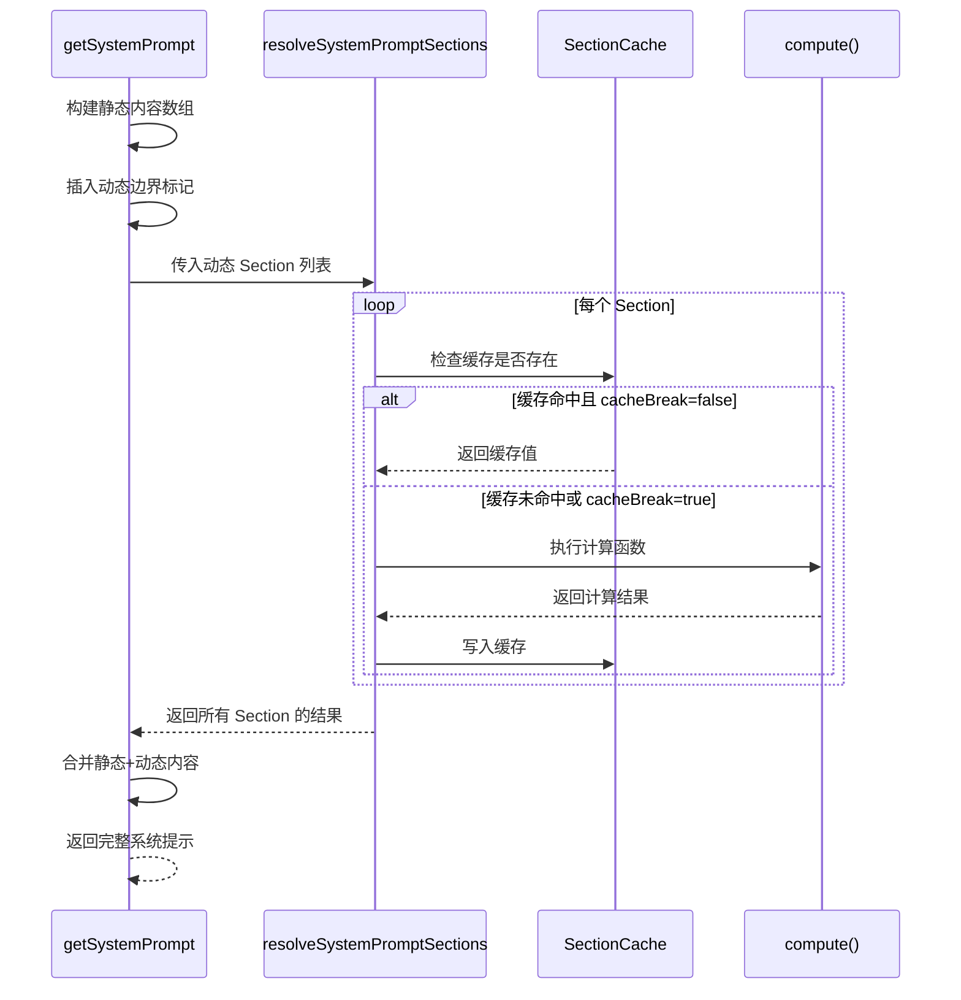
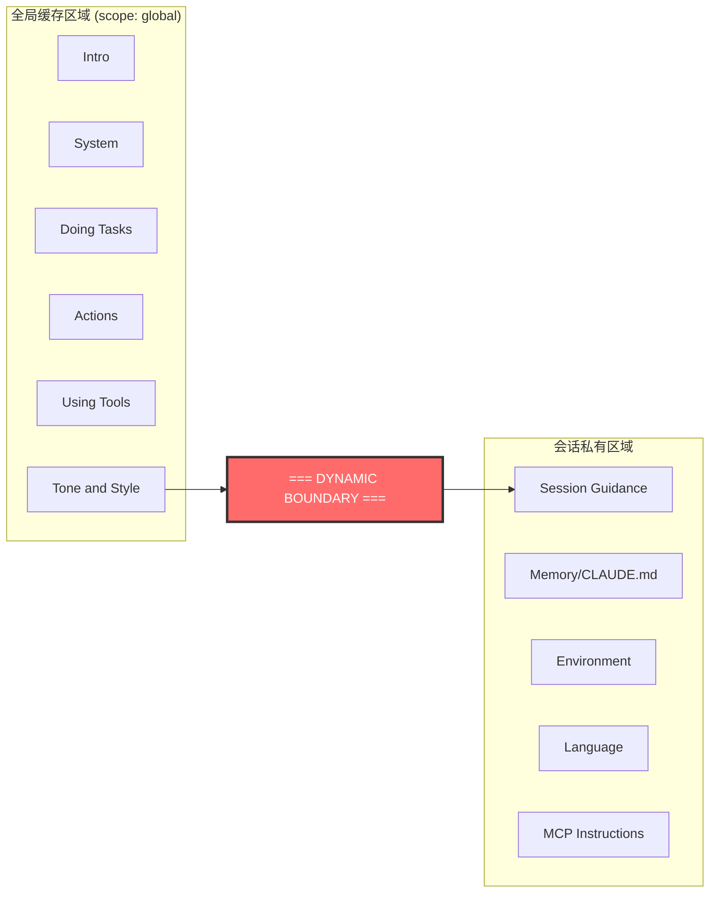
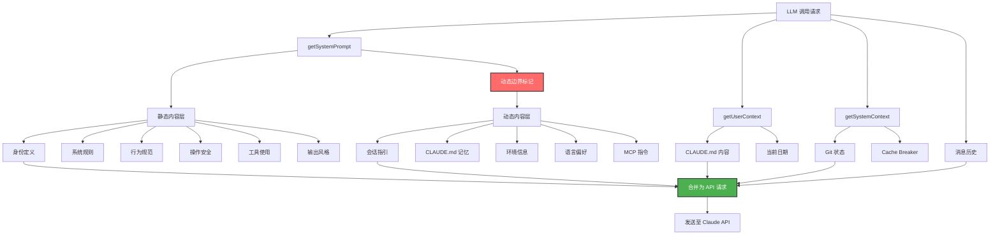

# 第 11 章：上下文组装——给 Agent 看什么

> 核心设计问题：每次 Agent 调用 LLM 时，如何将系统提示、对话历史、工具结果等异构信息组装成一个完整的上下文窗口？这个"拼图"过程如何做到模块化、可缓存、可动态调整？

## 11.1 上下文组装的本质挑战

Agent 系统与普通的 LLM 调用有一个根本区别：Agent 是一个**循环**，每次循环都需要重新组装一个完整的上下文窗口发往 LLM。这个上下文不仅包含用户的输入，还包含：

- 系统身份和行为规则
- 可用工具的描述
- 项目环境信息
- 对话历史
- 工具执行结果
- 动态注入的附件信息

随着对话的进行，这些内容的规模和构成都会发生变化。一个设计不良的上下文组装机制会导致：缓存命中率低、token 浪费严重、关键信息丢失、甚至触发上下文窗口溢出。

Claude Code 的上下文组装采用了**分层流水线**设计，将上下文拆分为静态缓存层和动态注入层，通过注册表模式管理各个子模块。

```mermaid
graph TD
    A[上下文组装入口 getSystemPrompt] --> B[静态内容层]
    A --> C[动态边界标记]
    A --> D[动态内容层]
    A --> E[用户上下文]
    A --> F[系统上下文]

    B --> B1[Intro 身份定义]
    B --> B2[System 系统规则]
    B --> B3[Doing Tasks 行为规范]
    B --> B4[Actions 操作安全]
    B --> B5[Using Tools 工具使用]
    B --> B6[Tone and Style 输出风格]

    C --> C1[SYSTEM_PROMPT_DYNAMIC_BOUNDARY]

    D --> D1[Session Guidance 会话指引]
    D --> D2[Memory CLAUDE.md]
    D --> D3[Environment 环境信息]
    D --> D4[Language 语言偏好]
    D --> D5[MCP Instructions]
    D --> D6[Output Style]

    E --> E1[CLAUDE.md 文件内容]
    E --> E2[当前日期]

    F --> F1[Git Status 快照]
    F --> F2[Cache Breaker]

    style C1 fill:#f9f,stroke:#333,stroke-width:2px
    style B fill:#e1f5fe
    style D fill:#fff3e0
```



## 11.2 系统提示的模块化设计：systemPromptSections

Claude Code 将系统提示拆分为多个独立的 **Section（段落）**，每个 Section 有自己的名称、计算函数和缓存策略。这是整个上下文组装中最精妙的设计之一。

### 11.2.1 两种 Section 类型

源码位置：`constants/systemPromptSections.ts`

```typescript
// 可缓存的 Section - 计算一次后缓存直到 /clear 或 /compact
export function systemPromptSection(
  name: string,
  compute: ComputeFn,
): SystemPromptSection {
  return { name, compute, cacheBreak: false }
}

// 不可缓存的 Section - 每轮重新计算，会破坏缓存
export function DANGEROUS_uncachedSystemPromptSection(
  name: string,
  compute: ComputeFn,
  _reason: string,
): SystemPromptSection {
  return { name, compute, cacheBreak: true }
}
```

这个设计的核心思想是：**不是所有系统提示都同等重要，也不是所有提示都在变化**。将 Section 分为缓存型和非缓存型，可以在保证信息准确性的同时最大化 Prompt Cache 的命中率。

### 11.2.2 Section 解析流程



这种设计的优势在于：

1. **缓存友好**：大部分 Section 在整个会话期间不变（如语言偏好、环境信息），计算一次即可
2. **按需刷新**：MCP 指令等可能在会话中变化的 Section 被标记为 `cacheBreak: true`，每轮重新计算
3. **统一管理**：所有 Section 通过 `clearSystemPromptSections()` 一次性清除，在 `/clear` 和 `/compact` 时重置

## 11.3 静态内容层：不变的基石

静态内容层由一系列纯函数生成，不依赖运行时状态，在整个会话期间保持不变。这使得它们可以被 Prompt Cache 缓存，减少重复计算和 token 开销。

### 11.3.1 身份与行为定义

源码位置：`constants/prompts.ts`

系统提示的最前面是 Agent 的身份定义：

```
You are an interactive agent that helps users with software engineering tasks.
```

接着是一系列行为规范，按照"做什么"、"怎么做"、"做的时候注意什么"的逻辑组织：

- **Doing Tasks**：定义了 Agent 处理任务的哲学——不要过度工程化，不要添加不需要的功能，不要创建不必要的抽象。特别强调"不要为了一次性操作创建辅助函数"、"三行相似代码好过一个过早的抽象"
- **Actions**：定义了操作安全级别——本地可逆操作自由执行，不可逆或影响他人的操作需要确认。列举了需要确认的具体场景：`rm -rf`、`force-push`、修改 CI/CD 管道、发送消息到外部服务
- **Using Tools**：定义了工具使用偏好——优先使用专用工具（Read/Edit/Write/Glob/Grep），而非 Bash。同时要求最大化并行工具调用，独立操作同时发起
- **Tone and Style**：定义了输出风格——简洁、直接、不使用 emoji
- **Output Efficiency**：定义了输出的效率要求——直奔主题，跳过填充词和过渡，一句话能说清的不用三句

这些规范被精心分层组织，形成一个从宏观到微观的行为指导体系。值得注意的是，每一层都有其独立的职责边界，修改某一层的行为规则不会影响其他层。

### 11.3.2 针对不同用户群体的差异化提示

一个有趣的设计是，Claude Code 对内部用户（Anthropic 员工，`process.env.USER_TYPE === 'ant'`）和外部用户使用了不同的提示内容。这种差异化贯穿多个 Section：

**Doing Tasks** 中，内部用户获得更严格的代码质量指令：
- 默认不写注释，只在 WHY 不明显时才写
- 不要删除已有注释，因为它们可能编码了历史教训
- 如果发现用户的请求基于误解或发现相邻的 bug，主动指出——"你是协作者，不只是执行者"
- 完成任务前必须验证结果确实工作

**Output Efficiency** 中，内部用户获得完全不同的沟通风格要求——要求完整的散文式写作、语义回溯避免、倒金字塔结构，而外部用户则被要求"尽量简短直接"。

这种设计体现了一个实用主义原则：**不同的用户群体需要不同的行为指导**。内部用户通常更了解系统能力，可以接受更严格的质量标准；外部用户则需要更简洁、更直接的默认体验。

## 11.4 动态边界：缓存分水岭

源码位置：`constants/prompts.ts` 中的 `SYSTEM_PROMPT_DYNAMIC_BOUNDARY`

这是上下文组装中最关键的设计之一。一个特殊的标记字符串 `__SYSTEM_PROMPT_DYNAMIC_BOUNDARY__` 将系统提示分为两部分：

- **边界之前**：静态内容，使用 `scope: 'global'` 缓存策略，可跨组织复用
- **边界之后**：动态内容，包含用户/会话特定的信息，不能跨会话缓存



为什么这个边界如此重要？因为 Prompt Cache 的效率直接取决于缓存前缀的稳定性。如果把动态内容（如 MCP 指令、语言偏好）放在静态内容之前，每次这些动态内容变化时，整个缓存就会失效——这意味着数万 token 的缓存全部需要重新创建。

将动态内容放在边界之后，确保了静态部分的缓存永远不会因为动态部分的变化而失效。这是一个典型的**关注点分离**在缓存层面的应用。

一个值得注意的细节：`Session-specific guidance`（包含 Agent 工具指引、Skill 工具说明、Explore 子代理指引等）被刻意放在动态边界之后。源码注释解释了原因：

> Session-variant guidance that would fragment the cacheScope:'global' prefix if placed before SYSTEM_PROMPT_DYNAMIC_BOUNDARY. Each conditional here is a runtime bit that would otherwise multiply the Blake2b prefix hash variants (2^N).

这段话揭示了一个微妙但关键的设计约束：即使某个 Section 本身不频繁变化，只要它的内容依赖于运行时状态（如当前可用工具列表、是否启用 Explore 代理），就必须放在边界之后。否则，N 个运行时变量会产生 2^N 种缓存变体，严重降低全局缓存的命中率。

源码中的注释清晰地说明了这个设计意图：

```typescript
/**
 * Boundary marker separating static (cross-org cacheable) content from dynamic content.
 * Everything BEFORE this marker in the system prompt array can use scope: 'global'.
 * Everything AFTER contains user/session-specific content and should not be cached.
 *
 * WARNING: Do not remove or reorder this marker without updating cache logic.
 */
```

## 11.5 动态内容层：会话感知的个性化

### 11.5.1 环境信息段

源码位置：`constants/prompts.ts` 中的 `computeSimpleEnvInfo()`

每次会话，Agent 都需要知道自己运行在什么环境中。Claude Code 通过 `computeSimpleEnvInfo()` 函数收集并格式化环境信息：

```typescript
// 环境信息包含：
- Primary working directory: /path/to/project
- Is a git repository: true/false
- Platform: darwin/linux/win32
- Shell: zsh/bash
- OS Version: Darwin 25.3.0
- Model: powered by claude-sonnet-4-6
- Knowledge cutoff: August 2025
```

这些信息通过 Section 注册表注入，并使用 `systemPromptSection` 标记为可缓存——因为环境信息在单次会话中不会变化。

### 11.5.2 CLAUDE.md 记忆注入

源码位置：`context.ts` 中的 `getUserContext()`

CLAUDE.md 文件是 Claude Code 的长期记忆机制。在上下文组装阶段，系统会：

1. 扫描工作目录及其父目录中的 CLAUDE.md 文件
2. 收集项目级和用户级的配置
3. 将所有内容合并为一个字符串注入到上下文中

```typescript
export const getUserContext = memoize(async () => {
  const claudeMd = shouldDisableClaudeMd
    ? null
    : getClaudeMds(filterInjectedMemoryFiles(await getMemoryFiles()))

  return {
    ...(claudeMd && { claudeMd }),
    currentDate: `Today's date is ${getLocalISODate()}.`,
  }
})
```

注意 `memoize` 的使用——`getUserContext` 在整个会话中只计算一次，后续调用直接返回缓存值。这既提高了性能，又确保了上下文的一致性。

### 11.5.3 Git 状态快照

源码位置：`context.ts` 中的 `getGitStatus()`

Git 状态是一个特别有趣的上下文段。它不是 Section 注册表的一部分，而是通过 `getSystemContext()` 注入：

```typescript
export const getSystemContext = memoize(async () => {
  const gitStatus = await getGitStatus()
  return {
    ...(gitStatus && { gitStatus }),
  }
})
```

Git 状态包含：当前分支、主分支名、工作区状态、最近 5 次提交。注意这是一个**快照**——它只在会话开始时获取一次，不会随着对话进行而更新。这个设计选择是有意的：如果每轮都更新 Git 状态，不仅增加延迟，还会破坏缓存。

### 11.5.4 MCP 服务器指令

源码位置：`constants/prompts.ts` 中的 `getMcpInstructionsSection()`

MCP（Model Context Protocol）服务器可以提供自定义指令。这些指令是高度动态的——MCP 服务器可能在会话中连接或断开。因此，MCP 指令段被标记为 `DANGEROUS_uncachedSystemPromptSection`：

```typescript
DANGEROUS_uncachedSystemPromptSection(
  'mcp_instructions',
  () => isMcpInstructionsDeltaEnabled()
    ? null
    : getMcpInstructionsSection(mcpClients),
  'MCP servers connect/disconnect between turns',
)
```

这里的 `reason` 参数是给开发者看的，解释为什么这个 Section 需要每轮重新计算。

值得注意的是，MCP 指令还有一个 Delta 优化路径。当 `isMcpInstructionsDeltaEnabled()` 返回 `true` 时，MCP 指令不再作为系统提示的一部分全量注入，而是通过附件（Attachment）机制以增量方式注入——只发送自上次以来变化的部分。这个优化进一步减少了 MCP 指令对缓存的冲击，因为全量 MCP 指令可能达到数千 token，而增量注入通常只有几百 token。

## 11.6 特殊场景的系统提示

### 11.6.1 自主模式（Proactive Mode）

当 Agent 运行在自主模式时，系统提示完全不同：

```typescript
if (proactiveModule?.isProactiveActive()) {
  return [
    `You are an autonomous agent. Use the available tools to do useful work.`,
    getSystemRemindersSection(),
    await loadMemoryPrompt(),
    envInfo,
    // ... 简化的提示
  ]
}
```

自主模式的提示更加精简，增加了自主工作相关的指令，如"偏执于行动"、"不要等待确认"、"用 Sleep 工具控制节奏"等。

### 11.6.2 子代理（Subagent）提示

子代理通过 `enhanceSystemPromptWithEnvDetails()` 获得增强的系统提示，包含：

```
Notes:
- Agent threads always have their cwd reset between bash calls
- In your final response, share file paths (always absolute, never relative)
- The assistant MUST avoid using emojis
```

这些额外指令确保子代理的行为与主 Agent 保持一致。

## 11.7 上下文组装的完整流水线



## 11.8 设计启示

### 11.8.1 静态与动态的分离

Claude Code 的上下文组装给我们最重要的启示是：**在设计 AI Agent 时，必须从一开始就将上下文分为静态和动态两部分**。这不仅影响缓存效率，还影响系统的可维护性。当需要修改某个行为规则时，只需要找到对应的 Section 函数即可，而不需要在一个巨大的字符串中搜索。

### 11.8.2 注册表模式的价值

Section 注册表（`systemPromptSection` / `DANGEROUS_uncachedSystemPromptSection` + `resolveSystemPromptSections`）是一个优雅的设计模式。它将系统提示的管理从"拼字符串"提升为"管理模块"。每个 Section 都是独立的、可测试的、有明确名称的模块。

### 11.8.3 缓存意识

从源码中可以看到，几乎每个设计决策都考虑了对 Prompt Cache 的影响：

- 动态边界标记的存在是为了保护静态部分的缓存
- Section 的缓存/非缓存标记是为了最小化缓存失效
- Git 状态只在会话开始时获取一次是为了避免缓存抖动
- MCP 指令使用 Delta 机制而非全量注入

这种"缓存意识"是高性能 Agent 系统的必备素质。在上下文窗口动辄几十万 token 的时代，一次缓存命中可以节省数千美元的 API 成本。

### 11.8.4 差异化提示策略

针对不同用户群体（内部/外部）、不同模式（交互/自主/子代理）使用不同的提示内容，是一个值得学习的实践。在实际项目中，我们也可以根据用户的专业程度、任务的复杂度、运行环境等因素动态调整系统提示的构成。

## 11.9 小结

Claude Code 的上下文组装机制是一个精心设计的工程系统，而非简单的字符串拼接。它的核心设计包括：

1. **分层架构**：静态层（缓存友好）+ 动态层（会话感知），通过边界标记分离
2. **注册表模式**：每个系统提示段都是独立的 Section，有自己的名称和缓存策略
3. **缓存优先**：默认缓存，显式标记不可缓存的 Section 并说明原因
4. **场景适配**：针对不同运行模式（交互式/自主/子代理）组装不同的提示

这个设计告诉我们：**给 Agent 看什么，和 Agent 怎么思考同样重要**。精心组装的上下文不仅能让 Agent 更聪明，还能让系统更高效。
