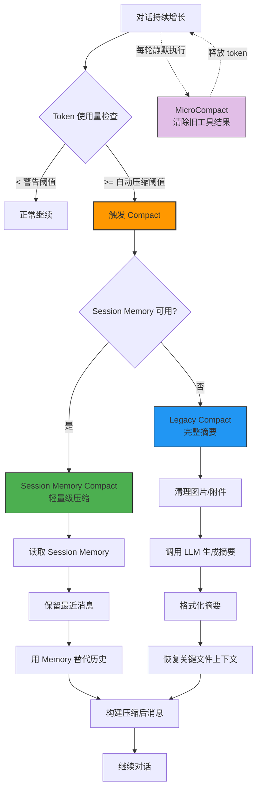
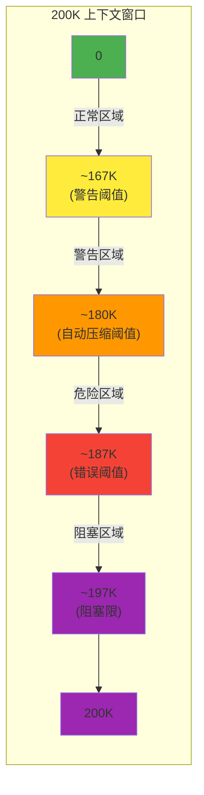
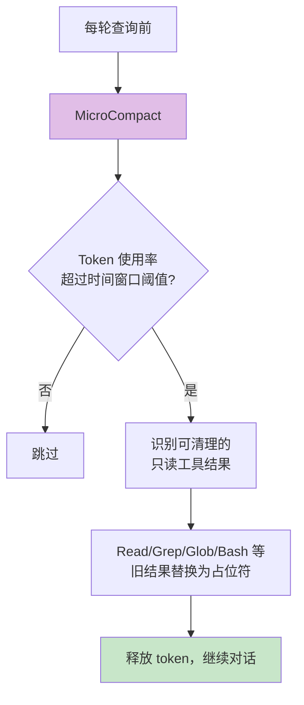
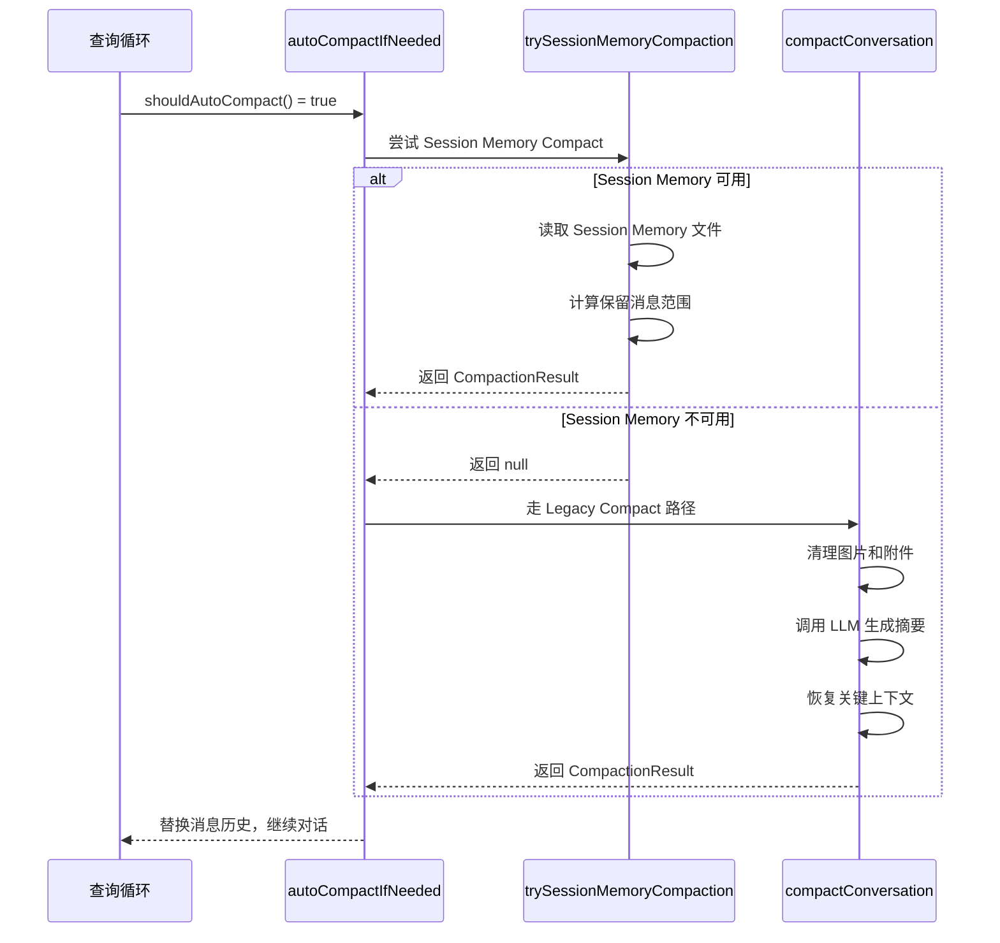
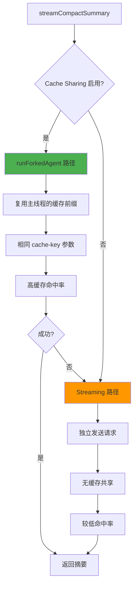
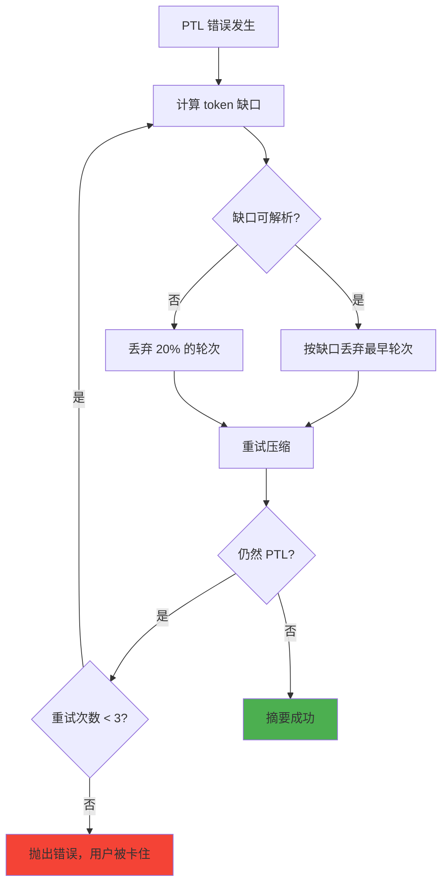
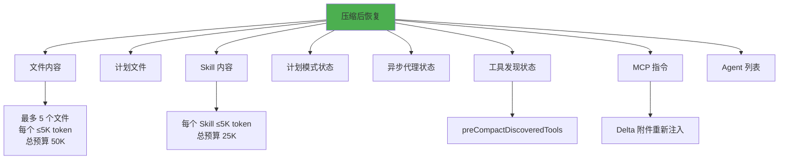
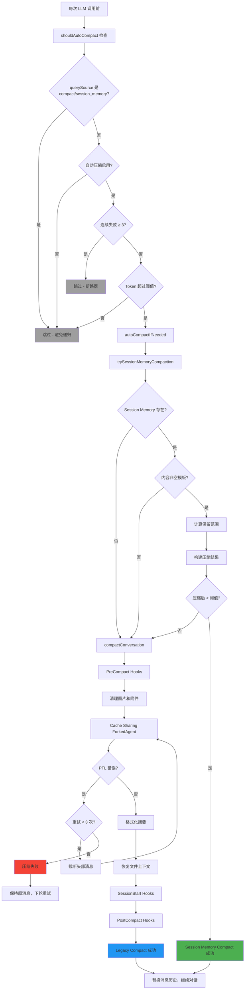

# 第 12 章：上下文压缩与摘要（Compact）

> 核心设计问题：当对话不断增长、上下文逼近窗口极限时，Agent 如何在不丢失关键信息的前提下压缩上下文？压缩策略如何平衡信息保真度、延迟和成本？

## 12.1 长对话的必然困境

所有基于 LLM 的 Agent 系统都会面对一个根本性的物理限制：**上下文窗口有上限**。即使现代模型的上下文窗口已经达到 200K 甚至 1M token，一个长时间运行的 Agent 仍然会触达这个边界。

Claude Code 的解决方案是一个多层次的上下文压缩系统，称为 **Compact**。这个系统不仅仅是简单的"截断"，而是一个完整的上下文管理框架，包括微观压缩（MicroCompact）、自动触发、智能压缩、优雅降级和状态恢复。



## 12.2 触发机制：何时压缩

### 12.2.1 多级阈值体系

源码位置：`services/compact/autoCompact.ts`

Claude Code 定义了多个阈值级别，形成一个渐进式的压力响应系统：

```typescript
// 缓冲 token 数 - 留给输出的空间
export const AUTOCOMPACT_BUFFER_TOKENS = 13_000
// 警告阈值缓冲
export const WARNING_THRESHOLD_BUFFER_TOKENS = 20_000
// 错误阈值缓冲
export const ERROR_THRESHOLD_BUFFER_TOKENS = 20_000
```

自动压缩阈值的计算公式：

```typescript
export function getAutoCompactThreshold(model: string): number {
  const effectiveContextWindow = getEffectiveContextWindowSize(model)
  // 有效上下文窗口 - 缓冲 = 触发阈值
  return effectiveContextWindow - AUTOCOMPACT_BUFFER_TOKENS
}
```

以 200K 上下文窗口为例：



### 12.2.2 触发检查流程

`shouldAutoCompact()` 函数在每次 LLM 调用前执行，决定是否需要压缩：

```typescript
export async function shouldAutoCompact(
  messages: Message[],
  model: string,
  querySource?: QuerySource,
  snipTokensFreed = 0,
): Promise<boolean> {
  // 递归防护：compact 和 session_memory 是 forked agent，避免死锁
  if (querySource === 'session_memory' || querySource === 'compact') {
    return false
  }

  // ... 各种功能门控检查 ...

  const tokenCount = tokenCountWithEstimation(messages) - snipTokensFreed
  const threshold = getAutoCompactThreshold(model)

  return isAboveAutoCompactThreshold
}
```

这里有一个关键的递归防护设计：压缩操作本身会调用 LLM（用于生成摘要），如果压缩过程中的 LLM 调用又触发压缩，就会形成死循环。通过检查 `querySource`，系统确保压缩操作本身不会触发嵌套压缩。

## 12.3 压缩执行：从微观到宏观

Claude Code 的上下文管理实际上有三个层次，从最轻量到最重量级排列：

### 12.3.0 MicroCompact：静默的轻量压缩

源码位置：`services/compact/microCompact.ts`

在 Session Memory Compact 和 Legacy Compact 之外，还有一个经常被忽略但极其重要的机制：**MicroCompact**。它不调用 LLM，也不生成摘要，而是在每次查询循环中静默执行，通过**清除旧的只读工具结果**来回收 token。



MicroCompact 的核心设计思想是：**不是所有工具结果都同等重要**。搜索结果（Grep、Glob）、文件读取结果（Read）、命令输出（Bash）一旦被消费过，就变成了"历史记录"，可以用一个简短的占位符（`[Old tool result content cleared]`）替代，而不影响 Agent 的后续推理。

源码中定义了可压缩的工具集合：

```typescript
const COMPACTABLE_TOOLS = new Set<string>([
  FILE_READ_TOOL_NAME,    // Read - 文件内容已消费
  ...SHELL_TOOL_NAMES,    // Bash - 命令输出已消费
  GREP_TOOL_NAME,         // Grep - 搜索结果已消费
  GLOB_TOOL_NAME,         // Glob - 文件列表已消费
  WEB_SEARCH_TOOL_NAME,   // WebSearch - 搜索结果已消费
  WEB_FETCH_TOOL_NAME,    // WebFetch - 网页内容已消费
  FILE_EDIT_TOOL_NAME,    // Edit - 编辑上下文已消费
  FILE_WRITE_TOOL_NAME,   // Write - 写入上下文已消费
])
```

MicroCompact 还有一个**基于时间的配置**（`timeBasedMCConfig`），通过 GrowthBook 远程控制。这意味着 Anthropic 可以根据实际观察到的 token 使用模式，动态调整 MicroCompact 的激进程度——而不需要发布新版本。

MicroCompact 与 MacroCompact（Session Memory Compact 和 Legacy Compact）的关系是互补的：MicroCompact 在前台静默回收 token，延缓 MacroCompact 的触发；当 MicroCompact 无法再回收足够的 token 时，MacroCompact 才会介入。

### 12.3.1 MacroCompact：两大路径

Claude Code 有两种宏观压缩策略，形成一个优先级链：



### 12.3.1 路径一：Session Memory Compact（轻量级）

源码位置：`services/compact/sessionMemoryCompact.ts`

这是较新的压缩策略。当 Session Memory（第 13 章详细介绍）已经包含了结构化的会话笔记时，压缩可以完全避免调用 LLM，直接用已有的 Session Memory 内容替代历史消息：

```typescript
export async function trySessionMemoryCompaction(
  messages: Message[],
  agentId?: AgentId,
  autoCompactThreshold?: number,
): Promise<CompactionResult | null> {
  if (!shouldUseSessionMemoryCompaction()) return null

  // 等待正在进行的 Session Memory 提取完成
  await waitForSessionMemoryExtraction()

  const sessionMemory = await getSessionMemoryContent()

  // 没有内容或内容为空模板 → 回退到 Legacy
  if (!sessionMemory || await isSessionMemoryEmpty(sessionMemory)) {
    return null
  }

  // 计算保留哪些消息
  const startIndex = calculateMessagesToKeepIndex(messages, lastSummarizedIndex)
  const messagesToKeep = messages.slice(startIndex)

  // 直接用 Session Memory 构建摘要，无需 LLM 调用
  return createCompactionResultFromSessionMemory(...)
}
```

Session Memory Compact 的核心优势是**零 LLM 调用成本**和**极低延迟**。代价是需要 Session Memory 已经积累了足够的内容。

保留消息范围的计算考虑了多个约束：

```typescript
// 配置约束
const config = {
  minTokens: 10_000,         // 保留至少 10K token
  minTextBlockMessages: 5,   // 保留至少 5 条包含文本的消息
  maxTokens: 40_000,         // 保留不超过 40K token
}
```

还有一个重要的不变量保护——`adjustIndexToPreserveAPIInvariants()` 函数确保截断不会拆散 `tool_use` 和 `tool_result` 的配对关系，否则 API 会返回错误。

### 12.3.2 路径二：Legacy Compact（完整摘要）

源码位置：`services/compact/compact.ts`

当 Session Memory 不可用时，系统回退到传统的 LLM 摘要压缩。这个路径更复杂，但也更通用。

#### 12.3.2.1 预处理：清理冗余内容

在发送给 LLM 生成摘要之前，系统会先清理掉不必要的 token：

```typescript
// 1. 剥离图片：图片对摘要无用，还可能导致压缩请求本身超限
stripImagesFromMessages(messages)

// 2. 剥离会重新注入的附件：skill_discovery 等
stripReinjectedAttachments(messages)
```

这个预处理步骤体现了"**不要浪费 LLM 的注意力在不必要的内容上**"的原则。

#### 12.3.2.2 摘要生成：精心设计的提示词

源码位置：`services/compact/prompt.ts`

压缩提示词被设计为一个严格的结构化指令，要求 LLM 输出标准化的摘要格式：

```typescript
const NO_TOOLS_PREAMBLE = `CRITICAL: Respond with TEXT ONLY. Do NOT call any tools.
- Do NOT use Read, Bash, Grep, Glob, Edit, Write, or ANY other tool.
- Tool calls will be REJECTED and will waste your only turn.
- Your entire response must be plain text:
  an <analysis> block followed by a <summary> block.`
```

注意开头的 `NO_TOOLS_PREAMBLE`——这是为了防止模型在压缩过程中调用工具。压缩是一个一次性的摘要生成任务，工具调用不仅浪费 token，还可能导致压缩失败。源码注释解释了这个看似冗余的指令的原因：

> The cache-sharing fork path inherits the parent's full tool set... adaptive-thinking models the model sometimes attempts a tool call despite the weaker trailer instruction... Putting this FIRST and making it explicit about rejection consequences prevents the wasted turn.

摘要需要覆盖 9 个标准化的段落：

1. Primary Request and Intent — 用户的意图
2. Key Technical Concepts — 技术概念
3. Files and Code Sections — 文件和代码
4. Errors and Fixes — 错误和修复
5. Problem Solving — 问题解决过程
6. All User Messages — 所有用户消息
7. Pending Tasks — 待办任务
8. Current Work — 当前工作
9. Optional Next Step — 可选的下一步

这种结构化的摘要格式确保了压缩后的信息是可预测的、可解析的。

#### 12.3.2.3 两种摘要变体

Claude Code 还支持**部分压缩（Partial Compact）**，允许用户选择压缩对话的特定部分：

- **BASE Compact**：压缩整个对话历史
- **Partial Compact (`from`)**：压缩指定消息之后的部分，保留之前的
- **Partial Compact (`up_to`)**：压缩指定消息之前的部分，保留之后的

这两种变体使用不同的提示词，因为被保留的消息提供了不同的上下文信息。

## 12.4 Prompt Cache 共享优化

压缩过程中的一个重要优化是 Prompt Cache 共享。

源码位置：`services/compact/compact.ts` 中的 `streamCompactSummary()`



当 Prompt Cache 共享启用时（默认启用），压缩操作通过 `runForkedAgent` 复用主线程的缓存前缀（系统提示 + 工具定义 + 已有消息）。这意味着压缩请求不需要重新创建这些缓存，可以节省大量的 token 成本。

源码注释解释了这个优化的价值：

> 3P default: true — forked-agent path reuses main conversation's prompt cache. Experiment (Jan 2026) confirmed: false path is 98% cache miss.

## 12.5 压缩失败处理：优雅降级

### 12.5.1 Prompt Too Long 重试

当压缩请求本身就超过了上下文窗口（"Prompt Too Long" 错误），系统会尝试截断最早的消息再重试：

```typescript
for (;;) {
  summaryResponse = await streamCompactSummary({ messages, ... })
  summary = getAssistantMessageText(summaryResponse)

  if (!summary?.startsWith(PROMPT_TOO_LONG_ERROR_MESSAGE)) break

  // 截断最早的 API 轮次
  ptlAttempts++
  const truncated = ptlAttempts <= MAX_PTL_RETRIES
    ? truncateHeadForPTLRetry(messagesToSummarize, summaryResponse)
    : null

  if (!truncated) {
    throw new Error(ERROR_MESSAGE_PROMPT_TOO_LONG)
  }

  messagesToSummarize = truncated
}
```

`truncateHeadForPTLRetry()` 的策略是按 API 轮次（一轮 = 一个用户消息 + 一个助手回复 + 工具结果）截断。它计算需要丢弃多少 token 才能满足 PTL 的缺口，然后按粒度丢弃整个轮次。



### 12.5.2 连续失败断路器

源码中还实现了一个断路器模式，防止在不可恢复的场景下反复重试：

```typescript
const MAX_CONSECUTIVE_AUTOCOMPACT_FAILURES = 3

// 断路器检查
if (tracking?.consecutiveFailures >= MAX_CONSECUTIVE_AUTOCOMPACT_FAILURES) {
  return { wasCompacted: false }
}
```

源码注释解释了这个设计决策的背景：

> BQ 2026-03-10: 1,279 sessions had 50+ consecutive failures (up to 3,272) in a single session, wasting ~250K API calls/day globally.

断路器是一个经典的分布式系统设计模式，在 Agent 系统中同样适用。当压缩连续失败时，继续重试只会浪费资源——此时最好的策略是停止尝试，让用户决定下一步怎么做。

## 12.6 压缩后的状态恢复

压缩不仅仅是丢弃历史消息，还需要恢复一些关键的运行时状态。

### 12.6.1 文件上下文恢复

源码位置：`services/compact/compact.ts` 中的 `createPostCompactFileAttachments()`

压缩后，Agent 失去了之前读取过的文件内容。为了减少 Agent 重新读取文件的次数，系统会恢复最近访问过的文件：

```typescript
export async function createPostCompactFileAttachments(
  readFileState: Record<string, { content: string; timestamp: number }>,
  toolUseContext: ToolUseContext,
  maxFiles: number,       // 默认最多 5 个文件
  preservedMessages: Message[],
): Promise<AttachmentMessage[]> {
  // 按时间排序，取最近的文件
  const recentFiles = Object.entries(readFileState)
    .sort((a, b) => b[1].timestamp - a[1].timestamp)
    .slice(0, maxFiles)

  // 预算控制：总 token 不超过 50K
  let usedTokens = 0
  return results.filter(result => {
    const tokens = estimateTokens(result)
    if (usedTokens + tokens <= POST_COMPACT_TOKEN_BUDGET) {
      usedTokens += tokens
      return true
    }
    return false
  })
}
```

这个恢复机制有几个精心设计的约束：

- **数量限制**：最多恢复 5 个文件
- **大小限制**：每个文件最多 5K token
- **总预算**：所有文件加起来不超过 50K token
- **去重**：已经在保留消息中存在的文件不再重复注入

### 12.6.2 其他恢复项

除了文件内容，系统还会恢复以下上下文：



每项恢复都有明确的大小限制和预算控制。这种"预算制"的设计确保了恢复操作不会导致压缩后的上下文立刻又触发下一次压缩。

### 12.6.3 Hook 系统

压缩过程还涉及三种 Hook 的执行：

- **PreCompact Hooks**：在压缩前执行，可以注入自定义指令或显示用户消息
- **SessionStart Hooks**：在压缩后执行，恢复 CLAUDE.md 等上下文
- **PostCompact Hooks**：在压缩完成后执行，可以处理摘要内容

这些 Hook 为用户和第三方扩展提供了介入压缩过程的能力。

## 12.7 压缩后的消息结构

一次完整的压缩会生成以下消息序列：

```typescript
// 压缩后的消息结构
[
  boundaryMarker,          // 系统消息：标记压缩边界
  ...summaryMessages,      // 用户消息：摘要内容
  ...(messagesToKeep),      // 保留的最近消息（如有）
  ...attachments,          // 附件：恢复的文件、计划、Skill 等
  ...hookResults,          // Hook 产生的消息
]
```

`boundaryMarker` 是一个特殊消息，记录了压缩的元数据：

```typescript
const boundaryMarker = createCompactBoundaryMessage(
  'auto' | 'manual',       // 触发方式
  preCompactTokenCount,    // 压缩前的 token 数
  lastMessageUuid,         // 被压缩的最后一条消息 ID
)
```

这个边界标记在后续的压缩决策中会被用到——`getMessagesAfterCompactBoundary()` 函数会找到最近的边界标记，只处理边界之后的消息。

## 12.8 完整的压缩触发与执行流程



## 12.9 设计启示

### 12.9.1 多级压缩策略

Claude Code 的两级压缩策略（Session Memory Compact -> Legacy Compact）体现了一个重要的设计原则：**先尝试低成本方案，只在必要时才使用高成本方案**。Session Memory Compact 不需要 LLM 调用，延迟几乎为零；Legacy Compact 需要一次完整的 LLM 调用，但可以处理所有情况。

### 12.9.2 预算制的资源管理

从文件恢复（50K token 预算）到 Skill 恢复（25K token 预算），Claude Code 的压缩系统使用了严格的预算制来管理压缩后的上下文大小。这种设计防止了一个常见陷阱：**压缩后立即又触发下一轮压缩**。

### 12.9.3 优雅降级的层次

Claude Code 的降级策略是一个教科书级的设计：

1. **第一层**：Session Memory Compact（零成本）
2. **第二层**：Cache-shared Legacy Compact（低成本）
3. **第三层**：Standalone Legacy Compact（高成本）
4. **第四层**：PTL 截断重试（有损但可用）
5. **第五层**：断路器放弃（保护系统）

每一层都是前一层的后备方案，确保系统在各种异常情况下都有应对策略。

### 12.9.4 压缩提示词的工程化

压缩提示词不是随意写的——它是一个经过严格工程化的文本。`<analysis>` 草稿块让模型先思考再输出，`<summary>` 结构化模板确保输出格式一致，`NO_TOOLS_PREAMBLE` 防止工具调用，`formatCompactSummary()` 函数后处理输出。这种"提示词工程化"的方法论值得所有 Agent 开发者学习。

### 12.9.5 递归防护

压缩过程中的递归防护（检查 `querySource`）是一个容易被忽视但至关重要的设计。没有它，压缩操作会无限触发自身，直到耗尽所有资源。在 Agent 系统中，任何可能触发 LLM 调用的操作都需要考虑递归防护。

### 12.9.6 API 不变量保护

`adjustIndexToPreserveAPIInvariants()` 函数揭示了一个在 Agent 系统中容易被忽视的设计约束：**消息截断不能破坏 API 的结构不变量**。Claude API 要求每个 `tool_result` 都有对应的 `tool_use`，且同一 `message.id` 的多个流式消息块必须保持完整。如果截断位置恰好落在 tool_use/tool_result 对之间，或者拆散了同一 message.id 的多个流式消息块，API 调用就会返回错误。这个函数通过回溯调整截断位置来维护这些不变量，是"正确性优先于效率"的典型体现。

## 12.10 小结

Claude Code 的上下文压缩系统是一个多层次、多策略的上下文管理框架：

1. **触发机制**：多级阈值 + 渐进式压力响应
2. **压缩策略**：Session Memory Compact（零成本）→ Legacy Compact（LLM 摘要）
3. **失败处理**：PTL 重试 + 断路器 + 优雅降级
4. **状态恢复**：预算制的文件、计划、Skill 恢复
5. **缓存优化**：Prompt Cache 共享，减少重复计算

这个系统告诉我们：**长对话 Agent 的上下文管理不是一个简单的"截断"问题，而是一个需要分层设计、预算控制、优雅降级的系统工程问题**。好的压缩系统应该是无感知的——用户不应该意识到上下文被压缩了，Agent 的能力也不应该因此下降。
