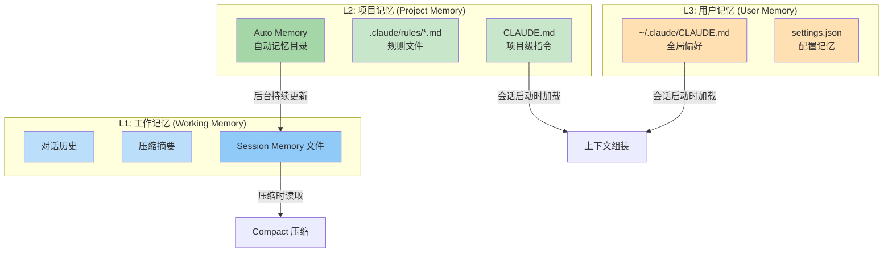
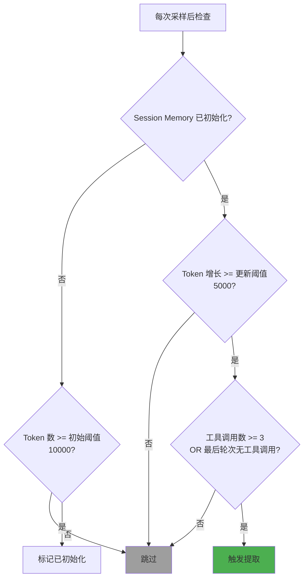
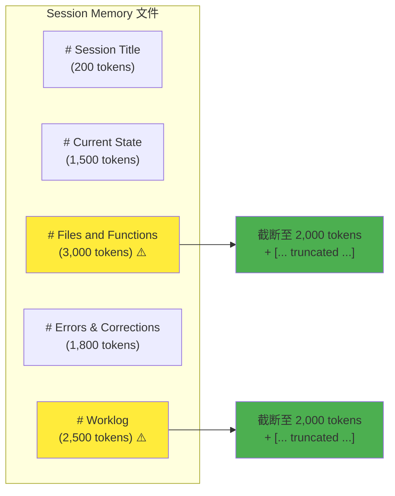
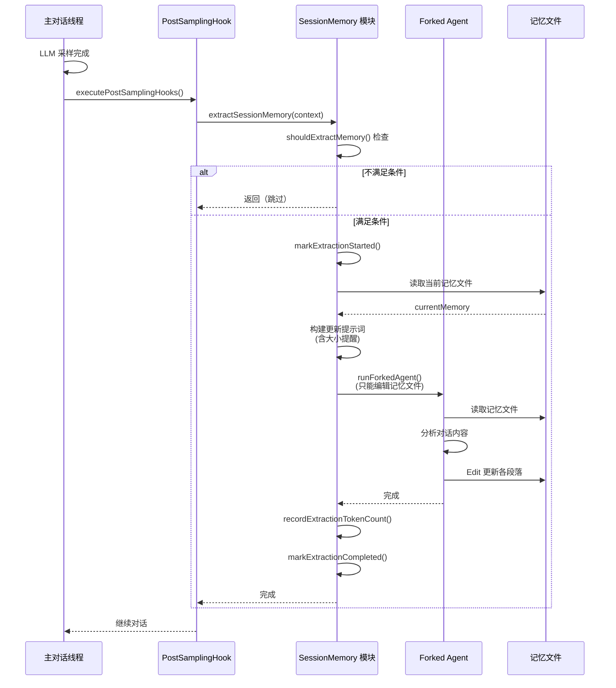
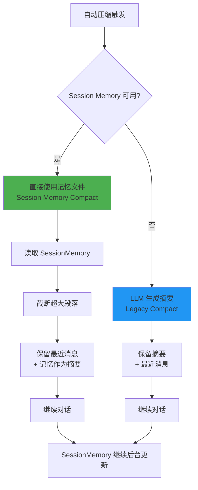

# 第 13 章：跨会话记忆（SessionMemory）

> 核心设计问题：Agent 如何在不同会话之间保持"记忆"？什么该记住，什么该遗忘？记忆存储在哪里，如何在需要时被检索？一个分层的记忆系统如何让 Agent 越用越聪明？

## 13.1 为什么 Agent 需要跨会话记忆

LLM 本质上是无状态的——每次会话都是从零开始。但一个真正有用的 Agent 不能每次都重新了解你的项目结构、偏好和工作习惯。跨会话记忆是 Agent 从"工具"进化为"助手"的关键能力。

Claude Code 的记忆系统是一个多层架构，从工作记忆（单次会话内的短期记忆）到长期记忆（跨项目的持久化知识），每一层都有不同的生命周期、存储介质和更新策略。



## 13.2 SessionMemory：会话级结构化笔记

### 13.2.1 设计理念

源码位置：`services/SessionMemory/sessionMemory.ts`

SessionMemory 的核心思想是将对话中的关键信息**实时提取**为一个结构化的 Markdown 文件。这个文件不是事后整理的，而是在对话过程中由一个后台的 Forked Agent 持续更新的。

```typescript
/**
 * Session Memory automatically maintains a markdown file with notes about
 * the current conversation. It runs periodically in the background using
 * a forked subagent to extract key information without interrupting the
 * main conversation flow.
 */
```

这段源码注释精确地概括了 SessionMemory 的三个设计目标：

1. **自动化**：无需用户干预，自动维护
2. **后台运行**：不阻塞主对话流程
3. **结构化**：按照固定模板组织信息

### 13.2.2 记忆模板设计

源码位置：`services/SessionMemory/prompts.ts`

SessionMemory 使用一个精心设计的 Markdown 模板，包含 10 个结构化段落：

```typescript
export const DEFAULT_SESSION_MEMORY_TEMPLATE = `
# Session Title
_A short and distinctive 5-10 word descriptive title_

# Current State
_What is actively being worked on right now? Pending tasks not yet completed._

# Task specification
_What did the user ask to build? Any design decisions or other explanatory context_

# Files and Functions
_What are the important files? In short, what do they contain and why are they relevant?_

# Workflow
_What bash commands are usually run and in what order?_

# Errors & Corrections
_Errors encountered and how they were fixed. What did the user correct?_

# Codebase and System Documentation
_What are the important system components? How do they work/fit together?_

# Learnings
_What has worked well? What has not? What to avoid?_

# Key results
_If the user asked a specific output, repeat the exact result here_

# Worklog
_Step by step, what was attempted, done? Very terse summary_
`
```

每个段落的设计都有明确的意图：

- **Current State**：最重要的段落，压缩后 Agent 需要首先了解"现在在做什么"
- **Errors & Corrections**：防止 Agent 重复犯同样的错误
- **Learnings**：积累经验教训，是一种"元认知"能力
- **Worklog**：提供时间线视角，帮助理解工作进展

### 13.2.3 模板的可定制性

用户可以提供自定义模板（`~/.claude/session-memory/config/template.md`）和自定义更新提示词（`~/.claude/session-memory/config/prompt.md`），通过 `{{variableName}}` 语法引用变量：

```typescript
function substituteVariables(
  template: string,
  variables: Record<string, string>,
): string {
  return template.replace(/\{\{(\w+)\}\}/g, (match, key: string) =>
    Object.prototype.hasOwnProperty.call(variables, key)
      ? variables[key]!
      : match,
  )
}
```

这是一个典型的**开放-封闭原则**的应用：核心逻辑封闭不变，但用户可以通过自定义模板来扩展行为。

## 13.3 记忆提取机制：何时更新

### 13.3.1 触发条件

源码位置：`services/SessionMemory/sessionMemory.ts` 中的 `shouldExtractMemory()`

SessionMemory 的更新不是每轮都触发的，而是基于双重阈值：



这个设计有几个巧妙的考量：

1. **初始阈值**（10000 token）：避免在对话刚开始时进行不必要的提取
2. **增量阈值**（5000 token）：只有上下文增长到一定程度才更新，避免频繁提取
3. **工具调用阈值**（3 次）：确保有足够的操作产生有价值的信息
4. **自然断点**：当最后一轮没有工具调用时，说明是一个自然的对话暂停点，适合提取

双重阈值（token 增长 AND 工具调用数）的设计防止了"仅因为对话变长但没有实质性操作"就触发提取。

### 13.3.2 通过 Post-Sampling Hook 集成

源码位置：`utils/hooks/postSamplingHooks.ts`

SessionMemory 的提取集成在 Post-Sampling Hook 中，每次 LLM 采样完成后执行：

```typescript
export function initSessionMemory(): void {
  // Session memory 用于压缩，所以遵循 auto-compact 设置
  if (!isAutoCompactEnabled()) return

  // 注册 Hook - 门控检查在实际执行时进行
  registerPostSamplingHook(extractSessionMemory)
}
```

注意这里的设计：**注册是无条件的，门控在执行时进行**。这是一个重要的模式——延迟决策到最后一刻，确保系统状态是最新的。

### 13.3.3 后台执行：Forked Agent

SessionMemory 的提取使用 Forked Agent 在后台执行，不影响主对话流程：

```typescript
await runForkedAgent({
  promptMessages: [createUserMessage({ content: userPrompt })],
  cacheSafeParams: createCacheSafeParams(context),
  canUseTool: createMemoryFileCanUseTool(memoryPath),
  querySource: 'session_memory',
  forkLabel: 'session_memory',
})
```

`canUseTool` 被限制为只能编辑记忆文件：

```typescript
export function createMemoryFileCanUseTool(memoryPath: string): CanUseToolFn {
  return async (tool, input) => {
    if (tool.name === FILE_EDIT_TOOL_NAME &&
        typeof input === 'object' &&
        input?.file_path === memoryPath) {
      return { behavior: 'allow', updatedInput: input }
    }
    return {
      behavior: 'deny',
      message: `only Edit on ${memoryPath} is allowed`,
    }
  }
}
```

这是一个**最小权限原则**的经典应用。Forked Agent 只能做一件事——编辑指定的记忆文件。即使它产生了幻觉，也不会影响任何其他文件或执行任何危险操作。

## 13.4 记忆内容的大小控制

### 13.4.1 分段大小限制

源码位置：`services/SessionMemory/prompts.ts`

SessionMemory 对每个段落的大小都有严格的限制：

```typescript
const MAX_SECTION_LENGTH = 2000           // 每段最多 ~2000 token
const MAX_TOTAL_SESSION_MEMORY_TOKENS = 12000  // 总共最多 ~12000 token
```

更新提示词会动态检测超限的段落并提醒 LLM 压缩：

```typescript
function generateSectionReminders(sectionSizes, totalTokens): string {
  if (totalTokens > MAX_TOTAL_SESSION_MEMORY_TOKENS) {
    return `CRITICAL: The session memory file is currently ~${totalTokens} tokens,
            which exceeds the maximum. You MUST condense the file.`
  }
  // 列出超限的段落
  const oversizedSections = Object.entries(sectionSizes)
    .filter(([_, tokens]) => tokens > MAX_SECTION_LENGTH)
    .map(([section, tokens]) =>
      `- "${section}" is ~${tokens} tokens (limit: ${MAX_SECTION_LENGTH})`
    )
}
```

### 13.4.2 压缩时的截断保护

源码位置：`services/SessionMemory/prompts.ts` 中的 `truncateSessionMemoryForCompact()`

当 SessionMemory 被用于 Compact 压缩时（第 12 章所述），过大的记忆文件会消耗过多 token。系统提供了截断函数来保护：

```typescript
export function truncateSessionMemoryForCompact(content: string): {
  truncatedContent: string
  wasTruncated: boolean
} {
  // 按段落遍历，超限的段落在行边界处截断
  // 并附加 [... section truncated for length ...] 标记
}
```



## 13.5 分层记忆架构

Claude Code 的记忆系统实际上是一个三层架构，每一层服务于不同的时间尺度和持久化需求。

```mermaid
graph TD
    subgraph "记忆层次"
        direction TB
        L1["L1: 工作记忆<br/>生命周期: 单次会话"]
        L2["L2: 项目记忆<br/>生命周期: 跨会话"]
        L3["L3: 用户记忆<br/>生命周期: 永久"]
    end

    subgraph "L1 存储"
        L1A[对话历史 Message[]]
        L1B[压缩摘要 Compact Summary]
        L1C[SessionMemory .md 文件]
    end

    subgraph "L2 存储"
        L2A["CLAUDE.md<br/>项目根目录"]
        L2B[".claude/rules/*.md<br/>规则文件"]
        L2C["Auto Memory 目录<br/>~/.claude/projects/"]
    end

    subgraph "L3 存储"
        L3A["~/.claude/CLAUDE.md<br/>全局偏好"]
        L3B["settings.json<br/>配置和权限"]
        L3C["Auto Memory<br/>MEMORY.md 入口"]
    end

    L1 --> L1A
    L1 --> L1B
    L1 --> L1C
    L2 --> L2A
    L2 --> L2B
    L2 --> L2C
    L3 --> L3A
    L3 --> L3B
    L3 --> L3C

    L1C -->|"压缩时替代<br/>对话历史"| L1B
    L2A -->|"会话启动时<br/>注入系统提示"| L1
    L3A -->|"会话启动时<br/>注入系统提示"| L1

    style L1 fill:#bbdefb
    style L2 fill:#c8e6c9
    style L3 fill:#ffe0b2
```

### 13.5.1 L1: 工作记忆

工作记忆存活于单次会话中，由三个组件构成：

- **对话历史**：完整的 Message 数组，包含所有用户消息、助手回复和工具结果
- **压缩摘要**：当对话过长时，旧消息被替换为 LLM 生成的摘要（第 12 章所述）
- **SessionMemory 文件**：结构化的会话笔记，在后台持续更新

SessionMemory 在 L1 中扮演着特殊的角色——它是"随时准备被压缩"的信息源。当需要压缩时，系统可以跳过 LLM 摘要生成，直接使用 SessionMemory 作为压缩后的上下文（第 12 章的 Session Memory Compact 路径）。

### 13.5.2 L2: 项目记忆

项目记忆与特定代码仓库绑定，跨会话持久化。

#### CLAUDE.md

源码位置：`utils/claudemd.ts` + `context.ts`

CLAUDE.md 是 Claude Code 最具特色的记忆机制之一。系统会从多个位置搜索 CLAUDE.md 文件：

1. **项目根目录**：`./CLAUDE.md` — 项目级指令
2. **子目录**：`./src/CLAUDE.md` — 模块级指令
3. **用户目录**：`~/.claude/CLAUDE.md` — 全局偏好
4. **规则目录**：`.claude/rules/*.md` — 规则文件

这些文件在上下文组装时被合并注入：

```typescript
export const getUserContext = memoize(async () => {
  const claudeMd = getClaudeMds(
    filterInjectedMemoryFiles(await getMemoryFiles())
  )
  return {
    ...(claudeMd && { claudeMd }),
    currentDate: `Today's date is ${getLocalISODate()}.`,
  }
})
```

CLAUDE.md 的设计哲学是**记忆即代码**——记忆文件存放在代码仓库中，可以被版本控制、代码审查，甚至在不同开发者之间共享。

#### Auto Memory

源码位置：`memdir/paths.ts`

Auto Memory 是一个更结构化的自动记忆系统，存储在 `~/.claude/projects/<project-path>/memory/` 目录下：

```typescript
export const getAutoMemPath = memoize((): string => {
  const override = getAutoMemPathOverride() ?? getAutoMemPathSetting()
  if (override) return override

  const projectsDir = join(getMemoryBaseDir(), 'projects')
  return join(projectsDir, sanitizePath(getAutoMemBase()), 'memory')
})
```

Auto Memory 包含：

- **MEMORY.md**：入口文件，作为记忆索引（最多 200 行 / 25KB）
- **主题文件**：按主题组织的详细记忆文件
- **日志文件**：按日期记录的工作日志

MEMORY.md 有严格的容量限制，防止记忆膨胀：

```typescript
export const MAX_ENTRYPOINT_LINES = 200
export const MAX_ENTRYPOINT_BYTES = 25_000
```

### 13.5.3 L3: 用户记忆

用户记忆是最持久的层，与具体项目无关：

- **全局 CLAUDE.md**（`~/.claude/CLAUDE.md`）：用户的通用偏好，如语言、代码风格等
- **settings.json**：配置和权限设置

用户记忆的特点是**由用户主动维护**，而不是系统自动生成。这赋予了用户对 Agent 行为的最终控制权。

## 13.6 记忆的存储安全

源码位置：`services/SessionMemory/sessionMemory.ts` + `memdir/paths.ts`

Claude Code 对记忆文件的存储安全有多层保护：

```typescript
// 创建会话记忆目录和文件
await fs.mkdir(sessionMemoryDir, { mode: 0o700 })  // 仅用户可访问
await writeFile(memoryPath, '', {
  encoding: 'utf-8',
  mode: 0o600,  // 仅用户可读写
  flag: 'wx',   // 不覆盖已存在的文件
})
```

Auto Memory 的路径验证更加严格：

```typescript
function validateMemoryPath(raw: string | undefined): string | undefined {
  // 拒绝相对路径、根路径、Windows 驱动器根路径、UNC 路径、包含 null 字节的路径
  if (
    !isAbsolute(normalized) ||
    normalized.length < 3 ||
    /^[A-Za-z]:$/.test(normalized) ||
    normalized.startsWith('\\\\') ||
    normalized.includes('\0')
  ) {
    return undefined
  }
}
```

这种防御性编程确保了记忆文件不会被恶意利用来访问系统上的敏感文件。

## 13.7 SessionMemory 的更新流程



这个流程的关键特征：

1. **非阻塞**：Forked Agent 在后台运行，主对话不受影响
2. **串行化**：使用 `sequential()` 包装确保同一时刻只有一个提取操作在运行
3. **状态追踪**：`extractionStartedAt` 时间戳用于检测过期的提取（超过 60 秒视为过期）
4. **原子性**：要么完全成功，要么完全失败，不会留下不一致的状态

## 13.8 记忆在压缩中的角色

第 12 章详细描述了压缩机制，这里聚焦记忆如何在压缩中发挥作用。



Session Memory Compact 的优势在于：

1. **零 LLM 调用**：不需要调用 LLM 生成摘要，节省成本和延迟
2. **结构化信息**：记忆文件本身就是结构化的，比 LLM 生成的自由文本更易于利用
3. **持续更新**：记忆在后台持续更新，压缩时可以直接使用最新版本

但它的前提是 SessionMemory 已经积累了足够的内容。在新会话或内容为空的情况下，系统会自动回退到 Legacy Compact。

## 13.9 设计启示

### 13.9.1 分层记忆的必要性

Claude Code 的三层记忆架构告诉我们：**不同时间尺度的信息需要不同的管理策略**。工作记忆需要快速但短暂，项目记忆需要结构化但可变，用户记忆需要稳定但手动维护。单一的"记忆系统"无法同时满足这些需求。

### 13.9.2 结构化记忆优于自由文本

SessionMemory 使用 Markdown 模板而非自由文本，这是一个重要的设计选择。结构化记忆有几个优势：

- **可预测性**：Agent 知道该在哪里找什么信息
- **大小可控**：每个段落有独立的大小限制
- **可比较**：可以检测哪些段落发生了变化
- **可截断**：可以按段落独立截断，不影响其他段落

### 13.9.3 后台提取 + 最小权限

SessionMemory 的后台提取设计有几个值得学习的模式：

1. **Forked Agent**：独立的执行环境，不影响主对话
2. **工具白名单**：只能编辑记忆文件，不能做任何其他操作
3. **状态追踪**：通过时间戳检测过期操作，避免堆积
4. **串行执行**：同一时刻只有一个提取操作，避免竞争

这些模式共同确保了记忆提取的**安全性**和**可靠性**。

### 13.9.4 记忆的容量控制

所有记忆系统都有容量限制：SessionMemory 的每段 2000 token、总共 12000 token；MEMORY.md 的 200 行 / 25KB。这些限制不是随意的，而是经过精心计算的——既要存储足够的信息来保持上下文，又不能因为记忆过大而消耗过多的上下文窗口。

容量控制的重要性在压缩场景下尤为突出。如果 SessionMemory 无限制地增长，它可能比原始对话还要大，完全失去了"压缩"的意义。

### 13.9.5 记忆即文件

Claude Code 将记忆存储为 Markdown 文件（CLAUDE.md、MEMORY.md、SessionMemory 文件），这个设计选择有几个深远的影响：

- **用户可读**：用户可以直接打开文件查看 Agent 记住了什么
- **用户可编辑**：用户可以手动修正或补充记忆内容
- **版本可控**：CLAUDE.md 可以提交到 Git，在团队间共享
- **工具可操作**：Agent 可以用标准的文件编辑工具操作记忆

这种"记忆即文件"的理念比传统的键值存储或向量数据库更简单、更透明，也更符合 Agent 作为"协作伙伴"的定位。

## 13.10 小结

Claude Code 的跨会话记忆系统是一个精心设计的三层架构：

1. **L1 工作记忆**：对话历史 + 压缩摘要 + SessionMemory 结构化笔记
2. **L2 项目记忆**：CLAUDE.md 项目指令 + Auto Memory 结构化知识库
3. **L3 用户记忆**：全局偏好 + 配置设置

SessionMemory 作为工作记忆的核心组件，具有以下特征：

- **实时更新**：通过 Post-Sampling Hook 在后台持续提取关键信息
- **结构化存储**：使用 Markdown 模板，10 个标准化段落
- **大小可控**：每段 2000 token，总计 12000 token 的容量限制
- **安全执行**：Forked Agent + 最小权限 + 串行化
- **压缩就绪**：可以直接用于 Session Memory Compact，零 LLM 成本

这个系统告诉我们：**好的 Agent 记忆不是"记住一切"，而是"记住重要的、遗忘琐碎的、随时可恢复的"**。通过分层设计和结构化存储，Agent 可以在保持上下文完整性的同时，避免信息过载。
