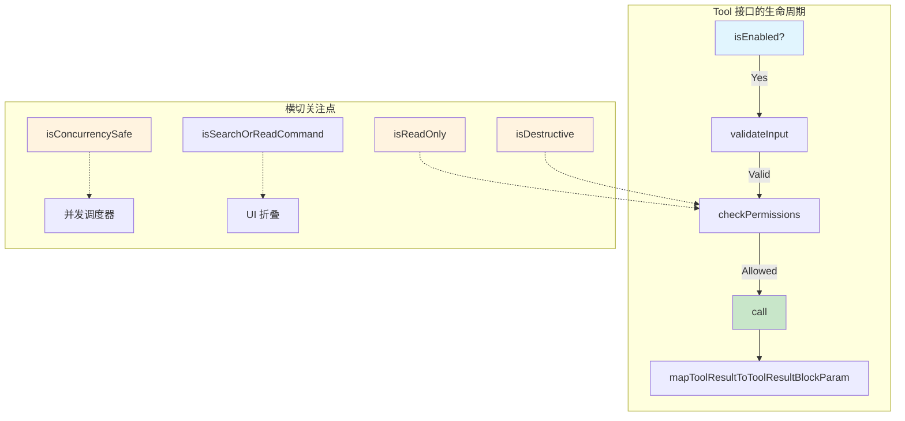
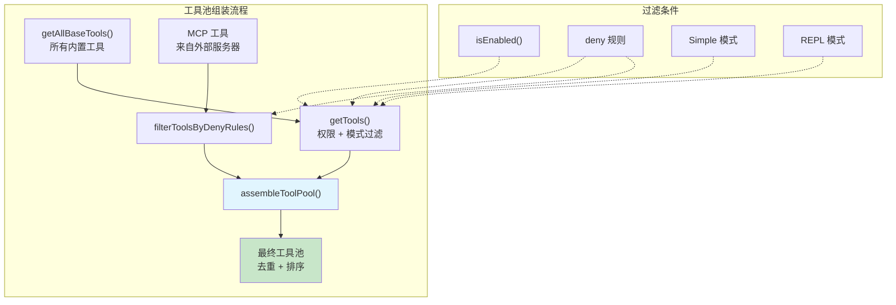

# 第 14 章：工具架构——统一接口与注册表

## 14.1 一个 Tool 是什么？

在 Claude Code 的世界里，Agent 能做的一切事情都通过"工具"来完成。读文件是工具，执行命令是工具，搜索代码是工具，甚至创建子 Agent 也是工具。但关键问题是：这些能力如此不同，如何让它们在同一个框架下运行？

答案在 `Tool.ts` 中定义的核心 `Tool` 类型。每一个工具都遵循同一个接口契约：

```typescript
type Tool<Input, Output, P> = {
  name: string
  inputSchema: Input
  outputSchema?: z.ZodType<unknown>
  description(input, options): Promise<string>
  prompt(options): Promise<string>
  call(args, context, canUseTool, parentMessage, onProgress?): Promise<ToolResult<Output>>
  isConcurrencySafe(input): boolean
  isReadOnly(input): boolean
  isDestructive?(input): boolean
  isEnabled(): boolean
  checkPermissions(input, context): Promise<PermissionResult>
  validateInput?(input, context): Promise<ValidationResult>
  mapToolResultToToolResultBlockParam(content, toolUseID): ToolResultBlockParam
  // ...渲染、搜索、进度等方法
}
```

这个接口告诉我们：一个 Tool 不仅仅是"执行函数"，它是一个自描述的能力单元。它需要告诉系统：

- **我是谁**（`name`、`description`）
- **我需要什么输入**（`inputSchema`，使用 Zod 定义）
- **我产生什么输出**（`outputSchema`）
- **我能执行吗**（`isEnabled`）
- **我安全吗**（`isConcurrencySafe`、`isReadOnly`、`isDestructive`）
- **如何检查权限**（`checkPermissions`、`validateInput`）
- **如何执行**（`call`）

这种设计不是偶然的。它源于一个深刻的架构洞察：**当所有能力遵循同一接口时，系统可以在工具层面施加统一的横切关注点**——权限控制、并发管理、输入验证、结果缓存、UI 渲染——而不需要每个工具自己操心这些。

## 14.2 buildTool：安全的默认值工厂

直接实现完整的 `Tool` 接口是繁琐的。Claude Code 提供了 `buildTool` 工厂函数来减少样板代码：

```typescript
const TOOL_DEFAULTS = {
  isEnabled: () => true,
  isConcurrencySafe: (_input?: unknown) => false,  // 默认不安全
  isReadOnly: (_input?: unknown) => false,           // 默认是写操作
  isDestructive: (_input?: unknown) => false,
  checkPermissions: (input, _ctx) =>
    Promise.resolve({ behavior: 'allow', updatedInput: input }),
  toAutoClassifierInput: (_input?) => '',
  userFacingName: (_input?) => '',
}
```

注意默认值的设计哲学——**fail-closed**（安全优先）：
- `isConcurrencySafe` 默认 `false`，假设工具不可并发执行
- `isReadOnly` 默认 `false`，假设工具会修改文件
- `isDestructive` 默认 `false`，但只有真正不可逆的操作（如删除）才需要覆盖它

这种"默认不安全"的策略意味着：如果一个新工具忘记声明自己的安全性属性，系统会以最保守的方式对待它——这正是安全的做法。



## 14.3 工具注册表：从定义到发现

工具不是散落在代码各处的孤立实体。它们通过 `tools.ts` 中的注册表集中管理。

`getAllBaseTools()` 函数是所有内置工具的"单一真相源"：

```typescript
function getAllBaseTools(): Tools {
  return [
    AgentTool, TaskOutputTool, BashTool,
    ...(hasEmbeddedSearchTools() ? [] : [GlobTool, GrepTool]),
    ExitPlanModeV2Tool, FileReadTool, FileEditTool, FileWriteTool,
    NotebookEditTool, WebFetchTool, TodoWriteTool, WebSearchTool,
    // ...条件性工具
    ...(isWorktreeModeEnabled() ? [EnterWorktreeTool, ExitWorktreeTool] : []),
    ...(getPowerShellTool() ? [getPowerShellTool()] : []),
    // ...
  ]
}
```

这里有几个重要的设计决策：

**条件注册**。工具不是全部加载的。许多工具通过 feature flag 或环境变量控制是否注册。例如 `GlobTool` 和 `GrepTool` 在 Ant 原生构建中有嵌入式替代品，所以被条件排除。`PowerShellTool` 只在 Windows 上启用。这避免了向模型暴露不可用的工具。

**运行时过滤**。`getTools()` 函数在此基础上应用权限过滤：

```typescript
const getTools = (permissionContext: ToolPermissionContext): Tools => {
  // Simple 模式：只有 Bash, Read, Edit
  if (isEnvTruthy(process.env.CLAUDE_CODE_SIMPLE)) {
    return filterToolsByDenyRules([BashTool, FileReadTool, FileEditTool], ...)
  }
  // 完整模式：过滤 + 去重
  const tools = getAllBaseTools().filter(tool => !specialTools.has(tool.name))
  let allowedTools = filterToolsByDenyRules(tools, permissionContext)
  return allowedTools.filter((_, i) => isEnabled[i])
}
```

**工具池组装**。最终，`assembleToolPool()` 将内置工具与 MCP 工具合并：

```typescript
function assembleToolPool(permissionContext, mcpTools): Tools {
  const builtInTools = getTools(permissionContext)
  const allowedMcpTools = filterToolsByDenyRules(mcpTools, permissionContext)
  // 内置优先，按名排序保证缓存稳定性
  return uniqBy(
    [...builtInTools].sort(byName).concat(allowedMcpTools.sort(byName)),
    'name'
  )
}
```



## 14.4 为什么排序很重要？

`assembleToolPool()` 中有一个容易被忽略但至关重要的细节：工具列表的排序。

```typescript
const byName = (a: Tool, b: Tool) => a.name.localeCompare(b.name)
return uniqBy(
  [...builtInTools].sort(byName).concat(allowedMcpTools.sort(byName)),
  'name'
)
```

为什么要按名字排序？答案是 **prompt 缓存稳定性**。Claude 的 API 支持 system prompt 缓存——如果两轮对话的 system prompt 相同，就不需要重新发送。工具定义是 system prompt 的一部分。如果工具列表的顺序在每轮对话中都不同，缓存就会失效，导致不必要的 token 消耗和延迟。

排序策略是：内置工具在前（连续的），MCP 工具在后。这样当 MCP 服务器变化时，不会影响内置工具部分的缓存。

## 14.5 ToolUseContext：工具的执行环境

每个工具的 `call()` 方法接收一个 `ToolUseContext` 对象。这个对象是工具与系统其余部分交互的桥梁：

```typescript
type ToolUseContext = {
  options: {
    tools: Tools           // 当前可用的所有工具
    mainLoopModel: string  // 当前使用的模型
    mcpClients: MCPServerConnection[]
    // ...
  }
  abortController: AbortController  // 取消信号
  readFileState: FileStateCache     // 文件读取状态缓存
  getAppState(): AppState           // 访问全局状态
  setAppState(f): void              // 更新全局状态
  messages: Message[]               // 当前对话历史
  // ...
}
```

`ToolUseContext` 的设计体现了"依赖注入"的思想。工具不直接导入全局状态，而是通过 context 接收它需要的一切。这使得：

- **子 Agent 可以拥有自己的 context**，与父 Agent 隔离
- **测试可以注入 mock context**，无需模拟整个系统
- **不同运行模式**（REPL、SDK、后台任务）可以提供不同的 context 实现

## 14.6 统一接口的收益

回过头来看，为什么 Claude Code 要让所有工具遵循同一接口？这种抽象的代价是什么，收益又是什么？

**收益**：

1. **统一的权限控制**。`checkPermissions` 和 `validateInput` 构成两道防线，每个工具都经过相同的权限检查管道。无论是内置工具还是 MCP 工具，权限逻辑都在同一框架下运行。

2. **并发管理**。`isConcurrencySafe` 让调度器知道哪些工具可以并行执行。搜索工具（Grep、Glob）是只读的，可以并发；文件编辑必须串行。

3. **MCP 无缝集成**。因为 MCP 工具也被建模为 `Tool` 对象，它们能直接融入内置工具的所有基础设施——权限、缓存、渲染、搜索。

4. **Prompt 缓存优化**。工具列表的稳定排序保证了 API 缓存命中率。

5. **可扩展性**。添加新工具只需定义一个 `Tool` 对象，无需修改框架代码。

**代价**：

1. 接口较大，`Tool` 类型有 30+ 个字段。`buildTool` 工厂和 `ToolDef` 部分类型缓解了这个问题。

2. 某些工具（如 MCPTool）的大部分方法都是占位符，在运行时由 MCP 客户端动态覆盖。这种"模板 + 覆盖"的模式增加了理解难度。

## 14.7 设计启示

Claude Code 的工具架构给我们的启示是：**定义一个足够丰富但不过度复杂的统一接口，然后用工厂模式降低实现成本，用注册表集中管理生命周期**。

这种模式在 AI Agent 系统中尤为重要，因为 LLM 的工具调用是动态的——模型在运行时决定调用哪个工具、传什么参数。一个统一的、自描述的工具接口让系统可以在运行时动态检查每个工具的能力和约束，而不需要硬编码这些信息。

如果你在设计自己的 Agent 系统，请记住：工具接口的宽度应该与你的横切关注点数量成正比。Claude Code 有权限、并发、缓存、渲染等多个关注点，所以接口较宽。如果你的系统更简单，接口也可以更窄——但核心的"名称 + 参数 Schema + 执行函数"三元组是必不可少的。
