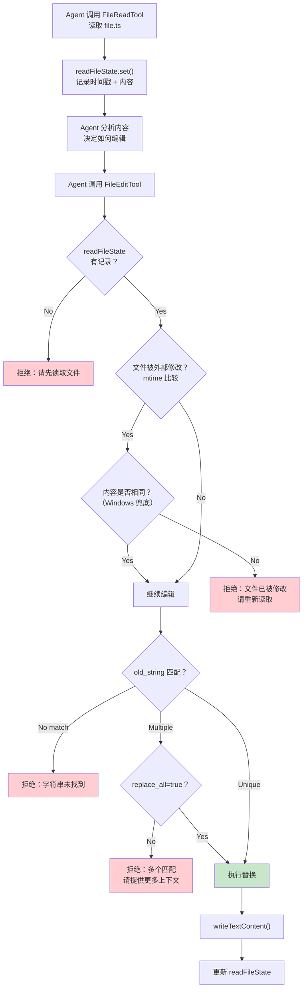
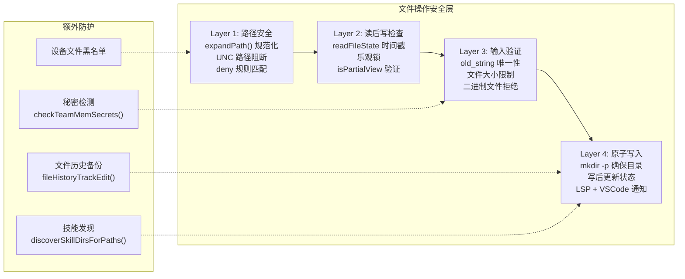

# 第 15 章：文件操作工具的设计哲学

## 15.1 Agent 文件操作的三个挑战

让 AI Agent 读写文件，听起来简单，实际极其复杂。Claude Code 的文件工具需要同时解决三个问题：

1. **可靠性**：LLM 生成的参数不精确，文件操作必须容错
2. **安全性**：Agent 不能破坏用户的工作成果
3. **效率**：大文件不能消耗过多上下文窗口

这三个问题的交叉地带，诞生了 Claude Code 文件工具的设计哲学。让我们逐一拆解三个核心工具：`FileReadTool`、`FileEditTool`、`FileWriteTool`。

## 15.2 FileEditTool：为什么选择"精确字符串替换"？

大多数代码编辑器使用"行号编辑"——指定第 N 行到第 M 行，替换为新内容。但 Claude Code 的 `FileEditTool` 选择了一种完全不同的方式：**精确字符串替换**（Exact String Replacement）。

工具的输入 Schema 是：

```typescript
z.strictObject({
  file_path: z.string().describe('The absolute path to the file'),
  old_string: z.string().describe('The text to replace'),
  new_string: z.string().describe('The text to replace it with'),
  replace_all: z.boolean().optional().describe('Replace all occurrences'),
})
```

为什么不用行号？原因有三层：

**第一层：LLM 的行号是不可靠的。** 模型在生成编辑指令时，对"第 N 行"的判断经常出错。特别是在多轮对话中，文件可能已被修改，模型记忆中的行号早已过时。精确字符串匹配则锚定在内容上，而非位置上——内容变了，匹配自然失败，而不是默默修改错误的行。

**第二层：精确匹配提供了隐式的原子性保证。** `validateInput` 会检查 `old_string` 是否在文件中唯一匹配：

```typescript
const matches = file.split(actualOldString).length - 1
if (matches > 1 && !replace_all) {
  return {
    result: false,
    message: `Found ${matches} matches of the string to replace, but replace_all is false.
              To replace only one occurrence, please provide more context to uniquely identify the instance.`
  }
}
```

如果字符串匹配多次，编辑会被拒绝，模型必须提供更多上下文来消歧。这防止了"改了不该改的地方"的错误。

**第三层："读后写"强制执行读写一致性。** `FileEditTool` 有一个关键的安全检查：

```typescript
const readTimestamp = toolUseContext.readFileState.get(fullFilePath)
if (!readTimestamp || readTimestamp.isPartialView) {
  return {
    result: false,
    message: 'File has not been read yet. Read it first before writing to it.'
  }
}
```

Agent **必须先读文件，才能编辑文件**。这不是技术限制，而是安全策略——确保模型在编辑前"看过"当前内容。更进一步的，它还检查文件是否在读之后被修改：

```typescript
if (lastWriteTime > readTimestamp.timestamp) {
  // Windows 上时间戳不可靠，用内容比较兜底
  const contentUnchanged = isFullRead && originalFileContents === readTimestamp.content
  if (!contentUnchanged) {
    return { result: false, message: 'File has been modified since read...' }
  }
}
```

这个检查构成了一个乐观锁（optimistic locking）机制：读操作记录时间戳，写操作验证时间戳未被更新。如果文件在读后被用户或 linter 修改，编辑会被拒绝，模型必须重新读取。



## 15.3 引号归一化：比看起来更难的问题

一个容易被忽略但极其重要的细节：LLM 生成的字符串和文件中的实际字符串可能不完全一致。最典型的场景是**弯引号**（curly quotes）。

文件中可能是 `'`（右单引号，U+2019），但 LLM 只能生成直引号 `'`。`FileEditTool` 通过 `findActualString()` 函数处理这个问题：

```typescript
export function findActualString(fileContent, searchString): string | null {
  // 先尝试精确匹配
  if (fileContent.includes(searchString)) return searchString
  // 再尝试归一化引号后匹配
  const normalizedSearch = normalizeQuotes(searchString)
  const normalizedFile = normalizeQuotes(fileContent)
  const index = normalizedFile.indexOf(normalizedSearch)
  if (index !== -1) return fileContent.substring(index, index + searchString.length)
  return null
}
```

找到匹配后，`preserveQuoteStyle()` 还会确保 `new_string` 使用与文件一致的引号风格——如果文件用的是弯引号，替换结果也应该用弯引号。

这个看似微小的设计反映了一个重要的设计原则：**文件编辑工具必须容忍 LLM 输出与文件实际内容之间的"合理差异"**。除了引号，还有尾部空白、反净化（desanitize）等问题。`normalizeFileEditInput()` 函数处理了这些边缘情况。

## 15.4 FileReadTool：大文件与上下文窗口的博弈

Agent 读取文件不像人类读文件——Agent 读到的每一行都会消耗 token 预算。一个 10,000 行的文件可能有 50,000+ token，直接塞进上下文窗口会挤占其他信息。

FileReadTool 的设计围绕"如何在有限的上下文窗口内提供最有用的信息"展开。

**多层截断策略**：

1. **文件大小限制**：`maxSizeBytes` 限制单次读取的字节数
2. **Token 限制**：`maxTokens` 限制读取内容的 token 数，通过 `validateContentTokens()` 检查
3. **行范围参数**：`offset` 和 `limit` 让模型指定只读特定行

```typescript
// 核心读取逻辑
const { content, lineCount, totalLines, totalBytes, readBytes, mtimeMs } =
  await readFileInRange(resolvedFilePath, lineOffset, limit, maxSizeBytes, signal)

await validateContentTokens(content, ext, maxTokens)
```

**去重机制**：如果 Agent 在同一轮对话中多次读取同一个文件（且文件未修改），第二次会返回一个存根（stub）而不是完整内容。这节省了大量重复的 token：

```typescript
const existingState = readFileState.get(fullFilePath)
if (existingState && !existingState.isPartialView && existingState.offset !== undefined) {
  const rangeMatch = existingState.offset === offset && existingState.limit === limit
  if (rangeMatch) {
    const mtimeMs = await getFileModificationTimeAsync(fullFilePath)
    if (mtimeMs === existingState.timestamp) {
      return { data: { type: 'file_unchanged', file: { filePath } } }
    }
  }
}
```

**多格式支持**：FileReadTool 不仅是文本读取器。它还处理：
- **图片**（PNG、JPG 等）：自动压缩到 token 预算内
- **PDF**：按页提取，每页转为图片
- **Jupyter Notebook**（.ipynb）：结构化解析 cell
- **二进制文件**：直接拒绝，引导使用 BashTool

**设备文件防护**：一个容易被忽略但重要的安全措施——阻止 Agent 读取会挂起的设备文件：

```typescript
const BLOCKED_DEVICE_PATHS = new Set([
  '/dev/zero',     // 无限输出
  '/dev/random',   // 阻塞等待
  '/dev/stdin',    // 等待输入
  '/dev/tty',      // 阻塞
])
```

## 15.5 FileWriteTool：全量覆盖的权衡

与 `FileEditTool` 的精确替换不同，`FileWriteTool` 采用全量覆盖策略——接收完整的文件内容并写入。这看似"粗糙"，实则是合理的：

- **新文件创建**：必须提供完整内容，无法增量
- **大范围修改**：当改动超过 50% 的行时，全量写入比多次编辑更高效
- **确定性保证**：写入的内容就是最终内容，不存在"替换匹配失败"的风险

FileWriteTool 共享了 FileEditTool 的"读后写"安全机制和乐观锁检查。

## 15.6 文件操作的安全边界



安全是分层的。Claude Code 的文件操作安全并非一道防线，而是四道：

**路径安全层**：`expandPath()` 将所有路径规范化为绝对路径，处理 `~` 和相对路径。UNC 路径（`\\server\share`）在验证阶段被短路，防止 Windows 上的 NTLM 凭据泄漏。`matchingRuleForInput()` 检查文件是否在 deny 列表中。

**读后写检查层**：这是防止 Agent "盲写"的核心机制。没有读过的文件不能写，读过后被修改的文件不能写。`readFileState` 是一个 LRU 缓存，跟踪每个文件的读取状态。

**输入验证层**：对于编辑操作，验证 `old_string` 的匹配情况。对于写入操作，检查文件大小是否超过限制（1 GiB）。对于读取操作，检查是否为二进制文件或危险的设备文件。

**原子写入层**：确保目录存在（`mkdir -p`），写入文件后更新 `readFileState`，通知 LSP 服务器和 VSCode 扩展。如果启用了文件历史备份，在写入前保存备份。

## 15.7 readFileState：文件操作的共享状态

`readFileState`（类型为 `FileStateCache`）是文件工具之间共享状态的核心机制。它是一个 LRU 缓存，记录了每个文件的：

- **内容**：上次读取的完整内容
- **时间戳**：读取时的 mtime
- **offset/limit**：读取的范围（用于判断是否为部分视图）
- **isPartialView**：是否只读了部分内容

这个缓存不仅是安全检查的基础，也是去重优化的基础。`FileEditTool` 检查 `!readTimestamp.isPartialView` 来确保模型看过完整文件（而非只看了前 50 行就试图编辑第 100 行）。

子 Agent 继承父 Agent 的 `readFileState` 快照（通过 `cloneFileStateCache`），但修改不回传——子 Agent 的编辑会更新自己的缓存，但不会影响父 Agent 的视图。这种隔离避免了父子 Agent 之间的状态污染。

## 15.8 设计启示

Claude Code 的文件操作工具教会我们：

**精确字符串替换优于行号编辑。** 当你的"编辑者"是一个 LLM 时，内容锚定比位置锚定更可靠。行号会过时，但内容匹配失败是安全的——它阻止了错误的编辑。

**强制"读后写"是必要的。** 在传统编程中，读写分离是反模式。但在 Agent 系统中，它是一道关键的安全防线——确保 Agent 在修改文件前"看过"当前内容。

**容忍 LLM 的不精确输出。** 引号归一化、尾部空白处理、反净化——这些看似琐碎的处理，实际上是区分"能用"和"好用"的关键。如果编辑工具要求模型输出与文件完全一致的字符串，失败率会非常高。

**分层安全优于单一检查。** 不要指望一道防线解决所有问题。路径安全、读后写、输入验证、原子写入——每一层都独立工作，即使某一层被绕过，其他层仍然能提供保护。
