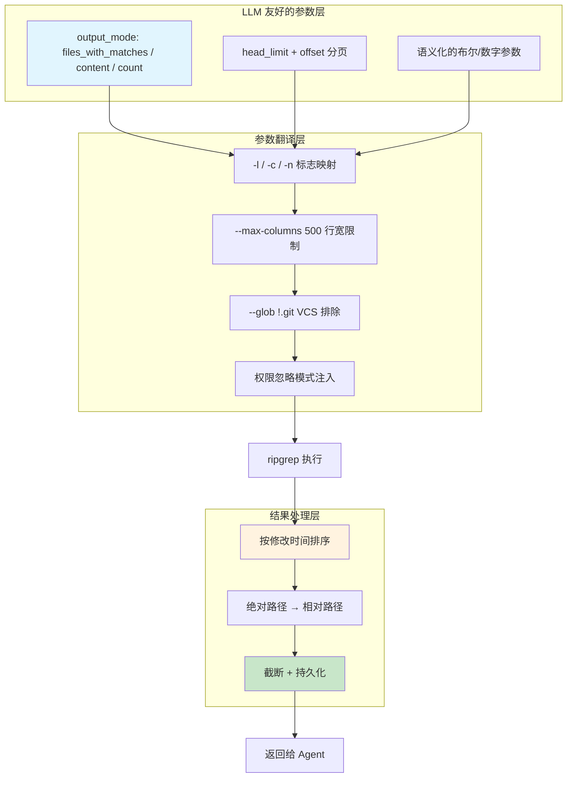

# 第 17 章：搜索工具——让 Agent 找到信息

## 17.1 搜索是 Agent 的眼睛

一个在代码库中"失明"的 Agent 是没有用的。Agent 必须能够快速、准确地找到相关的文件和代码片段。Claude Code 提供了两个核心搜索工具：

- **GrepTool**：基于内容搜索，在文件内容中查找匹配正则表达式的行
- **GlobTool**：基于文件名搜索，用 glob 模式匹配文件路径

这两个工具是 Agent 理解代码库的主要入口。Agent 通常的探索模式是：先用 GlobTool 找到相关文件，再用 GrepTool 在这些文件中搜索特定内容，最后用 FileReadTool 读取感兴趣的文件。

## 17.2 将 ripgrep 封装为 LLM 友好的接口



GrepTool 和 GlobTool 的底层引擎是 **ripgrep**（`rg`）——一个极速的正则表达式搜索工具。但 ripgrep 是为人类设计的命令行工具，直接暴露给 LLM 有几个问题：

1. **参数不直觉**：ripgrep 的 `-l`、`-c`、`-n` 等单字母参数对 LLM 不友好
2. **输出不可控**：没有限制的输出可能超过上下文窗口
3. **路径是绝对的**：ripgrep 输出绝对路径，浪费 token
4. **结果未排序**：ripgrep 按文件系统顺序返回结果，不是按相关性

GrepTool 的设计就是解决这些问题——将 ripgrep 的能力封装为一个 LLM 友好的接口。

### 输入 Schema：对 LLM 友好的参数设计

```typescript
z.strictObject({
  pattern: z.string().describe('The regular expression pattern to search for'),
  path: z.string().optional().describe('File or directory to search in'),
  glob: z.string().optional().describe('Glob pattern to filter files'),
  output_mode: z.enum(['content', 'files_with_matches', 'count']).optional(),
  head_limit: z.number().optional().describe('Limit output to first N entries'),
  offset: z.number().optional().describe('Skip first N entries'),
  '-i': z.boolean().optional().describe('Case insensitive search'),
  '-A': z.number().optional().describe('Lines after match'),
  multiline: z.boolean().optional().describe('Enable multiline mode'),
  type: z.string().optional().describe('File type (js, py, rust...)'),
})
```

注意几个设计决策：

**语义化的 `output_mode`**。替代 ripgrep 的 `-l`（仅文件名）、`-c`（计数）、默认（内容行），使用 `files_with_matches`、`count`、`content` 三个语义清晰的枚举值。LLM 可以从名字推断用途，不需要记住单字母参数。

**`head_limit` 和 `offset` 实现分页**。当结果太多时，Agent 可以用 `head_limit` + `offset` 逐页获取。默认的 `head_limit` 是 250——源码注释解释了这个数字的由来：

> 250 is generous enough for exploratory searches while preventing context bloat.

**保留 `-A`、`-B`、`-i` 等参数名**。这些参数名与 ripgrep 的标志对应，但通过 `semanticBoolean` / `semanticNumber` 包装，使 LLM 可以用更灵活的方式传递参数——既可以用布尔值也可以用字符串 "true"/"false"。

### 参数翻译：从 Schema 到 ripgrep 参数

`call()` 方法将 Schema 参数翻译为 ripgrep 命令行参数。除了基本的模式映射，还有几个重要的翻译细节：

**`--max-columns 500`**。这一行防止了 base64 编码的图片、压缩文件或极长的 JSON 行污染搜索结果。如果一行超过 500 列，ripgrep 只显示前 500 列加省略号。

**VCS 目录排除**。自动排除 `.git`、`.svn`、`.hg`、`.bzr`、`.jj` 等版本控制目录，避免搜索结果被版本控制元数据污染。

**`-e` 标志保护**。如果 pattern 以 dash 开头（如 `-v`），用 `-e` 标志防止被解释为 ripgrep 的参数。

## 17.3 结果处理：排序、截断与路径压缩

搜索结果的处理是 GrepTool 设计中最精细的部分。

### 文件列表模式：按修改时间排序

当 `output_mode === 'files_with_matches'` 时，ripgrep 返回匹配的文件列表。但默认的文件系统顺序不是最有用的。GrepTool 对结果按修改时间排序——最近修改的文件排在前面。

这基于一个启发式假设：用户最近修改的文件更可能与当前任务相关。这个排序使用了 `Promise.allSettled` 而不是 `Promise.all`，确保了即使某些文件在搜索后被删除（竞态条件），整个操作也不会失败。

### 截断策略：默认有界，显式无界

```typescript
const DEFAULT_HEAD_LIMIT = 250

function applyHeadLimit<T>(items: T[], limit?: number, offset = 0) {
  // 显式传 0 = 无限制
  if (limit === 0) return { items: items.slice(offset) }
  const effectiveLimit = limit ?? DEFAULT_HEAD_LIMIT
  // ...
}
```

`head_limit: 0` 是一个"逃生舱"——当 Agent 确实需要所有结果时，可以显式请求无限制。但默认的 250 行限制防止了无意的大输出。这个设计的核心原则是：**默认安全，显式放松**。

### 路径压缩：绝对路径到相对路径

ripgrep 返回绝对路径（如 `/Users/sam/project/src/utils.ts`），但 GrepTool 将它们转换为相对路径（`src/utils.ts`）。这个看似微小的优化在大型代码库中可以节省数百个 token——每次搜索返回 50 个文件路径，每个路径节省 20 个字符，就是 1000 个字符。

值得注意的是，路径压缩是在 `applyHeadLimit` 之后执行的——先截断再转换路径，避免处理那些会被丢弃的行。对于返回数万行结果的广域搜索，这个顺序差异意味着显著减少不必要的路径转换工作。

## 17.4 GlobTool：文件名搜索

GlobTool 的设计比 GrepTool 简单，但同样有值得学习的地方。它的参数极简——只有 `pattern` 和 `path`。

**默认 100 个文件的限制**。GlobTool 的默认结果上限比 GrepTool 更保守（100 vs 250），因为文件名搜索通常返回更多结果，但单个结果的信息量更少。

**truncated 标志**。当结果被截断时，返回的 `truncated: true` 会显示提示："(Results are truncated. Consider using a more specific path or pattern.)"。这个提示指导 Agent 缩小搜索范围。

**执行时间记录**。`durationMs` 在 UI 中显示（"Found 3 files in 12ms"），给用户一个搜索性能的直观感受。

## 17.5 搜索工具与权限系统

搜索工具都是只读的，这意味着它们不需要写权限审批，可以并发执行。但搜索工具仍然有读权限检查——`checkReadPermissionForTool()` 确保搜索路径不在 deny 列表中。

权限系统还过滤了文件读取忽略模式（`getFileReadIgnorePatterns`），这些模式被转换为 ripgrep 的 `--glob !pattern` 参数。对 Agent 来说，这些过滤是透明的——它不知道某些路径被排除了，只是搜索结果中不会出现被排除的文件。

## 17.6 嵌入式搜索：条件性工具替换

`tools.ts` 中有一个容易被忽略的条件：

```typescript
...(hasEmbeddedSearchTools() ? [] : [GlobTool, GrepTool]),
```

在 Ant 原生构建中，`bfs`（Breadth-First Search）和 `ugrep` 被嵌入到 bun 二进制中，Shell 中的 `find` 和 `grep` 命令被别名为这些快速工具。在这种情况下，专用的 GlobTool 和 GrepTool 就不再需要了——Agent 可以通过 BashTool 使用同样快速的嵌入式搜索工具。

这是一个有意义的优化：减少了两个工具的 Schema 定义，节省了 system prompt 中的 token。但它只在嵌入式搜索工具可用时才生效。这个设计体现了"工具池是动态组装的"这一架构理念——可用的工具集不是编译时固定的，而是根据运行时环境动态决定。

## 17.7 设计启示

Claude Code 的搜索工具设计教会我们几件事：

**封装而非暴露。** ripgrep 是一个强大的工具，但直接暴露给 LLM 意味着模型需要学习 ripgrep 的参数语法。通过封装为语义清晰的参数，降低了模型的认知负担，也减少了出错的可能。封装层还提供了附加价值：自动排序、路径压缩、VCS 排除等，这些都是 LLM 不会主动考虑的优化。

**默认有界。** 搜索工具的默认行为是返回有限的结果（250 或 100），而不是无限制的输出。这个设计原则应该贯穿所有可能返回大量数据的工具：默认安全，显式放松。逃生舱（`head_limit: 0`）的存在确保了灵活性不受限。

**排序是隐式的相关性判断。** 按修改时间排序文件搜索结果是一个简单但有效的启发式。它不完美，但比文件系统顺序好得多。对于 Agent 系统，不需要完美的相关性算法——需要的是"足够好"的默认排序，让 Agent 在大多数情况下不需要额外排序。

**路径压缩是值得的。** 将绝对路径转换为相对路径是一个微小的优化，但在大规模使用中（Agent 每轮对话可能执行多次搜索）节省的 token 是可观的。在设计 Agent 工具时，每一个 token 都应该被珍惜。

**工具池是动态组装的。** 嵌入式搜索工具的存在可以让 GlobTool 和 GrepTool 完全不出现在工具池中。这提醒我们：在 Agent 系统中，工具集不应该是硬编码的，而应该是根据环境和能力动态决定的。
