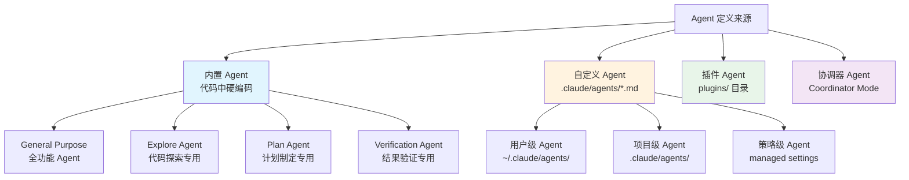
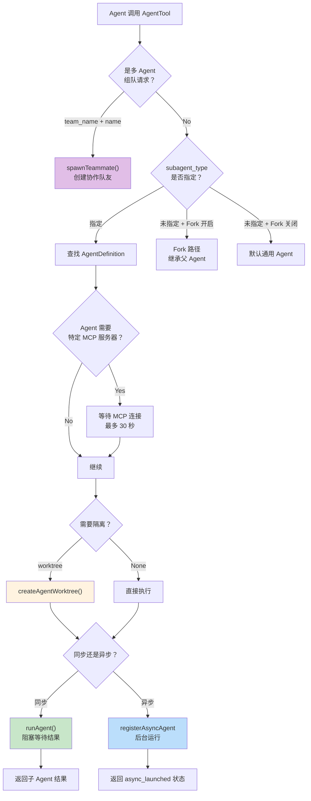
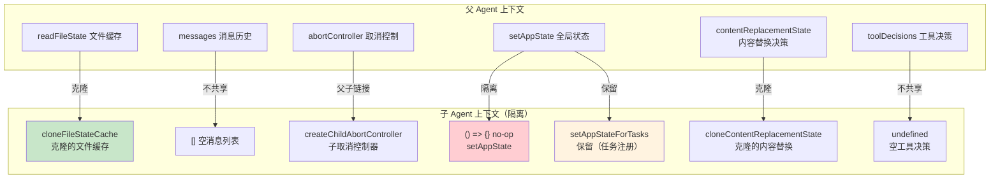
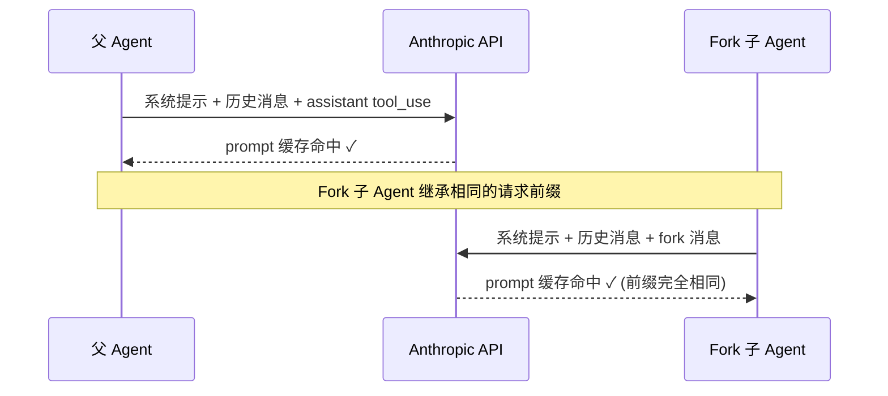

# 第 18 章：子 Agent 调度——AgentTool 与任务委派

## 18.1 为什么需要子 Agent？

想象你在做一个大型项目：修复一个跨三个模块的 bug。你可能需要：
1. 在模块 A 中找到问题的根源
2. 在模块 B 中理解相关的接口定义
3. 在模块 C 中实现修复
4. 运行所有测试验证修复

如果主 Agent 串行执行这些步骤，每一步都要等待上一步完成。但如果能同时委派多个子 Agent 并行探索，效率会大幅提升。

这就是 AgentTool 的核心价值——**让 Agent 能创建子 Agent 来处理子任务**。

## 18.2 AgentTool 的输入设计

AgentTool 的输入 Schema 体现了任务委派的核心抽象：

```typescript
z.object({
  description: z.string().describe('A short (3-5 word) description of the task'),
  prompt: z.string().describe('The task for the agent to perform'),
  subagent_type: z.string().optional().describe('The type of specialized agent'),
  model: z.enum(['sonnet', 'opus', 'haiku']).optional().describe('Model override'),
  run_in_background: z.boolean().optional().describe('Run in background'),
  // 多 Agent 参数
  name: z.string().optional().describe('Name for spawned agent'),
  team_name: z.string().optional().describe('Team name'),
  isolation: z.enum(['worktree', 'remote']).optional().describe('Isolation mode'),
  mode: permissionModeSchema().optional(),
})
```

每个参数都有其设计理由：

- **`description`**：简短的任务描述，用于 UI 展示和日志记录，不影响 Agent 行为
- **`prompt`**：完整的任务指令，是子 Agent 的"用户消息"
- **`subagent_type`**：选择专用的 Agent 类型（通用、探索、计划等）
- **`model`**：成本/质量权衡——简单任务用 Haiku，复杂任务用 Opus
- **`run_in_background`**：长时间任务异步执行
- **`isolation`**：worktree 模式在独立 Git 分支上工作，避免修改主工作区
- **`name` + `team_name`**：多 Agent 组队时的标识参数

一个值得注意的设计是：Schema 本身会根据运行时特性动态调整。例如，当 Fork 实验开启时，`run_in_background` 会被从 Schema 中移除——模型根本看不到这个参数。这种"根据能力动态调整 Schema"的设计确保了模型只会尝试系统当前支持的参数。

## 18.3 子 Agent 的类型系统

Claude Code 支持多种类型的子 Agent。`builtInAgents.ts` 中定义了内置的 Agent 类型：



每个 Agent 类型由 `AgentDefinition` 描述。除了基本字段（名称、描述、系统提示），这个定义还包含了许多控制 Agent 行为的配置：

- **`tools` / `disallowedTools`**：限制或扩展 Agent 可用的工具集
- **`permissionMode`**：覆盖默认的权限模式
- **`model`**：指定模型偏好（或 "inherit" 继承父 Agent）
- **`mcpServers`**：Agent 专用的 MCP 服务器配置
- **`isolation`**：指定是否在独立 worktree 中工作
- **`background`**：标记此 Agent 是否总是后台运行
- **`maxTurns`**：限制 Agent 的最大轮次
- **`memory`**：指定持久化记忆的范围（user/project/local）
- **`requiredMcpServers`**：声明依赖的 MCP 服务器，缺失时 Agent 不可用

`requiredMcpServers` 是一个精巧的设计。它允许 Agent 声明"我需要 GitHub MCP 服务器才能工作"。在运行时，系统会检查所需的 MCP 服务器是否已连接且有可用的工具。如果 Agent 类型被选中但所需的 MCP 服务器不可用，系统会立即报错，而不是让 Agent 在执行过程中才发现缺少能力。

## 18.4 任务委派流程



委派流程有几个值得关注的决策点：

**MCP 服务器等待**。如果 Agent 声明了 `requiredMcpServers`，但所需的 MCP 服务器还在连接中，系统会最多等待 30 秒（每 500ms 轮询一次）。如果连接失败，会立即报错而不是继续等待。这种"有超时的等待"避免了无限阻塞，同时给了慢速 MCP 服务器一个启动的机会。

**Agent 权限过滤**。在选择 Agent 之前，系统会先过滤被 deny 规则拒绝的 Agent 类型。如果用户配置了 `Agent(explore) → deny`，即使 explore Agent 存在，也不会出现在可选列表中。

## 18.5 同步与异步：两种委派模式

AgentTool 支持两种执行模式，对应不同的使用场景。

### 同步模式

子 Agent 阻塞主 Agent 的当前轮次。主 Agent 等待子 Agent 完成，然后继续工作。适用于快速的探索性任务和需要立即使用结果的任务。

### 异步模式

子 Agent 在后台运行，主 Agent 立即继续工作。适用于长时间运行的任务（运行测试套件、构建项目）和可以独立完成的任务。异步模式下，子 Agent 完成后通过通知系统告知主 Agent。

异步执行的触发条件不仅仅是 `run_in_background === true`。以下任一条件成立时，子 Agent 都会异步执行：

- Agent 定义中 `background: true`
- 协调器模式（所有子 Agent 异步）
- Fork 实验开启
- 主动式（Proactive）/ 助手（Assistant）模式

```typescript
const shouldRunAsync = (
  run_in_background === true ||
  selectedAgent.background === true ||
  isCoordinator ||
  forceAsync ||
  assistantForceAsync
) && !isBackgroundTasksDisabled
```

这种"多重触发条件"的设计反映了一个原则：**Agent 的执行模式应该由系统和上下文共同决定，而不是完全依赖模型的判断**。在某些模式下，系统比模型更清楚应该异步执行。

## 18.6 上下文隔离：父子 Agent 的状态边界

子 Agent 不应该看到或修改父 Agent 的所有状态。`createSubagentContext()` 在 `forkedAgent.ts` 中创建了一个受限的上下文，实现了精细的状态隔离：



这个设计有几个精妙之处：

**克隆而非共享文件缓存**。子 Agent 看到父 Agent 的读取历史（可以避免重复读取），但子 Agent 的读取不影响父 Agent 的去重逻辑。

**独立的消息列表**。子 Agent 的对话历史是独立的，不会污染父的上下文。但 `setAppStateForTasks` 保留了——这是因为后台任务的注册和取消必须到达根状态存储，否则异步 Agent 的 bash 任务会变成孤儿进程。

**选择性共享**。`createSubagentContext` 提供了 `shareSetAppState`、`shareAbortController` 等选项，允许调用方在需要时打破隔离。这种"默认隔离，显式共享"的设计比"默认共享，显式隔离"安全得多。

**克隆内容替换状态**。对于 Fork 路径（利用 prompt 缓存的子 Agent），内容替换决策需要与父 Agent 一致，否则相同的消息可能产生不同的替换结果，导致 API 请求前缀不同，缓存命中失败。

## 18.7 子 Agent 的工具池

子 Agent 拥有自己独立的工具池，通过 `assembleToolPool()` 独立组装：

```typescript
const workerPermissionContext = {
  ...appState.toolPermissionContext,
  mode: selectedAgent.permissionMode ?? 'acceptEdits'
}
const workerTools = assembleToolPool(workerPermissionContext, appState.mcp.tools)
```

这意味着子 Agent 的工具集独立于父 Agent 的工具限制，权限模式也可以通过 Agent 定义覆盖。源码注释解释了这个设计决策：

> Workers always get their tools from assembleToolPool with their own permission mode, so they aren't affected by the parent's tool restrictions.

这个决策反映了一个权衡：**安全性 vs. 能力**。如果子 Agent 继承父 Agent 的所有限制，可能导致"能力不足"的子 Agent 无法完成任务。Claude Code 选择了按 Agent 定义配置权限，而不是简单地继承或忽略。

### Agent 专用 MCP 服务器

Agent 定义中的 `mcpServers` 字段允许每个 Agent 声明自己需要的 MCP 服务器。在 Agent 启动时，`initializeAgentMcpServers()` 会连接这些服务器，将工具添加到 Agent 的工具池中。当 Agent 完成时，这些临时连接会被清理。

这个设计使得 Agent 的能力是"自包含"的——一个需要 GitHub 操作的 Agent 可以声明自己的 GitHub MCP 服务器，而不依赖于父 Agent 是否已经连接了这个服务器。

## 18.8 Fork 路径：共享上下文的缓存优化

Fork 路径是一种特殊的子 Agent 模式，其核心目标是**利用 API 的 prompt 缓存**来节省 token。



Fork 的工作方式：

1. 子 Agent 继承父 Agent 的完整系统提示（而非 FORK_AGENT 自己的）
2. 消息历史通过 `buildForkedMessages()` 构建——克隆父的助手消息，为非当前工具创建"虚拟"工具结果，为当前工具创建包含子任务指令的结果
3. 子 Agent 的 API 请求前缀与父 Agent 完全相同，服务器端的 prompt 缓存可以直接命中

Fork 有递归防护——fork 的子 Agent 不能再 fork：

```typescript
if (toolUseContext.options.querySource === `agent:builtin:${FORK_AGENT.agentType}`
    || isInForkChild(toolUseContext.messages)) {
  throw new Error('Fork is not available inside a forked worker.')
}
```

这种"共享前缀 + 独立后缀"的模式在 Agent 系统中有广泛应用——它展示了如何在保持缓存命中的同时给予子 Agent 独立的任务。

## 18.9 Worktree 隔离：安全的并行修改

当 `isolation: 'worktree'` 时，子 Agent 在独立的 Git worktree 中工作：

```typescript
if (effectiveIsolation === 'worktree') {
  const slug = `agent-${earlyAgentId.slice(0, 8)}`
  worktreeInfo = await createAgentWorktree(slug)
}
```

worktree 隔离意味着：
- 子 Agent 的文件修改不影响主工作区
- 完成后可以将 worktree 的更改合并回来
- 多个子 Agent 可以在不同的 worktree 中并行工作，互不干扰

这解决了一个根本问题：多个 Agent 同时编辑同一个项目会导致冲突。worktree 为每个 Agent 提供了独立的工作空间。当 Fork 路径与 worktree 隔离结合时，系统会在子 Agent 的 prompt 中注入路径转换提示，告诉它当前在 worktree 中工作。

## 18.10 子 Agent 的生命周期管理

子 Agent 的生命周期由 `LocalAgentTask` 管理。它维护了所有活跃 Agent 的注册表，支持以下操作：

- **注册**：`registerAsyncAgent()` 创建新的后台 Agent 任务
- **进度更新**：`updateAgentProgress()` 记录 Agent 的执行进度
- **完成**：`completeAgent()` 记录结果并通知父 Agent
- **失败**：`failAgent()` 记录错误并通知父 Agent
- **终止**：`killAgent()` 发送 abort 信号并清理资源（包括子 Agent 的 Shell 任务）

前台任务（`registerForeground`）会阻止 Agent 主循环提交新消息——确保当前任务完成后才处理下一轮。

## 18.11 设计启示

AgentTool 的设计教会我们：

**委派需要清晰的契约。** 父 Agent 通过 `prompt` 传达任务，子 Agent 通过返回值报告结果。这个简单的契约足以处理大多数任务委派场景。`description` 用于 UI 展示但不影响行为——这种"接口层"和"展示层"的分离是好的 API 设计。

**上下文隔离是必要的，但要有选择性的共享机制。** 父子 Agent 之间的状态隔离（文件缓存、消息历史、全局状态）防止了意外的状态污染。但某些状态（如任务注册）必须穿透隔离层。`createSubagentContext` 的"默认隔离，显式共享"模式是一个值得学习的模式。

**异步执行是 Agent 系统的关键能力。** 不是所有任务都需要同步完成。后台执行 + 通知机制让 Agent 可以并行处理多个子任务，大幅提高效率。更重要的是，异步的触发条件不仅来自模型请求，还来自系统判断——在某些场景下，系统比模型更清楚应该异步。

**缓存感知的设计可以大幅降低成本。** Fork 模式展示了如何通过共享 API 请求前缀来利用 prompt 缓存。在多 Agent 系统中，token 成本是主要的运营开销——任何能利用缓存的设计都是值得的。

**Agent 的能力应该是自包含的。** 通过 `mcpServers` 字段，每个 Agent 可以声明自己需要的 MCP 服务器。这种"声明式依赖"比"假设环境已准备好"更健壮——Agent 不需要知道运行时环境中已有哪些 MCP 服务器，它只需要声明自己需要什么。
