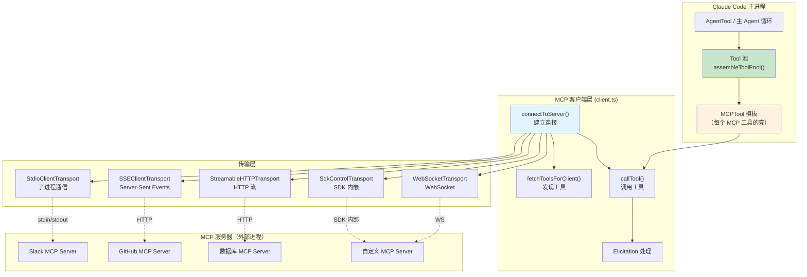
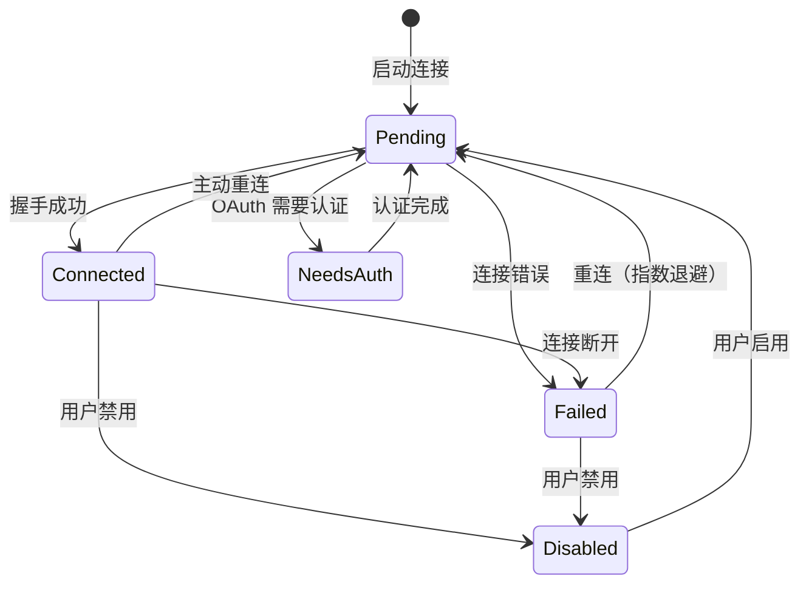
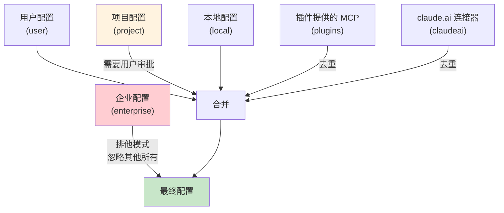
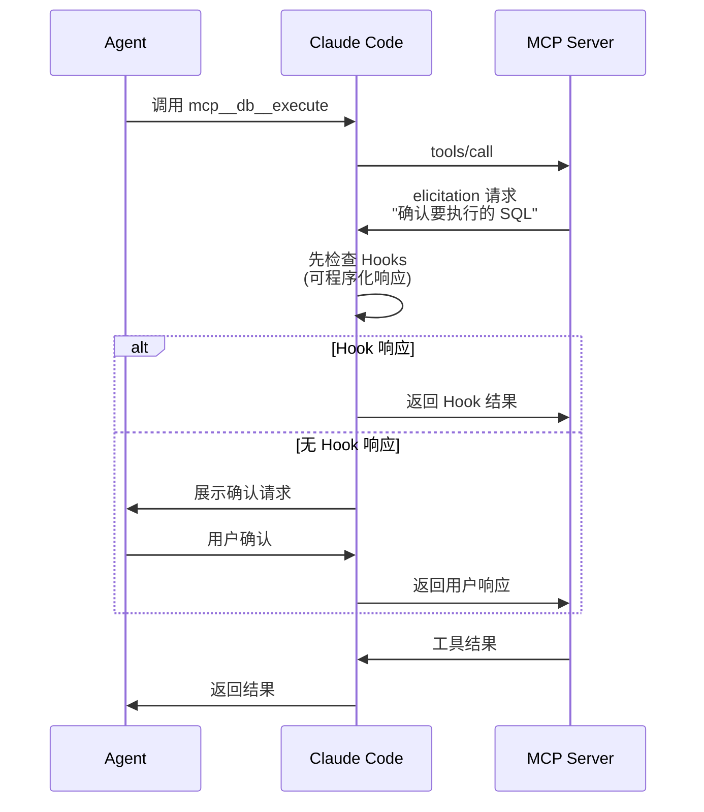
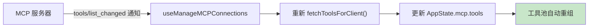

# 第 19 章：MCP——开放的工具协议

## 19.1 从封闭到开放

Claude Code 的内置工具覆盖了文件操作、Shell 执行、代码搜索等核心能力。但 AI Agent 的真正潜力在于它能连接到外部世界——数据库、API、IDE、浏览器、Slack、GitHub……

Model Context Protocol（MCP）就是这种连接的标准化协议。它定义了 Agent 如何发现和调用外部工具服务器提供的工具。对 Claude Code 来说，MCP 不是一个插件系统——它是一个**架构级的能力扩展机制**。

## 19.2 MCP 的架构分层



MCP 的架构分为三层：

1. **配置层**（`config.ts`）：管理 MCP 服务器的配置来源和合并
2. **客户端层**（`client.ts`）：负责连接、发现和调用
3. **传输层**（`@modelcontextprotocol/sdk`）：处理具体的通信协议

这三层各自独立：配置层决定"连接什么"，客户端层决定"如何交互"，传输层决定"用什么协议"。

## 19.3 传输层抽象：五种通信方式

MCP 协议的核心抽象是"传输"（Transport）。不同的 MCP 服务器使用不同的通信方式，但上层代码不需要关心这些差异。`connectToServer()` 根据配置类型选择传输方式：

**stdio** 是最常见和最重要的传输方式。MCP 服务器作为 Claude Code 的子进程运行，通过 stdin/stdout 交换 JSON-RPC 消息。这种方式有几个优势：
- 不需要网络端口，避免了端口冲突
- 进程生命周期由 Claude Code 管理
- 天然适用于本地工具（文件操作、Git 命令等）

**SSE 和 HTTP** 适用于远程 MCP 服务器——运行在云端的 API 网关或服务代理。两者都支持 OAuth 认证。

**WebSocket** 适用于需要双向通信的场景。

**SDK** 是一种特殊的传输方式，用于 IDE 扩展等嵌入场景——Claude Code 作为 SDK 被嵌入到另一个应用中，该应用直接提供 MCP 工具。

传输层的抽象让 MCP 可以适应从本地开发到云端部署的各种环境。上层代码（工具发现、调用、权限检查）完全不需要知道底层用的是哪种传输方式。

## 19.4 连接管理：状态机与生命周期

MCP 服务器连接是一个有生命周期的状态机。`types.ts` 定义了五种连接状态：

```typescript
type MCPServerConnection =
  | ConnectedMCPServer     // 已连接，可使用
  | FailedMCPServer        // 连接失败
  | NeedsAuthMCPServer     // 需要认证
  | PendingMCPServer       // 连接中
  | DisabledMCPServer      // 用户禁用
```



每个状态转换都可能触发工具池的重新组装。当一个新的 MCP 服务器从 `Pending` 变为 `Connected` 时，它的工具被发现并添加到工具池中——即使在对话进行中，工具集也是动态变化的。

**重连机制**使用指数退避策略：初始等待 1 秒，每次重连失败等待时间翻倍，最长等待 30 秒，最多尝试 5 次。这种策略避免了在服务器短暂不可用时产生连接风暴。

## 19.5 工具发现与 MCPTool 的动态创建

MCP 工具的发现过程在 `fetchToolsForClient()` 中实现。它是一个带 LRU 缓存的函数——同一个服务器不会重复发现工具。

发现流程：
1. 检查服务器的 `capabilities.tools` 是否存在
2. 发送 `tools/list` 请求获取工具列表
3. 对每个 MCP 工具，创建一个 Claude Code 的 `Tool` 对象

```typescript
// MCP 工具转换为 Claude Code Tool 对象的核心逻辑
return toolsToProcess.map((tool): Tool => {
  const fullyQualifiedName = buildMcpToolName(client.name, tool.name)
  return {
    ...MCPTool,  // 继承 MCPTool 模板的默认实现
    name: fullyQualifiedName,   // "mcp__server__tool"
    mcpInfo: { serverName: client.name, toolName: tool.name },
    isMcp: true,
    async description() { return tool.description ?? '' },
    inputJSONSchema: tool.inputSchema,
    inputSchema: z.object({}).passthrough(),  // 参数由 MCP 服务器验证
    isConcurrencySafe() { return tool.annotations?.readOnlyHint ?? false },
    isReadOnly() { return tool.annotations?.readOnlyHint ?? false },
    isDestructive() { return tool.annotations?.destructiveHint ?? false },
    isOpenWorld() { return tool.annotations?.openWorldHint ?? false },
    async call(input) {
      // 调用 MCP 服务器的 tools/call
    }
  }
})
```

这里有三个重要的设计决策：

**参数验证由 MCP 服务器负责。** `inputSchema: z.object({}).passthrough()` 意味着 Claude Code 不验证参数结构，只负责传递。这降低了耦合——Claude Code 不需要理解每个 MCP 工具的参数语义。

**工具注解（Annotations）映射为行为标记。** MCP 协议允许工具声明 `readOnlyHint`、`destructiveHint`、`openWorldHint` 等注解。Claude Code 将这些注解映射为自己的 `isReadOnly()`、`isDestructive()` 等方法，使 MCP 工具可以无缝融入内置工具的权限和并发系统。

**MCPTool 模板 + 动态覆盖。** `MCPTool.ts` 定义了一个默认的工具壳（name 为 'mcp'，所有方法都是空实现）。`fetchToolsForClient` 用展开运算符（`...MCPTool`）继承默认实现，然后逐个覆盖 `name`、`description`、`call` 等字段。这种"模板 + 覆盖"的模式是动态工具创建的优雅实现。

## 19.6 工具名归一化与命名空间

MCP 工具名使用 `mcp__` 前缀加双下划线分隔的命名空间：

```
mcp__github__create_issue
mcp__slack__send_message
mcp__my_server__custom_tool
```

`buildMcpToolName()` 构建这个名称，`normalizeNameForMCP()` 处理特殊字符（将非字母数字字符替换为下划线，确保名称在所有上下文中都有效）。

命名空间解决了两个问题：
1. **避免名称冲突**：不同 MCP 服务器可能有同名工具
2. **权限控制**：deny 规则可以按服务器前缀匹配，如 `mcp__github*` 拒绝所有 GitHub 工具

## 19.7 配置的多层合并

MCP 服务器配置来自多个来源，有严格的优先级。`config.ts` 中的 `getClaudeCodeMcpConfigs()` 实现了合并逻辑：



**企业排他模式**是最强的控制——如果企业配置存在，其他所有来源都被忽略。这确保了企业环境的安全合规。

**项目配置需要审批**。`.mcp.json` 文件可以提交到版本控制，恶意项目可以通过这种方式注入 MCP 服务器。审批机制（`getProjectMcpServerStatus(name) === 'approved'`）确保用户明确同意后才会连接。

**去重机制**防止同一个 MCP 服务器被重复配置。不同来源可能配置了相同的服务器（相同的 URL 或命令数组）。去重通过"内容签名"实现——相同的 URL 或相同的命令数组被视为同一个服务器。优先级最高的配置被保留。

## 19.8 认证与 Elicitation

某些 MCP 服务器需要认证。MCP 协议定义了两种认证交互方式。

### OAuth 认证

SSE/HTTP 类型的服务器支持标准 OAuth 流程。`ClaudeAuthProvider` 实现了 `AuthProvider` 接口，处理 OAuth 的重定向、token 存储和自动刷新。当 MCP 服务器返回 401 时，客户端会自动切换到 `NeedsAuth` 状态，引导用户完成浏览器认证流程。认证完成后，连接回到 `Pending` 状态重新连接。

### Elicitation：工具执行中的人机交互

Elicitation 是 MCP 协议的一个独特能力——服务器可以在工具调用过程中请求用户交互，"暂停"执行并请求用户提供额外信息。



Elicitation 有两种模式：
- **form 模式**：服务器发送结构化表单，用户填写后返回
- **url 模式**：服务器要求用户在浏览器中完成操作（如 OAuth 授权），完成后通知

一个重要的设计是 Hooks 可以程序化地响应 Elicitation。在 `registerElicitationHandler()` 中，系统首先尝试运行 Elicitation Hooks——如果 Hook 提供了响应，就不需要打扰用户。这使得自动化场景（如 CI/CD）可以通过配置 Hook 来跳过人工确认。

Elicitation 打破了传统工具调用的"请求-响应"模式，引入了"请求-确认-响应"的三步交互。这对安全性至关重要——它允许 MCP 服务器在执行危险操作前征求用户同意，而不是盲目执行。

## 19.9 MCP 工具如何融入内置工具体系

`assembleToolPool()` 函数是内置工具和 MCP 工具合并的单一入口：

```typescript
export function assembleToolPool(
  permissionContext: ToolPermissionContext,
  mcpTools: Tools,
): Tools {
  const builtInTools = getTools(permissionContext)
  const allowedMcpTools = filterToolsByDenyRules(mcpTools, permissionContext)

  // 内置工具排序后作为连续前缀，MCP 工具排序后追加
  // 这确保了 prompt 缓存的稳定性
  const byName = (a: Tool, b: Tool) => a.name.localeCompare(b.name)
  return uniqBy(
    [...builtInTools].sort(byName).concat(allowedMcpTools.sort(byName)),
    'name'
  )
}
```

合并策略中有一个容易被忽略但很重要的细节：**内置工具排序后作为连续前缀，MCP 工具排序后追加**。这不是简单的合并——这是为了 prompt 缓存的稳定性。源码注释解释：

> Sort each partition for prompt-cache stability, keeping built-ins as a contiguous prefix. A flat sort would interleave MCP tools into built-ins and invalidate all downstream cache keys whenever an MCP tool sorts between existing built-ins.

如果简单地按名称排序所有工具，MCP 工具可能会插在两个内置工具之间。当 MCP 工具集变化时（服务器连接/断开），所有下游的缓存键都会失效。将内置工具保持为连续前缀，即使 MCP 工具集变化，内置工具部分的缓存键仍然有效。

合并后的工具池对 Agent 来说是完全透明的——Agent 不需要区分内置工具和 MCP 工具。它们共享同一套权限系统、渲染管道和结果处理。`uniqBy` 确保了名称冲突时内置工具优先。

## 19.10 工具列表的动态更新

MCP 支持工具列表的动态更新。当 MCP 服务器的工具集发生变化时（例如用户安装了新的插件），服务器会发送 `tools/list_changed` 通知。`useManageMCPConnections` Hook 监听这些通知，自动重新获取工具列表并更新工具池。



这意味着 Agent 的能力在对话过程中可以动态增长——不需要重启会话。一个在对话开始时没有 GitHub 工具的 Agent，可以在对话中途获得这些工具。

## 19.11 设计启示

MCP 的设计教会我们：

**协议比实现更重要。** MCP 的价值不在于某个具体的客户端或服务器实现，而在于它定义的标准接口。任何遵循这个协议的工具服务器都可以被任何遵循这个协议的 Agent 使用。标准接口让"一次实现，所有 Agent 可用"成为可能。

**传输抽象是必要的。** 五种传输方式（stdio、SSE、HTTP、WebSocket、SDK）覆盖了几乎所有使用场景，而上层代码不需要关心差异。这种抽象让 MCP 可以适应从本地开发到云端部署的各种环境。

**安全性是第一公民。** 从配置层面的企业排他模式、项目审批机制，到运行时的权限过滤、deny 规则匹配，MCP 的安全性贯穿了整个架构。这不是一个"功能优先，安全后补"的设计——安全性从一开始就嵌入在每个层级。

**工具池的动态组合是 Agent 系统的核心能力。** `assembleToolPool()` 将内置工具、MCP 工具、权限规则动态组合为最终的 Agent 能力集。这种"运行时组装"而非"编译时绑定"的设计，让 Agent 的能力可以随环境变化而变化——这正是智能系统应有的灵活性。

**缓存感知的设计应贯穿架构。** 从工具排序策略（内置工具作为连续前缀）到连接缓存和去重机制，MCP 的设计处处考虑了对 prompt 缓存的影响。在 token 成本高昂的 LLM 系统中，缓存不仅是性能优化，更是架构决策。

**Elicitation 打破了"工具是单向的"限制。** 传统工具调用是请求-响应模式——Agent 发送请求，工具返回结果。MCP 的 Elicitation 允许工具在执行过程中请求用户交互，打开了"需要人工确认的自动化"这个设计空间。而 Hooks 机制又允许在自动化场景中程序化地跳过人工确认，兼顾了安全性和自动化。
