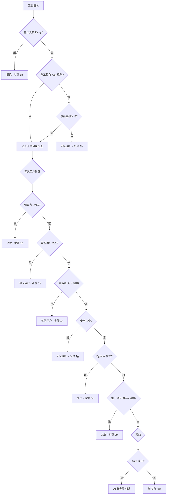
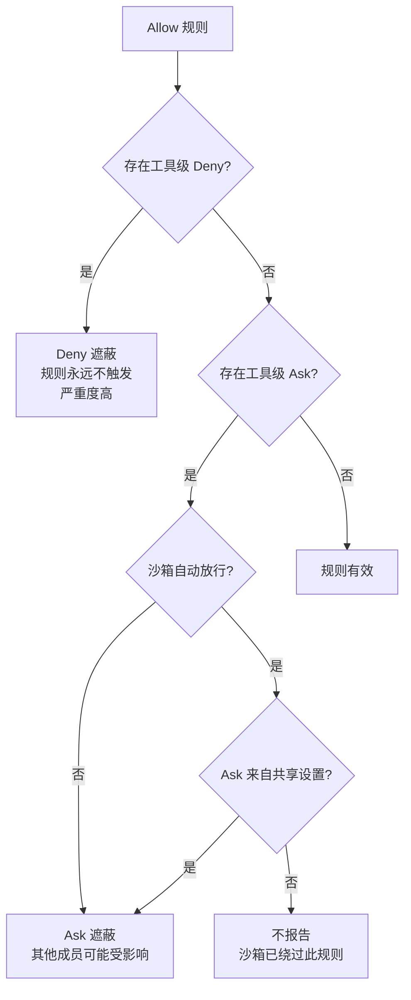

# 第 20 章：权限模型——信任与控制

> 一个自主 Agent 必须有明确的权限边界。Claude Code 的权限模型不是简单的"允许/拒绝"开关，而是一套精心设计的多层决策体系，涵盖了从全局模式到细粒度规则的完整信任光谱。

## 20.1 为什么权限模型是 Agent 的生命线

传统软件的权限模型通常是静态的：安装时授权，运行时放行。但 AI Agent 的行为是不可预测的——你无法预知 Agent 在下一次推理中会选择执行什么命令、编辑什么文件、访问什么网络资源。这种不可预测性使得 Agent 的权限设计面临一个根本矛盾：

- **太严格**：Agent 无法完成有用的工作，用户会被频繁的权限弹窗淹没。
- **太宽松**：Agent 可能执行危险操作，造成不可逆的损害。

Claude Code 的解决方案不是在两者之间做单点选择，而是构建了一个**可编程的信任光谱**——从完全自动到完全手动，中间有无数个可调节的刻度。

## 20.2 六种权限模式：信任的不同层次

Claude Code 定义了六种权限模式（PermissionMode），在源码文件 `types/permissions.ts` 中声明：

```
// 源码路径: types/permissions.ts
EXTERNAL_PERMISSION_MODES = [
  'acceptEdits',
  'bypassPermissions',
  'default',
  'dontAsk',
  'plan',
]
// 内部扩展: 'auto' | 'bubble'
```

在 `utils/permissions/PermissionMode.ts` 中，每种模式都有对应的配置：

```typescript
const PERMISSION_MODE_CONFIG = {
  default:      { title: 'Default',  symbol: '',    color: 'text' },
  plan:         { title: 'Plan Mode', symbol: '⏸',  color: 'planMode' },
  acceptEdits:  { title: 'Accept edits', symbol: '⏵⏵', color: 'autoAccept' },
  bypassPermissions: { title: 'Bypass Permissions', symbol: '⏵⏵', color: 'error' },
  dontAsk:      { title: "Don't Ask", symbol: '⏵⏵', color: 'error' },
  auto:         { title: 'Auto mode', symbol: '⏵⏵', color: 'warning' },
}
```

这些模式代表了从"最少信任"到"最多信任"的渐进光谱：

| 模式 | 行为 | 适用场景 |
|------|------|----------|
| **default** | 每次危险操作都询问用户 | 日常交互，最大安全保障 |
| **plan** | 只读规划，不执行实际修改 | 方案评审、架构设计 |
| **acceptEdits** | 自动允许文件编辑，其他操作仍需确认 | 高频代码修改任务 |
| **dontAsk** | 将所有"询问"转化为"拒绝" | 无头/后台运行，宁可不做也不误做 |
| **auto** | AI 分类器自动判断安全性 | 高信任场景，AI 审查代替人工审查 |
| **bypassPermissions** | 跳过所有权限检查 | 完全受信环境，企业可禁用 |

### 设计精髓：模式的渐进性

注意 `bypassPermissions` 的颜色标记为 `error`——这并非 UI 错误，而是**设计意图的视觉表达**：系统在提醒你，这个模式有风险。同样，`dontAsk` 也标记为 `error`，因为它的行为是"宁可错杀也不放过"——将所有需要询问的操作直接拒绝，适合无人值守的后台 Agent。

`auto` 模式标记为 `warning`，这是最有技术含量的模式。它不是简单地"全部允许"，而是调用一个独立的 AI 分类器来评估每个操作的安全性。我们将在第 21 章详细讨论。

## 20.3 权限规则：细粒度的信任编程

模式是粗粒度的控制。权限规则（PermissionRule）则是细粒度的编程接口，让用户精确描述"哪些操作可以被信任"。

### 20.3.1 规则的三种行为

在 `utils/permissions/PermissionRule.ts` 中，规则有三种行为：

```typescript
// 源码路径: utils/permissions/PermissionRule.ts
permissionBehaviorSchema = z.enum(['allow', 'deny', 'ask'])
```

- **allow**：自动允许匹配的操作
- **deny**：直接拒绝匹配的操作
- **ask**：强制弹出用户确认

### 20.3.2 规则的语法设计

权限规则使用一种简洁的 DSL（领域特定语言），定义在 `utils/permissions/permissionRuleParser.ts` 中：

```
格式: "ToolName" 或 "ToolName(content)"
```

具体示例：

```
Bash                          → 允许/拒绝所有 Bash 命令
Bash(npm install)             → 精确匹配 "npm install" 命令
Bash(npm run:*)               → 前缀匹配：所有以 "npm run" 开头的命令
Bash(git commit -m "*")       → 通配符匹配：git commit 任意提交信息
Edit(src/**)                  → 允许编辑 src 目录下所有文件
mcp__server1                  → 允许整个 MCP 服务器的所有工具
mcp__server1__*               → 同上，通配符形式
WebFetch(domain:github.com)   → 允许访问 github.com 域名
```

这个语法设计有几个架构层面的决策值得关注：

1. **向后兼容的迁移机制**：`normalizeLegacyToolName` 函数将旧工具名映射到新名称（如 `Task` → `Agent`），确保版本升级时旧的权限配置不会失效。这种兼容层设计在权限系统中特别重要——用户不会因为升级而意外失去权限保护。

2. **MCP 工具的层级匹配**：规则支持 `mcp__server__tool` 格式，同时支持服务器级别的通配匹配（`mcp__server1` 匹配该服务器下所有工具）。这意味着用户可以按需选择细粒度或粗粒度的 MCP 权限控制。

### 20.3.3 规则匹配的层级

在 `utils/permissions/permissions.ts` 中，规则匹配按层级执行：



### 20.3.4 权限决策的完整评估树

上面这张决策树浓缩了 `hasPermissionsToUseToolInner` 函数的核心逻辑（`utils/permissions/permissions.ts`，约 160 行）。让我拆解关键设计决策：

**Deny 优先原则**（步骤 1a）：Deny 规则的检查最先执行，且不可被任何后续步骤覆盖。这保证了"绝不执行"的硬约束。

**安全检查不可绕过**（步骤 1g）：即使进入了 `bypassPermissions` 模式，对 `.git/`、`.claude/`、`.vscode/`、shell 配置文件等敏感路径的安全检查仍然必须弹出用户确认。这是一个关键的安全底线——设计者认为，即使在完全信任模式下，修改版本控制配置和编辑器设置也应该是可见的。

**Bypass 在规则之后**（步骤 2a）：`bypassPermissions` 模式的检查在 Deny、Ask、安全检查之后。这意味着即使在 Bypass 模式下，Deny 规则和安全检查仍然生效。这不是一个"忽略所有规则"的开关，而是一个"在安全范围内尽可能自动化"的开关。

## 20.4 规则的来源层次：谁定义信任

权限规则不是来自单一来源。`types/permissions.ts` 定义了 `PermissionRuleSource` 联合类型：

```typescript
type PermissionRuleSource =
  | 'userSettings'     // 用户全局设置
  | 'projectSettings'  // 项目级设置（.claude/settings.json）
  | 'localSettings'    // 本地设置（.claude/settings.local.json）
  | 'flagSettings'     // 功能标记（企业策略）
  | 'policySettings'   // 管理策略（IT 管理员）
  | 'cliArg'           // 命令行参数
  | 'command'          // 运行时命令（如 /permissions）
  | 'session'          // 会话级别（运行时临时）
```

在 `utils/permissions/permissionsLoader.ts` 中，`loadAllPermissionRulesFromDisk` 函数从所有启用的来源加载规则：

```typescript
export function loadAllPermissionRulesFromDisk(): PermissionRule[] {
  // 如果企业策略启用了 allowManagedPermissionRulesOnly，
  // 则只使用 policySettings 中的规则
  if (shouldAllowManagedPermissionRulesOnly()) {
    return getPermissionRulesForSource('policySettings')
  }
  // 否则从所有启用的来源加载
  for (const source of getEnabledSettingSources()) {
    rules.push(...getPermissionRulesForSource(source))
  }
  return rules
}
```

这个设计体现了一个重要的企业安全考量：`allowManagedPermissionRulesOnly`。当企业的 IT 管理员启用这个选项后，用户的个人规则全部失效，只保留管理员定义的规则。这是"集中管控"与"个人自由"之间的安全阀。

### 来源的优先级设计

规则来源的加载顺序是有意义的。从 `permissions.ts` 中的 `PERMISSION_RULE_SOURCES` 常量可以看到：

```typescript
const PERMISSION_RULE_SOURCES = [
  ...SETTING_SOURCES,  // userSettings → projectSettings → localSettings → flagSettings → policySettings
  'cliArg',
  'command',
  'session',
]
```

Deny 规则在所有来源中都是**并集**生效——任何一个来源的 Deny 都会导致拒绝。而 Allow 规则则按来源逐个检查。这种"Deny 取并集、Allow 按序检查"的策略，确保了安全策略的叠加效应：限制只会越来越严格，不会因为某个宽松的来源而失效。

## 20.5 规则遮蔽检测：发现无效的配置

权限规则来自多个来源、多个层级，用户可能无意中配置出相互矛盾的规则。Claude Code 设计了一个**规则遮蔽检测**机制（`utils/permissions/shadowedRuleDetection.ts`）来自动发现这些问题。

### 什么是规则遮蔽？

当一个 Allow 规则永远不会被触发，因为另一个更高优先级的规则已经做出了决策，就发生了"遮蔽"。具体有两种情况：

1. **Deny 遮蔽**：存在工具级 Deny 规则（如 `Bash`），同时存在具体的 Allow 规则（如 `Bash(ls:*)`）。由于 Deny 在步骤 1a 最先检查，Allow 规则永远不会被触发。
2. **Ask 遮蔽**：存在工具级 Ask 规则（如 `Bash`），同时存在具体的 Allow 规则（如 `Bash(npm run test)`）。Ask 规则会在 Allow 检查之前弹出用户确认，Allow 规则形同虚设。

### 沙箱的特殊例外

设计者在这里做了一个精巧的区分：当沙箱的 `autoAllowBashIfSandboxed` 启用时，来自**个人设置**（`userSettings`、`localSettings` 等）的 Ask 规则不会触发遮蔽警告——因为沙箱内的 Bash 命令会自动放行，Ask 规则实际上被沙箱绕过了。但来自**共享设置**（`projectSettings`、`policySettings`）的 Ask 规则仍然会触发警告——因为其他团队成员可能没有启用沙箱。

这个设计体现了"检测的上下文感知"——静态分析工具需要理解运行时的实际行为，否则会产生大量无意义的误报。



## 20.6 Shell 命令的精细匹配

Shell 命令是权限管理中最复杂的场景。`utils/permissions/shellRuleMatching.ts` 实现了三种匹配模式：

```typescript
type ShellPermissionRule =
  | { type: 'exact'; command: string }     // 精确匹配
  | { type: 'prefix'; prefix: string }     // 前缀匹配（旧语法 cmd:*）
  | { type: 'wildcard'; pattern: string }  // 通配符匹配
```

### 精确匹配

`Bash(npm install)` 只匹配字面命令 `npm install`。

### 前缀匹配（兼容语法）

`Bash(npm run:*)` 匹配所有以 `npm run` 开头的命令。这里的 `:*` 是旧语法的兼容标记，等价于前缀 `npm run `。

### 通配符匹配

`Bash(git commit -m "*")` 使用完整的通配符模式。`matchWildcardPattern` 函数将模式编译为正则表达式，处理了转义字符、跨行匹配等边界情况。

一个精巧的细节是**尾部空格通配符的语义优化**：

```typescript
// 当模式以 " *" 结尾且只有一个通配符时，
// 使尾部空格和参数变为可选
// 这样 'git *' 既能匹配 'git add' 也能匹配裸 'git'
if (regexPattern.endsWith(' .*') && unescapedStarCount === 1) {
  regexPattern = regexPattern.slice(0, -3) + '( .*)?'
}
```

这种优化让 `git *` 同时匹配 `git` 和 `git add` 等子命令，与直觉一致。

## 20.7 危险权限的自动检测

`utils/permissions/permissionSetup.ts` 包含了一组"危险权限检测"函数，这是权限模型中最体现安全设计思想的部分。

### 为什么 `Bash(python:*)` 是危险的？

```typescript
// 源码路径: utils/permissions/permissionSetup.ts
function isDangerousBashPermission(toolName, ruleContent): boolean {
  // Bash(*) → 允许所有命令 → 危险
  // Bash(python:*) → 允许执行任意 Python 代码 → 危险
  // Bash(node:*) → 允许执行任意 Node.js 代码 → 危险
  for (const pattern of DANGEROUS_BASH_PATTERNS) {
    if (content === `${lowerPattern}:*`) return true
    if (content === `${lowerPattern}*`) return true
    if (content === `${lowerPattern} *`) return true
  }
}
```

设计者的洞察是：脚本解释器和代码执行入口点的 Allow 规则本质上等同于完全放行。`dangerousPatterns.ts` 中的 `DANGEROUS_BASH_PATTERNS` 列表不是随意列出的，而是经过精心分类的**跨平台代码执行入口点**：

- **解释器**：`python`、`python3`、`node`、`deno`、`ruby`、`perl`、`php`、`lua` 等——它们都可以通过 `-c` 参数执行任意代码。
- **包运行器**：`npx`、`bunx`、`npm run` 等——它们可以执行 `package.json` 中定义的任意脚本，或从远程下载并运行包。
- **Shell 本身**：`bash`、`sh`、`zsh`、`fish`——直接允许任意 Shell 命令。
- **命令执行器**：`eval`、`exec`、`xargs`、`sudo`——它们可以将字符串作为命令执行。

注意这个列表是**跨平台共享的**（`CROSS_PLATFORM_CODE_EXEC`），Bash 和 PowerShell 危险模式检测共用同一份基础列表，只是各自额外添加了平台特有的危险命令。这种"共享基础 + 平台扩展"的设计避免了两个列表在维护中产生不一致。

在 `auto` 模式下，这些危险权限会被自动剥离（`stripDangerousPermissionsForAutoMode`），防止它们绕过 AI 分类器的安全评估。当退出 `auto` 模式时，这些权限会被恢复（`restoreDangerousPermissions`）。

## 20.8 权限模式的运行时切换

权限模式不是静态配置，而是可以在运行时动态切换的。`transitionPermissionMode` 函数处理了所有状态转换的副作用：

```mermaid
stateDiagram-v2
    [*] --> default: 启动
    default --> plan: 进入规划模式
    plan --> default: 退出规划模式
    default --> acceptEdits: 接受编辑
    acceptEdits --> default: 回退
    default --> auto: 启用自动模式
    auto --> default: 关闭自动模式
    default --> bypassPermissions: 跳过权限
    bypassPermissions --> default: 回退
    plan --> auto: 规划+自动
    auto --> plan: 自动+规划

    state plan {
        [*] --> 规划只读
    }

    state auto {
        [*] --> 剥离危险权限
        剥离危险权限 --> AI分类器判断
    }
```

`prepareContextForPlanMode` 函数特别有趣——它保存了进入 Plan 模式之前的状态（`prePlanMode`），这样退出时可以精确恢复到之前的模式。如果用户从 `auto` 模式进入 `plan`，则 auto 语义会保持活跃（前提是用户已选择启用规划中的自动模式）。

## 20.9 能学到什么

Claude Code 的权限模型提供了几个可借鉴的架构教训：

**第一，安全不是二元的。** 传统的"允许/拒绝"模型对 AI Agent 来说太粗糙。Claude Code 的六种模式 + 三种规则行为，组合出一个丰富的信任光谱，让用户在不同场景下选择合适的信任级别。

**第二，Deny 必须优先。** 在任何权限评估管线中，Deny 规则应该是最先检查、不可覆盖的。这个原则在 Claude Code 中被严格遵守——无论是 Bypass 模式还是 Auto 模式，Deny 规则始终生效。

**第三，安全检查应该独立于模式。** `.git/` 配置文件的修改检查，即使在 Bypass 模式下也必须弹出确认。某些安全边界不应该被任何全局开关绕过。

**第四，危险权限的自动检测是必要的。** 当用户配置了 `Bash(python:*)` 这样的规则时，系统应该识别出这等同于完全放行，并在 Auto 模式下自动剥离。安全系统不能假设用户理解每条规则的隐含风险。

**第五，规则来源的层次化设计支持企业场景。** 个人设置、项目设置、企业策略分层管理，`allowManagedPermissionRulesOnly` 提供了集中管控的安全阀。这种设计让同一个 Agent 框架既能服务个人开发者，也能满足企业的安全合规需求。
