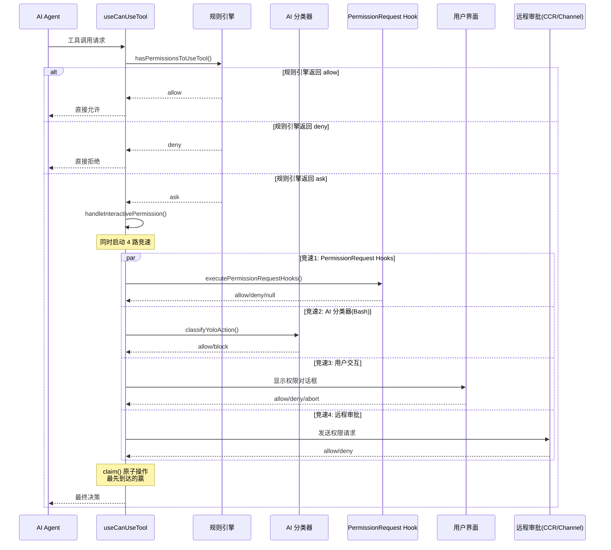
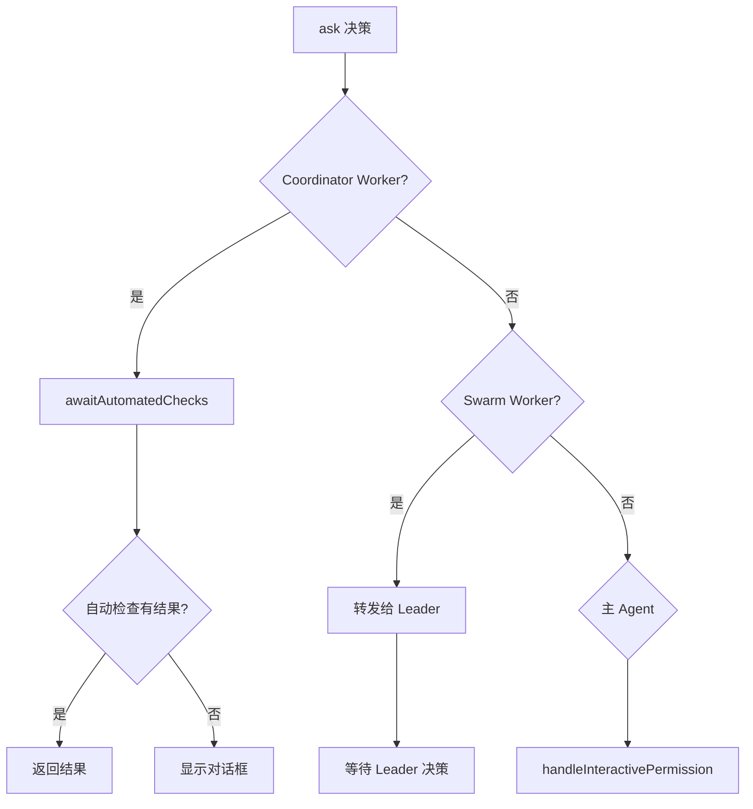
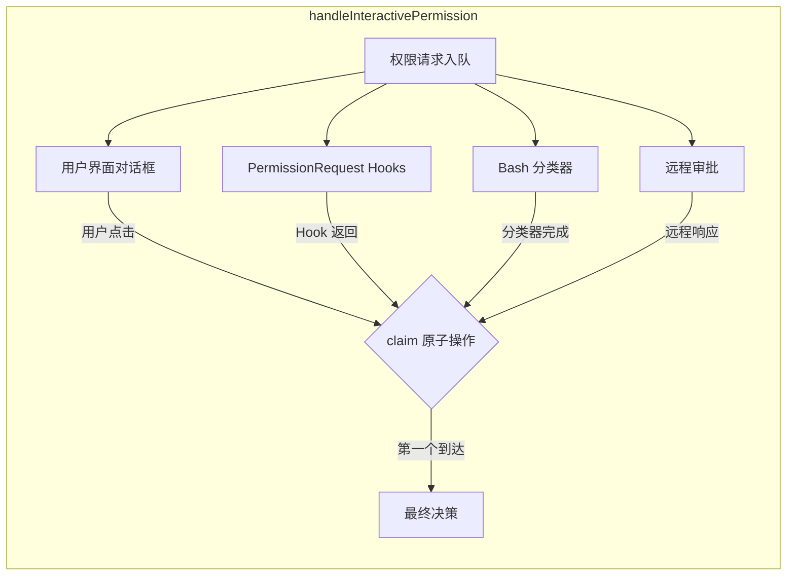
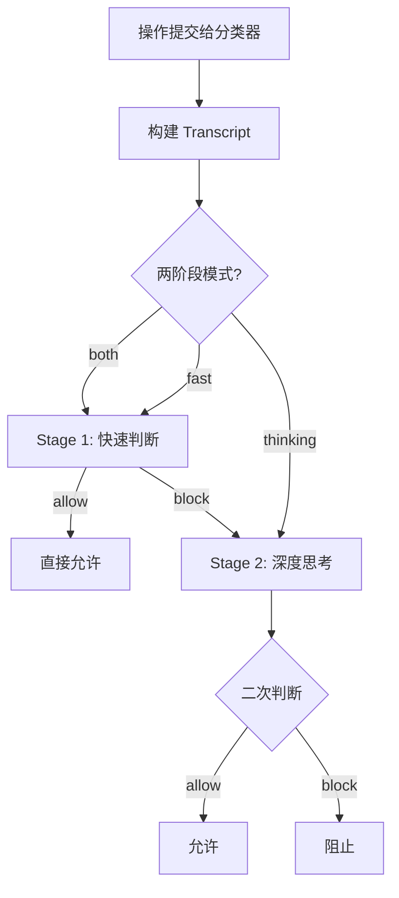

# 第 21 章：权限的运行时执行

> 权限不只是配置，更需要在运行时逐次执行。Claude Code 的权限运行时管线是一个精心编排的多参与者竞赛——规则引擎、AI 分类器、用户交互、Hook 钩子、远程审批同时运行，最快给出决定的一方胜出。

## 21.1 从规则到执行：权限管线的全貌

第 20 章我们讨论了权限的"是什么"——六种模式、三种行为、多层规则来源。本章聚焦"怎么做"：当一个工具调用发生时，权限系统如何从静态规则走向动态决策。

整个权限执行涉及三个核心文件：

- **`utils/permissions/permissions.ts`**：规则评估引擎（`hasPermissionsToUseTool` / `hasPermissionsToUseToolInner`），输出原始的 allow/deny/ask 决策。
- **`hooks/useCanUseTool.tsx`**：运行时编排器（`useCanUseTool` hook），将规则决策与用户交互、Hook 钩子、分类器等竞速组合。
- **`hooks/toolPermission/handlers/interactiveHandler.ts`**：交互处理器（`handleInteractivePermission`），管理权限对话框的生命周期和多路竞速。

它们之间的关系可以用一个时序图来描述：



## 21.2 第一阶段：规则引擎的静态评估

一切始于 `hasPermissionsToUseTool` 函数。这是一个 async 函数，内部调用 `hasPermissionsToUseToolInner` 完成静态规则评估，然后对结果进行后处理。

### 21.2.1 静态评估的七步检查

`hasPermissionsToUseToolInner` 按照严格的顺序执行七步检查：

```
步骤 1a: Deny 规则检查 — 有任何 Deny 规则匹配？
步骤 1b: Ask 规则检查 — 有任何 Ask 规则匹配？
步骤 1c: 工具自身检查 — 工具的 checkPermissions() 怎么说？
步骤 1d: 工具拒绝 — checkPermissions 返回 deny？
步骤 1e: 需要用户交互 — 工具标记 requiresUserInteraction？
步骤 1f: 内容级 Ask 规则 — checkPermissions 中发现 Ask 规则？
步骤 1g: 安全检查 — 涉及 .git/、.claude/ 等敏感路径？
步骤 2a: 模式检查 — bypassPermissions 模式？
步骤 2b: Allow 规则检查 — 有任何 Allow 规则匹配？
步骤 3:  默认转 Ask — 以上都不满足，转为"询问用户"
```

这个顺序不是任意的。让我解释几个关键设计：

**步骤 1a（Deny 优先）**：Deny 永远最先检查，且一旦匹配就立即返回。没有任何后续步骤可以覆盖 Deny。这是安全系统中最基本的"默认拒绝"原则。

**步骤 1c（工具自身检查）**：每个工具可以实现自己的 `checkPermissions` 方法。例如，Bash 工具会解析命令中的子命令，对每个子命令分别做权限检查。这意味着 `hasPermissionsToUseToolInner` 的检查不是单层的——一个工具调用可能触发多轮递归检查。

**步骤 1g（安全检查不可绕过）**：即使后续的步骤 2a 处于 `bypassPermissions` 模式，涉及 `.git/`、`.claude/`、shell 配置文件等敏感路径的操作仍然会返回 `ask`。代码注释明确写道：

```typescript
// 1g. Safety checks are bypass-immune — they must prompt
// even when a PreToolUse hook returned allow.
```

**步骤 2a 与 2b 的顺序**：`bypassPermissions` 模式的检查在 Allow 规则之前。这意味着 Bypass 模式不需要遍历所有 Allow 规则就能快速放行。但注意——所有 Deny、Ask 和安全检查已经在此之前完成了，所以 Bypass 放行的操作一定是安全的。

### 21.2.2 后处理：模式转换

`hasPermissionsToUseTool` 在 `hasPermissionsToUseToolInner` 返回后，还有一层重要的后处理逻辑：

```typescript
// dontAsk 模式：将 ask 转为 deny
if (mode === 'dontAsk' && result.behavior === 'ask') {
  return { behavior: 'deny', ... }
}

// auto 模式：将 ask 交给 AI 分类器
if (mode === 'auto' && result.behavior === 'ask') {
  // 先尝试 acceptEdits 快速路径
  // 再尝试安全工具白名单
  // 最后调用 AI 分类器
}
```

这三层后处理形成了一个**漏斗模型**：

1. **快速路径**：如果操作在 `acceptEdits` 模式下会被允许（比如在工作目录内的文件编辑），直接放行，不调用分类器。这避免了昂贵的 API 调用。
2. **白名单路径**：只读工具（如 `Read`、`Grep`、`Glob`）在一个安全白名单中（`SAFE_YOLO_ALLOWLISTED_TOOLS`），直接放行。
3. **分类器路径**：只有无法被前两层快速处理的操作，才会调用 AI 分类器。

### 21.2.3 拒绝追踪与限流

Auto 模式中一个容易被忽视但至关重要的机制是**拒绝追踪**（`utils/permissions/denialTracking.ts`）：

```typescript
const DENIAL_LIMITS = {
  maxConsecutive: 3,   // 连续拒绝上限
  maxTotal: 20,        // 总拒绝上限
}
```

当 AI 分类器连续拒绝了 3 次操作，或者一个会话中总共拒绝了 20 次操作，系统会**回退到用户交互模式**——强制弹出权限对话框，让人类审查发生了什么。

这是一个优雅的安全阀。设计者的洞察是：如果分类器持续拒绝操作，很可能意味着 Agent 的意图与安全策略存在系统性冲突，此时不应该让 Agent 无休止地重试，而应该引入人类判断。

在无头模式（`shouldAvoidPermissionPrompts`）下，达到拒绝上限会直接抛出 `AbortError`，终止整个 Agent——因为后台 Agent 无法弹出对话框，宁可终止也不能无限重试。

## 21.3 第二阶段：运行时编排

`hasPermissionsToUseTool` 返回的决策是"原始决策"——它只知道 allow/deny/ask，不知道如何与用户交互。`useCanUseTool` hook（`hooks/useCanUseTool.tsx`）承担了运行时编排的角色。

### 21.3.1 三种 Agent 类型的分支处理

`useCanUseTool` 根据当前 Agent 的类型选择不同的处理路径：



- **Coordinator Worker**：先等待自动检查（分类器、Hook）完成，只有自动检查无法决策时才显示对话框。设计意图：后台工作器应该尽量减少对用户的打扰。
- **Swarm Worker**：将权限请求转发给 Swarm Leader 处理。子 Agent 不直接与用户交互。
- **主 Agent**：直接进入交互模式，启动多路竞速。

### 21.3.2 投机性分类器检查

对于 Bash 命令，`useCanUseTool` 在显示对话框之前，会启动一个 2 秒的"投机性分类器检查"：

```typescript
// 源码路径: hooks/useCanUseTool.tsx (编译后)
const speculativePromise = peekSpeculativeClassifierCheck(command)
if (speculativePromise) {
  const raceResult = await Promise.race([
    speculativePromise.then(r => ({ type: 'result', result: r })),
    new Promise(res => setTimeout(res, 2000, { type: 'timeout' })),
  ])
  if (raceResult.type === 'result' && result.matches && confidence === 'high') {
    // 分类器在高置信度下自动批准，跳过对话框
    resolve(buildAllow(...))
    return
  }
}
```

这段代码启动了一个与 2 秒超时的竞赛。如果分类器在 2 秒内返回了高置信度的"安全"判断，就直接允许操作，不显示对话框。这利用了一个事实：大多数安全的 Bash 命令（如 `ls`、`git status`）可以在短时间内被分类器识别。

## 21.4 第三阶段：多路竞速的交互处理

`handleInteractivePermission`（`hooks/toolPermission/handlers/interactiveHandler.ts`）是权限运行时最复杂的组件。它不返回 Promise，而是设置回调，让多个异步参与者竞争决策权。

### 21.4.1 四路竞速架构



核心机制是 `createResolveOnce` 创建的 **claim 原子操作**：

```typescript
function createResolveOnce<T>(resolve: (value: T) => void): ResolveOnce<T> {
  let claimed = false
  return {
    claim() {
      if (claimed) return false
      claimed = true
      return true
    },
    resolve(value) {
      if (claimed) return
      claimed = true
      resolve(value)
    },
  }
}
```

每个参与者完成时都调用 `claim()`。只有第一个调用者会返回 `true`，后续调用者全部返回 `false`。这保证了无论多少个异步参与者同时完成，最终决策只会被采纳一次。

### 21.4.2 用户交互的优雅期

```typescript
const GRACE_PERIOD_MS = 200
onUserInteraction() {
  if (Date.now() - permissionPromptStartTimeMs < GRACE_PERIOD_MS) {
    return  // 忽略过早的交互
  }
  userInteracted = true
  clearClassifierChecking(toolUseID)
}
```

当用户开始与权限对话框交互（按键、Tab 切换）时，系统会取消正在运行的分类器检查。但有一个 200ms 的优雅期——如果用户在对话框出现后的 200ms 内按键（可能是之前操作的惯性），这些按键会被忽略。这防止了用户意外取消分类器的自动批准。

### 21.4.3 分类器批准的视觉反馈

当分类器在用户看到对话框之后自动批准了操作，系统不会立即移除对话框，而是显示一个短暂的"勾号"过渡：

```typescript
// 终端聚焦时显示 3 秒，不聚焦时显示 1 秒
const checkmarkMs = getTerminalFocused() ? 3000 : 1000
checkmarkTransitionTimer = setTimeout(() => {
  ctx.removeFromQueue()
}, checkmarkMs)
```

这个设计考虑了用户的心理模型：如果对话框突然消失而没有视觉反馈，用户可能会困惑。短暂的勾号告诉用户"系统自动批准了这个操作"。

### 21.4.4 远程审批的双通道

`handleInteractivePermission` 支持两种远程审批机制：

1. **Bridge（CCR）**：通过 `bridgeCallbacks` 将权限请求发送到 claude.ai 网页端。用户可以在网页上点击"允许"或"拒绝"，响应通过回调传回 CLI。
2. **Channel**：通过 MCP 服务器的 `channel_permission_request` 通知，将请求发送到 Telegram、iMessage 等渠道。用户回复"yes abc123"即可批准。

两种远程审批与本地交互、Hook、分类器一起参与 `claim()` 竞速。无论用户在哪个端点响应，最先到达的决策生效。

## 21.5 权限的动态更新

权限不是一成不变的。用户可以在 Agent 运行过程中添加、删除规则，甚至切换模式。

### 21.5.1 权限更新的持久化

`utils/permissions/PermissionUpdate.ts` 定义了六种更新操作：

```typescript
type PermissionUpdate =
  | { type: 'addRules', destination, rules, behavior }
  | { type: 'replaceRules', destination, rules, behavior }
  | { type: 'removeRules', destination, rules, behavior }
  | { type: 'setMode', destination, mode }
  | { type: 'addDirectories', destination, directories }
  | { type: 'removeDirectories', destination, directories }
```

每个更新操作同时修改两个地方：**内存中的 `ToolPermissionContext`**（立即生效）和**磁盘上的设置文件**（持久化）。`persistPermissionUpdates` 函数负责磁盘写入，`applyPermissionUpdates` 负责内存更新。

### 21.5.2 权限建议（Suggestions）

当规则引擎返回 `ask` 时，它可以附带 `suggestions`——一组建议的权限规则更新。这些是系统根据当前操作推断出的"最小授权"建议。

例如，如果用户手动允许了 `npm run test`，系统会建议添加 `Bash(npm run test)` 到 Allow 规则中。用户可以选择"仅本次允许"或"永久允许"。永久允许时，规则被写入设置文件，后续相同的操作将自动放行。

这个机制让权限系统具有**渐进式授权**的特性：用户不需要预先配置所有规则，而是在实际使用中逐步授权。系统的建议降低了用户的配置负担。

### 21.5.3 设置变更的实时响应

`settingsChangeDetector` 监听设置文件的变化，当检测到变更时：

```typescript
settingsSubscriptionCleanup = settingsChangeDetector.subscribe(() => {
  const newConfig = convertToSandboxRuntimeConfig(settings)
  BaseSandboxManager.updateConfig(newConfig)
})
```

这让权限规则和沙箱配置都能在运行时动态更新。管理员可以在不重启 Agent 的情况下，通过修改企业策略文件来收紧或放宽权限。

## 21.6 AI 分类器的内部架构

Auto 模式的核心是 `classifyYoloAction` 函数（`utils/permissions/yoloClassifier.ts`），它使用一个独立的 AI 模型来评估操作的安全性。

### 21.6.1 两阶段分类

分类器支持三种运行模式：

- **both**（默认）：先执行快速阶段（Stage 1），如果结果是"允许"则直接返回；如果结果是"阻止"，则进入思考阶段（Stage 2）进行二次确认。
- **fast**：只执行快速阶段。
- **thinking**：只执行思考阶段。



两阶段设计的目的：Stage 1 快速判断（`max_tokens=64`，带 `stop_sequences`）减少延迟；Stage 2 使用更大的 token 预算进行深度推理，减少误判。大多数安全的操作在 Stage 1 就能被识别，只有被标记为"可能有风险"的操作才需要 Stage 2 的二次确认。

### 21.6.2 Transcript 的构建

分类器看到的不是原始消息，而是一个精简的 **Transcript**——只包含用户文本和助手的工具调用（不包含助手的文本回复）：

```typescript
// 源码路径: utils/permissions/yoloClassifier.ts
export function buildTranscriptEntries(messages: Message[]): TranscriptEntry[] {
  // 只保留用户文本和助手的 tool_use 块
  // 助手的文本回复被排除——因为它是模型自己生成的，
  // 可能被恶意利用来影响分类器决策
}
```

每个工具调用通过 `toAutoClassifierInput` 方法序列化。工具可以控制暴露给分类器的信息粒度——这既保护了用户隐私，也防止了通过精心构造的工具输出来操纵分类器。

### 21.6.3 分类器的故障安全设计

分类器是一个远程 API 调用，可能失败。设计者的选择是 **fail-closed**（失败时偏向安全）：

```typescript
// 分类器不可用 → 默认阻止
// 但受 tengu_iron_gate_closed 功能标记控制
if (classifierResult.unavailable) {
  if (ironGateClosed) {
    return { behavior: 'deny', ... }  // 严格模式：拒绝
  }
  return result  // 宽松模式：回退到正常权限处理
}
```

**Transcript 过长**的处理尤其值得注意。如果对话历史超过了分类器的上下文窗口，系统会检测到 `prompt is too long` 错误，这是确定性的（相同的对话必然产生相同的错误）。此时不会重试，而是直接回退到用户交互模式。

## 21.7 能学到什么

Claude Code 的权限运行时提供了几个架构教训：

**第一，权限检查应该是无副作用的管线。** `hasPermissionsToUseToolInner` 是一个纯函数式的评估管线——它不做任何 I/O，不修改任何状态，只根据规则和输入返回一个决策。副作用（用户交互、Hook 执行、远程审批）全部在后续阶段处理。这种分离使得规则评估可以独立测试和优化。

**第二，多路竞速是处理延迟敏感权限请求的有效模式。** 用户不会为了等待 AI 分类器而多等几秒。将分类器、Hook、用户交互、远程审批放在一个竞速框架中，让最快的决策者胜出，既保证了安全性，又不会不必要地增加延迟。

**第三，无头 Agent 需要专门的降级路径。** 后台运行的 Agent（CI/CD、自动化脚本）无法弹出对话框。Claude Code 为此设计了多层降级：先尝试 PermissionRequest Hook（Hook 可以自动决策），Hook 无结果时自动拒绝（`AUTO_REJECT_MESSAGE`），拒绝达到上限时直接终止 Agent。这种设计让同一个权限框架同时服务于交互式和非交互式场景。

**第四，优雅期和视觉反馈是良好用户体验的关键。** 200ms 的交互优雅期防止误操作；分类器自动批准后的勾号过渡提供视觉反馈；拒绝限流后的用户回退避免了无头 Agent 的无限重试。这些细节让权限系统从"能用"变成"好用"。

**第五，故障安全比零故障更重要。** 分类器会失败，网络会断开，API 会超时。设计者没有追求零故障，而是为每种故障模式定义了明确的回退行为：fail-closed 保护安全，transcript 过长则回退到人工审查。一个健壮的权限系统不是不失败的系统，而是失败时仍然安全的系统。
