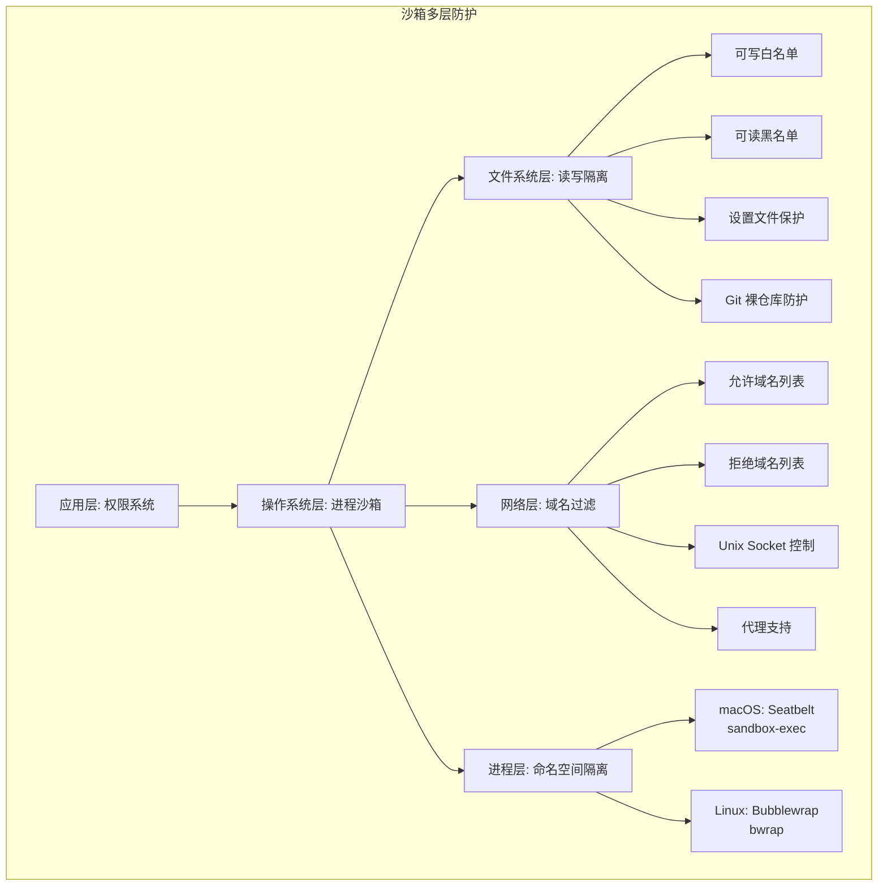

# 第 22 章：沙箱——Agent 的活动围栏

> 权限决定"能不能做"，沙箱决定"做了之后的范围"。如果权限系统是门卫，沙箱就是围墙——即使门卫误判放行了一个危险操作，围墙也能将损害限制在可控范围内。

## 22.1 为什么权限还不够

第 20 章和第 21 章讨论的权限系统解决了一个问题：Agent 能不能调用某个工具。但它们没有解决另一个问题：如果 Agent 获准执行了 `Bash(rm -rf /tmp/test)`，谁能保证它不会偷偷执行 `rm -rf /home`？

权限系统是**声明式**的——它基于规则和模式匹配做决策。但实际执行的结果取决于运行时环境。沙箱（Sandbox）提供了**强制式**的控制——无论 Agent 的意图如何，操作系统级别的隔离确保它无法超出允许的范围。

这两者的关系可以用一个简单的类比来理解：

| | 权限系统 | 沙箱系统 |
|---|---------|---------|
| **角色** | 门卫 | 围墙 |
| **检查时机** | 执行前 | 执行中 |
| **实现层级** | 应用层 | 操作系统层 |
| **可绕过性** | 理论上可被应用层 bug 绕过 | 需要 OS 级漏洞才能逃逸 |
| **粒度** | 工具/命令级 | 文件系统/网络级 |

## 22.2 沙箱的多层防护架构

Claude Code 的沙箱不是单一机制，而是多层防护的组合，定义在 `utils/sandbox/sandbox-adapter.ts` 中。



## 22.3 沙箱配置：从权限规则到运行时配置

`convertToSandboxRuntimeConfig` 函数是将应用层的权限规则转换为操作系统层沙箱配置的桥梁。

### 22.3.1 文件系统隔离

```typescript
// 源码路径: utils/sandbox/sandbox-adapter.ts
const allowWrite: string[] = ['.', getClaudeTempDir()]
const denyWrite: string[] = []
const denyRead: string[] = []
```

默认策略是**最小可写集**：

- **当前工作目录（`.`）**：Agent 需要在这里读写文件才能工作。
- **Claude 临时目录**：Shell 进程需要在这里写入工作目录跟踪文件。

其他所有目录默认只读或不可访问。

### 22.3.2 设置文件的强制保护

即使 Agent 获得了文件写入权限，沙箱仍然会阻止它修改关键配置文件：

```typescript
// 源码路径: utils/sandbox/sandbox-adapter.ts
// 安全关键: 无论权限规则如何设置，
// 始终阻止写入设置文件以防止沙箱逃逸
const settingsPaths = SETTING_SOURCES.map(source =>
  getSettingsFilePathForSource(source)
).filter(...)
denyWrite.push(...settingsPaths)
denyWrite.push(getManagedSettingsDropInDir())
```

被保护的文件包括：
- `.claude/settings.json`（项目级设置）
- `.claude/settings.local.json`（本地设置）
- 用户级设置文件
- 管理策略设置目录

设计者的洞察是：如果 Agent 可以修改权限设置文件，它就能给自己添加 Allow 规则，从而**绕过所有权限检查**。这是沙箱必须阻止的"权限提升"攻击路径。

### 22.3.3 Skills 目录的保护

```typescript
// 阻止写入 .claude/skills 目录
// Skills 具有与 commands 和 agents 相同的权限级别
// （自动发现、自动加载、完整 Claude 能力）
// 因此它们需要相同的 OS 级沙箱保护
denyWrite.push(resolve(originalCwd, '.claude', 'skills'))
```

Skills 是 Claude Code 中的一种可扩展机制——它们被自动发现和加载，拥有完整的 Claude 能力。如果 Agent 可以写入 Skills 目录，它就能在下次会话中注入恶意的 Skill。沙箱通过阻止写入来防止这种持久化攻击。

### 22.3.4 Git 裸仓库攻击的防护

这是一个极其精巧的安全设计。源码中的注释解释了威胁模型：

```typescript
// 安全关键: Git 的 is_git_directory() 将 cwd 视为裸仓库
// 如果它包含 HEAD + objects/ + refs/。攻击者植入这些文件
// （加上一个包含 core.fsmonitor 的 config），
// 当 Claude 的非沙箱 git 运行时会逃逸沙箱。
```

攻击路径是这样的：

1. Agent 在沙箱内执行命令，在当前目录创建 `HEAD`、`objects/`、`refs/`、`config` 文件。
2. 这些文件让 Git 认为当前目录是一个裸仓库。
3. `config` 文件中包含 `core.fsmonitor = /malicious/command`。
4. 当 Claude Code 在沙箱外运行 `git` 命令时（某些 git 操作不在沙箱内执行），Git 会自动执行 `core.fsmonitor` 指向的恶意命令。

沙箱的防护策略是**两层防御**：

- **已存在的文件**：加入 `denyWrite` 列表，沙箱会以只读方式挂载，阻止修改。
- **不存在的文件路径**：记录到 `bareGitRepoScrubPaths`，在每次沙箱命令执行后检查并删除任何新出现的文件。

```typescript
function scrubBareGitRepoFiles(): void {
  for (const p of bareGitRepoScrubPaths) {
    try {
      rmSync(p, { recursive: true })
    } catch {
      // ENOENT 是预期的常见情况——没有被植入
    }
  }
}
```

`cleanupAfterCommand` 在每次沙箱命令执行后被调用，执行清理：

```typescript
cleanupAfterCommand: (): void => {
  BaseSandboxManager.cleanupAfterCommand()
  scrubBareGitRepoFiles()  // 清理可能被植入的文件
}
```

### 22.3.5 Git Worktree 的特殊处理

```typescript
// 如果检测到 Git Worktree，主仓库路径在初始化时缓存。
// Worktree 中的 Git 操作需要写入主仓库的 .git 目录
// （如 index.lock 等）
if (worktreeMainRepoPath && worktreeMainRepoPath !== cwd) {
  allowWrite.push(worktreeMainRepoPath)
}
```

Git Worktree 是一个需要额外权限的特殊场景。在 Worktree 中，`.git` 是一个指向主仓库的文件，而不是目录。Git 操作（如 `git add`）需要写入主仓库的 `.git` 目录中的 `index.lock` 等文件。沙箱需要将主仓库路径加入可写白名单，否则 Git 操作会失败。

`detectWorktreeMainRepoPath` 在初始化时被调用一次，结果被缓存整个会话：

```typescript
// 解析 .git 文件中的 gitdir 路径
// 格式: gitdir: /path/to/main/repo/.git/worktrees/worktree-name
const gitdirMatch = gitContent.match(/^gitdir:\s*(.+)$/m)
```

## 22.4 网络隔离

网络隔离是沙箱的另一层关键防护，配置在 `SandboxRuntimeConfig.network` 中：

```typescript
network: {
  allowedDomains,        // 允许访问的域名
  deniedDomains,         // 拒绝访问的域名
  allowUnixSockets,      // 允许的 Unix Socket
  allowAllUnixSockets,   // 允许所有 Unix Socket
  allowLocalBinding,     // 允许本地端口绑定
  httpProxyPort,         // HTTP 代理端口
  socksProxyPort,        // SOCKS 代理端口
}
```

### 22.4.1 域名策略的来源

允许和拒绝的域名来自两个来源：

1. **权限规则中的 WebFetch 规则**：`WebFetch(domain:github.com)` 类型的规则会被提取并转换为沙箱的域名策略。
2. **sandbox.network 配置**：直接在设置中配置的 `sandbox.network.allowedDomains`。

```typescript
// 从 WebFetch 权限规则提取域名
for (const ruleString of permissions.allow || []) {
  const rule = permissionRuleValueFromString(ruleString)
  if (rule.toolName === WEB_FETCH_TOOL_NAME &&
      rule.ruleContent?.startsWith('domain:')) {
    allowedDomains.push(rule.ruleContent.substring('domain:'.length))
  }
}
```

### 22.4.2 企业域名管控

`shouldAllowManagedSandboxDomainsOnly` 函数检查企业策略是否启用了"仅管理域名"模式：

```typescript
export function shouldAllowManagedSandboxDomainsOnly(): boolean {
  return getSettingsForSource('policySettings')
    ?.sandbox?.network?.allowManagedDomainsOnly === true
}
```

启用后，只有 `policySettings` 中配置的域名被允许，用户在个人设置中添加的域名全部被忽略。这是企业 IT 管理员限制 Agent 网络访问范围的关键控制点。

### 22.4.3 网络请求的交互式审批

`SandboxAskCallback` 是一个回调函数，当沙箱拦截到一个未在允许/拒绝列表中的网络请求时被调用：

```typescript
type SandboxAskCallback = (hostPattern: NetworkHostPattern) => Promise<boolean>
```

在 REPL 模式下，这会弹出用户提示，询问是否允许该网络请求。在无头模式下，如果企业策略启用了 `allowManagedDomainsOnly`，所有未在策略中的请求会被直接拒绝：

```typescript
const wrappedCallback: SandboxAskCallback | undefined = sandboxAskCallback
  ? async (hostPattern) => {
      if (shouldAllowManagedSandboxDomainsOnly()) {
        return false  // 严格模式：拒绝所有未在策略中的请求
      }
      return sandboxAskCallback(hostPattern)
    }
  : undefined
```

## 22.5 跨平台实现

Claude Code 的沙箱在不同操作系统上使用不同的底层实现。

### 22.5.1 macOS：Seatbelt（sandbox-exec）

macOS 使用 Apple 的 Seatbelt 框架（通过 `sandbox-exec` 命令），它基于 Scheme-like 的配置语言定义允许和拒绝的操作。

`BaseSandboxManager.checkDependencies` 在 macOS 上检查 `sandbox-exec` 和 `socat` 是否可用。Seatbelt 是 macOS 内置的，但 `socat` 需要通过 Homebrew 安装（用于网络代理）。

### 22.5.2 Linux：Bubblewrap（bwrap）

Linux 使用 Bubblewrap（`bwrap`），这是一个轻量级的沙箱工具，通过 Linux 命名空间（namespace）实现隔离。

```typescript
const checkDependencies = memoize((): SandboxDependencyCheck => {
  return BaseSandboxManager.checkDependencies({
    command: rgPath,
    args: rgArgs,
  })
})
```

依赖检查被 `memoize` 缓存，避免每次沙箱操作都重新检查。

### 22.5.3 平台限制的优雅处理

Linux/WSL 上的 Bubblewrap 不完全支持 glob 模式。`getLinuxGlobPatternWarnings` 函数检测到使用了 glob 模式的权限规则时，会返回警告：

```typescript
function getLinuxGlobPatternWarnings(): string[] {
  const platform = getPlatform()
  if (platform !== 'linux' && platform !== 'wsl') return []
  // 检查权限规则中的 glob 模式
  const hasGlobs = (path: string): boolean => {
    const stripped = path.replace(/\/\*\*$/, '')
    return /[*?[\]]/.test(stripped)
  }
  // ...
}
```

`enabledPlatforms` 设置允许管理员将沙箱限制在特定平台上。例如，企业可以在 macOS 上启用沙箱（成熟稳定），但在 Linux 上暂不启用（等待更多验证）：

```typescript
function isPlatformInEnabledList(): boolean {
  const enabledPlatforms = settings?.sandbox?.enabledPlatforms
  if (enabledPlatforms === undefined) return true
  return enabledPlatforms.includes(getPlatform())
}
```

### 22.5.4 WSL1 的排除

WSL1（Windows Subsystem for Linux 第一版）不支持沙箱。`isSupportedPlatform` 函数会排除 WSL1：

```typescript
const isSupportedPlatform = memoize((): boolean => {
  return BaseSandboxManager.isSupportedPlatform()
  // macOS, Linux, WSL2+ are supported
  // WSL1 is NOT supported
})
```

### 22.5.5 沙箱不可用时的安全反馈

如果用户明确启用了沙箱（`sandbox.enabled: true`），但沙箱因为缺少依赖或平台不支持而无法运行，系统不会静默忽略这个安全设置：

```typescript
function getSandboxUnavailableReason(): string | undefined {
  if (!getSandboxEnabledSetting()) return undefined  // 用户没启用，不需要警告
  if (!isSupportedPlatform()) {
    return 'sandbox.enabled is set but WSL1 is not supported (requires WSL2)'
  }
  if (deps.errors.length > 0) {
    return 'sandbox.enabled is set but dependencies are missing'
  }
}
```

这是一个关键的安全设计决策：**用户配置的安全策略不能被静默忽略**。如果用户期望沙箱保护但实际不可用，必须明确告知。

## 22.6 沙箱与权限系统的协作

沙箱不是权限系统的替代品，而是它的补充。两者在不同层级上协同工作。

### 22.6.1 autoAllowBashIfSandboxed

`isAutoAllowBashIfSandboxedEnabled` 是沙箱和权限系统的关键连接点：

```typescript
function isAutoAllowBashIfSandboxedEnabled(): boolean {
  const settings = getSettings_DEPRECATED()
  return settings?.sandbox?.autoAllowBashIfSandboxed ?? true  // 默认启用
}
```

当这个设置启用时，如果一个 Bash 命令将在沙箱内执行，权限系统会自动允许它——即使有 Ask 规则。设计者的推理是：沙箱已经限制了命令的影响范围，所以即使命令本身看起来需要确认，在沙箱保护下也是安全的。

```typescript
// 源码路径: utils/permissions/permissions.ts
const canSandboxAutoAllow =
  tool.name === BASH_TOOL_NAME &&
  SandboxManager.isSandboxingEnabled() &&
  SandboxManager.isAutoAllowBashIfSandboxedEnabled() &&
  shouldUseSandbox(input)

if (!canSandboxAutoAllow) {
  return { behavior: 'ask', ... }
}
// 沙箱保护下，跳过 Ask 规则
```

### 22.6.2 沙箱排除命令

`getExcludedCommands` 返回不应在沙箱内执行的命令列表：

```typescript
function getExcludedCommands(): string[] {
  return settings?.sandbox?.excludedCommands ?? []
}
```

某些命令不适合在沙箱内执行——例如需要访问网络资源的外部工具、需要 Docker socket 的容器命令等。用户可以将这些命令添加到 `excludedCommands` 中。

`addToExcludedCommands` 函数在用户选择"在沙箱外运行"时自动被调用，将命令模式持久化到设置文件中：

```typescript
// 如果有权限建议，提取命令模式
// Bash(npm run test:*) → 排除 "npm run test"
let commandPattern = command
if (permissionUpdates) {
  const bashSuggestions = permissionUpdates.filter(...)
  if (bashSuggestions.length > 0) {
    const prefix = permissionRuleExtractPrefix(firstBashRule.ruleContent)
    commandPattern = prefix || firstBashRule.ruleContent
  }
}
```

### 22.6.3 Swarm 中的沙箱权限转发

在 Swarm 多 Agent 场景中，沙箱网络隔离产生了一个新的问题：当后台 teammate 的沙箱拦截到一个网络请求时，teammate 无法直接弹出确认对话框。解决方案与权限请求转发类似——通过 `permissionSync.ts` 中的 `sendSandboxPermissionRequestViaMailbox` 将请求发送到 Team Lead 的 UI，Lead 审批后通过 `sendSandboxPermissionResponseViaMailbox` 返回结果。

这意味着沙箱系统与权限系统一样，都需要考虑**多进程环境下的交互路由**。沙箱不只是单进程内的隔离机制，它的 `SandboxAskCallback` 需要能在多 Agent 架构中跨进程传递。

### 22.6.4 动态配置刷新

沙箱配置不是静态的。`settingsChangeDetector` 监听设置文件变化，实时更新沙箱配置：

```typescript
settingsSubscriptionCleanup = settingsChangeDetector.subscribe(() => {
  const settings = getSettings_DEPRECATED()
  const newConfig = convertToSandboxRuntimeConfig(settings)
  BaseSandboxManager.updateConfig(newConfig)
})
```

`refreshConfig` 提供了同步刷新的接口，在权限更新后立即调用，避免竞态条件：

```typescript
function refreshConfig(): void {
  if (!isSandboxingEnabled()) return
  const settings = getSettings_DEPRECATED()
  const newConfig = convertToSandboxRuntimeConfig(settings)
  BaseSandboxManager.updateConfig(newConfig)
}
```

## 22.7 路径解析的两种语义

沙箱中的路径解析是一个容易出错的地方。Claude Code 定义了两种不同的路径语义，在 `resolvePathPatternForSandbox` 和 `resolveSandboxFilesystemPath` 中分别处理：

### 权限规则中的路径

权限规则使用 Claude Code 特有的路径约定：

```
//path  → 绝对路径（去掉前导 //）
/path   → 相对于设置文件目录
~/path  → Home 目录
./path  → 相对路径
```

### 沙箱文件系统设置中的路径

`sandbox.filesystem.*` 使用标准路径语义：

```
/path   → 绝对路径（不经过设置目录解析）
~/path  → Home 目录（通过 expandPath 展开）
./path  → 相对于设置文件目录
```

这种差异是有历史原因的——权限规则的路径约定是 Claude Code 早期设计的选择，而 `sandbox.filesystem.*` 是后来添加的更直观的接口。`resolveSandboxFilesystemPath` 中保留了 `//` 的兼容处理，以支持那些已经使用旧约定的用户配置。

## 22.8 能学到什么

Claude Code 的沙箱设计提供了几个架构教训：

**第一，纵深防御中每一层解决不同的问题。** 权限系统阻止不需要的操作，沙箱限制已允许操作的影响范围。即使权限系统误判（允许了不应该允许的操作），沙箱仍然可以限制损害。这种分层防御是安全工程的基本原则。

**第二，保护权限配置本身是最高优先级。** 沙箱中最不可妥协的规则是阻止 Agent 修改权限设置文件。如果这个保护被绕过，整个安全体系就会坍塌——Agent 可以给自己授予任意权限。

**第三，攻击者会寻找意想不到的逃逸路径。** Git 裸仓库攻击是一个教科书级别的"间接攻击"示例——Agent 不直接逃逸沙箱，而是通过在沙箱内植入恶意配置，影响后续的非沙箱进程。安全设计必须考虑这种"跨进程时差攻击"。

**第四，跨平台安全需要平台感知。** macOS 的 Seatbelt 和 Linux 的 Bubblewrap 有不同的能力和限制。glob 模式的支持差异、依赖检查、平台排除列表——这些都是为了让同一个安全策略在不同平台上以适当的方式执行。

**第五，安全设置不能被静默忽略。** 如果用户启用了沙箱但沙箱不可用，系统必须明确告知。静默降级是最危险的安全行为——用户以为受到保护，实际上没有。
