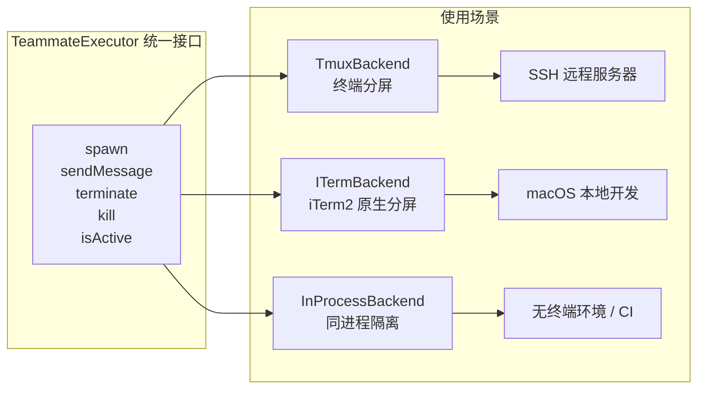
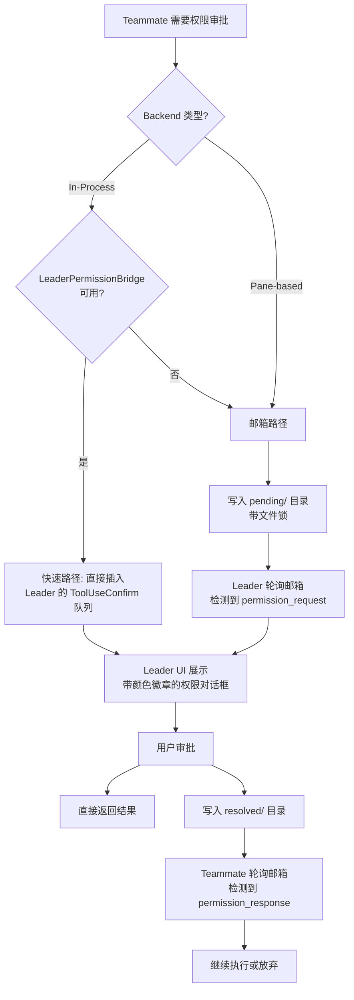

# 第 24 章 Swarm——多 Agent 协调架构

## 24.1 为什么需要多 Agent 协作

单个 AI Agent 无论多么强大，始终受限于串行执行：一次只能处理一个任务，一个上下文窗口只能容纳有限的上下文。当你面对一个大型代码重构、跨模块的 bug 修复、或者需要同时运行测试和编写文档的场景时，串行执行显然不够高效。

Claude Code 的 Swarm 架构正是为解决这个问题而设计的。Swarm 允许一个"团队领导者"(team-lead)协调多个"队友"(teammate)并行工作，每个队友都是一个独立的 Agent 实例，拥有自己的对话上下文和工具权限。

这不是简单的"函数调用"或"子进程委托"，而是一个完整的**多 Agent 协调系统**，包括：团队组建、任务分配、消息传递、权限同步、生命周期管理和资源清理。

更重要的是，Swarm 解决的并不只是"算得更快"。它解决的是**认知负载的分摊**。在 Agent 系统里，真正昂贵的往往不是 CPU，而是上下文窗口、注意力和决策连贯性。单个 Agent 即使理论上能完成所有事，也会因为上下文过载而逐渐退化：开始遗忘前提、混淆任务边界、把不同目标揉成一团。多 Agent 的意义，就是把一个过宽的问题拆成多个仍然保持清晰边界的小问题。

所以，Swarm 本质上不是并行库，而是一种**组织结构设计**：如何让多个有限理性的执行体，在不共享大脑的前提下，仍然为同一个目标协同工作。

## 24.2 Swarm 的核心架构：协调者模式

Claude Code 的 Swarm 采用了**协调者模式**(Coordinator Pattern)，而非对等模式(Peer-to-Peer)。在这个模式中：

- **Team Lead（团队领导者）**：与用户直接交互的主 Agent，负责创建团队、分配任务、审批权限。
- **Teammates（队友）**：由领导者创建的从属 Agent，执行具体任务，通过邮箱(mailbox)与领导者通信。

```mermaid
graph TB
    User[用户] --> Lead[Team Lead<br/>协调者]
    Lead -->|创建 & 分配任务| T1[Teammate: researcher<br/>研究员]
    Lead -->|创建 & 分配任务| T2[Teammate: coder<br/>编码者]
    Lead -->|创建 & 分配任务| T3[Teammate: tester<br/>测试员]

    T1 -->|Mailbox 消息| Lead
    T2 -->|Mailbox 消息| Lead
    T3 -->|Mailbox 消息| Lead

    Lead -->|Mailbox 消息| T1
    Lead -->|Mailbox 消息| T2
    Lead -->|Mailbox 消息| T3

    T1 -.->|Peer Message| T2
    T2 -.->|Peer Message| T3

    subgraph "Team File (config.json)"
        TF[team name, lead ID,<br/>members[], tasks dir]
    end

    Lead --- TF
    T1 --- TF
    T2 --- TF
    T3 --- TF

    style Lead fill:#4A90D9,color:#fff
    style T1 fill:#7BC67E,color:#fff
    style T2 fill:#E8A838,color:#fff
    style T3 fill:#D94949,color:#fff
```

为什么选择协调者模式而不是对等模式？核心原因是**权限安全**。在 Claude Code 的设计中，用户只与 Team Lead 直接交互，所有敏感操作（如执行 shell 命令、修改文件）的审批都经过领导者的 UI。如果队友之间可以互相触发操作而绕过用户审批，安全性将无法保证。

但这不只是安全问题，也是**责任归属**问题。对等模式在拓扑上更自由，却会模糊谁对最终结果负责。协调者模式让系统天然存在一个汇总点：任务由谁拆分、冲突由谁裁决、最终结果由谁对用户解释，都有明确归属。对于一个要落到代码和文件上的 Agent 系统，这种中心化责任比理论上的分布式优雅更重要。

## 24.3 Team File：团队状态的持久化中心

Swarm 系统用一个 JSON 文件作为所有队友的共享状态中心。每个团队在 `~/.claude/teams/<team-name>/config.json` 下维护一个 `TeamFile`。

```typescript
// 源码位置: utils/swarm/teamHelpers.ts
type TeamFile = {
  name: string
  description?: string
  createdAt: number
  leadAgentId: string
  leadSessionId?: string
  hiddenPaneIds?: string[]
  teamAllowedPaths?: TeamAllowedPath[]
  members: Array<{
    agentId: string
    name: string
    agentType?: string
    model?: string
    prompt?: string
    color?: string
    planModeRequired?: boolean
    joinedAt: number
    tmuxPaneId: string
    cwd: string
    worktreePath?: string
    sessionId?: string
    subscriptions: string[]
    backendType?: BackendType
    isActive?: boolean
    mode?: PermissionMode
  }>
}
```

这个设计的关键洞察是：**文件系统是最简单的跨进程通信机制**。无论是 tmux pane 中运行的独立进程，还是同一进程内的 in-process teammate，都可以通过读写同一个 JSON 文件来共享状态。这避免了引入额外的服务发现机制或消息队列。

`TeamFile` 不仅记录了成员信息，还包含了：
- `teamAllowedPaths`：团队级别的文件访问权限白名单，让队友无需逐一审批即可编辑指定路径。
- `hiddenPaneIds`：UI 层面隐藏的 pane 列表，管理终端布局。
- `isActive`：标记队友是否活跃，用于 UI 展示和工作分配决策。

从架构上看，`TeamFile` 扮演的是一个**轻量控制面（control plane）**，而不是工作数据本身。真正的工作产物仍然在各自的会话、worktree 和提交历史里；`TeamFile` 只描述"谁存在、谁负责什么、系统现在如何路由消息"。这类控制面信息天生适合放在简单、透明、可恢复的介质中。JSON 文件的优势不在于高级，而在于它足够朴素，出问题时人可以直接打开看。

## 24.4 Backend 抽象：三种执行模式

Claude Code 的 Swarm 支持三种不同的 Agent 执行后端，通过一套统一的 `TeammateExecutor` 接口抽象：



后端检测的优先级逻辑非常实用（见 `utils/swarm/backends/registry.ts`）：

1. **如果在 tmux 内部**：总是使用 TmuxBackend（即使你在 iTerm2 中运行 tmux）
2. **如果在 iTerm2 中且安装了 it2 CLI**：使用 ITerm2 原生分屏
3. **如果在 iTerm2 中但没有 it2**：尝试回退到 tmux
4. **其他情况（非交互式会话等）**：使用 InProcessBackend

```typescript
// 源码位置: utils/swarm/backends/types.ts
type BackendType = 'tmux' | 'iterm2' | 'in-process'
type PaneBackendType = 'tmux' | 'iterm2'

type TeammateExecutor = {
  readonly type: BackendType
  isAvailable(): Promise<boolean>
  spawn(config: TeammateSpawnConfig): Promise<TeammateSpawnResult>
  sendMessage(agentId: string, message: TeammateMessage): Promise<void>
  terminate(agentId: string, reason?: string): Promise<boolean>
  kill(agentId: string): Promise<boolean>
  isActive(agentId: string): Promise<boolean>
}
```

**为什么需要三层抽象？** 因为 Agent 的执行环境差异巨大。TmuxBackend 需要管理终端 pane 的创建、颜色设置、命令发送；InProcessBackend 则需要在同一 Node.js 进程内通过 `AsyncLocalStorage` 实现上下文隔离。统一接口让上层代码（如 TeamCreateTool、SendMessageTool）完全不需要关心底层差异。

InProcessBackend 是最特别的设计：它在**同一进程内**运行多个 Agent，通过 `AsyncLocalStorage` 为每个 Agent 提供独立的身份上下文（`TeammateContext`），包括 agentId、teamName、颜色、权限模式等。这避免了为每个 teammate 启动独立进程的开销，特别适合 CI 环境和非交互式会话。

## 24.5 邮箱系统：Agent 间的消息传递

Swarm 的 Agent 间通信采用了**异步邮箱模式**(Mailbox Pattern)，而非实时 RPC 或共享内存。

每个 Agent 有一个专属邮箱目录，其他 Agent 通过 `writeToMailbox()` 向其投递消息，Agent 自己通过轮询 `readMailbox()` 读取消息。

```typescript
// 源码位置: tools/SendMessageTool/SendMessageTool.ts
// 消息投递的核心逻辑
await writeToMailbox(
  recipientName,
  {
    from: senderName,
    text: content,
    summary,           // 5-10 字摘要，用于 UI 预览
    timestamp: new Date().toISOString(),
    color: senderColor, // 颜色标识，用于 UI 区分
  },
  teamName,
)
```

邮箱系统支持多种消息类型：

| 消息类型 | 方向 | 用途 |
|---------|------|------|
| 普通文本消息 | 任意 -> 任意 | 协作沟通 |
| 广播消息 (`to: "*"`) | 任意 -> 全体 | 团队通知 |
| `shutdown_request` | Leader -> Teammate | 请求队友退出 |
| `shutdown_response` | Teammate -> Leader | 同意/拒绝退出 |
| `plan_approval_response` | Leader -> Teammate | 审批/驳回计划 |
| `permission_request` | Teammate -> Leader | 请求工具使用权限 |
| `permission_response` | Leader -> Teammate | 返回权限审批结果 |

**为什么选择邮箱而不是 RPC？** 核心原因是**解耦和容错**。Agent 的执行是 LLM 驱动的，响应时间不可预测。如果使用同步 RPC，一个 Agent 等待另一个 Agent 的响应可能会阻塞数分钟。邮箱模式让每个 Agent 按自己的节奏处理消息，不会因为对端慢而卡死。

In-process teammate 的消息轮询间隔是 500ms（见 `inProcessRunner.ts` 中的 `waitForNextPromptOrShutdown`），在检查邮箱时还有优先级逻辑：
1. **关闭请求**（shutdown_request）优先级最高
2. **领导者的消息**优先于其他队友的消息
3. **任务列表**中的待领取任务也可以触发队友工作

这里体现的是一种典型的 Agent 设计哲学：**宁可最终一致，也不要强求瞬时一致**。多个 Agent 不可能像同一线程里的函数那样严格同步。既然如此，系统就不该假装它们可以同步，而应该把延迟、乱序、离线这些现实条件纳入协议本身。邮箱因此不是退而求其次，而是更贴近 Agent 本性的通信模型。

## 24.6 权限同步：跨 Agent 的安全协作

多 Agent 系统中最棘手的问题之一是权限管理。当一个 teammate 需要执行一个需要用户批准的操作（比如运行一个 bash 命令）时，它无法直接弹出确认对话框——它可能运行在另一个 tmux pane 中，或者根本不在主 UI 进程中。

### 24.6.1 双路径权限同步架构

Claude Code 设计了两条权限同步路径，根据 Backend 类型和场景自动选择最优路径：



**快速路径**（`leaderPermissionBridge.ts`）是 InProcessBackend 独有的。它通过模块级变量注册了 Leader 的 `setToolUseConfirmQueue` 函数，当 in-process teammate 需要权限时，直接将 `ToolUseConfirm` 对象插入 Leader 的队列。这个路径零延迟、零序列化开销，而且权限对话框会显示 teammate 的颜色徽章，让用户清楚知道是哪个 Agent 在请求权限。

**邮箱路径**（`permissionSync.ts`）是通用路径，适用于所有 backend。它使用文件系统作为中介：teammate 将请求写入 `~/.claude/teams/<team>/permissions/pending/<id>.json`，Leader 轮询该目录，审批后写入 `permissions/resolved/<id>.json`。整个过程使用文件锁保证原子性。

### 24.6.2 权限同步的沙箱扩展

权限同步不仅用于工具使用权限，还用于**沙箱网络访问审批**。当 teammate 的沙箱拦截到一个不在白名单中的网络请求时，同样通过邮箱系统将 `sandbox_permission_request` 发送到 Leader，Leader 审批后返回 `sandbox_permission_response`。这意味着沙箱系统在多 Agent 环境中也需要考虑"谁来审批"的问题。

### 24.6.3 会话恢复：断线后的上下文重建

Swarm 的 `reconnection.ts` 模块解决了另一个实际问题：当 teammate 的会话中断（如网络断开、进程重启）后如何恢复身份。

`computeInitialTeamContext` 在首次渲染前同步计算 team 上下文——从 CLI 参数或 transcript 中读取 teamName 和 agentName，然后读取 TeamFile 获取 leadAgentId。这意味着即使 teammate 进程重启，它也能恢复自己的身份和团队关系。

设计者选择在首次渲染前同步完成这个计算（而非 useEffect 异步获取），避免了 UI 闪烁和状态不一致。这是一个重要的架构选择：**身份信息必须在渲染前就确定**，否则 UI 可能在"有身份"和"无身份"之间闪烁。

## 24.7 生命周期管理：从创建到清理

一个 Swarm 团队的完整生命周期如下：

1. **创建**：`TeamCreateTool` 创建 `TeamFile`，注册到 session 清理列表
2. **添加成员**：`AgentTool` 或直接 spawn，选择 backend，创建 pane 或 in-process context
3. **任务分配**：通过 `TaskCreateTool` 创建任务，teammate 通过 `claimTask()` 认领
4. **协作执行**：队友执行任务，通过 mailbox 通信，空闲时发送 idle notification
5. **关闭请求**：Leader 可以通过 `shutdown_request` 请求队友退出，队友有权拒绝
6. **清理**：`TeamDeleteTool` 清理 worktree、pane、team 目录、task 目录

值得注意的设计细节：

- **优雅关闭协商**：Leader 不能强制杀死队友。它发送 `shutdown_request`，teammate 收到后由 LLM 决定是否同意。如果 teammate 正在执行关键操作，它可以拒绝并说明理由。只有当 teammate 同意后，Leader 才能执行 kill。

- **Session 级清理注册**：每个通过 `TeamCreateTool` 创建的团队都会注册到 session 清理列表（`registerTeamForSessionCleanup`）。如果用户在 Leader 会话中按 Ctrl+C 退出，`cleanupSessionTeams()` 会自动杀死所有 orphaned pane、销毁 worktree、清理目录。

## 24.8 能学到什么

1. **文件系统作为共享状态**：在多进程场景中，文件系统是最简单、最可靠的共享状态方案。不需要引入数据库或消息队列，一个 JSON 文件就能解决团队发现、成员管理、任务追踪等问题。

2. **Backend 抽象的价值**：通过 `TeammateExecutor` 接口将 tmux pane、iTerm2 分屏、in-process 三种截然不同的执行环境统一为一套 API。上层代码完全不感知底层差异，新增执行环境只需要实现接口。

3. **邮箱模式的适用性**：当通信双方的处理速度差异极大（如 LLM 驱动的 Agent），异步邮箱模式比同步 RPC 更合适。它天然支持优先级、批量处理、离线缓冲。

4. **权限的跨进程传递**：多 Agent 系统中，权限审批不能只在单个进程内完成。将权限请求序列化后通过消息传递到拥有用户交互能力的 Leader 进程，是一个通用且安全的模式。

5. **优雅关闭比强制终止更重要**：让 Agent 有机会拒绝关闭请求、保存工作状态，比直接 SIGKILL 更能保护用户的工作成果。这在 AI Agent 系统中尤其重要，因为 Agent 可能正在进行不可中断的文件操作。

6. **多 Agent 的核心不是并发，而是组织学**：真正困难的问题不是"怎么多开几个 Agent"，而是"怎么让它们有清晰边界、稳定汇报链和可追责的决策中心"。Swarm 的价值，恰恰在于把组织结构编码进了系统结构。
