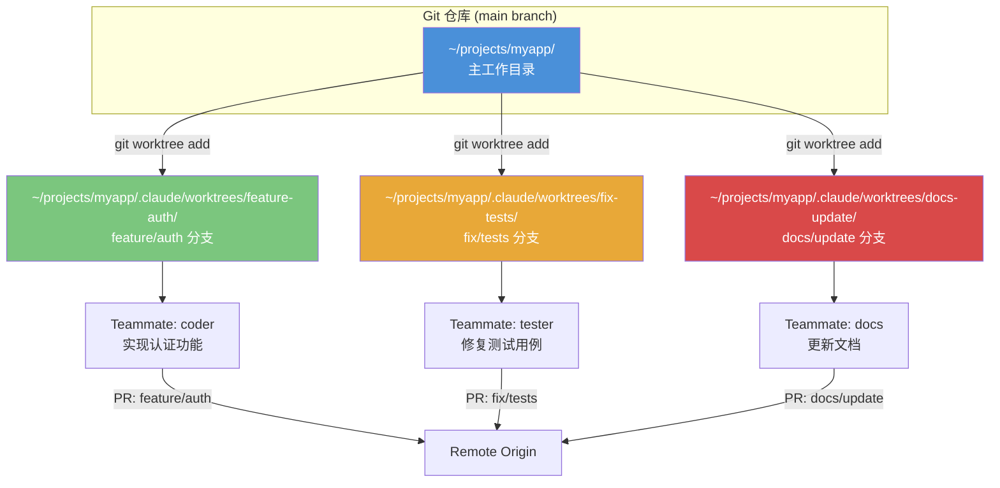
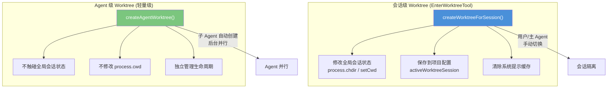
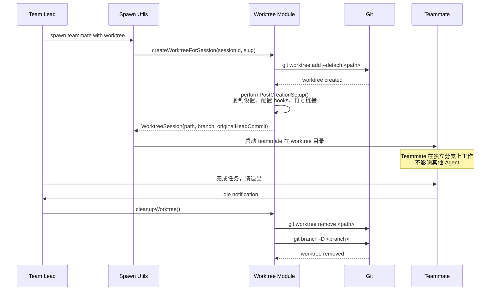
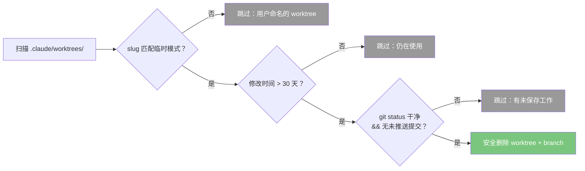

# 第 25 章 Worktree——并行工作流

## 25.1 为什么 Agent 需要并行工作

当多个 Agent 同时修改同一个代码仓库时，它们会互相踩脚：一个 Agent 正在重写模块 A，另一个 Agent 同时在模块 A 上运行测试，文件冲突在所难免。Git 分支可以解决逻辑隔离，但如果所有 Agent 都在同一个工作目录下 checkout 不同分支，Git 本身就会报错——一个工作目录同一时间只能对应一个分支。

这就是 Git worktree 的用武之地。Git worktree 允许你从同一个仓库检出多个分支到不同的目录，每个目录都是完整的工作副本，互相独立。Claude Code 将这个 Git 原生能力封装为 `EnterWorktreeTool` 和 `ExitWorktreeTool`，让 Agent 可以安全地在隔离环境中并行工作。

## 25.2 Worktree 在 Swarm 中的角色

在 Swarm 架构中，worktree 是实现 Agent 并行化的关键基础设施。当你创建多个 teammate 并让它们各自负责不同的代码变更时，每个 teammate 会在独立的 worktree 中工作：



每个 teammate 在自己的 worktree 目录中工作，拥有独立的文件系统视图和 Git 状态，完全不会干扰其他 teammate 的工作。

从更高一层看，worktree 解决的是**空间隔离**问题。多 Agent 系统天然会有上下文隔离，但如果它们最终仍在同一个目录里落盘，认知隔离就会被物理现实打破。worktree 的意义，在于让每个 Agent 不只"想法独立"，而且"操作空间独立"。这是一种把抽象边界变成文件系统边界的做法。

## 25.3 两种 Worktree 创建路径：会话级与 Agent 级

Claude Code 的 worktree 系统有两条创建路径，服务于不同的场景：



**会话级 worktree**（`createWorktreeForSession`）由 `EnterWorktreeTool` 触发，它修改进程的全局状态——切换工作目录、保存会话快照、清除缓存。这是"我（主 Agent）要搬到另一个目录工作"。

**Agent 级 worktree**（`createAgentWorktree`）由 `AgentTool` 等工具在后台创建，它**不触碰全局会话状态**。这是"我的子 Agent 需要一个隔离的工作空间，但我自己还留在原地"。这种分离避免了子 Agent 的工作目录切换干扰主 Agent 的上下文。

两者的共享基础设施是 `getOrCreateWorktree`（Git worktree 创建）和 `performPostCreationSetup`（创建后配置），但 Agent 级 worktree 跳过了所有全局状态修改。这是一个经典的**粒度控制模式**：同一能力在不同粒度下提供不同级别的副作用。

这背后有一个很值得借鉴的原则：**把资源创建和上下文切换分开**。创建隔离环境是一种基础设施动作；让当前会话"住进去"则是用户体验动作。很多系统把这两件事绑死在一起，结果副作用范围过大。Claude Code 把它们拆开之后，主 Agent 才能既拥有并行子空间，又不失去自己的连续性。

## 25.4 EnterWorktreeTool：会话中的环境切换

`EnterWorktreeTool` 的设计哲学是**零配置切换**：Agent 只需调用一次工具，底层自动处理 worktree 创建、分支管理、会话状态切换。

源码位置：`tools/EnterWorktreeTool/EnterWorktreeTool.ts`

```typescript
// EnterWorktreeTool.call() 的核心逻辑（简化）
async call(input) {
  // 1. 检查是否已在 worktree 中（防嵌套）
  if (getCurrentWorktreeSession()) {
    throw new Error('Already in a worktree session')
  }

  // 2. 解析到主仓库根目录
  const mainRepoRoot = findCanonicalGitRoot(getCwd())
  if (mainRepoRoot && mainRepoRoot !== getCwd()) {
    process.chdir(mainRepoRoot)
    setCwd(mainRepoRoot)
  }

  // 3. 创建 worktree（或恢复已有的）
  const slug = input.name ?? getPlanSlug()
  const worktreeSession = await createWorktreeForSession(getSessionId(), slug)

  // 4. 切换当前工作目录
  process.chdir(worktreeSession.worktreePath)
  setCwd(worktreeSession.worktreePath)
  setOriginalCwd(getCwd())
  saveWorktreeState(worktreeSession)

  // 5. 清除缓存，重新计算环境信息
  clearSystemPromptSections()
  clearMemoryFileCaches()
  getPlansDirectory.cache.clear?.()
}
```

这里有几个精妙的设计细节：

**防嵌套保护**：`getCurrentWorktreeSession()` 检查确保不会在已有的 worktree 中再次创建 worktree，避免嵌套导致的混乱。如果你在 `~/projects/app/.claude/worktrees/feature-x/` 中再次调用 EnterWorktree，它会先回到主仓库根目录。

**slug 生成与安全验证**：worktree 的路径名（slug）支持用户指定或自动生成。slug 的验证非常严格：每个路径段只能是字母、数字、点、下划线和连字符，禁止 `.` 和 `..` 以防路径穿越攻击。一个巧妙的设计是 `flattenSlug`——将 `user/feature` 中的 `/` 替换为 `+`，因为嵌套目录会导致 Git 的 D/F 冲突（文件与目录不能同名），也会让 `git worktree remove` 删除父目录时误伤子目录。

**状态同步**：创建 worktree 后，工具会立即清除多个缓存——系统提示的缓存区段、CLAUDE.md 的文件缓存、plans 目录缓存。这是因为切换到新的 worktree 后，环境信息（当前目录、Git 分支等）全部变了，旧缓存会导致 Agent 基于错误的上下文工作。

## 25.5 快速恢复路径：避免不必要的 Git Fetch

一个容易被忽视但极为重要的性能优化是 `getOrCreateWorktree` 中的**快速恢复路径**。当 worktree 已经存在时（比如之前创建过但还没删除），Claude Code 不会重新执行 `git fetch` 和 `git worktree add`，而是直接读取 `.git` 指针文件获取 HEAD SHA：

```typescript
// 快速恢复：直接读取 .git 文件获取 HEAD，无需子进程
const existingHead = await readWorktreeHeadSha(worktreePath)
if (existingHead) {
  return { worktreePath, worktreeBranch, headCommit: existingHead, existed: true }
}
```

为什么这很重要？在一个有 21 万文件、1600 万对象的大型仓库中，`git fetch` 需要 6-8 秒的本地 commit-graph 扫描（还没算网络延迟）。而读文件系统只需要不到 1 毫秒。这个优化让 Agent 在恢复已有 worktree 时几乎零延迟。

此外，当需要 fetch 时，代码会先检查 `origin/<branch>` 是否已存在于本地——如果存在就跳过 fetch，使用可能稍旧但足够好的 base。这种**用"足够好"换取"零延迟"**的权衡在 Agent 系统中非常实用。

## 25.6 创建后的环境配置

Worktree 创建后，`performPostCreationSetup` 执行一系列环境配置，确保新的 worktree 是一个"开箱即用"的工作环境：

1. **复制本地设置**：将 `settings.local.json` 复制到 worktree 的 `.claude/` 目录，确保本地配置（可能包含密钥）在 worktree 中也生效。

2. **配置 Git Hooks 路径**：将 worktree 的 `core.hooksPath` 指向主仓库的 `.husky/` 或 `.git/hooks/`。这解决了 Husky 等工具使用相对路径的问题——worktree 中没有自己的 hooks，但可以通过配置指向主仓库的。

3. **符号链接大目录**：通过 `settings.worktree.symlinkDirectories` 配置，将 `node_modules` 等大目录从主仓库符号链接到 worktree，避免磁盘空间浪费。这是 opt-in 的，因为不是所有目录都适合共享。

4. **复制 .worktreeinclude 文件**：将 `.gitignore` 中被忽略但 `.worktreeinclude` 中指定的文件复制到 worktree。这解决了像 `.env.local` 这类不 tracked 但工作必需的文件的传递问题。实现使用了 `git ls-files --directory` 来折叠大型忽略目录（如 `node_modules/`），避免全量遍历。

5. **稀疏检出（Sparse Checkout）**：当配置了 `worktree.sparsePaths` 时，使用 `git sparse-checkout set --cone` 只检出指定目录，大幅减少大仓库中 worktree 的创建时间和磁盘占用。

## 25.7 ExitWorktreeTool：安全的退出与清理

`ExitWorktreeTool` 提供了两种退出策略：**keep**（保留 worktree）和 **remove**（删除 worktree）。

源码位置：`tools/ExitWorktreeTool/ExitWorktreeTool.ts`

**安全门控设计**是 ExitWorktree 的核心亮点：

1. **scope guard**：`validateInput` 首先检查 `getCurrentWorktreeSession()` 是否存在。这确保 ExitWorktree 只能操作由 EnterWorktree 在当前会话中创建的 worktree，不会误删用户手动创建的 worktree。

2. **变更检测**：当 action 为 `remove` 时，工具会调用 `countWorktreeChanges()` 统计未提交的文件和未推送的提交数。如果有未保存的工作，`validateInput` 返回错误消息，要求用户确认 `discard_changes: true`。这是一个 **fail-closed** 设计——宁可多问一次，也不要丢失用户的工作。特别注意，当 `countWorktreeChanges()` 返回 null（状态无法确定）时，被视为"不安全，拒绝操作"。源码注释写得很清楚：

   > Returns null when state cannot be reliably determined — callers that use this as a safety gate must treat null as "unknown, assume unsafe" (fail-closed). A silent 0/0 would let cleanupWorktree destroy real work.

3. **会话状态恢复**：退出 worktree 后，`restoreSessionToOriginalCwd()` 将所有状态恢复到 worktree 创建前的值——工作目录、原始 CWD、项目根目录、hooks 配置快照、系统提示缓存等。这是一个完整的**状态回滚**操作。其中有一个微妙的分支：只有当 `projectRoot === originalCwd` 时才恢复 projectRoot，因为 mid-session 进入 worktree 不会修改 projectRoot，盲目恢复反而会破坏"稳定的项目标识"。

## 25.8 Worktree 在 Swarm 中的集成

当 Swarm 的 teammate 被创建时，如果配置了 worktree，整个流程如下：



在 `AppState` 的 `teamContext` 中，每个 teammate 的 worktree 信息被持久化：

```typescript
// AppState.teamContext.teammates 的元素
{
  name: string
  tmuxPaneId: string       // 终端 pane 标识
  cwd: string              // 工作目录
  worktreePath?: string    // worktree 的绝对路径
  spawnedAt: number
}
```

## 25.9 临时 Worktree 的垃圾回收

Agent 级 worktree 有一个容易被忽视的问题：如果 Agent 进程崩溃（Ctrl+C、OOM、超时），它的 worktree 清理代码永远不会执行，worktree 目录和分支会残留在磁盘上。

Claude Code 用 `cleanupStaleAgentWorktrees` 解决了这个问题。它的设计体现了几层安全考虑：



**模式匹配而不是全部清理**：只有匹配特定模式的 slug 才会被清理（如 `agent-a7f3b2c`、`wf_8a3f1b4c-5d2-1`）。用户通过 EnterWorktree 手动创建的 worktree（如 `my-feature`）永远不会被自动删除。

**Fail-closed 的多检查**：必须同时满足 `git status --porcelain -uno` 为空（忽略 untracked 文件以加速）和 `rev-list --not --remotes` 为空（所有提交都已推送）。任何一个检查失败都跳过。

**跳过当前会话的 worktree**：通过比较 `currentWorktreeSession.worktreePath`，确保不会清理当前正在使用的 worktree。

## 25.10 并行策略与合并

Worktree 本身只解决了隔离问题，但最终所有 Agent 的变更需要合并回主分支。Claude Code 的策略是**分支即隔离，PR 即合并**：

1. 每个 teammate 在独立的 worktree 中创建一个 `worktree-<slug>` 分支
2. Agent 完成工作后在分支上提交
3. 通过 GitHub PR 或 git merge 合并到主分支
4. Team Lead 负责最终的合并决策

这种策略避免了在 Agent 层面实现复杂的自动合并逻辑。Git 本身的 merge 机制加上人类审批环节，是最安全可靠的方案。

这里体现的是一种非常成熟的边界感：**Agent 可以负责生成变更，但不必负责定义真相**。代码库的最终真相仍然由 Git 历史、分支策略和人的合并决定。换句话说，worktree 不是为了让 Agent 接管版本控制，而是为了让 Agent 更好地服从版本控制。

## 25.11 能学到什么

1. **利用平台原语**：Claude Code 没有自己实现文件系统隔离，而是直接利用了 Git worktree 这个成熟的原语。当你需要实现并行工作隔离时，先看看底层平台（操作系统、版本控制系统）是否已经提供了你需要的能力。

2. **会话级与 Agent 级的状态隔离**：`createWorktreeForSession` 和 `createAgentWorktree` 共享创建基础设施但隔离副作用范围。前者修改全局状态（当前目录、会话配置），后者不触碰全局状态。这种"同一能力，不同粒度"的设计让 Agent 可以安全地并行创建工作空间而不互相干扰。

3. **fail-closed 安全设计**：在可能丢失用户工作的操作前（删除 worktree），强制要求显式确认。`countWorktreeChanges` 返回 null 时被视为"状态未知，假设不安全"，拒绝操作。这种宁可误报也不丢数据的设计哲学在 AI Agent 系统中至关重要。

4. **快速恢复路径**：对已有 worktree 跳过 `git fetch`、检查本地是否有缓存的 ref——这些优化在 Agent 频繁创建/恢复 worktree 的场景下将延迟从秒级降到毫秒级。

5. **垃圾回收中的防御性设计**：只清理匹配临时模式的 worktree（不碰用户命名的）、必须所有检查通过才清理（有未保存工作就跳过）、清理后执行 `git worktree prune`。层层保护确保了自动化清理不会造成数据丢失。

6. **环境传递的系统化方案**：通过 `.worktreeinclude` 文件解决 gitignore 文件的传递、通过符号链接解决大目录共享、通过 sparse-checkout 解决大仓库性能问题。这些不是孤立的优化，而是一个完整的"如何让 worktree 成为开箱即用的工作环境"的设计方案。

7. **隔离不是目的，低冲突协作才是目的**：如果隔离之后仍然需要大量人工搬运环境、频繁手工修复路径和依赖，隔离就失去了价值。真正好的隔离方案，应该让 Agent 几乎忘记自己身处隔离环境。
