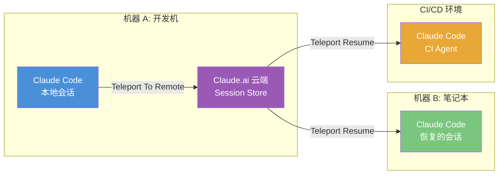
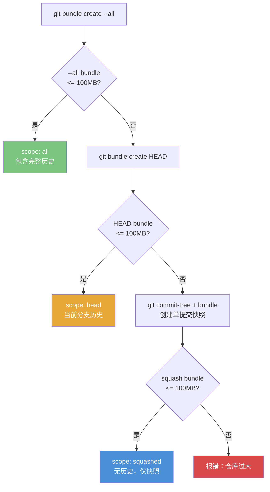
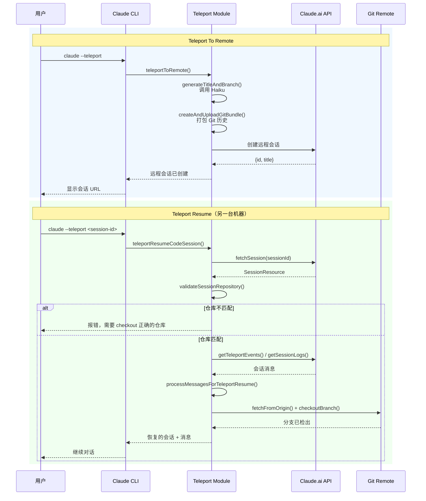

# 第 26 章 Teleport——远程协作

## 26.1 Teleport 解决什么问题

想象这个场景：你在公司的开发机上启动了一个 Claude Code 会话，花了 30 分钟让 Agent 理解了你的项目架构、建立了上下文。然后你需要离开办公室，在回家的笔记本上继续这个对话。你不想从头再来——30 分钟的上下文建立过程太昂贵了。

这就是 Teleport 要解决的问题：**在不同机器之间无缝迁移 Claude Code 会话**。

Teleport 提供两个核心能力：

1. **Teleport To Remote**：将本地会话"上传"到 Claude.ai 云端，生成一个可在任何地方访问的远程会话。
2. **Teleport Resume**：从另一台机器"下载"之前的会话，恢复完整的对话上下文和代码状态。



这里最值得强调的一点是：Teleport 迁移的不是一个进程，而是一个**可重新物化的工作上下文**。这与远程桌面、tmux attach 或 SSH 代理完全不同。那些技术迁移的是"同一个正在运行的会话"；Teleport 迁移的是"让另一台机器足以继续这个会话所需的最小充分条件"。这是一种更贴近 Agent 本质的设计，因为 Agent 的核心不是进程 ID，而是上下文连续性。

## 26.2 Teleport To Remote：上传会话

当你执行 `--teleport` 或 `/teleport` 命令时，Claude Code 会将当前会话打包上传到云端。

源码位置：`utils/teleport.tsx` 中的 `teleportToRemote` 函数。

整个过程分为几个阶段：

### 阶段一：前置检查

在 Teleport 之前，系统会进行一系列前置检查：

```typescript
// utils/teleport.tsx
// 前置错误检查由 getTeleportErrors() 执行
// 包括：Git 是否干净、是否有未提交的变更、是否已安装 GitHub App 等
```

`getTeleportErrors()` 返回一组错误类型，如：
- **needsGitStash**：工作目录有未提交的变更，需要先 stash 或 commit
- **needsGitHubApp**：需要安装 GitHub App 才能使用远程功能
- **其他错误**：认证失败、权限不足等

这些错误通过 `TeleportError` React 组件展示给用户，用户可以在 UI 中直接解决（比如一键 stash 变更）。

### 阶段二：生成会话元数据

Teleport 需要为远程会话生成一个有意义的标题和分支名。这里用了一个小巧的设计：调用 Claude Haiku（一个快速的小模型）来生成标题和分支名。

```typescript
// utils/teleport.tsx
async function generateTitleAndBranch(description: string, signal: AbortSignal) {
  // 使用 Haiku 模型生成 JSON 格式的 {title, branch}
  const response = await queryHaiku({
    systemPrompt: asSystemPrompt([]),
    userPrompt: SESSION_TITLE_AND_BRANCH_PROMPT.replace('{description}', description),
    outputFormat: {
      type: 'json_schema',
      schema: { type: 'object', properties: { title: { type: 'string' }, branch: { type: 'string' } } }
    }
  })
}
```

分支名以 `claude/` 为前缀（如 `claude/fix-auth-bug`），标题则是一个简洁的人类可读描述。这确保远程会话在 Claude.ai 的 UI 中一目了然。

### 阶段三：Git Bundle 上传

Teleport 的核心数据传输使用了 `git bundle`——这是 Git 原生的打包格式，可以将仓库的完整历史（或指定范围）打包成单个文件。

```typescript
// utils/teleport/gitBundle.ts
export async function createAndUploadGitBundle(
  config: FilesApiConfig,
  opts?: { cwd?: string; signal?: AbortSignal },
): Promise<BundleUploadResult>
```

Git Bundle 的创建有一个精心设计的三级回退链，处理不同大小的仓库：



这个回退链的每一级都做了明确的取舍：
- **--all** 包含所有分支和标签，最适合但可能很大
- **HEAD** 只打包当前分支，减少体积但丢失其他分支
- **squashed-root** 通过 `git commit-tree` 创建一个无历史的单提交快照，最小但完全没有 Git 历史

此外，Bundle 创建还会捕获工作区的未提交变更（通过 `git stash create`），将其保存为 `refs/seed/stash` 引用，并在上传后清理这些临时引用——不会污染用户的 `git stash` 栈。

为什么选择 `git bundle` 而不是直接 push？

1. **离线友好**：bundle 创建不依赖远程连接，可以在任何环境下生成
2. **完整性**：bundle 包含完整的提交历史和对象，恢复时不需要网络
3. **原子性**：bundle 是单个文件，上传要么成功要么失败，不存在半完成状态
4. **体积自适应**：三级回退链确保即使在超大仓库中也能找到可用的打包方案

更深一层看，Teleport 在这里做的是**语义保真，而不是形式保真**。它不要求远端拥有与你本地完全相同的仓库形态、stash 栈和临时状态；它要求的是，远端恢复后依然能对"我正在做什么"给出一致理解。这也是为什么可以接受从完整历史逐步降级到 squash 快照：Git 历史是重要信息，但在"继续当前工作"这个目标下，它并不是绝对不可妥协的全部。

### 阶段四：会话创建

最后，Teleport 调用 Claude.ai 的 API 创建远程会话：

```typescript
// 伪代码
const response = await createRemoteSession({
  title: generatedTitle,
  branch: generatedBranch,
  gitBundle: uploadedBundleUrl,
  sessionLogs: serializedConversationMessages,
})
```

返回的 `TeleportToRemoteResponse` 包含会话 ID 和标题，用户可以在 Claude.ai 上访问这个会话。

## 26.3 Teleport Resume：恢复会话

Teleport Resume 是 Teleport To Remote 的逆过程——从云端下载会话数据，在本地恢复对话上下文。

源码位置：`utils/teleport.tsx` 中的 `teleportResumeCodeSession` 函数。

### 仓库验证：安全的第一道门

Resume 的第一步不是下载消息，而是**验证仓库匹配**。这是一个关键的安全设计：

```typescript
// utils/teleport.tsx
async function validateSessionRepository(sessionData: SessionResource): Promise<RepoValidationResult> {
  const currentParsed = await detectCurrentRepositoryWithHost()
  const currentRepo = currentParsed ? `${currentParsed.owner}/${currentRepo}` : null

  // 从会话数据中提取 Git 仓库信息
  const gitSource = sessionData.session_context.sources.find(s => s.type === 'git_repository')

  // 比较主机和仓库路径
  if (currentRepo !== sessionRepo) {
    return { status: 'mismatch', sessionRepo, currentRepo }
  }
  return { status: 'match' }
}
```

验证有四种可能的结果：

| 状态 | 含义 | 处理 |
|------|------|------|
| `match` | 当前仓库与会话仓库一致 | 继续恢复 |
| `mismatch` | 仓库不匹配 | 报错，要求用户切换到正确的仓库 |
| `not_in_repo` | 当前不在任何 Git 仓库中 | 报错，要求用户先 checkout 仓库 |
| `no_repo_required` | 原会话不涉及 Git | 直接继续 |

注意这里还考虑了**主机匹配**（GitHub.com vs GitHub Enterprise），避免将 GitHub.com 的会话恢复到 GHE 的仓库上。

这个校验看似保守，实际上是在维护一个关键的不变量：**会话里的语义必须绑定到正确的现实对象**。如果把同样的对话历史恢复到错误的仓库，模型会继续"说得很像对的"，但它理解的文件、分支和代码身份都已经错位。Teleport 的难点从来不只是传输成功，而是防止这种"貌似连续、实则漂移"的恢复。

### 消息恢复与处理

消息恢复的核心挑战是**不完整工具调用的处理**。如果原始会话在一个工具调用中途被打断，恢复时需要清理这些不完整的消息：

```typescript
// utils/teleport.tsx
export function processMessagesForTeleportResume(messages: Message[], error: Error | null): Message[] {
  // 1. 反序列化消息（处理特殊格式）
  const deserializedMessages = deserializeMessages(messages)

  // 2. 添加 Teleport 恢复通知
  return [
    ...deserializedMessages,
    createTeleportResumeUserMessage(),   // 告知模型会话从另一台机器恢复
    createTeleportResumeSystemMessage(error)  // 系统级通知
  ]
}
```

`createTeleportResumeUserMessage()` 生成一条特殊的用户消息："This session is being continued from another machine. Application state may have changed."。这条消息确保模型知道环境可能已经变化，不会盲目依赖之前的文件系统状态。

### 分支检出

如果原会话有关联的 Git 分支，Teleport Resume 会自动检出该分支：

```typescript
async function checkoutBranch(branchName: string): Promise<void> {
  // 先尝试本地检出
  let { code } = await execFileNoThrow(gitExe(), ['checkout', branchName])

  // 如果本地不存在，从 origin 检出
  if (code !== 0) {
    await execFileNoThrow(gitExe(), ['checkout', '-b', branchName, '--track', `origin/${branchName}`])
  }

  // 确保上游分支已设置
  await ensureUpstreamIsSet(branchName)
}
```

这里的多重回退策略（本地检出 -> 从 origin 创建 -> 直接跟踪远程分支）展示了处理 Git 操作时的鲁棒性思维。

所以，Teleport 的真正价值不是让 Agent 去云上跑，而是把**工作连续性**从单机绑定里解放出来。对一个现代 Agent 系统来说，连续性应该绑定在会话语义、代码快照和恢复协议上，而不是绑定在"原来那台机器还活着"这个偶然条件上。

## 26.4 Teleport 的架构全景



## 26.5 会话数据的双重获取

Teleport Resume 的数据获取有一个渐进式的回退策略：

```typescript
// 先尝试 CCR v2 端点（Spanner/Threadstore）
let logs = await getTeleportEvents(sessionId, accessToken, orgUUID)

// v2 不可用时回退到 session-ingress API
if (logs === null) {
  logs = await getSessionLogsViaOAuth(sessionId, accessToken, orgUUID)
}
```

这个双重获取策略反映了实际系统演进中的常见模式：新 API 逐步替代旧 API，但需要保持向后兼容。`getTeleportEvents` 是新一代端点，`getSessionLogsViaOAuth` 是遗留端点。当新端点返回 null（未部署或暂时不可用）时，自动回退到旧端点。

### API 请求的弹性设计

Teleport 的所有 API 请求都通过 `axiosGetWithRetry` 封装，实现了自动重试和指数退避：

```typescript
// utils/teleport/api.ts
const TELEPORT_RETRY_DELAYS = [2000, 4000, 8000, 16000] // 4 次重试，指数退避
```

重试策略的判断逻辑是：只有**瞬态错误**才重试（网络断开、5xx 服务器错误），4xx 客户端错误不重试。这意味着如果请求因为认证失败被拒绝，不会浪费 30 秒在无意义的重试上。

这个设计体现了 Teleport 对网络环境的务实态度：用户可能在咖啡厅的 WiFi 上操作，网络可能不稳定，但认证错误不是重试能解决的。

获取到的日志还需要过滤：

```typescript
const messages = logs
  .filter(entry => isTranscriptMessage(entry) && !entry.isSidechain) as Message[]
```

`isTranscriptMessage` 确保只保留对话消息（排除系统事件），`!entry.isSidechain` 排除侧链消息（如 Agent 内部的子查询）。这确保恢复的上下文是用户可见的"主对话"。

## 26.6 环境选择与远程执行

Teleport 不仅支持恢复到本地机器，还支持在远程环境中执行。`utils/teleport/environments.ts` 提供了环境发现和选择能力。

```typescript
// utils/teleport/environments.ts
export async function fetchEnvironments(): Promise<Environment[]>
```

这允许用户将 Claude Code 会话 Teleport 到：
- **本地机器**：最常见，从开发机到笔记本的切换
- **远程开发环境**：如 GitHub Codespaces、云 IDE
- **CI/CD 环境**：在持续集成中运行 Claude Code 任务

环境选择会检查 preconditions（前置条件），如 GitHub App 是否已安装、认证是否有效等（见 `utils/background/remote/preconditions.ts`）。

## 26.7 能学到什么

1. **会话的可移植性设计**：将 AI Agent 的会话设计为可移植的——不绑定到特定机器或进程——是一个强大的架构决策。它要求会话状态是自包含的，可以在任何环境中重建。这需要序列化对话消息、分离环境相关的状态（如当前目录、Git 状态）、并在恢复时重新绑定环境。

2. **渐进式回退**：双重 API 获取策略展示了如何在不牺牲可靠性的前提下迁移到新系统。新 API 优先，旧 API 兜底。当新 API 完全可用后，旧 API 的调用路径自然变为死代码，可以安全移除。

3. **安全验证的纵深防御**：Teleport Resume 不是简单地下载并恢复，而是先验证仓库匹配、检查主机一致性、处理不完整消息。每一层验证都是一道安全门，防止在错误的环境中恢复会话。

4. **用小模型做元数据生成**：用 Haiku 生成标题和分支名是一个经典的"用合适的工具做合适的事"的案例。这类简单的结构化生成任务不需要最强的模型，用快速的小模型既省钱又省时。

5. **Git Bundle 作为传输格式**：`git bundle` 是 Git 生态中一个被低估的能力。它提供了一种将完整仓库状态打包为单个文件的方法，非常适合"离线创建、在线传输、远程恢复"的场景。三级回退链（--all -> HEAD -> squashed-root）是一个优雅的"最佳努力"模式：优先尝试最好的方案，失败后逐步降级，每级都有明确的取舍。

6. **瞬态错误与永久错误的区分**：重试机制只对瞬态错误（网络断开、5xx）生效，对永久错误（4xx 认证失败）立即放弃。这种区分避免了在不可恢复的场景下浪费时间重试，同时在可恢复的场景下提供弹性。
