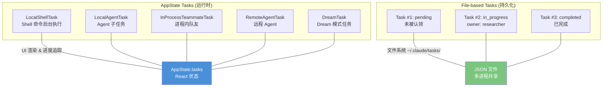
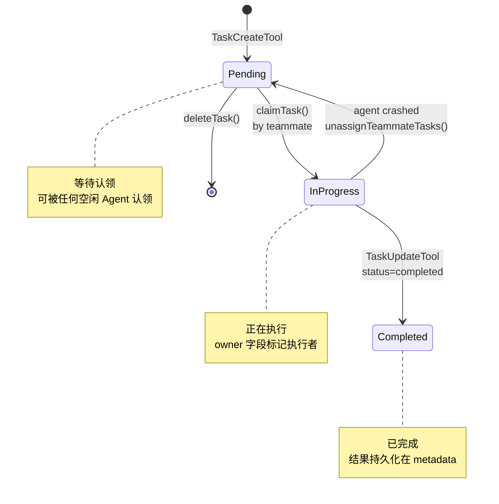
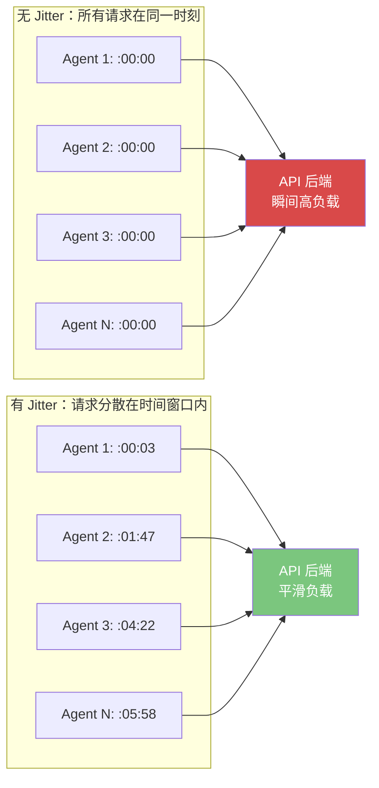
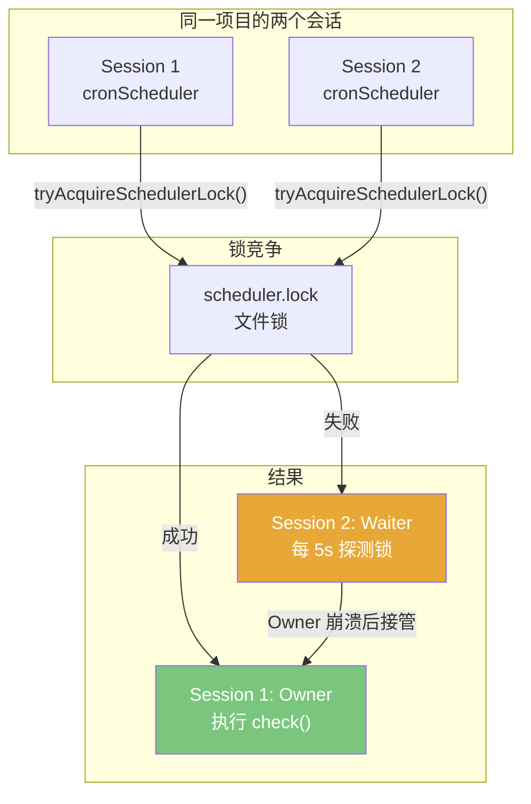
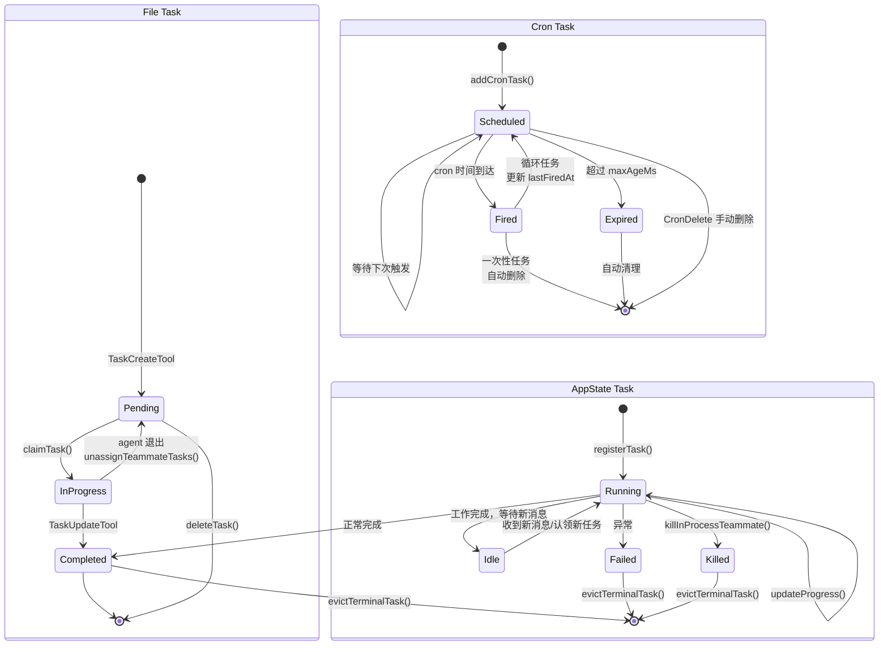

# 第 27 章 后台任务与异步执行

## 27.1 为什么 Agent 需要后台任务

传统的 AI Agent 交互模式是同步的：用户发一条消息，Agent 处理，返回结果，用户再发下一条。这种模式对于快速对话很好，但对于长时间运行的任务来说效率极低。

想象你让 Agent "运行完整的测试套件并分析失败原因"——测试可能需要 20 分钟。如果 Agent 在这 20 分钟内阻塞主对话，你什么都做不了。你需要的是 Agent 在后台运行测试，你继续做其他事情，测试完成后再通知你。

Claude Code 的后台任务系统正是为解决这个问题而设计的。它让 Agent 从"对话式工具"进化为"自动化平台"。

这里的关键转变，是把"一次问答"和"一项工作"明确地区分开。传统聊天产品把这两者混在一起，所以一旦工作时长超过对话时长，体验就开始崩塌。后台任务体系相当于承认：**对话是控制通道，任务才是执行通道**。用户不该被长任务绑死在一次前台交互里。

## 27.2 Task 体系：统一的任务抽象

Claude Code 的任务系统建立在两个不同层次的概念之上：

- **AppState Task**：在 React 状态树中跟踪的运行时任务，用于 UI 渲染和进度追踪
- **File-based Task**：持久化到文件系统的协作任务，用于多 Agent 间的任务分配



### AppState Task 类型

`tasks/types.ts` 定义了统一的 TaskState 联合类型：

```typescript
// tasks/types.ts
export type TaskState =
  | LocalShellTaskState      // Shell 命令后台执行
  | LocalAgentTaskState      // Agent 子任务（可暂停/恢复）
  | RemoteAgentTaskState     // 远程 Agent 任务
  | InProcessTeammateTaskState // 进程内队友
  | LocalWorkflowTaskState   // 工作流任务
  | MonitorMcpTaskState      // MCP 监控任务
  | DreamTaskState           // Dream 模式任务
```

每种任务类型共享一个基础状态（`createTaskStateBase`）：

```typescript
// Task.ts
function createTaskStateBase(taskId: string, type: string, description: string, toolUseId?: string) {
  return {
    id: taskId,
    type,
    description,
    toolUseId,
    status: 'running',     // running | completed | failed | killed
    startTime: Date.now(),
    endTime: undefined,
    output: undefined,
    error: undefined,
  }
}
```

### File-based Task 系统

File-based Task 用于多 Agent 间的任务协作。它们存储在 `~/.claude/tasks/<taskListId>/` 目录下，每个任务是一个 JSON 文件。

```typescript
// utils/tasks.ts
export type Task = {
  id: string               // 自增 ID（如 "1", "2", "3"）
  subject: string          // 简短标题
  description: string      // 详细描述
  activeForm?: string      // 进行时形式（如 "Running tests"）
  owner?: string           // 认领者的 agent name
  status: TaskStatus       // pending | in_progress | completed
  blocks: string[]         // 阻塞的任务 ID
  blockedBy: string[]      // 被哪些任务阻塞
  metadata?: Record<string, unknown>  // 任意元数据
}
```

## 27.3 后台任务的生命周期



### 创建阶段

`TaskCreateTool` 负责创建新任务。它的设计有一个精妙的细节——Hook 系统：

```typescript
// tools/TaskCreateTool/TaskCreateTool.ts
async call({ subject, description, activeForm, metadata }, context) {
  const taskId = await createTask(getTaskListId(), {
    subject, description, activeForm,
    status: 'pending',
    owner: undefined,
    blocks: [],
    blockedBy: [],
    metadata,
  })

  // 执行 task-created hooks（外部集成点）
  const generator = executeTaskCreatedHooks(
    taskId, subject, description,
    getAgentName(), getTeamName(),
    undefined, context?.abortController?.signal, undefined, context
  )
  for await (const result of generator) {
    if (result.blockingError) {
      await deleteTask(getTaskListId(), taskId)  // Hook 拒绝则回滚
      throw new Error(getTaskCreatedHookMessage(result.blockingError))
    }
  }

  // 自动展开任务列表视图
  context.setAppState(prev => {
    if (prev.expandedView === 'tasks') return prev
    return { ...prev, expandedView: 'tasks' }
  })
}
```

Hook 系统允许外部系统在任务创建时进行干预。如果一个 Hook 返回 `blockingError`，任务会被立即删除并回滚。这是一种**开闭原则**的体现：核心任务系统不对"什么任务可以创建"做假设，而是通过 Hook 扩展点让外部逻辑决定。

### 认领阶段

任务是自增 ID 的，使用 high-water-mark 机制确保 ID 不会复用：

```typescript
// utils/tasks.ts
async function findHighestTaskId(taskListId: string): Promise<number> {
  const [fromFiles, fromMark] = await Promise.all([
    findHighestTaskIdFromFiles(taskListId),
    readHighWaterMark(taskListId),
  ])
  return Math.max(fromFiles, fromMark)
}
```

任务认领使用**文件锁**来防止竞态条件。在 Swarm 中，多个 Agent 可能同时尝试认领同一个任务：

```typescript
// utils/tasks.ts - claimTask 的原子性保证
export async function claimTask(
  taskListId: string,
  taskId: string,
  claimantAgentId: string,
  options: ClaimTaskOptions = {},
): Promise<ClaimTaskResult> {
  // 获取文件锁
  const release = await lockfile.lock(taskPath, LOCK_OPTIONS)

  // 双重检查：在锁内重新读取任务状态
  const task = await getTask(taskListId, taskId)
  if (task.owner && task.owner !== claimantAgentId) {
    return { success: false, reason: 'already_claimed' }
  }

  // 检查依赖是否已完成
  const blockedByTasks = task.blockedBy.filter(id => unresolvedTaskIds.has(id))
  if (blockedByTasks.length > 0) {
    return { success: false, reason: 'blocked', blockedByTasks }
  }

  // 原子更新
  await updateTaskUnsafe(taskListId, taskId, { owner: claimantAgentId })
  await release?.()
}
```

锁的配置也值得一提：

```typescript
const LOCK_OPTIONS = {
  retries: {
    retries: 30,
    minTimeout: 5,
    maxTimeout: 100,
  },
}
```

注释解释了为什么需要 30 次重试：在 10+ 并发 Agent 的 Swarm 中，每个临界区大约 50-100ms，10 路竞争的最后一个竞争者需要约 900ms，30 次重试提供了 2.6 秒的等待时间。

### 完成/失败阶段

任务完成后，如果执行者是一个 teammate 且它崩溃或被杀死，`unassignTeammateTasks()` 会将其未完成的任务重置为 pending 状态，以便其他 Agent 认领：

```typescript
// utils/tasks.ts
export async function unassignTeammateTasks(
  teamName: string,
  teammateId: string,
  teammateName: string,
  reason: 'terminated' | 'shutdown',
): Promise<UnassignTasksResult> {
  const unresolvedAssignedTasks = tasks.filter(
    t => t.status !== 'completed' && (t.owner === teammateId || t.owner === teammateName)
  )
  for (const task of unresolvedAssignedTasks) {
    await updateTask(teamName, task.id, { owner: undefined, status: 'pending' })
  }
}
```

## 27.4 Cron 调度：从对话到自动化

如果说后台任务让 Agent 从"同步对话"进化到"异步执行"，那么 Cron 调度让 Agent 进一步进化到"定时自动化"。

源码位置：`tools/ScheduleCronTool/CronCreateTool.ts` 和 `utils/cronTasks.ts`

### Cron 任务的数据模型

```typescript
// utils/cronTasks.ts
export type CronTask = {
  id: string                 // 8 位 hex 随机 ID
  cron: string               // 5 字段 cron 表达式（本地时间）
  prompt: string             // 触发时注入的提示词
  createdAt: number          // 创建时间（epoch ms）
  lastFiredAt?: number       // 上次触发时间
  recurring?: boolean        // 是否循环（否则是一次性）
  permanent?: boolean        // 是否永久（免于自动过期）
  durable?: boolean          // 运行时标记：是否持久化到磁盘
  agentId?: string           // 关联的 in-process teammate
}
```

### 两种存储模式

Cron 任务有两种存储方式：

1. **Durable（持久化）**：写入 `.claude/scheduled_tasks.json`，进程重启后仍然存在
2. **Session-only（会话级）**：只存在于进程内存（`bootstrap/state.ts` 的 session store），进程退出即消失

```typescript
// utils/cronTasks.ts - addCronTask
if (!durable) {
  // 只写入内存
  addSessionCronTask({ ...task, ...(agentId ? { agentId } : {}) })
  return id
}
// 写入磁盘
const tasks = await readCronTasks()
tasks.push(task)
await writeCronTasks(tasks)
```

这个设计反映了一个重要的权衡：**持久化 vs 临时性**。Durable 任务适合需要跨会话存活的工作（如"每天早上检查我的 PR"），而 session-only 任务适合当前会话的临时需求（如"5 分钟后提醒我检查测试结果"）。 teammates 不能创建 durable cron，因为 teammate 的 agentId 不会跨会话存在。

如果把这个设计再抽象一步，你会发现 Claude Code 在区分两种完全不同的"时间"：

- **会话时间**：只在当前对话活着时有意义，服务于当前注意力。
- **系统时间**：独立于当前对话存在，服务于持续性的自动化。

Cron 之所以单独成章，不是因为它只是多了个定时器，而是因为它让 Agent 首次真正进入第二种时间。

### Cron 的 Jitter 机制

Cron 调度中最有趣的设计是 **Jitter（抖动）机制**。它解决了一个经典问题：如果成千上万个 Claude Code 实例都设置了 `0 * * * *`（每小时整点触发），所有请求会在同一秒打到 API 后端。

Claude Code 用一个确定性的抖动来分散负载：

```typescript
// utils/cronTasks.ts - 确定性 jitter 计算
function jitterFrac(taskId: string): number {
  // taskId 是 8 位 hex UUID slice → 解析为 u32 → [0, 1)
  const frac = parseInt(taskId.slice(0, 8), 16) / 0x1_0000_0000
  return Number.isFinite(frac) ? frac : 0
}
```

Recurring 任务使用**正向抖动**（延迟触发，最多 `recurringCapMs` 即 15 分钟），one-shot 任务使用**反向抖动**（提前触发，最多 `oneShotMaxMs` 即 90 秒）。关键区别在于：循环任务延迟是不可见的（你不会注意到 cron 在 :06 而非 :00 执行），但一次性任务不能延迟（用户说"3 点提醒我"，你不能 3:06 才提醒）。



### 自动过期

Cron 任务还有自动过期机制，默认 7 天（`recurringMaxAgeMs`）。这是为了防止长期运行的会话中 cron 任务无限积累：

```typescript
export const DEFAULT_CRON_JITTER_CONFIG: CronJitterConfig = {
  recurringFrac: 0.1,
  recurringCapMs: 15 * 60 * 1000,
  oneShotMaxMs: 90 * 1000,
  recurringMaxAgeMs: 7 * 24 * 60 * 60 * 1000, // 7 天
}
```

标记为 `permanent` 的任务免于自动过期。这些是系统级的内置任务（如 "catch-up"、"morning-checkin"、"dream"），由 `install.ts` 写入且 `writeIfMissing()` 不会覆盖。

### Cron 调度器锁：防止双重触发

当多个 Claude Code 会话在同一个项目目录下同时运行时，它们会共享同一个 `scheduled_tasks.json` 文件。如果不加控制，每个会话的调度器都会读取同一组任务并独立触发，导致同一个 cron 任务被重复执行。

`cronScheduler.ts` 用一个**调度器锁**（`cronTasksLock.ts`）解决了这个问题：



调度器启动时尝试获取锁。只有获得锁的会话（owner）会执行 `check()` 来触发文件级别的 cron 任务。其他会话每 5 秒探测一次锁状态——如果 owner 崩溃或退出，waiter 会接管成为新的 owner。

值得注意的是，**session-only 任务不受锁控制**。因为它们存储在各自进程的内存中，其他会话看不到也不需要看到，天然不存在双重触发问题。这是锁设计中的**最小权限原则**：只对真正需要协调的资源加锁。

这说明一个很成熟的工程判断：**协调本身也是成本**。很多系统一看到多实例就本能地给所有东西上锁，最后得到一个笨重的中心化调度器。Claude Code 只对共享的 durable 任务加协调，对局部任务保持完全自治，这样才不会把异步系统重新做回同步系统。

### 文件监听与实时重载

Cron 调度器使用 `chokidar` 监听 `scheduled_tasks.json` 的变更。当文件被外部修改（如另一个会话创建了新 cron 任务），调度器会立即重新加载任务列表：

```typescript
// cronScheduler.ts
watcher = chokidar.watch(path, {
  persistent: false,
  ignoreInitial: true,
  awaitWriteFinish: { stabilityThreshold: 300 },
})
watcher.on('add', () => void load(false))
watcher.on('change', () => void load(false))
watcher.on('unlink', () => { tasks = []; nextFireAt.clear() })
```

`awaitWriteFinish` 设置了 300ms 的稳定期，避免在文件写入过程中读到不完整的 JSON。`ignoreInitial: true` 跳过启动时的初始事件（改用显式的 `load(true)` 来处理，以便区分首次加载和后续重载）。

### Cron 与 Teammate 的集成

Cron 任务可以关联到一个 in-process teammate。当 `agentId` 被设置时，cron 触发时的 prompt 会被路由到该 teammate 的消息队列，而不是主 REPL：

```typescript
// CronCreateTool 的验证逻辑
if (input.durable && getTeammateContext()) {
  return {
    result: false,
    message: 'durable crons are not supported for teammates',
    errorCode: 4,
  }
}
```

teammates 不能创建 durable cron，因为 teammate 的 agentId 不会跨会话存在。这个限制不是技术上的不可能，而是语义上的正确性——如果一个 teammate 在下次会话中不存在了，它创建的 durable cron 就会指向一个不存在的 agent。

## 27.5 后台任务生命周期全景



## 27.6 Task List ID 的解析策略

Task List ID 决定了任务存储在哪个目录。它的解析有一套精心设计的优先级：

```typescript
// utils/tasks.ts
export function getTaskListId(): string {
  if (process.env.CLAUDE_CODE_TASK_LIST_ID) return process.env.CLAUDE_CODE_TASK_LIST_ID

  // In-process teammates 使用 leader 的 team name
  const teammateCtx = getTeammateContext()
  if (teammateCtx) return teammateCtx.teamName

  // 环境变量或 leader 设置的 team name
  return getTeamName() || leaderTeamName || getSessionId()
}
```

这个优先级确保了：

1. **显式指定** > **teammate 上下文** > **环境变量** > **leader 设置** > **session ID**
2. **所有 teammate 共享同一个 task list**（通过 team name 而非各自的 session ID）
3. tmux/iTerm2 的 teammate 通过环境变量 `CLAUDE_CODE_TEAM_NAME` 获取 task list ID
4. in-process teammate 通过 `TeammateContext` 获取

这种多层次的 ID 解析策略是多 Agent 系统中"谁来协调"问题的标准解法。

## 27.7 能学到什么

1. **把对话延迟和任务延迟拆开**：用户能容忍任务慢，但很难容忍界面被慢任务占住。后台任务系统的价值，不是让任务更快，而是让主交互保持快。

2. **区分会话内异步和跨会话自动化**：前者是提高当前工作流吞吐量，后者是把 Agent 变成持续运行的系统。二者看起来都叫"后台"，但设计约束完全不同。

3. **调度是产品问题，不只是技术问题**：Jitter、过期、锁、持久化策略，表面上是基础设施细节，本质上是在定义"系统多久打扰一次用户、多久占用一次资源、多久保留一项承诺"。

4. **两层任务模型**：将"运行时任务"（用于 UI 渲染）和"协作任务"（用于 Agent 间协调）分开设计。AppState Task 跟踪的是一个执行单元的生命周期，File Task 跟踪的是一个工作单元的状态。两者关注点不同，不应混为一谈。

5. **文件锁的实用策略**：使用 `proper-lockfile` 配合指数退避重试（30 次，5-100ms），在 10+ 并发 Agent 的 Swarm 中保证原子性。这比引入数据库或分布式锁服务简单得多。在大多数多进程协作场景中，文件锁 + 重试就是足够的方案。

6. **确定性 Jitter**：用任务 ID 的哈希值作为 jitter 的种子，确保同一任务在不同进程、不同重启间总是获得相同的抖动值。这意味着即使多个进程独立计算，它们对同一任务的调度时间也是一致的。

7. **自动过期的防御性设计**：7 天的 cron 自动过期上限不是功能需求，而是**防御性设计**。长时间运行的会话会积累状态、消耗内存，自动过期是一个安全阀，防止系统因用户遗忘而无限膨胀。

8. **Hook 作为扩展点**：`TaskCreateTool` 中的 `executeTaskCreatedHooks` 展示了一种优雅的扩展模式。核心系统不对"任务是否应该创建"做判断，而是让外部 Hook 决定。如果 Hook 拒绝，任务被删除并回滚。这让任务系统可以在不同项目中适配不同的策略（如：禁止在周五下午创建部署任务）。

9. **调度器锁与自动接管**：Cron 调度器使用文件锁确保同一时间只有一个会话触发文件级任务，同时非持有者定期探测以便在 owner 崩溃时自动接管。这种 leader election 模式简单有效——无需引入 ZooKeeper 或 Raft，一个文件锁加上定期探测就覆盖了所有场景。
