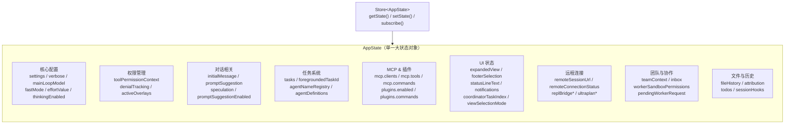

# 第 28 章 全局状态设计

## 一个 Store 统领全局

当你在终端里使用 Claude Code 时，你是否想过：对话消息从哪里来？工具的执行状态存在哪？MCP 服务器的连接信息保存在哪里？权限模式（plan mode、default mode）又是谁在管理？

答案出人意料地简单——所有这些信息都住在同一个对象里。

Claude Code 选择了**集中式状态**（Single Store）架构。整个应用的运行时状态被组织成一个名为 `AppState` 的巨大类型，由一个统一的 `Store<AppState>` 实例管理。没有 Redux 的 reducer 分裂，没有 MobX 的 observable 装饰，也没有 Context API 的层层嵌套。一个 Store，一个 State，一套规则。

这种选择背后有着深思熟虑的架构考量。

单一 Store 在这里并不是"前端习惯用法"，而是 Claude Code 对自身复杂度的一种回答：当一个系统的真正难点在于**多个子系统如何同时保持同一个现实视图**时，最危险的不是状态太大，而是现实被切碎。

## AppState 的结构全景

`AppState` 定义在 `state/AppStateStore.ts` 中，是一个超过 570 行的 TypeScript 类型。它并非一坨无序的属性堆砌，而是按功能领域自然分区。

在深入结构之前，值得注意一个关键的类型设计决策：AppState 的主体被包裹在 `DeepImmutable<{...}>` 中。这意味着绝大多数字段在类型层面就是**只读的**——你不能直接修改 `state.verbose = true`，必须通过 `setState(prev => ({ ...prev, verbose: true }))` 来创建一个新对象。这个类型级别的不可变性约束是整个架构的基石，确保了引用相等性检查（`Object.is`）能够正确工作。只有 `tasks` 字段因为包含函数类型而被排除在 `DeepImmutable` 之外。

让我们用一张图来总览 AppState 的内部结构：



从源码中可以看到，`AppState` 涵盖了以下功能领域：

**核心配置区**（`settings`、`verbose`、`mainLoopModel`、`fastMode`、`effortValue`）：这些字段控制着 Agent 的基础行为。模型选择、verbose 日志模式、thinking 模式开关等都在此区域。这些值的变化频率较低，但一旦变化就会触发全链路的重新配置。

**权限管理区**（`toolPermissionContext`、`denialTracking`、`activeOverlays`）：权限是 Agent 应用的命脉。`toolPermissionContext` 不仅记录当前权限模式（default、plan、yolo 等），还携带了批准/拒绝的工具列表。`activeOverlays` 跟踪当前活跃的弹窗层，协调 Escape 键的行为。

**任务系统区**（`tasks`、`foregroundedTaskId`、`agentNameRegistry`、`agentDefinitions`）：Claude Code 支持多 Agent 并发执行。每个子 Agent 是一个 Task，通过 `tasks` 字典管理。`foregroundedTaskId` 指向当前前台展示的 Agent，`agentNameRegistry` 建立 Agent 名到 ID 的映射。

**MCP 与插件区**（`mcp`、`plugins`）：MCP（Model Context Protocol）服务器连接、工具列表、命令列表都在此区域。插件系统的状态（启用/禁用列表、安装状态）也在此处。

**UI 状态区**（`expandedView`、`footerSelection`、`notifications`、`coordinatorTaskIndex`）：终端 UI 的交互状态。底部导航栏选中项、展开的面板类型、通知队列等都集中在此。

**远程连接区**（`remoteSessionUrl`、`replBridge*`、`ultraplan*`）：支持远程模式（`claude assistant`）的一系列连接状态，包括 WebSocket 连接状态、Bridge 模式开关、Ultraplan 任务状态等。

**团队协作区**（`teamContext`、`inbox`、`workerSandboxPermissions`）：Agent Swarm 模式下的团队上下文、消息收件箱、沙箱权限请求队列。

**文件与历史区**（`fileHistory`、`attribution`、`todos`、`sessionHooks`）：文件变更追踪、Git 提交归属追踪、待办事项列表、会话级钩子状态。

## 极简 Store：34 行代码的力量

Claude Code 的 Store 实现在 `state/store.ts` 中，全部代码仅有 34 行：

```typescript
export function createStore<T>(
  initialState: T,
  onChange?: OnChange<T>,
): Store<T> {
  let state = initialState
  const listeners = new Set<Listener>()

  return {
    getState: () => state,
    setState: (updater: (prev: T) => T) => {
      const prev = state
      const next = updater(prev)
      if (Object.is(next, prev)) return  // 无变化则跳过
      state = next
      onChange?.({ newState: next, oldState: prev })
      for (const listener of listeners) listener()
    },
    subscribe: (listener: Listener) => {
      listeners.add(listener)
      return () => listeners.delete(listener)
    },
  }
}
```

这段代码的设计哲学可以用三个关键词概括：**不可变更新**、**引用相等性检查**、**观察者模式**。

`setState` 接收一个 updater 函数而非直接的新值。这意味着每次状态变更都是通过 `prev => ({ ...prev, key: newValue })` 这种展开运算符的形式完成的，天然保证了不可变性。更关键的是，如果 updater 返回的对象与旧状态引用相等（`Object.is(next, prev)`），整个更新流程会被短路——不会触发监听器，不会引起重渲染。

`onChange` 回调是 Store 设计中的一个精巧之处。它不是给 React 用的，而是给**副作用系统**用的。每当状态变化时，`onChange` 会收到新状态和旧状态，可以对比差异并执行副作用（如持久化到磁盘、通知外部系统）。这构成了 Claude Code 状态响应式管线的第二层（第一层是 React 的重渲染，第二层是副作用层）。我们将在第 29 章详细讨论这个设计。

## 为什么选择集中式而非分布式

在设计全局状态时，架构师面临一个根本选择：是把所有状态放在一个大对象里（集中式），还是把状态分散到各个模块各自管理（分布式）？

分布式状态的典型代表是 React 的多 Context 模式——权限状态一个 Context、UI 状态一个 Context、任务状态一个 Context。每个模块只关心自己的状态切片，理论上更松耦合。

Claude Code 选择集中式状态，原因有三：

**第一，跨领域状态交互的频率极高。** 在 Agent 应用中，一个工具的执行可能同时影响权限状态、任务状态和 UI 状态。如果这些状态分散在不同模块中，跨模块协调就需要事件总线或复杂的订阅关系，反而引入了更多的隐式依赖。集中式状态让这种交互变得简单——一个 `setState` 调用可以原子地更新多个领域的字段。

以 `state/teammateViewHelpers.ts` 中的 `enterTeammateView` 函数为例，当用户点击查看一个 Agent 的对话时，需要同时更新 `viewingAgentTaskId`、`viewSelectionMode`、以及 `tasks` 中对应任务的 `retain` 和 `evictAfter` 属性。在集中式状态下，这些变更在一次 `setAppState` 调用中完成，保证了原子性。如果在分布式状态下，你需要三个不同的状态管理器协调，中间任何一步失败都会导致状态不一致。

**第二，调试可追溯性。** 集中式状态意味着任何时刻，你都可以通过 `store.getState()` 获取应用的完整快照。这对调试 Agent 行为至关重要——当 Agent 做出了意料之外的决策，你需要看到当时的完整状态上下文，而不是在五个不同的状态模块之间跳转拼凑。

**第三，持久化和恢复的一致性。** Agent 应用需要支持会话恢复（`--resume`、`--continue`）。从磁盘加载的状态需要一次性注入到应用中。如果状态分散在多个模块中，恢复过程需要按正确的顺序初始化多个模块，并处理模块间的依赖关系。集中式状态下，一次 `setState` 或初始状态构造就能完成所有恢复。

可以把这种选择理解为：`AppState` 不是为了把一切都塞进一个对象，而是为了给系统提供一个**统一事实面（single surface of truth）**。在 Agent 产品里，UI、权限、任务、插件、远程连接并不是互不相干的子域，它们共同构成了用户眼中那个"Agent 现在正在做什么"的现实。既然用户感知的是一个整体，系统内部往往也需要一个整体化的快照。

## AppStateProvider：状态的入口

`AppState` 通过 React Context 注入到组件树中。入口是 `state/AppState.tsx` 中的 `AppStateProvider` 组件：

```mermaid
graph TD
    subgraph ComponentTree["组件树"]
        ASP["AppStateProvider<br/>创建 Store 实例"]
        MB["MailboxProvider"]
        VP["VoiceProvider"]
        APP["应用组件..."]
    end

    ASP --> MB --> VP --> APP

    subgraph StoreCreation["Store 创建流程"]
        IS["initialState 或<br/>getDefaultAppState()"]
        CS["createStore(initialState, onChangeAppState)"]
        US["useState(创建函数)<br/>保证只创建一次"]
    end

    IS --> CS --> US --> ASP
end
```

`AppStateProvider` 的设计有几个值得注意的细节：

**Store 只创建一次。** 通过 `useState(创建函数)` 的惰性初始化模式，Store 实例在整个组件生命周期中只创建一次。`createStore` 被包裹在工厂函数中传入 `useState`，React 保证工厂函数只在首次渲染时执行。这意味着 Provider 本身不会因为父组件的重渲染而重建 Store。

**防嵌套保护。** 通过 `HasAppStateContext` 这个内部 Context，代码会检测并阻止 `AppStateProvider` 的嵌套使用。嵌套 Provider 在分布式状态中很常见（外层提供全局状态，内层提供局部状态），但集中式状态下，嵌套意味着两个 Store 实例竞争同一个状态空间，这几乎肯定是 bug。

**外部设置同步。** `AppStateProvider` 在挂载时还会订阅外部设置的变更（通过 `useSettingsChange` 钩子）。当用户在文件系统中修改了配置文件（如 `.claude/settings.json`），这个变更会被检测到并通过 `applySettingsChange` 同步到 AppState 中。这实现了**双向同步**：AppState 的变更持久化到磁盘，磁盘的变更也反映到 AppState。

**挂载时的权限覆盖。** `AppStateProvider` 的一个不明显的职责是在组件挂载时检查是否需要禁用 bypass permissions 模式。这是一个处理竞态条件的精巧设计：远程设置可能在 React 组件挂载之前就已经加载完毕，此时 `toolPermissionContext.isBypassPermissionsModeAvailable` 和 `isBypassPermissionsModeDisabled()` 两个条件同时为真，说明设置系统已经通知了禁用，但 AppState 还没来得及更新。`useEffect` 在挂载时执行一次 `createDisabledByPassPermissionsContext` 覆盖权限上下文，确保竞态窗口不会泄露过大的权限。

## 非 React 代码的状态访问

不是所有需要状态变更的代码都在 React 组件中。工具的实现、后台任务管理器、MCP 连接处理器等都需要读写 AppState。`useAppStateStore()` 钩子提供了对 Store 实例的直接访问，让非 React 代码可以调用 `store.getState()` 和 `store.setState()`。

但注意，这个钩子本身仍然需要在 React 组件内调用（因为它依赖 Context）。通常的做法是在 React 组件的初始化阶段获取 Store 引用，然后将其传递给非 React 模块。这种"在 React 边界处获取引用，在非 React 世界中使用"的模式是 React 应用中桥接 React 和非 React 代码的标准做法。

## 默认状态的构造

`getDefaultAppState()` 函数负责构造初始状态。阅读这个函数（在 `AppStateStore.ts` 第 456 行起），你会发现它不仅设置了合理的默认值，还包含了一些条件逻辑：

- 权限模式的初始值取决于当前进程是否为 Teammate，以及是否要求 plan mode。这是通过运行时检查 `isTeammate()` 和 `isPlanModeRequired()` 决定的。
- `thinkingEnabled` 和 `promptSuggestionEnabled` 的默认值来自配置函数 `shouldEnableThinkingByDefault()` 和 `shouldEnablePromptSuggestion()`，而非硬编码的布尔值。
- MCP 相关的所有列表初始为空数组，因为 MCP 连接是异步建立的。

这种"默认值也可能依赖运行时环境"的设计，体现了一个重要原则：**初始状态不是静态的，它是对启动时运行环境的一次快照。**

## 选择器模式：从大状态中提取小切片

有了集中式的大状态，下一步要解决的问题是：如何让组件只订阅它关心的状态切片，避免不相关的状态变更导致无意义的重渲染？

Claude Code 的答案是 `useAppState(selector)` 钩子。定义在 `state/AppState.tsx` 中，它利用了 React 18 的 `useSyncExternalStore` API：

```typescript
export function useAppState<T>(selector: (state: AppState) => T): T {
  const store = useAppStore()
  const get = () => {
    const state = store.getState()
    const selected = selector(state)
    return selected
  }
  return useSyncExternalStore(store.subscribe, get, get)
}
```

组件使用示例：

```typescript
const verbose = useAppState(s => s.verbose)
const model = useAppState(s => s.mainLoopModel)
const { text, promptId } = useAppState(s => s.promptSuggestion)
```

每个组件通过选择器函数从 AppState 中提取自己需要的切片。`useSyncExternalStore` 会对比前后两次选择器返回值（使用 `Object.is`），只有值发生变化时才触发组件重渲染。

这种设计要求选择器必须返回**稳定的引用**。源码中的注释明确警告：不要在选择器中返回新创建的对象。`const { text, promptId } = useAppState(s => s.promptSuggestion)` 是安全的，因为它解构的是已存在的对象属性；而 `useAppState(s => ({ text: s.text, model: s.model }))` 是危险的，因为每次调用都返回新对象，`Object.is` 永远判定为"变化了"，导致无限重渲染。

除了 `useAppState`，还有 `useSetAppState`（只获取 setState 函数，不订阅任何状态）和 `useAppStateMaybeOutsideOfProvider`（在 Provider 外部也能安全使用的版本，返回 undefined 而不抛错）。这三个钩子覆盖了组件与 Store 交互的所有典型场景。

## 集中式状态的代价

客观地说，集中式状态并非没有代价。

**AppState 类型的膨胀是最大的隐患。** 450+ 行的类型定义意味着任何开发者修改状态结构时，都需要理解这个类型与众多消费者之间的关系。如果两个不相关的功能模块在同一个 AppState 上频繁修改，类型系统的安全网会变成开发体验的负担。

**选择器的引用稳定性要求增加了心智负担。** 开发者必须时刻注意不在选择器中创建新对象，这在复杂场景下并不总是直觉性的。

**不可变更新在深度嵌套时显得笨拙。** 更新 `tasks[taskId].status` 需要展开整个 tasks 对象：`{ ...prev, tasks: { ...prev.tasks, [taskId]: { ...prev.tasks[taskId], status: 'running' } } }`。随着嵌套层级增加，代码可读性下降。

但 Claude Code 的团队显然认为这些代价是值得的。因为 Agent 应用的核心挑战不在于类型定义的大小，而在于**状态变更的可追溯性和跨模块一致性**。集中式状态在这两个维度上的优势是分布式状态难以企及的。

这也是为什么这一章最该学到的，不是"要不要用单 Store"，而是**状态架构必须围绕系统最昂贵的不一致来设计**。对 Claude Code 而言，最昂贵的不一致不是某个组件多渲染一次，而是 UI 认为某工具在运行、权限层认为它已被拒绝、任务层却还认为它活着。这类跨域错位，比局部性能损耗危险得多。

## 能学到什么

从 Claude Code 的全局状态设计中，我们可以提炼出几条通用的架构原则：

1. **选择集中式还是分布式，取决于跨领域交互的频率。** 如果你的应用中不同领域的状态经常需要联合更新或联合读取，集中式状态的收益大于代价。反之，如果领域之间几乎不交互，分布式状态更灵活。

2. **Store 的实现应该尽可能简单。** 34 行代码的 Store 比任何第三方状态库都更容易理解和调试。复杂的状态需求（如副作用、持久化）应该通过 Store 的扩展点（如 `onChange` 回调）而非 Store 内部实现来满足。

3. **选择器模式是集中式状态的性能安全阀。** 没有选择器，集中式状态会变成性能灾难——每个组件都重渲染于任何状态变化。`useSyncExternalStore` + 选择器函数的组合，让集中式状态在保持简单性的同时获得了精细化的更新控制。

4. **类型层面的不可变性约束比运行时检查更可靠。** `DeepImmutable<AppState>` 在编译时就阻止了直接修改状态对象的尝试，而不是等到运行时才发现 bug。当你设计一个依赖引用相等性的系统时，不可变性不应该是"建议"而应该是"约束"。

5. **初始状态应考虑运行时环境。** 静态的默认值工厂（如 Redux 的 `initialState`）在简单应用中够用，但在 Agent 应用中，初始状态可能依赖于进程角色（Leader 还是 Teammate？）、环境变量、甚至远程配置。把初始状态构造视为一次性快照而非静态常量。

6. **防嵌套保护是必要的防御性设计。** 如果你的状态系统不支持也不应该嵌套，用运行时检查来防止误用。这比文档规范更可靠，因为错误会在开发阶段立即暴露。

7. **单一事实面比局部优雅更重要**：当系统的复杂度主要来自子系统耦合，而不是单点算法，优先保证所有人看见的是同一份现实，再去优化局部状态的纯粹性。
