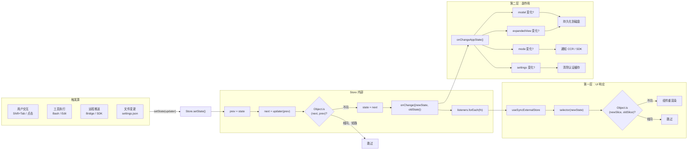

# 第 29 章 状态变更与响应式更新

## 从一次状态变更说起

当用户在 Claude Code 中按 Shift+Tab 切换权限模式（从 default 到 plan，再到 yolo）时，发生了什么？

表面上看，只是底部状态栏的一个文字变化。但在这个简单的交互背后，一条精心设计的状态变更管线正在运转：权限模式在 AppState 中被更新，React 组件根据新状态重渲染 UI，同时一个副作用监听器检测到模式变化，通知外部的 CCR（Cloud Control Relay）和 SDK 状态流。

这条管线的核心设计思想是：**单向数据流 + 分层响应**。状态变更是唯一的真相源，UI 更新和副作用分别是这条管线上的两个消费者。

## 状态变更管线全景

让我们先看整条管线的架构：



这条管线有两个清晰的层次：

**第一层——UI 响应**：通过 `useSyncExternalStore` + 选择器模式驱动 React 组件的精准重渲染。

**第二层——副作用层**：通过 `onChangeAppState` 回调检测状态差异并执行副作用。

两层共享同一个触发点——Store 的 `setState`——但它们的关注点完全不同。UI 层关心"什么变了，需要重画"；副作用层关心"什么变了，需要通知或持久化"。

## 第一层：选择器模式与精准重渲染

在第 28 章中我们了解了 `useAppState(selector)` 的基本用法。这里我们深入探讨选择器模式在实际应用中的几个关键设计决策。

### 粒度选择：多调用优于大选择

Claude Code 的组件通常需要 AppState 的多个字段。一个自然的问题是：用一个选择器返回所有需要的字段，还是用多个选择器分别返回？

Claude Code 的选择是**多调用模式**。源码注释中明确写道：

```
For multiple independent fields, call the hook multiple times:
const verbose = useAppState(s => s.verbose)
const model = useAppState(s => s.mainLoopModel)
```

为什么不用一个选择器返回多个字段？因为选择器每次返回新对象会导致 `Object.is` 毸远判定为"变化了"。而分开调用时，每个选择器只返回原始值（字符串、布尔值、数字或已存在的对象引用），`Object.is` 的比较是精确的。

这种设计意味着：如果只有 `verbose` 变了，订阅 `model` 的选择器不会触发重渲染。两个选择器的更新是独立的、最小化的。

### 选择器 vs 计算状态

在 `state/selectors.ts` 中，Claude Code 定义了一些纯函数选择器：

```typescript
export function getViewedTeammateTask(
  appState: Pick<AppState, 'viewingAgentTaskId' | 'tasks'>,
): InProcessTeammateTaskState | undefined {
  const { viewingAgentTaskId, tasks } = appState
  if (!viewingAgentTaskId) return undefined
  const task = tasks[viewingAgentTaskId]
  if (!task || !isInProcessTeammateTask(task)) return undefined
  return task
}
```

注意这个函数的参数类型是 `Pick<AppState, 'viewingAgentTaskId' | 'tasks'>`，而非完整的 `AppState`。这是一个有意的设计决策：它声明了自己只依赖 AppState 的哪些字段。但由于 React hooks 不能在运行时组合选择器，这些纯函数选择器主要用于非 React 代码路径（如事件处理器、工具执行逻辑中），而不是直接用在 `useAppState` 里。

文件顶部的注释清晰定义了选择器的定位：

```
Selectors for deriving computed state from AppState.
Keep selectors pure and simple - just data extraction, no side effects.
```

这条原则至关重要。选择器是纯函数，没有副作用，只做数据提取和转换。副作用是第二层管线的职责。

### useSetAppState：只写不读

`useSetAppState()` 钩子是一个巧妙的优化。它返回 `store.setState` 函数，但不订阅任何状态：

```typescript
export function useSetAppState() {
  return useAppStore().setState
}
```

使用这个钩子的组件**永远不会因为状态变化而重渲染**。它适合那些只需要修改状态但不关心当前值的场景，比如事件处理器中的回调。

在 `state/teammateViewHelpers.ts` 中可以大量看到这种模式：

```typescript
export function enterTeammateView(
  taskId: string,
  setAppState: (updater: (prev: AppState) => AppState) => void,
): void {
  setAppState(prev => {
    // ...复杂的状态更新逻辑
  })
}
```

这些辅助函数接收 `setAppState` 作为参数，而不是直接访问 Store。这种依赖注入的设计使得函数可以在不引入 React 依赖的情况下修改状态，提高了可测试性。

## 第二层：onChangeAppState 副作用系统

如果说第一层解决的是"状态变了，UI 怎么更新"的问题，那么第二层解决的就是"状态变了，除了 UI 还有什么需要做"的问题。

`onChangeAppState` 定义在 `state/onChangeAppState.ts` 中。每当 `store.setState` 检测到状态确实发生了变化（`Object.is` 返回 false），它就会调用这个回调，传入新旧两个状态对象。

```typescript
export function onChangeAppState({ newState, oldState }: {
  newState: AppState
  oldState: AppState
}) {
  // 检测权限模式变化
  const prevMode = oldState.toolPermissionContext.mode
  const newMode = newState.toolPermissionContext.mode
  if (prevMode !== newMode) { /* ... */ }

  // 检测模型变化
  if (newState.mainLoopModel !== oldState.mainLoopModel) { /* ... */ }

  // 检测 expandedView 变化
  if (newState.expandedView !== oldState.expandedView) { /* ... */ }

  // 检测 verbose 变化
  if (newState.verbose !== oldState.verbose) { /* ... */ }

  // 检测 settings 变化
  if (newState.settings !== oldState.settings) { /* ... */ }
}
```

### 权限模式同步：一个精心设计的例子

权限模式同步是 `onChangeAppState` 中最复杂的副作用，也最能体现这个设计的价值。源码中的注释详细解释了为什么需要在这里集中处理：

> Prior to this block, mode changes were relayed to CCR by only 2 of 8+ mutation paths: a bespoke setAppState wrapper in print.ts (headless/SDK mode only) and a manual notify in the set_permission_mode handler. Every other path -- Shift+Tab cycling, ExitPlanModePermissionRequest dialog options, the /plan slash command, rewind, the REPL bridge's onSetPermissionMode -- mutated AppState without telling CCR.

在引入集中式副作用之前，有 8 个以上的代码路径可以修改权限模式，但只有 2 个路径会通知 CCR。结果就是 CCR 和 CLI 的权限状态经常不同步。

通过在 `onChangeAppState` 中集中检测权限模式变化，**所有修改路径自动获得 CCR 通知能力**，无需在每个路径上手动添加通知逻辑。这是一个典型的"横切关注点"问题的解决方案。

但这里有一个微妙之处：并非所有内部权限模式都应该通知 CCR。某些模式名称（如 `bubble`、`ungated auto`）是内部实现细节，对外部系统来说是无意义的。因此代码中先将内部模式转换为外部模式（`toExternalPermissionMode`），只有外部模式确实变化时才发送通知：

```typescript
const prevExternal = toExternalPermissionMode(prevMode)
const newExternal = toExternalPermissionMode(newMode)
if (prevExternal !== newExternal) {
  notifySessionMetadataChanged({ permission_mode: newExternal, ... })
}
notifyPermissionModeChanged(newMode)  // SDK 通道始终通知
```

这种"对外过滤、对内透传"的设计体现了副作用层的精细控制能力。

## 状态更新中的 evictAfter 模式

在 `state/teammateViewHelpers.ts` 中，Claude Code 使用了一个优雅的 `evictAfter` 模式来管理已完成任务面板的延迟消失。这个模式虽然只是一个时间戳字段，但它解决了终端 UI 中的一个重要体验问题。

当用户退出一个已完成的 teammate 的对话视图时，面板不应该立即消失——用户需要几秒钟来阅读最终结果。`release()` 函数将已完成的任务标记为 `evictAfter: Date.now() + 30000`（30 秒宽限期），而未完成的任务则设置 `evictAfter: undefined`。

```typescript
function release(task: LocalAgentTaskState): LocalAgentTaskState {
  return {
    ...task,
    retain: false,            // 释放"保留"标记，允许清理
    messages: undefined,       // 清除内存中的消息
    diskLoaded: false,         // 清除磁盘加载标记
    evictAfter: isTerminalTaskStatus(task.status)
      ? Date.now() + PANEL_GRACE_MS   // 终止状态：30 秒后可清理
      : undefined,                      // 运行中：不可清理
  }
}
```

这个设计的核心思想是**用状态而非命令控制 UI 生命周期**。面板的消失不是一个命令（"删除面板"），而是一个状态条件（"evictAfter 时间已过"）。UI 层只需要检查 `Date.now() > task.evictAfter` 来决定是否渲染面板，不需要额外的定时器或回调。

而 `stopOrDismissAgent` 函数则使用 `evictAfter: 0` 表示"立即隐藏"。这是"延迟消失"模式的特殊变体——用户点击 dismiss 表示明确要求立即隐藏，不需要宽限期。如果被 dismiss 的 agent 正在被查看，还会同时退出查看模式回到 leader 视图。

### 模型变更的持久化

当用户通过 `/model` 命令或快捷键切换模型时，`onChangeAppState` 会检测到 `mainLoopModel` 的变化并执行两个动作：

1. 调用 `updateSettingsForSource('userSettings', { model: ... })` 将新模型保存到用户设置文件
2. 调用 `setMainLoopModelOverride(...)` 更新引导层的模型覆盖

特别值得注意的是，当模型被设置为 `null`（恢复默认）时，代码会从设置文件中删除 model 字段，而非设置为 null。这体现了"存储即合约"的思想——设置文件中没有 model 字段意味着"使用默认"，而非一个值为 null 的字段。

### expandedView 的向后兼容持久化

`expandedView` 的持久化是一个有趣的向后兼容设计。当前 AppState 中用 `expandedView: 'none' | 'tasks' | 'teammates'` 表示展开面板的状态，但全局配置文件中使用的是两个独立的布尔值：`showExpandedTodos` 和 `showSpinnerTree`。

```typescript
if (newState.expandedView !== oldState.expandedView) {
  const showExpandedTodos = newState.expandedView === 'tasks'
  const showSpinnerTree = newState.expandedView === 'teammates'
  saveGlobalConfig(current => ({ ...current, showExpandedTodos, showSpinnerTree }))
}
```

这种"内部新格式 + 持久化旧格式"的映射模式在长期维护的项目中非常常见。内部代码已经迁移到更清晰的枚举值，但存储格式保持向后兼容，避免破坏旧版本客户端或外部工具对配置文件的解析。

同样，`verbose` 的变更会被持久化到全局配置文件（`~/.claude/config.json`），而非项目级配置。这是一个有意的决策——verbose 模式是用户级别的偏好，不应该因项目不同而不同。

### 设置变更的缓存清除

当 `newState.settings !== oldState.settings` 时，`onChangeAppState` 会清除三个认证相关的缓存：

```typescript
clearApiKeyHelperCache()
clearAwsCredentialsCache()
clearGcpCredentialsCache()
```

同时，如果 `settings.env` 发生了变化，还会重新应用环境变量：

```typescript
if (newState.settings.env !== oldState.settings.env) {
  applyConfigEnvironmentVariables()
}
```

这个设计的精妙之处在于：组件只需要调用 `setAppState` 更新设置，缓存清除和环境变量应用自动作为副作用发生。组件不需要知道认证系统或环境变量的存在。

### 反向管线：外部状态到 AppState

`onChangeAppState.ts` 中还有一个容易被忽视但同样重要的函数：`externalMetadataToAppState`。它是 `onChangeAppState` 的逆操作——将外部系统推送的状态映射回 AppState 更新：

```typescript
export function externalMetadataToAppState(
  metadata: SessionExternalMetadata,
): (prev: AppState) => AppState {
  return prev => ({
    ...prev,
    ...(typeof metadata.permission_mode === 'string'
      ? { toolPermissionContext: { ...prev.toolPermissionContext,
          mode: permissionModeFromString(metadata.permission_mode) } }
      : {}),
  })
}
```

当 CCR 发送控制请求（如"切换到 plan mode"）时，这个函数将外部元数据转换为 AppState updater。这构成了**双向同步**的另一端：AppState -> CCR（通过 onChangeAppState），CCR -> AppState（通过 externalMetadataToAppState）。

## 为什么不用 React Effect

一个自然的疑问是：为什么不把这些副作用放在 React 的 `useEffect` 中？

React Effect 确实可以检测状态变化并执行副作用，但它有三个关键弱点使得它不适合承担这个角色：

**第一，时序不可控。** React Effect 是在渲染提交后异步执行的。在并发模式下，Effect 的执行时机甚至可能被推迟到下一次渲染。对于权限模式同步这种需要"状态变更后立即通知外部系统"的场景，时序延迟是不可接受的。

**第二，缺乏全局视角。** React Effect 定义在组件内部，每个组件只能看到自己订阅的状态切片。而 `onChangeAppState` 拿到的是完整的新旧状态，可以做跨领域的差异检测。

**第三，重复执行风险。** 如果多个组件都订阅了 `toolPermissionContext.mode` 并在 Effect 中发送通知，通知会被重复发送。将副作用集中在一个地方，天然避免了这个问题。

当然，`onChangeAppState` 也有它的局限：它是一个同步回调，不能直接执行异步操作。对于需要异步处理的场景（如网络请求），Claude Code 使用了其他机制（如自定义 hooks 和事件队列）。

## 单向数据流在终端应用中的优势

将上述设计统合起来，Claude Code 的状态管线呈现出清晰的单向数据流：

```
用户操作 → setState(updater) → Store 更新 →
  ├── useSyncExternalStore → 选择器比对 → 组件重渲染
  └── onChangeAppState → 差异检测 → 副作用执行
```

这条管线在终端应用（CLI/TUI）场景中尤其有效，原因有三：

**终端 UI 的重渲染成本高昂。** 终端渲染涉及 ANSI 转义序列、全屏缓冲区管理和布局计算。每一次不必要的重渲染都会导致终端闪烁和延迟。选择器模式通过精确控制重渲染范围，将这个成本降到最低。

**终端应用的状态变更高频且批量。** Agent 执行一个工具时，可能在短时间内产生数十次状态更新（工具开始、进度更新、输出追加、工具完成）。`Object.is` 的短路机制确保这些中间状态的级联效应被最小化。

**终端应用的副作用往往是跨进程的。** CCR 通知、SDK 状态流推送、文件系统写入——这些副作用的消费者不是当前终端进程。单向数据流保证了"谁改了状态、什么时候改的"这个因果链是清晰可追溯的。

## select.ts 的设计原则

`state/selectors.ts` 虽然只有不到 80 行代码，但它体现了几个重要的设计原则：

**输入类型最小化。** 选择器函数的参数类型使用 `Pick` 而非完整的 `AppState`：

```typescript
export function getViewedTeammateTask(
  appState: Pick<AppState, 'viewingAgentTaskId' | 'tasks'>,
): InProcessTeammateTaskState | undefined
```

这不仅是类型层面的约束，更是一种**可测试性声明**——测试这个函数时，你只需要构造两个字段的对象，而不需要模拟完整的 AppState。

**返回类型使用可辨识联合。** `getActiveAgentForInput` 返回 `ActiveAgentForInput` 类型，这是一个可辨识联合：

```typescript
export type ActiveAgentForInput =
  | { type: 'leader' }
  | { type: 'viewed'; task: InProcessTeammateTaskState }
  | { type: 'named_agent'; task: LocalAgentTaskState }
```

这种设计让消费者可以用 `switch(result.type)` 进行穷尽性模式匹配，TypeScript 编译器会检查你是否处理了所有情况。

## 能学到什么

1. **分层响应比单层处理更清晰。** 将"UI 更新"和"副作用执行"分成两个独立层，各层关注点分离，互不干扰。UI 层不关心持久化，副作用层不关心渲染。

2. **副作用集中化是横切关注点的最佳解法。** 当多个触发源可能修改同一个状态字段，且修改后需要执行相同的副作用时，将副作用集中在 Store 的 onChange 回调中是最可靠的方案。每个触发源不需要知道副作用的存存在。

3. **引用相等性是性能优化的基石。** 从 Store 层的 `Object.is(next, prev)` 到选择器层的 `Object.is(newSlice, oldSlice)`，引用相等性检查贯穿整条管线。这要求状态更新必须遵循不可变模式——永远创建新对象，永远不修改旧对象。

4. **选择器的粒度决定了重渲染的范围。** 细粒度选择器（每次返回单个原始值）比重粒度选择器（返回对象或多个字段）更不容易导致不必要的重渲染。宁可多调用几次 `useAppState`，也不要返回新对象。

5. **依赖注入让状态修改函数可测试。** `enterTeammateView(taskId, setAppState)` 比 `enterTeammateView(taskId)` 更容易测试——你可以传入一个 mock 的 `setAppState`，检查它收到的 updater 函数是否正确计算了新状态。

6. **用状态而非命令控制 UI 生命周期。** `evictAfter` 模式展示了如何用状态字段（一个时间戳）替代命令式 API（setTimeout + 回调）来控制 UI 元素的生命周期。状态驱动的消失比回调驱动更可靠——它在状态快照中是可见的，可以序列化、可以暂停、可以在任何时刻重新评估。
