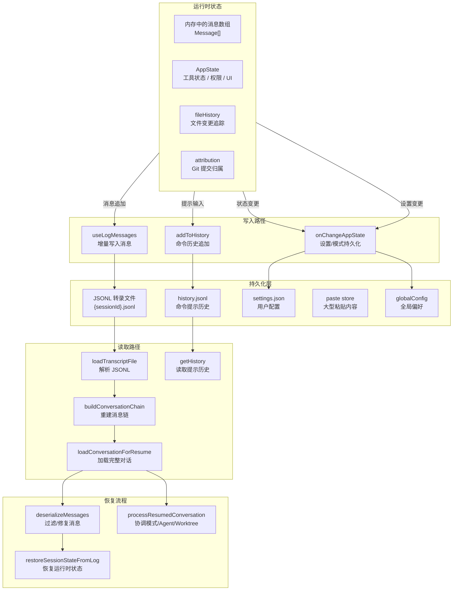
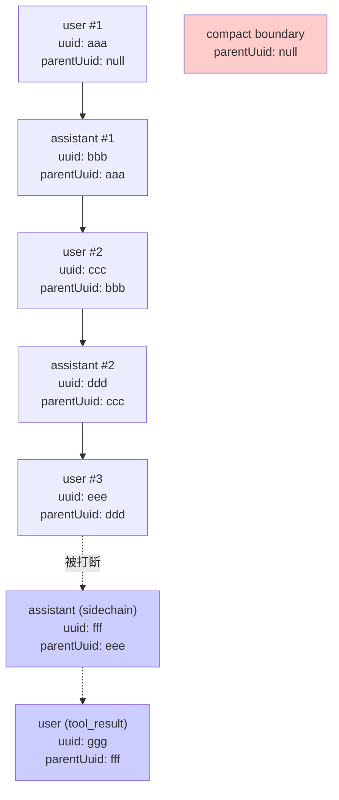

# 第 30 章 对话历史的持久化与恢复

## 为什么 Agent 需要记忆

想象一下：你让 Claude Code 执行一个复杂的多步重构任务。在第三步时，你的网络断了，终端进程被杀掉。第二天你重新打开终端，输入 `claude --continue`。

一个好的 Agent 应用应该做到什么？它应该精确地恢复到你离开时的状态——对话消息、工具执行结果、文件变更历史、甚至你当时使用的模型和权限模式。不是模糊的近似，不是从头开始，而是像什么都没发生过一样继续。

这就是对话历史持久化与恢复要解决的核心问题。在传统 Web 应用中，持久化通常只是数据的 CRUD。但在 Agent 应用中，持久化的范畴远不止于此——它包括了对话消息链、工具执行状态、文件变更追踪、Agent 上下文、权限模式、MCP 连接状态等等一整套运行时上下文。

Claude Code 的持久化系统是一个多层次、多格式、多路径的复杂架构。让我们逐层拆解。

## 持久化架构全景



这张图展示了两个核心方向：**写入路径**（从运行时状态到磁盘）和**读取路径**（从磁盘到运行时状态）。我们分别讨论。

## 写入路径：JSONL 转录与增量追加

### 转录文件格式

Claude Code 的对话历史存储在 JSONL（JSON Lines）文件中，每个会话一个文件。文件路径遵循 `~/.claude/projects/{project}/{sessionId}.jsonl` 的命名规则。

每行是一个独立的 JSON 对象，代表一条转录条目（Entry）。条目的类型包括：

- **user**：用户消息
- **assistant**：助手响应
- **attachment**：附件（文件、目录、技能等）
- **system**：系统消息（包括压缩边界标记）
- **custom-title / tag / agent-setting / mode** 等元数据条目

每条消息都有一个 `uuid`（唯一标识符）和 `parentUuid`（指向上一条消息的 uuid），形成一条链表结构。这意味着转录文件不是简单的追加日志，而是一棵以 parentUuid 为边的有向无环图（DAG）。



**为什么用 DAG 而不是简单的数组？** 因为并行工具调用。当 Agent 同时调用多个工具时，每个工具的 assistant 消息和 tool_result 消息形成独立的分支，最终在下一个用户消息处汇合。DAG 结构能精确表达这种分支和汇合关系。

**compact boundary 是什么？** 当对话历史过长时，Claude Code 会执行上下文压缩（compaction），将旧消息总结为一条摘要。compact boundary 标记了压缩发生的位置，它的 `parentUuid` 为 null，表示一条新的链的起点。

### 增量写入机制

消息不是每条都即时写入磁盘的。Claude Code 使用了一个缓冲写入机制，定义在 `utils/sessionStorage.ts` 的 `SessionFileWriter` 类中：

**延迟物化（Lazy Materialization）。** 会话文件并不是在进程启动时就创建的。在第一个用户或助手消息到来之前，所有条目只缓存在内存中（`pendingEntries` 数组）。只有当真正的对话消息到来时，才会调用 `materializeSessionFile()` 创建文件并刷新缓存。

这种设计的原因是：许多会话（如后台任务、测试运行）可能在产生任何实际对话之前就结束了。延迟物化避免了为这些短暂会话创建无意义的空文件。

**队列化批量写入。** `SessionFileWriter` 维护了一个按文件路径分组的写入队列（`writeQueues: Map<string, QueueItem[]>`）。每个队列有一个 `MAX_CHUNK_BYTES` 上限。写入操作被批量收集，然后通过 `drainWriteQueue()` 一次性追加到文件中。

这种批量写入减少了系统调用的次数，提升了 I/O 吞吐量。对于 Agent 应用来说，一个工具执行可能产生多条消息（tool_use、tool_result、progress），批量写入确保这些消息作为一个整体被持久化。

**清理注册。** 通过 `registerCleanup`，在进程退出时执行最终的 `flush()`，确保所有缓冲的消息都被写入磁盘。这个清理机制处理了正常退出和信号中断（SIGINT、SIGTERM）两种场景。

### useLogMessages：React 到磁盘的桥梁

`hooks/useLogMessages.ts` 是连接 React 组件中的消息状态和磁盘转录文件的桥梁。它接收当前的 `Message[]` 数组，检测新增的消息，并调用 `recordTranscript()` 将它们写入 JSONL 文件。

这个钩子的核心挑战是**增量检测**：如何在消息数组频繁变化的场景下（正常追加、压缩截断、倒回操作），精确识别出需要写入磁盘的新消息？

源码中的解决方案使用了几个引用（refs）来跟踪状态：

- `lastRecordedLengthRef`：上次记录的消息长度
- `firstMessageUuidRef`：数组中第一条消息的 UUID（用于检测压缩导致的数组重建）
- `lastParentUuidRef`：上一条记录的消息的 UUID（用于构建 parentUuid 链）

通过对比当前数组的第一条消息 UUID 和 ref 中存储的值，可以区分三种情况：

1. **增量追加**（UUID 相同，长度增加）：只写入新增的尾部消息
2. **压缩/重建**（UUID 变化）：从零开始重新扫描整个数组
3. **尾部缩减**（UUID 相同，长度减少）：倒回或删除操作，需要特殊处理

这种增量检测机制确保了：正常对话时只写入新消息（O(1)），压缩后重建时全量扫描（O(n)，但压缩本身就很低频）。

## 读取路径：从磁盘到运行时

### loadTranscriptFile：解析 JSONL

`loadTranscriptFile` 是读取路径的入口。它读取一个 JSONL 文件，解析每一行，并返回丰富的结构化数据：

```typescript
export async function loadTranscriptFile(filePath: string, opts?): Promise<{
  messages: Map<UUID, TranscriptMessage>
  summaries: Map<UUID, string>
  customTitles: Map<UUID, string>
  tags: Map<UUID, string>
  agentNames: Map<UUID, string>
  // ... 还有十几个 Map
  leafUuids: Set<UUID>
}>
```

返回值中的核心数据结构是 `messages: Map<UUID, TranscriptMessage>`——所有消息按 UUID 索引。`leafUuids` 是所有没有子节点的消息 UUID 集合（即 DAG 的叶子节点）。

对于大型转录文件（超过阈值），`loadTranscriptFile` 会执行**预压缩跳过优化**：只读取最后一个 compact boundary 之后的内容，跳过之前的历史。这可以显著减少内存占用——一个 150MB 的转录文件，压缩后只需要读取 32MB 的有效数据。

这个优化由 `sessionStoragePortable.ts` 中的 `readHeadAndTail` 函数实现。它不是读取整个文件，而是分别读取文件头部和尾部，中间的内容跳过。源码中定义了明确的阈值：

- `LITE_READ_BUF_SIZE`：头尾缓冲区大小（1KB）
- `SKIP_PRECOMPACT_THRESHOLD`：当文件超过此大小时，启用预压缩跳过

这种"只读两头"的策略是一个经典的**大文件随机访问模式**：头部的 compact boundary 列表告诉你哪些部分是有效的，尾部的最新消息是真正需要加载的内容，中间的历史摘要可以安全跳过。

### buildConversationChain：从 DAG 到线性序列

磁盘上的消息是 DAG 结构，但对话 API 需要的是线性序列。`buildConversationChain` 函数负责这个转换：

```typescript
export function buildConversationChain(
  messages: Map<UUID, TranscriptMessage>,
  leafMessage: TranscriptMessage,
): TranscriptMessage[]
```

它从最新的叶子节点开始，沿着 `parentUuid` 向前回溯，直到根节点。然后将结果反转，得到从旧到新的线性序列。

这个回溯过程有一个精妙的细节：**循环检测**。如果 parentUuid 链中出现了循环（通常是文件损坏导致的），函数会记录错误并返回部分结果，而不是无限循环：

```typescript
if (seen.has(currentMsg.uuid)) {
  logError(new Error(`Cycle detected in parentUuid chain...`))
  break
}
```

### 并行工具结果的恢复

在 DAG 到线性序列的转换中，有一个棘手的问题：并行工具调用。当 Agent 同时调用多个工具时，每个工具的 assistant 消息和 tool_result 构成一条独立的链。如果只沿着一条链回溯，其他分支的消息就会丢失。

`recoverOrphanedParallelToolResults` 函数解决了这个问题。它在主链回溯完成后，扫描所有不在主链上的 assistant 消息（通过 `message.id` 找到同组的兄弟），以及它们的 tool_result，将它们插入到主链的正确位置。

源码注释详细描述了这个问题：

> Streaming emits one AssistantMessage per content_block_stop -- N parallel tool_uses -> N messages, distinct uuid, same message.id. Each tool_result's sourceToolAssistantUUID points to its own one-block assistant. The topology is a DAG; the walk above is a linked-list traversal and keeps only one branch.

## 恢复流程：从磁盘到活态会话

当用户执行 `claude --continue` 或 `claude --resume <sessionId>` 时，恢复流程被触发。这个流程涉及多个文件和函数的协作。

### loadConversationForResume：统一的加载入口

`utils/conversationRecovery.ts` 中的 `loadConversationForResume` 是恢复流程的入口函数。它支持三种加载源：

1. **undefined**（`--continue`）：加载最近一次会话
2. **string**（`--resume <sessionId>`）：加载指定 ID 的会话
3. **string**（.jsonl 文件路径）：直接从文件路径加载（跨项目恢复）

加载过程包括：

- 调用 `loadTranscriptFile` 和 `buildConversationChain` 获取原始消息
- 调用 `restoreSkillStateFromMessages` 恢复技能状态
- 调用 `deserializeMessagesWithInterruptDetection` 过滤和修复消息
- 调用 `processSessionStartHooks` 执行会话启动钩子
- 返回完整的恢复数据（消息、快照、元数据等）

### 消息反序列化：过滤与修复

`deserializeMessages` 函数对原始消息进行一系列清洗和修复：

1. **迁移旧附件类型**：将 `new_file` 转换为 `file`，将 `new_directory` 转换为 `directory`
2. **过滤无效权限模式**：从磁盘读入的 JSON 可能包含当前版本不认识的权限模式名称
3. **过滤未完成的工具调用**：如果会话在工具执行中间被中断，存在没有对应 tool_result 的 tool_use 块。这些未配对的工具调用必须被移除，否则 API 会报错
4. **过滤孤立的 thinking 消息**：流式传输可能产生只包含 thinking 内容的孤立助手消息
5. **检测中断状态**：判断会话是在用户输入阶段被中断（`interrupted_prompt`）还是在助手响应阶段被中断（`interrupted_turn`）

其中，中断检测的逻辑特别值得注意。它通过检查最后一条消息的类型来判断中断状态：

- 最后是 user 消息 → 用户输入了但助手还没开始响应（`interrupted_prompt`）
- 最后是 tool_result 消息 → 助手在执行工具过程中被中断（`interrupted_turn`）
- 最后是 assistant 消息 → 助手完成了响应（`none`，正常结束）

对于 `interrupted_turn` 的情况，系统会自动注入一条合成消息 "Continue from where you left off."，让 Agent 在恢复后自动继续未完成的任务。

### processResumedConversation：协调恢复

`utils/sessionRestore.ts` 中的 `processResumedConversation` 是恢复流程的协调者。它处理以下关注点：

**会话 ID 切换。** 如果不是 fork 模式，恢复流程会通过 `switchSession()` 切换到恢复的会话 ID。这使得后续的所有写入操作（新消息、元数据更新）都写入被恢复的会话文件。

**Coordinator 模式匹配。** 如果当前进程的模式（coordinator/normal）与恢复会话的模式不同，会产生一条警告消息。

**Agent 设置恢复。** 如果恢复的会话使用了自定义 Agent（通过 `agentSetting`），会从 Agent 定义列表中查找并恢复对应的 Agent 配置，包括模型覆盖。

**Worktree 恢复。** 如果恢复的会话在 Git Worktree 中运行，会切换到对应的 Worktree 目录。如果 Worktree 目录已被删除（`process.chdir` 抛出 ENOENT），会优雅地回退。

**初始状态计算。** 将所有恢复的上下文（Agent 定义、归属状态、独立 Agent 上下文等）合并为一个新的 `initialState`，传给 `AppStateProvider`。

### restoreSessionStateFromLog：运行时状态恢复

最后，`restoreSessionStateFromLog` 将磁盘上的快照数据注入到 AppState 中：

- **文件历史恢复**：从快照重建 `fileHistory` 状态
- **归属状态恢复**：从快照重建 `attribution` 状态
- **上下文压缩日志恢复**：重建 context collapse 的提交日志和暂存快照
- **Todo 恢复**：从转录消息中扫描最后的 TodoWrite 工具调用，提取待办事项列表

### Agent 元数据 Sidecar 文件

除了 JSONL 转录文件外，Claude Code 还为每个子 Agent 维护了一个元数据 sidecar 文件。它存储在 `~/.claude/projects/{project}/{sessionId}/subagents/agent-{agentId}.meta.json`：

```typescript
export type AgentMetadata = {
  agentType: string        // Agent 类型（如 "general", "code-review"）
  worktreePath?: string    // Worktree 路径（如果有）
  description?: string     // 原始任务描述
}
```

为什么用 sidecar 文件而不是扩展 JSONL schema？源码注释给出了答案：

> Sidecar file avoids JSONL schema changes.

这是一个经典的**元数据分离模式**：主数据（转录）的格式保持稳定，而元数据（Agent 类型、Worktree 路径）以独立的辅助文件存储。这使得转录格式的读写逻辑不需要因为新的元数据需求而频繁变更。

恢复时，`readAgentMetadata` 从 sidecar 文件读取 Agent 类型，确保恢复的 Agent 使用正确的系统提示词和工具集，而不是降级到默认的通用模式。

对于远程 Agent，还有一个类似的 `RemoteAgentMetadata` sidecar，存储了远程任务的 ID、CCR 会话 ID 和任务类型，用于在恢复时从 API 获取最新的远程任务状态。

## 命令提示历史：history.jsonl

除了完整的对话转录，Claude Code 还维护了一个独立的命令提示历史文件 `~/.claude/history.jsonl`。这个文件由 `history.ts` 模块管理，记录用户在提示框中输入的所有命令。

### 设计特点

**项目隔离与会话优先。** 读取历史时，当前会话的条目优先展示，其他会话的条目作为补充。这保证了在多个并行会话中，Up-arrow 键看到的首先是当前会话的命令。

**去重。** 通过 `Set<string>` 按显示文本去重，避免重复命令污染历史。

**粘贴内容的存储策略。** 用户粘贴的内容有两种存储方式：
- 小于 1KB 的文本直接内联存储在历史条目中
- 大于 1KB 的文本通过哈希引用存储在外部的 paste store 中

这种分层存储策略平衡了历史文件的大小和内容完整性。

**延迟写入与清理。** 历史条目先缓存在 `pendingEntries` 数组中，然后异步刷新到磁盘。进程退出时通过 `registerCleanup` 确保缓冲区被排空。

**撤销最近条目。** `removeLastFromHistory` 支持撤销最近一次历史记录。这用于 Esc 键中断恢复的场景：当用户按 Esc 取消了刚输入的提示，对应的历史条目也应该被移除，避免 Up-arrow 键看到已取消的命令。

## 会话持久化的用户体验意义

为什么 Claude Code 要花这么大的力气在持久化上？因为对 Agent 应用来说，持久化不是锦上添花，而是**核心用户体验**。

**Agent 任务通常跨越长时间。** 一个复杂的代码重构可能需要几分钟甚至几十分钟。如果没有可靠的持久化，任何意外中断（网络断开、进程崩溃、误操作 Ctrl+C）都会导致所有进度丢失。这对用户来说是不可接受的。

**Agent 的上下文是累积的。** 对话历史不仅是消息记录，更是 Agent 理解项目上下文的载体。每次对话中，Agent 逐步建立了对项目结构、代码风格、用户偏好的理解。如果这些理解在每次会话后丢失，Agent 永远只能是一个"没有记忆的助手"。

**多会话并行是常见场景。** 开发者可能同时在多个终端中运行 Claude Code，处理不同的任务。独立会话的持久化确保了并行任务之间不会互相干扰。

**审查和审计需要。** 完整的对话转录提供了 Agent 行为的审计轨迹。当 Agent 做出了意料之外的变更时，用户可以通过转录文件回溯完整的决策链。

## 能学到什么

1. **持久化的粒度决定了恢复的完整性。** 只保存消息是远远不够的。工具状态、权限模式、文件变更历史、Agent 定义——每一个遗漏的字段都可能导致恢复后的行为不一致。Claude Code 的持久化覆盖了超过 15 种不同类型的状态。

2. **DAG 结构比线性数组更适合表达对话历史。** 并行工具调用、压缩边界、侧链分支——这些都是线性数组无法自然表达的结构。DAG + parentUuid 的设计虽然增加了读写复杂度，但换来了语义的精确性。

3. **延迟物化是避免资源浪费的关键。** 不是所有会话都需要持久化。后台任务、测试运行、短暂查看——这些场景下创建文件只是增加了垃圾。延迟到真正需要时再创建文件，是一种务实的优化。

4. **恢复流程需要处理历史版本兼容。** 磁盘上的数据可能是任意历史版本写入的。旧附件类型、废弃的权限模式名称、pre-compact 的消息结构——恢复流程必须对每种历史格式都做兼容处理。

5. **增量写入 + 批量刷洗是 I/O 性能的最佳平衡。** 每条消息都即时写盘太慢，全量缓存到退出再写又太危险。增量检测 + 缓冲队列 + 批量写入 + 进程退出保障，这四者的组合在性能和可靠性之间找到了最佳平衡点。

6. **中断检测和自动续行是 Agent 体验的关键差异。** 普通聊天应用只需恢复消息。Agent 应用需要检测中断发生在哪个阶段，并自动注入续行指令。这种"无感恢复"是 Agent 应用区别于传统应用的核心体验升级。

7. **Sidecar 文件模式保持主格式的稳定性。** 当需要为已有序列化格式添加新字段时，使用独立的辅助文件而非修改主格式 schema。转录文件不需要因为 Agent 元数据的需求而变更其读写逻辑，新类型的 sidecar 文件可以随时添加而不影响现有代码。
