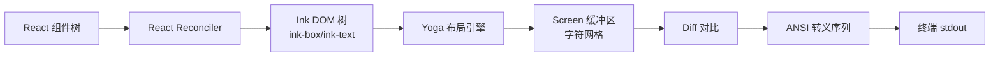
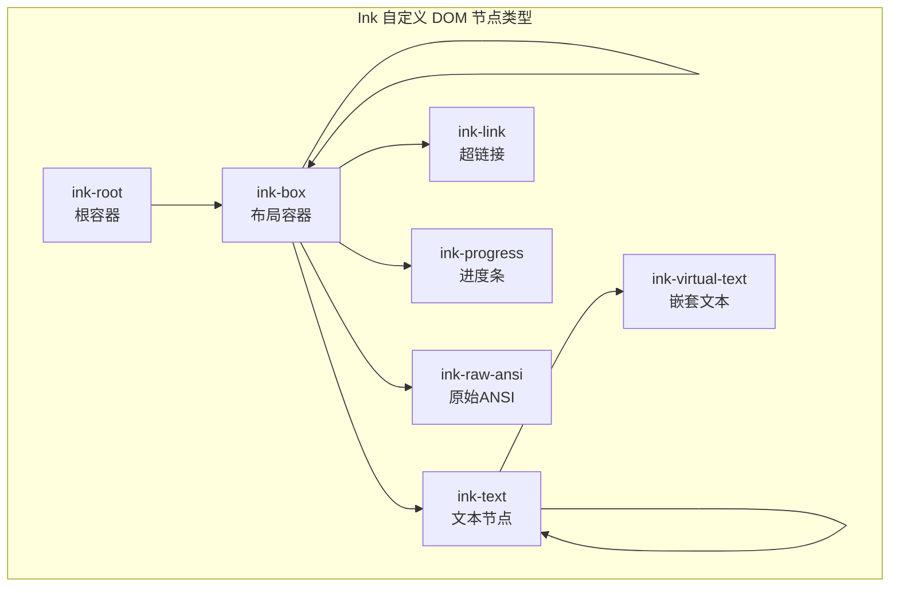
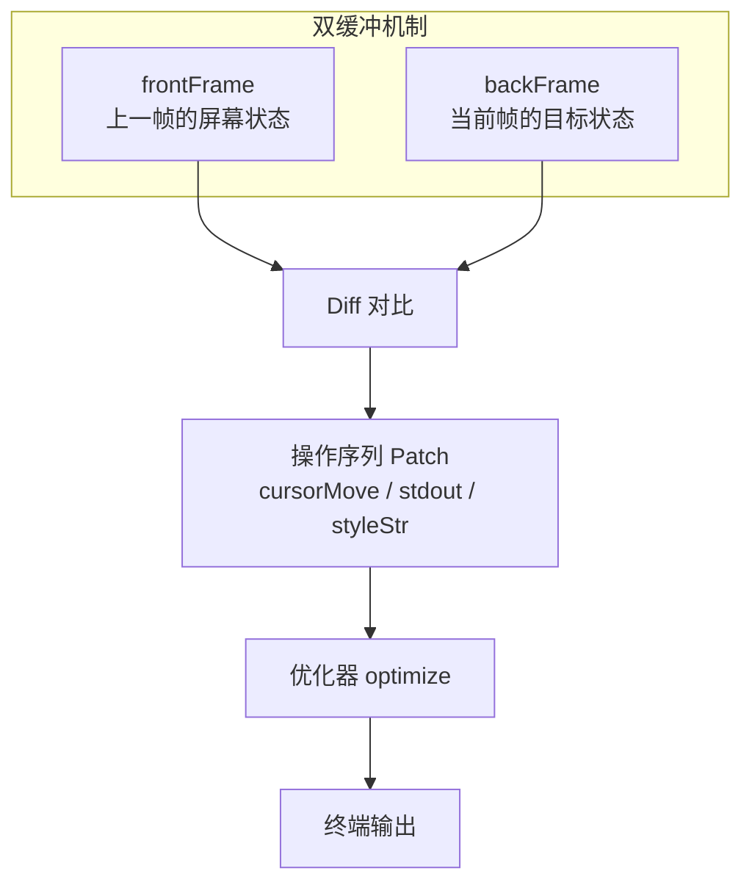
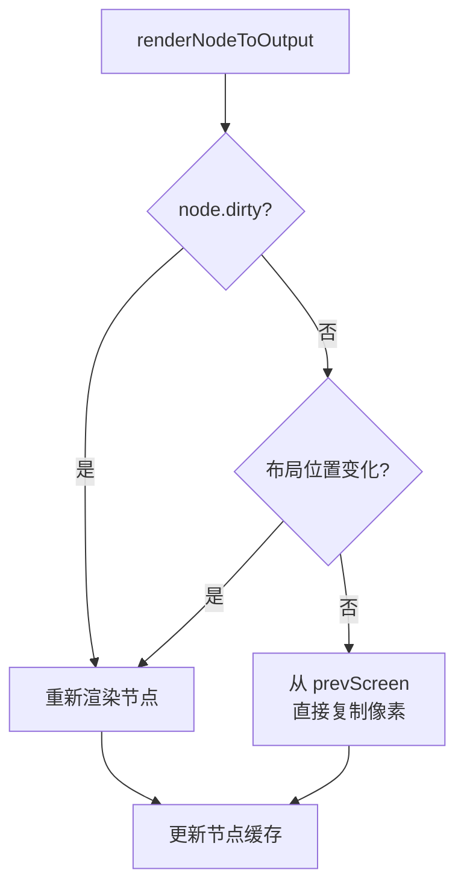
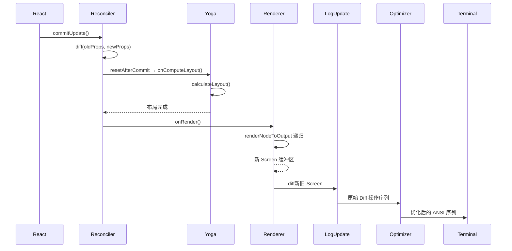

# 第 31 章：React 在终端——Ink 框架的设计

## 设计之问：为什么要在终端里用 React？

当提到"React"，绝大多数开发者的第一反应是浏览器、DOM、网页。然而 Claude Code 选择了在终端环境中深度使用 React 来构建其整个用户界面。这个决策乍看反直觉，但仔细分析后会发现它解决了一个核心问题：**终端 UI 的状态管理复杂性**。

一个 AI Agent 的终端界面远非简单的"打印文字"。它需要同时展示流式输出的 AI 回复、正在执行的工具调用状态、用户输入框、滚动列表、权限确认弹窗、搜索高亮——而且所有这些元素都在不断变化。如果用命令式代码逐帧拼接 ANSI 转义序列，代码会迅速退化成难以维护的"意大利面条"。

React 的声明式模型提供了一种解法：开发者只需描述"界面应该长什么样"，框架负责高效地将描述转化为终端输出。Claude Code 并没有直接使用开源的 Ink 框架，而是在 `ink/` 目录下维护了一个深度定制的 fork，添加了选择支持、搜索高亮、点击事件、alternate screen 模式和终端 I/O 解析等关键能力。

## Ink 的核心架构

### 从 React 组件到终端像素

Ink 的核心思路是建立一个与浏览器 DOM 类似的"虚拟 DOM"，但最终输出目标不是浏览器像素，而是终端的字符网格。整个渲染管线如下：



让我们逐一拆解这个管线的每个阶段。

### React Reconciler：连接 React 与终端的桥梁

在 `ink/reconciler.ts` 中，Ink 使用了 `react-reconciler` 这个底层 API 来创建自定义的 React 渲染器。这不是常见的 `ReactDOM`，而是一个完全独立的宿主环境实现：

```typescript
const reconciler = createReconciler<
  ElementNames,    // 宿主元素类型：ink-box, ink-text 等
  Props,
  DOMElement,      // 容器节点类型
  DOMElement,      // 实例节点类型
  TextNode,        // 文本节点类型
  // ... 其他泛型参数
>({
  createInstance(originalType, newProps, _root, hostContext) {
    const node = createNode(type)
    for (const [key, value] of Object.entries(newProps)) {
      applyProp(node, key, value)
    }
    return node
  },
  commitUpdate(node, _type, oldProps, newProps) {
    const props = diff(oldProps, newProps)
    // 增量更新：只处理变化的属性
  },
  // ...
})
```

这里的设计哲学值得深入思考：

**为什么用 `createReconciler` 而不是简单的模板引擎？** 因为 React Reconciler 提供了完整的组件生命周期管理、状态更新调度、批量更新、优先级队列等基础设施。这些在浏览器中理所当然的能力，在终端环境中同样宝贵。想象一个 Spinner 组件每 100ms 更新一次——如果没有调度器，每次更新都会触发完整的终端重绘。

**自定义 DOM 节点类型**的设计也很有讲究。Ink 定义了 `ink-root`、`ink-box`、`ink-text`、`ink-virtual-text`、`ink-link`、`ink-progress`、`ink-raw-ansi` 等有限的节点类型。这个类型集合非常克制，每一类都对应终端渲染的一个真实需求：

- `ink-box` 对应 Flexbox 布局容器
- `ink-text` 对应文本渲染单元
- `ink-virtual-text` 处理嵌套在 Text 内部的 Text（避免递归布局）
- `ink-raw-ansi` 直接输出预渲染的 ANSI 内容（跳过文本处理管线）



### Yoga 布局引擎：终端中的 Flexbox

终端本质上是一个等宽字符网格，每个"像素"是一个字符单元格。在这种环境下实现布局听起来简单——直接逐行输出不就行了？但实际上，复杂的 UI 需要嵌套的弹性布局、自动换行、边距、对齐等能力。

Ink 选择了 Facebook 的 Yoga 布局引擎（即 React Native 使用的同一引擎）。Yoga 实现了 CSS Flexbox 的一个子集，这使得 Ink 的 `<Box>` 组件支持 `flexDirection`、`flexGrow`、`padding`、`margin` 等属性——与 Web 开发者的心智模型高度一致。

在 `ink/layout/engine.ts` 中，每个 Ink DOM 节点都关联一个 Yoga 节点，布局计算通过 `calculateLayout()` 完成：

```typescript
// ink/dom.ts 中的节点结构
type DOMElement = {
  nodeName: ElementNames
  yogaNode?: LayoutNode    // Yoga 布局节点
  style: Styles
  dirty: boolean           // 脏标记
  // ...
}
```

**为什么 Yoga 而不是自己写布局？** 终端布局有一个独特挑战：文本宽度不统一。CJK 字符占 2 个单元格，emoji 可能占 2 个甚至更多，组合字符的宽度更是不确定。Yoga 通过 `measureFunc` 回调让 Ink 报告文本的实际宽度，从而正确计算布局。在 `ink/measure-text.ts` 中实现了精确的字符宽度测量。

### Screen 缓冲区与增量渲染



这是 Ink 渲染管线中最精妙的部分。在 `ink/renderer.ts` 中，渲染器接收一个 DOM 树，将其"绘制"到一个 Screen 缓冲区中。Screen 是一个二维字符网格，每个单元格包含字符、样式 ID、宽度信息和超链接。

关键在于双缓冲机制：

1. **frontFrame** 保存上一帧渲染后的 Screen 状态
2. **backFrame** 是当前帧正在构建的 Screen 状态
3. 渲染完成后，通过 `LogUpdate` 对比两帧的差异，只输出变化的 ANSI 指令

`ink/log-update.ts` 中的 `LogUpdate` 类负责这个 diff 过程。它逐行逐列对比两个 Screen 缓冲区，生成一个操作序列（`Diff` 类型），包括：
- `stdout`：输出文本
- `cursorMove`：移动光标
- `styleStr`：改变文字样式
- `cursorTo`：定位到绝对坐标

然后 `ink/optimizer.ts` 进一步优化这个操作序列——合并连续的 `cursorMove`、取消紧邻的 hide/show 光标操作、合并相邻的样式切换等。这种优化在终端环境中极为重要，因为每个 ANSI 转义序列都会增加 stdout 的数据量，在 tmux 或 SSH 等延迟较高的环境下尤其关键。

## Claude Code 的定制化扩展

### 为什么需要深度 Fork？

Claude Code 对 Ink 的 fork 不是小修小补。原始 Ink 框架主要面向简单的终端应用（选择菜单、进度条、短列表），而 Claude Code 需要构建一个**全功能的终端 IDE 级别界面**。这带来了一系列原始 Ink 无法支持的需求：

### 文本选择系统

在 `ink/selection.ts` 中，Claude Code 实现了完整的终端文本选择功能。这在终端应用中极其罕见——大多数终端应用依赖终端模拟器自身的选择功能，但 alternate screen 模式下原生的选择行为不可靠。

选择系统追踪 anchor（起始点）和 focus（当前位置）两个屏幕坐标，支持字符模式、词模式和行模式三种选择粒度。还处理了一个有趣的问题：**拖动选择时内容滚出视口**——通过 `scrolledOffAbove` 和 `scrolledOffBelow` 累积器保存已滚出视口的文本。

### 搜索高亮

`ink/searchHighlight.ts` 实现了屏幕缓冲区级别的搜索高亮。它遍历 Screen 的每一个单元格，构建每行的文本映射（处理宽字符、跳过不可选区域），然后用 `indexOf` 匹配查询字符串。匹配到的单元格通过样式池（StylePool）应用反色效果。

更有趣的是 `ink/render-to-screen.ts` 中的"侧渲染"机制：为了定位搜索结果在特定消息中的精确位置，它会为单条消息创建一个独立的 React 渲染树，渲染到一个临时 Screen 中，扫描匹配位置后卸载。这种"渲染-扫描-丢弃"的模式约 1-3ms 每次调用。

### 点击事件与 hit-test

`ink/events/click-event.ts` 定义了鼠标点击事件，支持坐标冒泡（从最深的命中节点向上冒泡到祖先节点）、局部坐标转换（相对于当前 Box 的坐标而非屏幕坐标）和空白区域检测。

`ink/hit-test.ts` 实现了 hit-test 逻辑：给定屏幕坐标，遍历 DOM 树找到该位置的最深层可见节点。这要求每个节点的布局位置（由 Yoga 计算）都被正确缓存。

### Alternate Screen 模式

`ink/components/AlternateScreen.tsx` 封装了终端的 alternate screen buffer（DEC 1049）。进入 alternate screen 后，应用占据整个终端视口，原生滚动被禁用，所有滚动必须由应用自己实现。这是 Claude Code 全屏模式的基础。

同时启用了 SGR 鼠标追踪，使终端报告鼠标事件（点击、拖拽、滚轮），这些事件被解析后用于文本选择和滚动控制。

### 终端 I/O 解析器

`ink/termio/` 目录包含了一个完整的终端 I/O 解析器，能解析 CSI（Control Sequence Introducer）、OSC（Operating System Command）、DEC（Digital Equipment Corporation）等各类终端转义序列。这是正确处理终端输入的关键——用户的按键可能是一个简单的字符，也可能是一个复杂的多字节转义序列。

`ink/parse-keypress.ts` 使用这个解析器来识别键盘输入，支持功能键、修饰键组合、Kitty 键盘协议（CSI u）和 xterm modifyOtherKeys 等多种终端输入协议。

## 渲染管线中的脏标记与 Blit 优化



在 `ink/render-node-to-output.ts` 中，有一个精心设计的缓存机制。每个 DOM 节点都有一个 `dirty` 标志和一个位置缓存（`nodeCache`）。如果一个节点既没有内容变化，位置也没有移动，渲染器会直接从上一帧的 Screen 缓冲区复制（blit）该节点的像素，完全跳过重新渲染。

这个优化在长对话场景中极其重要。想象一个包含 100 条消息的对话，当底部 Spinner 更新时，上面 99 条消息都没有变化。Blit 机制使得只有 Spinner 区域需要重新渲染，其余 99 条消息直接从缓存复制。

但是，这个优化有一个微妙的陷阱：**脏污染传播**。如果一个脏节点溢出了它的边界（没有 `overflow: hidden`），它右边或下方的兄弟节点的缓存可能包含来自脏节点的溢出内容。`renderChildren` 函数通过 `seenDirtyChild` 标志来处理这个问题——一旦遇到一个脏子节点，后续所有兄弟节点都禁用 blit，强制重新渲染。

## 设计启示

### 声明式 UI 的普适价值

Ink 的成功证明了一个重要观点：**声明式 UI 模型的价值不依赖于特定的渲染目标**。React 的组件模型、状态管理和调度机制在任何需要管理复杂 UI 状态的场景中都有效——无论是浏览器、终端、还是未来的任何显示介质。

### 深度 Fork 的取舍

Claude Code 选择深度 Fork 而非贡献回上游，说明当一个框架的使用场景远远超出其原始设计目标时，Fork 可能是更务实的选择。Claude Code 需要的文本选择、搜索高亮、alternate screen 等能力，对于一个通用终端 UI 框架来说过于特化了。

### 终端渲染的性能意识

终端渲染有一个 Web 渲染所没有的独特性能瓶颈：**带宽**。每一个字符变化都需要通过 stdout 传输 ANSI 转义序列，在 SSH 或 tmux 环境中，这个带宽可能非常有限。Ink 的增量 diff、操作优化和 blit 缓存都是针对这个瓶颈的优化。这提醒我们，性能优化必须针对真实的瓶颈，而非假设的瓶颈。

### 有限类型系统的力量

Ink 的 DOM 节点类型非常有限（只有 7 种），但这反而是一种优势。有限的类型集使得每个类型的语义非常明确，渲染逻辑可以被高度特化。与浏览器的 100+ 种 HTML 元素相比，这种克制减少了边界情况，提高了渲染效率。

## 从 Reconciler 到终端：一次完整渲染的生命周期

为了将上述所有概念串联起来，让我们跟踪一次完整的渲染周期——从用户输入触发状态更新，到终端屏幕上出现新的像素。

### 第一步：React Commit

用户输入一条消息，React 状态更新触发组件重渲染。React Reconciler（在 `ink/reconciler.ts` 中定义）调用 `createInstance`、`commitUpdate` 等方法，将 React 组件树的变化映射到 Ink DOM 树。例如，一条新的消息会创建若干 `ink-box` 和 `ink-text` 节点。

`commitUpdate` 中有一个重要的增量 diff 逻辑——对比新旧 props，只处理变化的属性：

```typescript
commitUpdate(node, _type, oldProps, newProps) {
  const props = diff(oldProps, newProps)
  const style = diff(oldProps['style'], newProps['style'])
  // 只更新变化的属性和样式
}
```

### 第二步：resetAfterCommit 触发布局

在 `reconciler.ts` 的 `resetAfterCommit` 回调中，Ink 调用 `rootNode.onComputeLayout()`，这会触发 Yoga 的 `calculateLayout()`。Yoga 递归遍历所有节点，使用 Flexbox 算法计算每个节点的精确位置和大小。

对于包含文本的节点，Yoga 通过 `measureFunc` 回调询问 Ink 文本的实际尺寸。这个回调会执行字符宽度测量（区分 ASCII、CJK、emoji 等不同宽度的字符）和自动换行计算——这是布局中最昂贵的操作。

### 第三步：onRender 触发 Screen 渲染

布局完成后，`resetAfterCommit` 调用 `rootNode.onRender()`，这触发 Ink 实例的渲染循环。渲染调用 `createRenderer` 返回的 renderer 函数（在 `ink/renderer.ts` 中），将整个 DOM 树"绘制"到 Screen 缓冲区。

`renderNodeToOutput`（在 `ink/render-node-to-output.ts` 中）递归遍历 DOM 树，对每个节点：

1. 检查 dirty 标志和位置缓存
2. 如果未变化，从 prevScreen blit
3. 如果变化了，根据节点类型渲染（ink-text 写文本、ink-box 处理子节点和裁剪）
4. 更新 nodeCache

### 第四步：LogUpdate 生成 Diff

渲染完成后，Ink 拿到新的 Screen 缓冲区。`LogUpdate`（在 `ink/log-update.ts` 中）将新 Screen 与上一帧的 Screen 逐单元格对比，生成一个操作序列（cursorMove、stdout、styleStr 等）。

### 第五步：Optimizer 压缩输出

`optimize()`（在 `ink/optimizer.ts` 中）对操作序列进行合并优化，减少实际的 stdout 输出量。

### 第六步：写入终端

最终，优化后的操作序列被转化为 ANSI 转义序列，通过 `process.stdout.write()` 写入终端。终端解析这些序列，更新屏幕显示。



这个完整的管线每秒可能执行 30-60 次（在有动画或流式输入时），每次都必须在 16ms 以内完成。任何阶段的性能退化都会导致终端 UI 的卡顿——没有浏览器的"跳帧"机制，终端渲染是同步的，一帧超时就意味着用户感知到延迟。

### ink.tsx：管线的调度中心

`ink/ink.tsx` 是整个渲染管线的调度中心。它管理 React FiberRoot 的创建、帧率控制（`FRAME_INTERVAL_MS`）、前后帧的交换、以及各种边缘情况的处理（终端 resize、信号恢复等）。

这个文件虽然庞大（超过 5000 行），但核心逻辑清晰：**React 负责描述 UI，Yoga 负责计算布局，Screen 负责存储像素，LogUpdate 负责 diff，stdout 负责输出**。每一层只关心自己的职责，通过清晰的接口连接。

## 小结

Ink 框架的设计证明了一个重要论点：React 的组件模型不仅适用于浏览器，也适用于任何需要管理复杂 UI 状态的环境。Claude Code 的深度 Fork 进一步扩展了这个模型，添加了终端应用所需的文本选择、搜索高亮、鼠标交互和 alternate screen 等能力。这些扩展不是对原始设计的背叛，而是对其设计空间的自然延伸——当你把"屏幕"从浏览器像素替换为终端字符网格时，新的需求自然涌现，而 React 的声明式模型为满足这些需求提供了优雅的架构基础。
