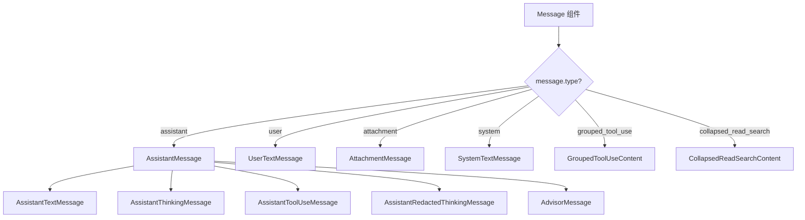
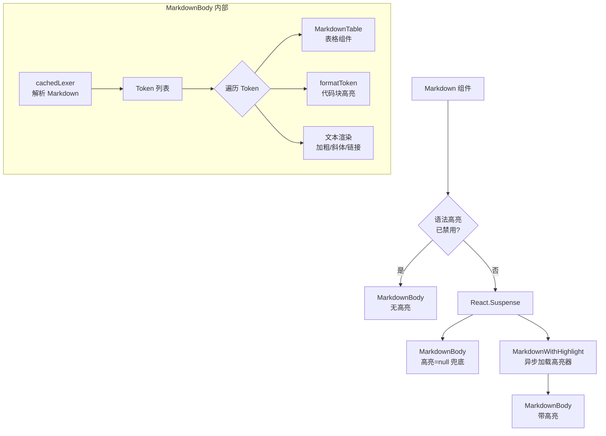
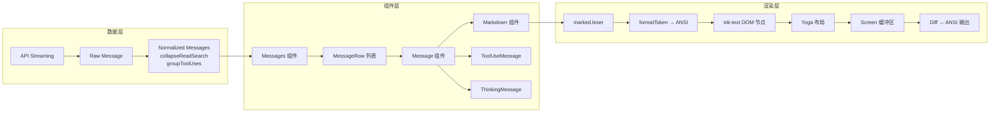
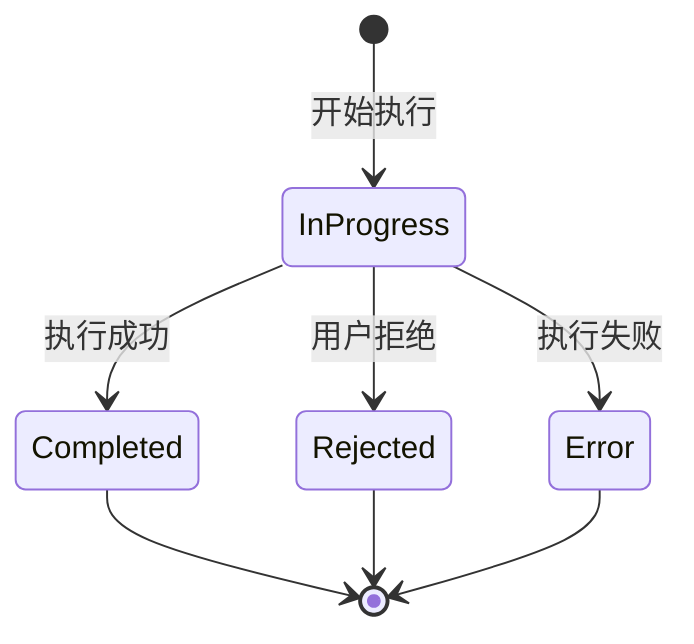

# 第 32 章：消息渲染——从 AI 输出到终端显示

## 设计之问：流式文本如何在终端中美观地呈现？

AI Agent 的核心用户体验可以用一句话概括：**用户发送消息，AI 的回复逐步"流"出来，同时工具调用实时展示状态，整个过程行云流水**。但"流出来"这三个字背后，隐藏着一系列复杂的工程挑战。

AI 的回复不是一段静态文本。它以 token 为单位逐个到达（每秒约 30-60 个 token），可能是 Markdown 格式、包含代码块、列表、表格，甚至还有行内工具调用的状态更新。在终端环境中，流式渲染面临三个独特难题：

1. **格式连续性**：Markdown 的代码块需要 ` ``` ` 包裹，但 token 到达时我们不知道后面是否还有更多内容。如果过早闭合代码块，用户会看到格式闪烁。
2. **终端宽度限制**：终端的列宽是固定的（通常 80-120 列），文本必须正确换行，而且宽字符（中文、emoji）占 2 列。
3. **样式叠加**：语法高亮需要 ANSI 转义序列，但多个转义序列在换行边界上的行为极其脆弱。

Claude Code 的消息渲染系统通过精心设计的组件层级和缓存策略解决了这些问题。

## 消息类型的组件层级

### 从消息到组件的映射

Claude Code 处理的消息类型远比"一段文本"复杂。在 `components/Message.tsx` 中，一个 `Message` 组件根据消息类型分发到不同的渲染组件：



这种分层设计遵循了一个重要原则：**消息的渲染逻辑应该与消息的数据结构解耦**。同样的"助手消息"可能包含文本块、思考块和工具调用块，每种块的渲染方式完全不同。通过将每种内容类型抽象为独立的 React 组件，系统获得了极大的灵活性。

### AssistantTextMessage：最核心的渲染组件

在 `components/messages/AssistantTextMessage.tsx` 中，AI 的文本回复被包裹在 `<MessageResponse>` 和 `<Markdown>` 组件中：

```typescript
// 简化的渲染逻辑
<MessageResponse>
  <Box flexDirection="column">
    <Markdown>{text}</Markdown>
  </Box>
</MessageResponse>
```

看似简单，但这里的每一层都有其存在的理由：

- **MessageResponse** 提供消息级别的交互能力（展开/折叠、复制、操作菜单）
- **Box** 提供布局容器，确保文本宽度受限
- **Markdown** 负责将 Markdown 文本渲染为 ANSI 格式的终端输出

## Markdown 渲染引擎

### 解析与缓存策略

`components/Markdown.tsx` 是消息渲染系统中技术密度最高的组件之一。它使用 `marked` 库将 Markdown 解析为 token 树，然后通过 `formatToken` 将 token 转换为 ANSI 字符串。

这里有一个关键的性能优化——**模块级 token 缓存**：

```typescript
const TOKEN_CACHE_MAX = 500
const tokenCache = new Map<string, Token[]>()

function cachedLexer(content: string): Token[] {
  // 快速路径：无 Markdown 语法的纯文本
  if (!hasMarkdownSyntax(content)) {
    return [{ type: 'paragraph', raw: content, text: content }]
  }
  // LRU 缓存查询
  const key = hashContent(content)
  const hit = tokenCache.get(key)
  if (hit) {
    tokenCache.delete(key)
    tokenCache.set(key, hit) // 提升到 MRU
    return hit
  }
  // 解析并缓存
  const tokens = marked.lexer(content)
  tokenCache.set(key, tokens)
  return tokens
}
```

为什么用 `Map` 做缓存而不是 `useMemo`？因为虚拟滚动场景下，组件会被卸载再重新挂载，`useMemo` 的缓存在卸载时丢失。而 `Map` 是模块级的，跨组件生命周期持久存在。在长对话中滚动回到之前看过的消息时，缓存命中可以节省约 3ms/条 的解析时间。

更有趣的是 `hasMarkdownSyntax` 快速路径。大多数 AI 短回复和用户提示都是纯文本，不含 `#`、`` ` ``、`*`、`[` 等 Markdown 标记。通过正则采样前 500 个字符检测这些标记，纯文本直接跳过整个解析流程。

### 语法高亮的 Suspense 边界



语法高亮器的加载是异步的（`getCliHighlightPromise`），Markdown 组件使用 `React.Suspense` 来处理这个异步过程。在等待高亮器加载时，先用无高亮版本渲染，加载完成后自动切换。这种模式确保了用户不会因为高亮器加载慢而看到空白屏幕。

### 流式渲染的挑战与策略

AI 的回复是逐 token 流入的。这意味着 Markdown 组件接收到的 `children` 字符串在持续增长。每次增长都触发重新解析和重新渲染。这里有三个关键的工程决策：

**1. 增量解析而非全量重解析**

虽然 `marked.lexer` 是全量解析（从字符串开头到末尾），但由于 token 缓存的存在，只有内容确实变化时才重新解析。流式到达时内容确实在变化，但缓存的 key 是内容哈希，所以同一内容不会重复解析。

**2. 不完整的 Markdown 处理**

流式到达的一个特殊情况：可能当前文本以 ```` ```py` 结尾，代码块尚未闭合。`marked` 在这种情况下的行为是不确定的——它可能把未闭合的代码块当作普通文本。Claude Code 通过 `StreamingMarkdown` 组件（在 `components/Markdown.tsx` 中）处理这个问题，在流式渲染时添加适当的补全。

**3. 表格的特殊处理**

Markdown 表格在终端中的渲染非常特殊。等宽字体使得精确对齐成为可能，但也要求精确计算每列的宽度。`components/MarkdownTable.tsx` 使用 Ink 的 `<Box>` 组件以 Flexbox 布局来渲染表格，而非传统的字符拼接。这确保了表格在终端宽度变化时能正确重排。

## 消息渲染管线全景



### 消息标准化

在 `components/Messages.tsx` 中，原始消息经过多层变换才到达渲染层：

1. **normalizeMessages**：将 API 返回的原始消息标准化为统一的 `NormalizedMessage` 类型
2. **collapseReadSearchGroups**：将连续的文件读取和搜索操作折叠为可展开的分组
3. **collapseHookSummaries**：折叠 hook 执行摘要
4. **collapseBackgroundBashNotifications**：折叠后台 bash 通知
5. **applyGrouping**：将工具调用按逻辑关系分组

每一层折叠都服务于同一个目标：**减少视觉噪音，让用户聚焦于重要信息**。一个典型的 AI Agent 交互可能触发 10+ 次文件读取，如果全部展开显示，用户很难找到关键内容。

### 工具调用的状态渲染

工具调用（ToolUse）的渲染是 Agent 界面区别于普通聊天界面的核心。在 `components/messages/AssistantToolUseMessage.tsx` 中，每个工具调用有多个状态：



每个状态的渲染方式不同：

- **InProgress**：显示 Spinner + 工具名称 + 参数摘要
- **Completed**：显示工具结果（代码 diff、文件内容、命令输出等）
- **Rejected**：显示用户拒绝的原因
- **Error**：显示错误信息

工具结果的渲染尤其复杂。文件编辑操作需要展示 diff 视图（`components/FileEditToolDiff.tsx`、`components/StructuredDiff.tsx`），bash 命令需要展示终端输出，MCP 工具调用的结果格式则完全取决于工具本身。

### 思考过程的渲染

Claude 的"thinking"（扩展思考）块在 UI 中有两种状态：

- **Thinking（进行中）**：`components/messages/AssistantThinkingMessage.tsx` 显示一个脉动的思考指示器
- **Redacted Thinking（已编辑）**：`components/messages/AssistantRedactedThinkingMessage.tsx` 显示一段摘要

思考块的渲染有一个独特的挑战：它可能非常长（数千 token），但在界面上应该折叠显示。OffscreenFreeze（下一章详述）确保不可见的思考块不消耗渲染资源。

## Markdown 到 ANSI 的转化细节

### formatToken 的设计

`utils/markdown.ts` 中的 `formatToken` 函数是 Markdown 到 ANSI 转化的核心。它将 `marked` 解析出的每个 token 转化为带 ANSI 样式的字符串：

- **加粗**：使用 ANSI bold 序列 (`\x1b[1m`)
- **斜体**：使用 ANSI italic 序列 (`\x1b[3m`)
- **代码**：使用 ANSI 背景色模拟代码块
- **链接**：使用 OSC 8 超链接协议（如果终端支持）
- **标题**：使用 ANSI bold + 下划线

### 代码块的语法高亮

代码块的语法高亮使用了一个异步加载的高亮器（`utils/cliHighlight.ts`）。高亮器将代码文本转化为带 ANSI 颜色序列的字符串，每个 token（关键字、字符串、注释、标识符等）都有对应的颜色。

在 `ink/render-node-to-output.ts` 中，高亮后的代码块通过 `ink-text` 节点渲染。文本节点的渲染包含以下步骤：

1. **squashTextNodes**：将相邻的文本节点合并为样式段（StyledSegment）
2. **wrapText**：按终端宽度自动换行
3. **applyTextStyles**：将样式转化为 ANSI 转义序列
4. **output.write**：写入到 Screen 缓冲区

### OSC 8 超链接

一个容易被忽视的细节是 OSC 8 超链接支持。在 `ink/render-node-to-output.ts` 中，链接文本被包裹在 OSC 8 序列中：

```typescript
function wrapWithOsc8Link(text: string, url: string): string {
  return `${OSC}8;;${url}${BEL}${text}${OSC}8;;${BEL}`
}
```

这使得在支持 OSC 8 的终端（iTerm2、Ghostty、VS Code 终端等）中，Markdown 链接可以被点击。不支持的终端会忽略 OSC 序列，显示为普通文本。

## 流式渲染中的性能考量

### 避免每 token 一次重绘

AI 的回复以约 50 token/秒的速度流入。如果每个 token 都触发一次完整的组件重渲染和终端重绘，性能会严重下降。Claude Code 通过以下策略缓解：

1. **节流渲染**：Ink 实例的 `onRender` 回调有内置的节流（`FRAME_INTERVAL_MS`），不会比这个间隔更快地渲染
2. **React 批量更新**：React 19 的自动批量更新使得多个 state 变化合并为一次 commit
3. **Markdown 缓存**：token 缓存确保相同内容不会重复解析

### Spinner 的动画不影响消息

底部 Spinner 的 100ms 更新是一个常见的性能陷阱。如果 Spinner 的更新导致整个消息列表重新渲染，性能会急剧下降。Claude Code 通过以下机制隔离 Spinner 的影响：

- **OffscreenFreeze**：不可见的消息（滚出视口的）不参与重渲染
- **Blit 优化**：未变化的节点直接从 prevScreen 复制
- **React.memo**：消息组件通过 memo 避免不必要的重渲染

## 设计启示

### 分层是管理复杂度的唯一手段

消息渲染系统的复杂性来源有三：消息类型的多样性、流式更新的实时性、终端渲染的特殊性。Claude Code 的解决方案是将这三个关注点分层处理——数据标准化层处理多样性，React 组件层处理实时性，Ink 渲染层处理终端特殊性。

### 缓存策略必须匹配使用模式

Markdown token 缓存使用模块级 Map 而非 React 的 useMemo，这个选择完全由虚拟滚动的使用模式决定。组件会频繁卸载/重新挂载，useMemo 的缓存会在卸载时丢失，而模块级 Map 则持久存在。缓存策略必须建立在对使用模式的深刻理解之上。

### 渐进式渲染优于一次性渲染

Suspense 包裹语法高亮、流式 Markdown 渲染先显示文本再应用格式、工具调用先显示状态再显示结果——所有这些都体现了同一个原则：**先给用户看一点东西，再逐步完善**。在网络延迟和计算延迟都不可预测的环境中，这种策略显著改善了感知性能。
