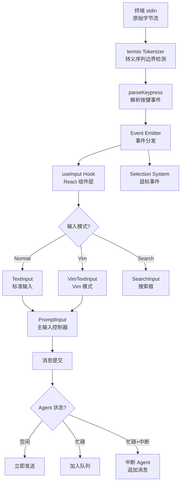
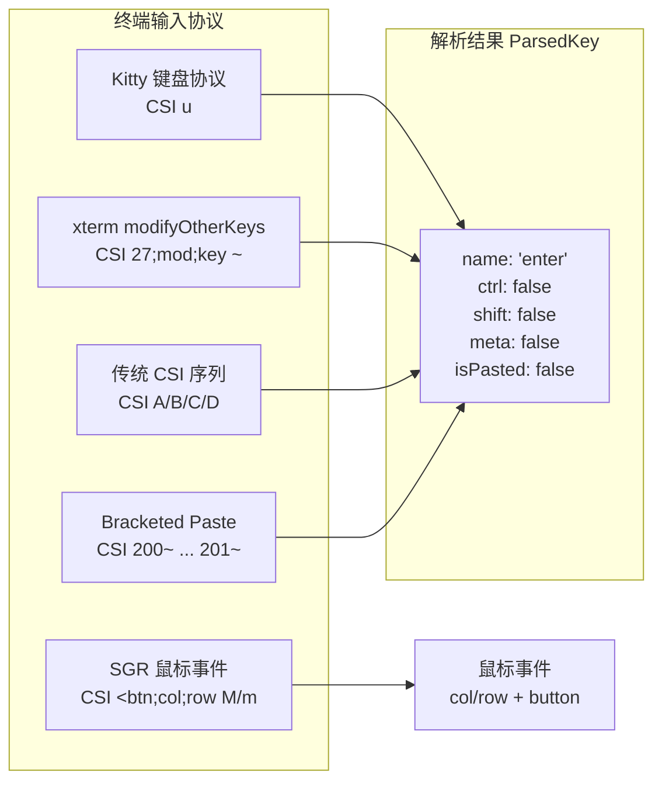
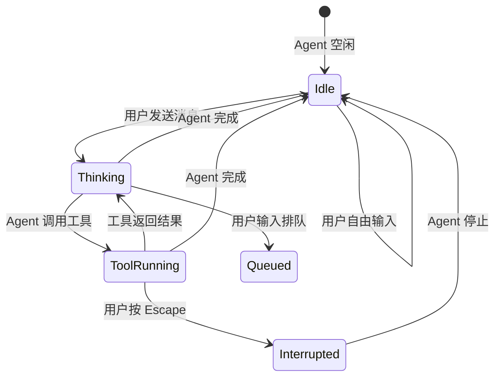

# 第 33 章：输入系统——用户如何与 Agent 交互

## 设计之问：在 Agent 思考时，用户还能做什么？

一个 AI Agent 的终端界面与普通命令行工具有着根本的不同。普通工具的交互模型是"用户输入 → 程序处理 → 输出结果"的同步循环。但 Agent 是异步的——用户发送一条消息后，Agent 可能要思考几秒、执行多个工具调用、持续数十秒甚至更久。

在这漫长的等待过程中，用户可能想要：

1. **打断 Agent**：Agent 走错了方向，需要紧急停止
2. **追加指令**：突然想起一个重要细节，想要补充
3. **排队消息**：Agent 完成当前任务后立即处理下一个
4. **切换上下文**：用斜杠命令查看设置、搜索历史
5. **编辑输入**：用 Vim 模式精细编辑多行文本

Claude Code 的输入系统必须在 Agent 运行的同时响应所有这些操作。这是一个经典的并发设计问题——不是操作系统级别的并发，而是用户交互状态的并发。

## 输入系统架构全景



### 终端输入的底层处理

终端输入远比大多数人想象的复杂。当用户按下 `a` 键时，终端实际发送的是字节 `0x61`。但当用户按下方向键时，终端发送的是 `0x1b 0x5b 0x41`（ESC [ A），一个三字节的转义序列。更复杂的按键（如 Ctrl+Shift+Enter）可能产生更长的序列，而且不同终端模拟器的编码方式不同。

在 `ink/termio/` 目录下，Claude Code 实现了完整的终端 I/O 协议栈：

- **`tokenizer.ts`**：转义序列边界检测——区分"ESC 后面跟着的字符是转义序列的一部分"还是"用户按了 ESC 键"
- **`csi.ts`**：CSI（Control Sequence Introducer）序列解析，处理功能键、鼠标事件
- **`osc.ts`**：OSC（Operating System Command）序列处理，用于超链接
- **`sgr.ts`**：SGR（Select Graphic Rendition）样式序列
- **`dec.ts`**：DEC 私有序列，包括 alternate screen 切换和鼠标追踪控制

`ink/parse-keypress.ts` 在 termio 解析器之上构建了一个按键事件模型。它支持多种终端输入协议：



**为什么需要支持这么多协议？** 因为 Claude Code 的用户可能在各种终端环境中工作：macOS Terminal、iTerm2、Ghostty、VS Code 终端、tmux、SSH、Windows Terminal。每种环境可能使用不同的输入编码。Kitty 键盘协议（CSI u）能区分所有修饰键组合，但只有部分终端支持。传统序列作为 fallback 覆盖了大多数场景。

### Bracketed Paste 检测

一个微妙但重要的特性是 bracketed paste 检测。当用户从剪贴板粘贴多行文本时，终端会发送 `CSI 200~` ... `CSI 201~` 包裹的原始内容。`parse-keypress.ts` 通过检测这些边界标记，将粘贴的文本作为单个 `isPasted: true` 事件传递，而非逐字符触发。这避免了粘贴触发现场输入的每个字符回调，也使得多行粘贴能被正确处理为一个操作。

## PromptInput：输入系统的控制中心

`components/PromptInput/PromptInput.tsx` 是输入系统的"大脑"，它是一个超过 1500 行的核心组件，整合了所有输入相关的能力。

### 双模式输入引擎

Claude Code 支持两种文本输入模式：

```mermaid
graph TD
    PROMPT[PromptInput] --> VIM_CHECK{用户设置<br/>Vim 模式?}
    VIM_CHECK -->|是| VIM[VimTextInput]
    VIM_CHECK -->|否| TEXT[TextInput]

    subgraph "共享基础层 BaseTextInput"
        BASE[BaseTextInput<br/>光标管理<br/>多行渲染<br/>剪贴板支持]
    end

    VIM --> BASE
    TEXT --> BASE

    subgraph "Vim 扩展"
        MOTIONS[motions.ts<br/>w/b/e/0/$/gg/G]
        OPERATORS[operators.ts<br/>d/c/y/p]
        TEXT_OBJECTS[textObjects.ts<br/>iw/aw/i"/a"]
        TRANSITIONS[transitions.ts<br/>Normal/Insert/Visual]
    end

    VIM --> MOTIONS
    VIM --> OPERATORS
    VIM --> TEXT_OBJECTS
    VIM --> TRANSITIONS
```

在 `vim/` 目录下实现了完整的 Vim 子集：

- **`motions.ts`**：移动命令（w、b、e、0、$、gg、G 等）
- **`operators.ts`**：操作符（d、c、y、p）
- **`textObjects.ts`**：文本对象（iw、aw、i"、a"）
- **`transitions.ts`**：模式切换（Normal → Insert → Visual）

这个设计体现了一个重要的架构原则：**将模式特定的逻辑与通用文本处理逻辑分离**。BaseTextInput 处理光标渲染、多行布局、剪贴板操作等通用能力，VimTextInput 在此基础上添加模式管理和 Vim 命令映射。TextInput 则是更简单的 Emacs 风格快捷键。

### 自动补全系统

PromptInput 集成了多层次的自动补全：

1. **斜杠命令补全**：输入 `/` 触发命令建议
2. **文件路径补全**：输入 `@` 或文件路径时触发
3. ** Mention 补全**：`@` 触发 IDE selection 或 teammate mention
4. **历史搜索**：上下箭头浏览历史输入

`hooks/useTypeahead.ts` 实现了 typeahead 机制，在用户输入时实时匹配建议。`utils/suggestions/commandSuggestions.ts` 扫描已注册的命令并匹配前缀。

### 输入缓冲与撤销

`hooks/useInputBuffer.ts` 实现了输入撤销功能。它维护一个输入历史缓冲区，每次输入变化（经过防抖）都记录到缓冲区中。用户可以通过 Ctrl+Z 撤销到之前的输入状态。

缓冲区设计有一个微妙之处：**防抖策略**。快速连续输入时不会每次按键都记录，而是在输入稳定后（`debounceMs` 毫秒无新输入）才推入缓冲区。这避免了撤销时的粒度过细——用户按 10 次 `Ctrl+Z` 应该回退 10 个有意义的编辑状态，而非 10 个单字符变化。

## 用户与 Agent Loop 的交互模型

### 三种 Agent 状态下的输入行为

这是输入系统最核心的设计决策。用户在三种不同的 Agent 状态下有不同的交互能力：



**1. Agent 空闲（Idle）**

用户可以自由输入、编辑多行文本、使用所有斜杠命令。输入框有完整焦点。这是最简单的状态。

**2. Agent 思考中（Thinking）**

Agent 正在生成回复。输入框仍然可见但可能被标记为非焦点状态。用户仍然可以：

- 输入文字并排队等待 Agent 完成后发送
- 按 Escape 中断 Agent
- 使用某些斜杠命令

**3. Agent 执行工具中（ToolRunning）**

Agent 正在等待工具结果。用户的交互能力取决于工具类型和权限设置：

- 等待权限确认时：用户可以批准或拒绝
- 后台工具运行时：用户可以输入排队消息
- 用户按 Escape：触发中断

### 消息队列机制

在 `src/utils/messageQueueManager.ts` 中实现了消息队列。当 Agent 正忙时，用户输入不会丢失，而是被排队。队列支持以下操作：

- **push**：添加新消息到队列尾部
- **popAll**：Agent 完成后取出所有排队消息
- **popEditable**：取出可以编辑的排队消息（用户可能还在编辑最后一条）

这个设计解决了一个常见的 Agent UX 问题：**用户在 Agent 思考时突然想起一个重要细节**。如果系统不接受输入，用户只能等 Agent 完成、读完回复、再输入补充信息——这个过程中用户可能已经忘记了要补充什么。

### 中断机制

中断是一个需要精心设计的操作。简单粗暴地终止 Agent 进程会导致资源泄漏（临时文件、子进程、网络连接）。Claude Code 的中断设计是：

1. **第一次 Escape**：设置中断标志，Agent 在下一个合适的检查点停止
2. **Agent 响应中断**：完成当前 token 或工具调用的最小单元后停止
3. **第二次 Escape**（如果 Agent 未响应）：强制中断

在 `components/InterruptedByUser.tsx` 中，被中断的消息显示一个专门的"被用户中断"标记，与正常的完成或错误状态区分开来。

## 输入事件的传播与消费

### useInput Hook

`ink/hooks/use-input.ts` 是 React 组件层与底层输入事件之间的桥梁。它通过 `useStdin` 获取事件发射器，注册输入回调：

```typescript
const useInput = (inputHandler: Handler, options: Options = {}) => {
  const { setRawMode, internal_eventEmitter } = useStdin()

  useLayoutEffect(() => {
    if (options.isActive === false) return
    setRawMode(true)  // 启用 raw mode
    return () => setRawMode(false)
  }, [options.isActive, setRawMode])

  // 注册事件处理器
  internal_eventEmitter.on('input', inputHandler)
  return () => internal_eventEmitter.off('input', inputHandler)
}
```

注意使用 `useLayoutEffect` 而非 `useEffect` 来设置 raw mode。这是因为 raw mode 的启用必须在 React commit 阶段同步完成——如果延迟到 useEffect（下一个微任务），终端会短暂处于 cooked mode，导致按键回显和光标可见。

### 输入优先级与焦点管理

在多层组件（全局快捷键、输入框、弹窗、搜索框）同时监听输入时，需要一个优先级机制。Ink 通过焦点管理器（`ink/focus.ts` 中的 `FocusManager`）来处理这个问题：

- 只有获得焦点的组件才能通过 `useInput` 接收按键事件
- 弹窗/对话框打开时自动获取焦点，关闭时归还焦点
- `autoFocus` 属性在组件挂载时自动获取焦点

### 键绑定系统

`keybindings/` 目录实现了一个可配置的键绑定系统，支持：

- **默认快捷键**：Escape 中断、Ctrl+C 退出、上下箭头历史等
- **可自定义绑定**：用户可以在设置中重新映射快捷键
- **上下文感知**：同一按键在不同上下文中可能有不同行为

`useKeybinding` 和 `useKeybindings` hooks 封装了键绑定的注册和匹配逻辑，使得组件可以用声明式的方式定义快捷键行为。

## 早期输入捕获

一个容易被忽视的设计细节是"早期输入捕获"——在应用完全初始化之前就捕获用户输入。Claude Code 在启动过程中就会显示输入框，用户可以在 Agent 加载的同时开始输入。这是通过以下机制实现的：

1. **Input Buffer**：`useInputBuffer` 在组件挂载时立即开始工作
2. **Raw Mode**：stdin 的 raw mode 在最早期就启用
3. **渐进式 UI**：输入框在数据加载完成前就已经渲染

这种设计减少了"冷启动等待时间"——用户不需要等 Agent 完全就绪就可以开始输入，输入会在 Agent 准备好后自动发送。

## 多行编辑

终端环境中的多行文本编辑有其独特挑战。`BaseTextInput` 组件处理了以下问题：

- **光标在多行间的移动**：上下箭头需要正确地在行间跳转，保持列位置
- **自动换行与手动换行**：区分文本因终端宽度自动换行和用户按 Enter 手动换行
- **粘贴多行文本**：从剪贴板粘贴的文本需要一次性插入，不触发逐字符处理
- **光标可见区域跟踪**：当文本超出可视区域时，需要"视口"跟随光标滚动

`components/PromptInput/inputPaste.ts` 专门处理粘贴逻辑，包括检测图片粘贴（从剪贴板获取图片数据并编码为 base64 附件）。

## 设计启示

### 异步交互需要队列思维

同步工具的输入模型是"一条一条"，但异步 Agent 的输入模型必须是"队列"。用户不应该被 Agent 的思考过程阻塞。消息队列机制是 Agent UX 的基础模式。

### 输入系统的分层抽象

从字节流到按键事件到组件回调到业务逻辑，输入系统有四个清晰的抽象层。每一层只关心自己的职责：字节流解析不管组件逻辑，组件逻辑不管终端协议。这种分层使得添加新的输入协议（如 Kitty 键盘协议）或新的输入模式（如 Vim 模式）可以在不影响其他层的情况下完成。

### 渐进式可交互性

"先可输入，后可发送"的设计哲学值得借鉴。用户在系统完全就绪之前就可以开始输入，这减少了感知等待时间。在 AI Agent 场景中，这种模式特别重要，因为 Agent 的启动可能涉及 API 连接、权限检查、上下文加载等多个异步步骤。

### 模式切换的心智负担

支持 Vim 模式虽然满足了 Vim 用户的需求，但也增加了系统的复杂度。Claude Code 的做法是让 Vim 模式成为一个可选的覆盖层（overlay），而非改变基础输入系统的行为。BaseTextInput 保持模式无关，VimTextInput 在此之上添加模式管理。这种"可选能力叠加"的模式是管理特性复杂度的有效策略。
