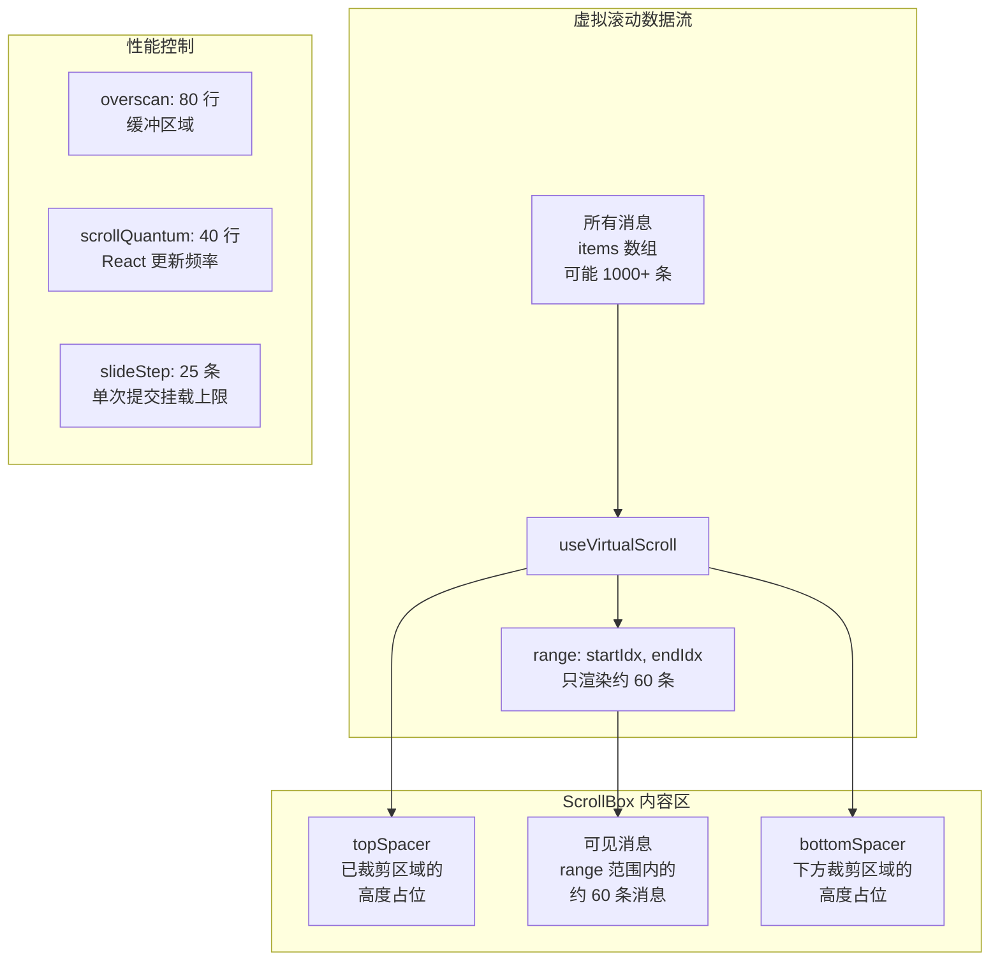
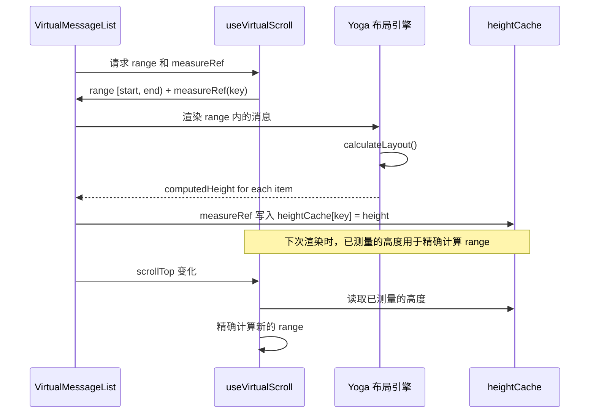
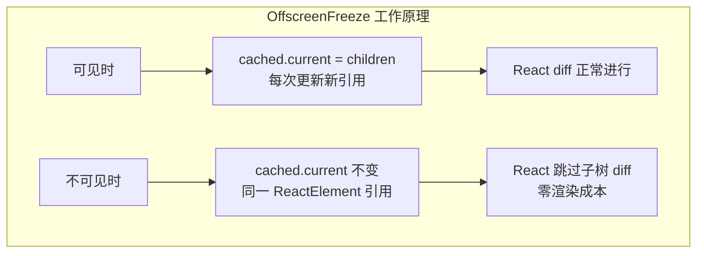
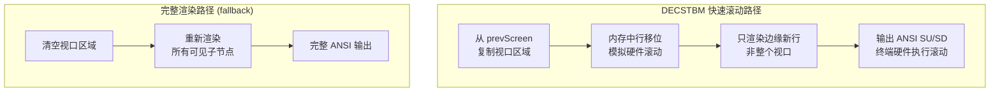

# 第 34 章：虚拟滚动与渲染性能

## 设计之问：终端也需要虚拟滚动吗？

在 Web 开发中，虚拟滚动是一个成熟的话题：渲染 10000 条微博会卡顿，所以只渲染视口内的几十条。但在终端里，谁会有 10000 条消息？

答案是：一个长时间运行的 AI Agent 交互完全可以产生数百甚至数千条消息。一次代码重构任务可能触发 50+ 次文件编辑，每次编辑都有 diff 输出。一次调试会话可能产生数十条 bash 命令输出。一段长时间的 Agent 运行可能积累上千条消息。

更重要的是，终端的渲染能力远弱于浏览器。浏览器有 GPU 加速的复合层渲染，终端只有 stdout 这个同步字符流。每帧需要传输的 ANSI 转义序列数量与渲染区域成正比。在 tmux 或 SSH 环境中，带宽瓶颈更加明显——1000 条消息的全量渲染可能产生数百 KB 的 ANSI 数据。

Claude Code 在全屏模式下使用了虚拟滚动来解决这个问题。这是终端应用中极其罕见的设计决策，但它是长对话场景下流畅体验的保障。

## 虚拟滚动的核心算法

### 从 ScrollBox 到虚拟化

`ink/components/ScrollBox.tsx` 是滚动的基础设施。它是一个支持 `overflow: scroll` 的 Box 组件，提供命令式的 `scrollTo`、`scrollBy`、`scrollToBottom` 等 API。

ScrollBox 本身实现了视口裁剪（viewport culling）——只渲染在视口内的子组件。但这还不够，因为 React 仍然需要为所有子组件创建 Fiber 节点，即使它们在渲染时被裁剪掉。

虚拟化的下一步是**只挂载视口附近的组件**，这就是 `hooks/useVirtualScroll.ts` 的工作。



### useVirtualScroll 的关键参数

在 `hooks/useVirtualScroll.ts` 中，有几个精心调节的参数：

```typescript
const DEFAULT_ESTIMATE = 3    // 未测量项的预估高度（行数）
const OVERSCAN_ROWS = 80      // 视口上下各多渲染的行数
const COLD_START_COUNT = 30   // 首次渲染（无布局信息时）的项数
const SCROLL_QUANTUM = 40     // scrollTop 量化步长
const PESSIMISTIC_HEIGHT = 1  // 悲观假设：未测量项最小 1 行
const MAX_MOUNTED_ITEMS = 300 // 最大挂载数量上限
const SLIDE_STEP = 25         // 单次提交最多新增 25 项
```

**DEFAULT_ESTIMATE = 3** 这个值偏低而非偏高，这是一个有意的非对称设计。高估会导致提前停止挂载——视口底部出现空白，因为实际高度小于预估值，挂载的总高度不够填满视口。低估只是多挂载几项进入 overscan 区域，代价是多了几次组件渲染，但不会出现空白。

**OVERSCAN_ROWS = 80** 看起来很大（终端通常只有 24-60 行），但考虑到单条消息可能有 20+ 行（长代码块、diff 输出），80 行的缓冲大约能覆盖 4-8 条消息的滚动余量。这确保了快速滚动时用户不会看到空白闪烁。

**SCROLL_QUANTUM = 40** 是一个精妙的节流机制。没有它，每次滚轮事件（一个刻度 3-5 个事件）都会触发一次 React commit + Yoga 布局 + Ink diff，造成 CPU 峰值。量化后，React 只在 scrollTop 变化超过 40 行时才重新计算挂载范围。**视觉滚动不受影响**——ScrollBox 通过 DOM 节点的 `scrollTop` 直接控制渲染位置，不经过 React。

### 虚拟滚动的测量机制

虚拟滚动的核心挑战是**在挂载之前知道每项的高度**。在浏览器中，这通常通过 `ResizeObserver` 或预估高度解决。在终端中，高度由文本内容和终端宽度决定，必须在布局后才能精确知道。

Claude Code 使用了一个 **measureRef 回调机制**：



`measureRef` 是一个工厂函数，为每条消息创建一个回调 ref。当消息的根 Box 被 Ink 渲染后（Yoga 计算完布局），回调 ref 触发，将 Yoga 计算出的高度写入 `heightCache`。下次滚动时，已测量的消息使用精确高度，未测量的消息使用 `DEFAULT_ESTIMATE`。

### Spacer 与列表偏移

虚拟滚动需要用 Spacer（空白占位符）来维持正确的滚动条位置。`useVirtualScroll` 生成 `topSpacer` 和 `bottomSpacer` 两个高度值，分别对应视口上方和下方的未挂载消息的总高度。

一个独特的设计是 `spacerRef`：它指向 topSpacer 的 Box 元素，其 Yoga 计算出的 `computedTop` 就是列表在 ScrollBox 内容区中的绝对偏移。这种"让 Yoga 告诉我们偏移量"的方法比手动累加高度更准确，因为它自动处理了边距、间距等布局因素。

## OffscreenFreeze：不可见区域的零成本更新

### 问题：Spinner 的蝴蝶效应

在虚拟滚动之外，还有一个看似简单但影响深远的性能问题。考虑以下场景：

1. 用户滚动了 500 行消息
2. 视口外的第 3 条消息有一个 Spinner（loading 动画），每 100ms 更新
3. 第 10 条消息有一个"已用时间"计时器，每秒更新
4. 第 50 条消息有一个"监控中"状态指示器，每 5 秒更新

如果没有特殊处理，这些组件的每次更新都会触发 React commit → Ink diff → 终端输出。更糟糕的是，在非全屏模式（使用原生终端滚动）下，对已滚出视口的内容的任何更新都会强制 Ink 进行**全帧重置**（因为它无法部分更新已经滚入终端回滚缓冲区的行）。

### 解决方案：OffscreenFreeze

`components/OffscreenFreeze.tsx` 用不到 40 行代码解决了这个问题：

```typescript
export function OffscreenFreeze({ children }: Props): React.ReactNode {
  'use no memo'  // 关键：禁用 React Compiler 的 memo

  const [ref, { isVisible }] = useTerminalViewport()
  const cached = useRef(children)

  if (isVisible || inVirtualList) {
    cached.current = children
  }
  return <Box ref={ref}>{cached.current}</Box>
}
```

原理极其巧妙：

1. `useTerminalViewport()` 通过 Yoga 布局信息判断组件是否在终端视口内
2. 当不可见时，`cached.current` 保持不变
3. 由于返回的是**同一个 ReactElement 引用**，React Reconciler 会跳过这个子树的所有更新（因为 `oldElement === newElement`）
4. `'use no memo'` 确保 React Compiler 不会 memo 这个组件——memo 化会阻止 `cached.current` 的读取逻辑工作

这个设计的精妙之处在于它利用了 React Reconciler 的一个基本假设：**如果返回值与上次相同（引用相等），则跳过子树的 diff**。这不是一个 hack，而是 React 设计者有意为之的优化路径。



### useTerminalViewport 的实现

`ink/hooks/use-terminal-viewport.ts` 实现了视口可见性检测。它通过以下步骤计算一个元素是否在视口内：

1. 获取元素的 Yoga 计算高度和顶部位置
2. 沿 DOM 父链向上遍历，累加偏移
3. 遇到 ScrollBox 时减去 scrollTop
4. 判断最终位置是否在终端行数范围内

关键设计：**使用 `useLayoutEffect` 而非 `useEffect`，且不触发 setState**。可见性信息存储在 ref 中，不引起额外渲染。调用方在自身重渲染时自然读取到最新值。这避免了"可见性变化 → setState → 重渲染 → 可见性变化"的无限循环。

### 虚拟列表中的 OffscreenFreeze 行为

在虚拟滚动列表中，OffscreenFreeze 被**禁用**（通过 `InVirtualListContext`）。原因是虚拟列表已经通过 `useVirtualScroll` 控制了哪些组件被挂载——不需要二次冻结。而且在 ScrollBox 内部，`useTerminalViewport` 的可见性计算可能与虚拟滚动位置不一致，导致误判。

## 渲染管线中的性能优化

### 脏标记传播与 Blit 跳过

在 `ink/render-node-to-output.ts` 中，每个 DOM 节点都有一个 `dirty` 标志。渲染时，如果一个节点不脏且位置没变，直接从 `prevScreen`（上一帧的 Screen 缓冲区）复制像素（blit），跳过整个子树的渲染：

```typescript
// 简化的 blit 优化逻辑
if (!node.dirty && cached && cached.x === x && cached.y === y
    && cached.width === width && cached.height === height && prevScreen) {
  output.blit(prevScreen, fx, fy, fw, fh)  // 直接复制
  return  // 跳过子树
}
```

这个优化在长对话中极其有效。当 Spinner 更新时，只有 Spinner 所在的节点被标记为 dirty，其余 99% 的消息通过 blit 直接复制。

### 脏污染传播

一个脏节点可能影响其兄弟节点的 blit 安全性。如果脏节点的内容溢出了它的边界（没有 `overflow: hidden`），旁边兄弟节点的缓存中可能包含脏节点的溢出内容。

`renderChildren` 函数用 `seenDirtyChild` 标志处理这个问题——遇到脏子节点后，后续所有兄弟都禁用 blit。但对于有 `overflow: hidden` 的裁剪容器（如 ScrollBox 内部），溢出不可能影响兄弟，所以裁剪容器内的脏子节点不会禁用外部兄弟的 blit。

### ScrollBox 的 DECSTBM 滚动优化

在 `ink/render-node-to-output.ts` 中有一个精巧的 ScrollBox 滚动优化。当 ScrollBox 的 scrollTop 变化但内容没有变化时（用户滚动了但没有新消息），渲染器会：

1. 从 prevScreen 复制滚动区域的像素
2. 在内存中执行行移位（`output.shift(top, bottom, delta)`）
3. 只重新渲染进入视口的新行（edge rows）

这比重新渲染整个 ScrollBox 内容便宜得多——特别是当 ScrollBox 内有数百条消息时。



在某些支持 DECSTBM（Set Top and Bottom Margins）序列的终端中，滚动甚至可以由终端硬件完成——Ink 只需发送一个 `CSI n S`（Scroll Up）序列，终端自己移动行内容，零数据传输。

### Yoga 布局缓存

Yoga 的 `calculateLayout()` 是每帧最昂贵的操作之一。在 `ink/node-cache.ts` 中，Ink 缓存了每个节点的布局位置。只有当节点被标记为 dirty 时才重新计算其布局。

`nodeCache` 存储每个节点的 `{x, y, width, height, top}`。当节点被裁剪出 ScrollBox 视口时，其缓存被清除（`dropSubtreeCache`），以避免在重新进入视口时触发过时的 clear 操作。

## 滚动排水的物理直觉

ScrollBox 的 `pendingScrollDelta` 和排水机制有一个优美的物理隐喻：**惯性滚动**。

当用户快速滚动鼠标滚轮时，事件密集到达（每秒 20-40 个），每个事件累加到 `pendingScrollDelta`。渲染器以受控速率排水：

- **原生终端**（iTerm2、Ghostty）：使用比例排水 `step = max(MIN, floor(abs * 3/4))`，大增量快速衰减，小增量平滑停止
- **xterm.js**（VS Code）：使用自适应排水，低增量一次性排完（慢滚要即时），高增量用小步长（快滚要平滑）

```mermaid
graph LR
    WHEEL[鼠标滚轮事件] --> ACC[pendingScrollDelta<br/>纯累加器]
    ACC --> DRAIN{排水策略}
    DRAIN -->|原生终端| PROP[比例排水<br/>step = max(4, abs*3/4)]
    DRAIN -->|xterm.js| ADAPT[自适应排水<br/>小量即时/大量分步]
    PROP --> RENDER[每帧渲染]
    ADAPT --> RENDER
```

累加器的另一个好处是**方向反转自然取消**。用户快速上滚然后立即下滚，`pendingScrollDelta` 先增后减，净效果可能接近零。这比每次滚动都设置一个目标位置然后动画追赶要自然得多。

## 性能监控与调优

### 帧计时系统

Ink 的 `frame.ts` 定义了详细的帧事件结构，包含每个阶段的耗时：

```typescript
type FrameEvent = {
  durationMs: number
  phases?: {
    renderer: number     // DOM → yoga → screen buffer
    diff: number         // screen diff → Patch[]
    optimize: number     // patch merge/dedupe
    write: number        // patches → ANSI → stdout
    patches: number      // 变化的 patch 数量
    yoga: number         // calculateLayout() 耗时
    commit: number       // React reconcile 耗时
    yogaVisited: number  // Yoga 节点访问次数
    yogaMeasured: number // 文本测量次数（最昂贵）
  }
}
```

这个计时系统使得性能瓶颈可以被精确诊断。例如，如果 `yogaMeasured` 值突然升高，说明有大量新文本被测量（可能是新的消息挂载），需要检查虚拟滚动的 range 计算是否过于激进。

### COMMIT_LOG 调试工具

`ink/reconciler.ts` 中有一个条件编译的 COMMIT_LOG 系统，当设置 `CLAUDE_CODE_COMMIT_LOG` 环境变量时，会记录每次 React commit 的详细信息：

- commit 间隔（gap）——如果超过 30ms 说明有掉帧
- React reconcile 时间——如果超过 20ms 说明组件树太重
- createInstance 次数——如果超过 50 说明有大量新节点挂载
- Yoga 布局时间——如果超过 20ms 说明布局计算是瓶颈

### Yoga 计数器

`ink/reconciler.ts` 还集成了 Yoga 的计数器系统（`getYogaCounters`），追踪：
- `visited`：递归访问的 Yoga 节点总数
- `measured`：调用 measureFunc 的次数（文本测量）
- `cacheHits`：缓存命中次数
- `live`：当前存活的 Yoga 节点数

这些计数器帮助诊断布局性能问题。例如，如果 `measured` 值很高但 `cacheHits` 很低，说明文本缓存失效了，可能是因为终端宽度频繁变化（如 tmux 分屏）。

## 设计启示

### 终端应用的性能模型与 Web 不同

Web 应用的性能瓶颈通常是 DOM 操作和重绘。终端应用的瓶颈是 **stdout 带宽和同步渲染**。这意味着：

1. 每个 ANSI 转义序列都有成本（尤其是通过 SSH/tmux）
2. 渲染是同步的——一帧的渲染时间直接影响事件循环
3. 没有浏览器的 requestIdleCallback 来利用空闲时间

这些差异决定了终端应用的性能优化方向：最小化 diff 输出、利用终端硬件能力（DECSTBM）、严格控制每帧工作量。

### 虚拟滚动不是 Web 专属

终端虚拟滚动的核心思路与 Web 相同——只渲染可见区域。但实现细节完全不同：没有 DOM、没有 CSS `overflow: hidden`、没有 `IntersectionObserver`。Claude Code 通过 Yoga 布局 + DOM 节点遍历 + ref 回调实现了等效能力，证明虚拟滚动是一个与渲染目标无关的通用优化模式。

### 防御性设计：PESSIMISTIC_HEIGHT 的哲学

`PESSIMISTIC_HEIGHT = 1` 的选择体现了一个重要的设计哲学：**宁可多渲染一点，也不要出现空白**。在虚拟滚动中，空白是最严重的 UX 缺陷——用户会以为内容加载失败。多渲染几条消息只是增加了少量 CPU 成本，但保证了视觉完整性。这种"宁多勿缺"的非对称错误偏好在 UI 性能优化中是通用原则。

### 利用框架的隐式契约

OffscreenFreeze 利用 React 的"相同引用跳过 diff"这个隐式契约，实现了零成本冻结。这不是一个 hack，而是对框架语义的深刻理解。类似的模式在 Web 开发中也存在（如 `useMemo` 返回相同引用避免子树重渲染），但 OffscreenFreeze 将其推向了极致——通过 ref 缓存整个子树的渲染结果，完全绕过了 React 的 diff 机制。这种"理解框架内核，然后巧妙利用"的能力，是高级架构设计的标志。
