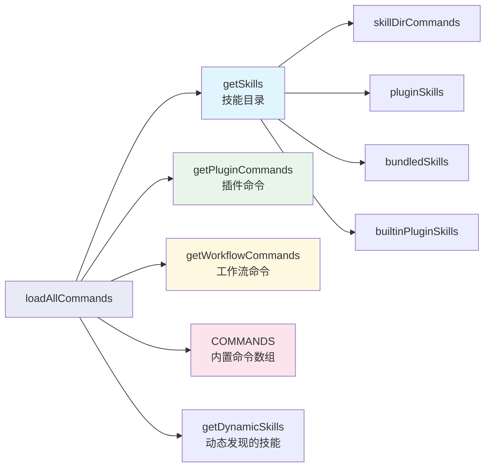
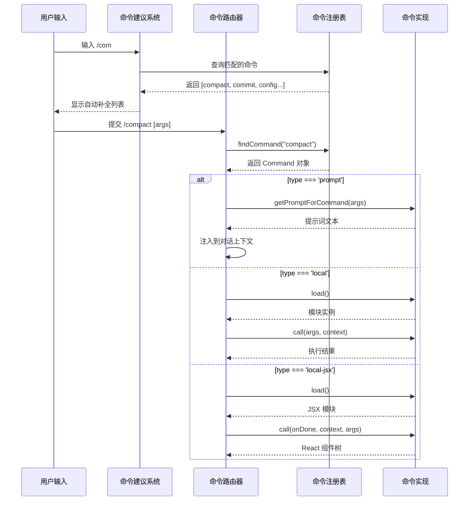

# 第 35 章：命令系统——可插拔的命令架构

## 35.1 为什么命令系统必须是可插拔的

当你在 Claude Code 中输入 `/compact`、`/review`、`/commit` 时，你正在与一套精心设计的命令系统交互。这套系统表面上看起来很简单——输入斜杠前缀加上命令名，系统执行对应的操作。但在背后，它承载着一个 AI Agent 的核心架构问题：**如何让一个快速迭代的产品保持扩展性，同时又不让新增功能拖垮整个系统？**

Claude Code 有超过 80 个内置命令，再加上来自技能目录、插件、MCP 服务器的动态命令，命令总数可以轻松超过百个。如果每个命令都直接耦合在主流程中，系统会变得臃肿、脆弱，难以维护。可插拔架构是唯一的出路。

可插拔设计带来三个关键好处：

1. **关注点分离**：每个命令是独立模块，只关心自己的逻辑。`/compact` 不需要知道 `/review` 的存在。
2. **延迟加载**：不是所有命令都会在一次会话中被使用。懒加载机制让系统只在实际需要时才加载命令的重量级依赖。
3. **动态扩展**：插件和技能可以在运行时注册新命令，无需修改核心代码。

## 35.2 三种命令类型的设计哲学

Claude Code 的命令系统定义了三种截然不同的命令类型，每种类型对应一种不同的交互模式。

源码文件 `types/command.ts` 是理解这个设计的入口：

```typescript
export type Command = CommandBase &
  (PromptCommand | LocalCommand | LocalJSXCommand)
```

这是一个典型的** tagged union 类型**——通过 `type` 字段 discriminated 的联合类型。让我逐一分析这三种类型。

### PromptCommand：提示词命令

```typescript
type PromptCommand = {
  type: 'prompt'
  progressMessage: string
  contentLength: number
  allowedTools?: string[]
  model?: string
  source: SettingSource | 'builtin' | 'mcp' | 'plugin' | 'bundled'
  getPromptForCommand(
    args: string,
    context: ToolUseContext,
  ): Promise<ContentBlockParam[]>
}
```

Prompt 命令是最"AI 原生"的命令类型。它的核心思想是：**命令的本质是一段提示词**。当你输入 `/review 1234` 时，系统调用 `getPromptForCommand` 生成一段文本，然后把这段文本插入到当前对话中，就像用户自己输入了一段精心设计的提示词一样。

以 `/review` 命令为例（`commands/review.ts`）：

```typescript
const review: Command = {
  type: 'prompt',
  name: 'review',
  description: 'Review a pull request',
  progressMessage: 'reviewing pull request',
  async getPromptForCommand(args): Promise<ContentBlockParam[]> {
    return [{ type: 'text', text: LOCAL_REVIEW_PROMPT(args) }]
  },
}
```

这种设计非常巧妙——命令不需要自己实现代码审查逻辑，它只是把 AI 引导到正确的思考方向。这充分利用了 LLM 的能力，让命令的实现极其轻量。

### LocalCommand：本地命令

```typescript
type LocalCommand = {
  type: 'local'
  supportsNonInteractive: boolean
  load: () => Promise<LocalCommandModule>
}
```

Local 命令是需要执行实际逻辑的命令。与 Prompt 命令不同，它们不依赖 LLM，而是直接执行代码。`/compact` 就是一个典型的 Local 命令（`commands/compact/index.ts`）：

```typescript
const compact = {
  type: 'local',
  name: 'compact',
  load: () => import('./compact.js'),
} satisfies Command
```

注意 `load` 函数——它返回一个动态 `import()`。这就是**懒加载**的入口。`compact.js` 中的实际逻辑（压缩上下文、调用摘要 API 等）只有在用户真正输入 `/compact` 时才会被加载到内存中。

### LocalJSXCommand：UI 命令

```typescript
type LocalJSXCommand = {
  type: 'local-jsx'
  load: () => Promise<LocalJSXCommandModule>
}
```

JSX 命令是最重量级的命令类型——它们需要渲染交互式 UI。`/ultrareview` 就是一个 JSX 命令，它会弹出用量许可对话框。JSX 命令依赖 React/Ink 渲染引擎，所以延迟加载更加重要。

```mermaid
graph TD
    A[用户输入 /command] --> B{命令类型判断}
    B -->|type: prompt| C[生成提示词文本]
    C --> D[插入到对话上下文]
    D --> E[LLM 处理提示词]
    B -->|type: local| F[懒加载命令模块]
    F --> G[执行本地逻辑]
    G --> H[返回文本结果]
    B -->|type: local-jsx| I[懒加载 JSX 模块]
    I --> J[渲染交互式 UI]
    J --> K[用户交互完成后回调]

    style C fill:#e1f5fe
    style F fill:#fff3e0
    style I fill:#fce4ec
```



**为什么是三种而不是一种？** 这是"最小权限原则"的体现。Prompt 命令最简单、最安全——它只是文本注入。Local 命令需要执行权限，但不需要 UI。JSX 命令权限最大，但也最重。这种分层让系统在路由命令时可以做精细化的安全控制。例如在远程模式（Remote Mode）下，只有部分安全命令被允许执行（见 `commands.ts` 中的 `REMOTE_SAFE_COMMANDS` 和 `BRIDGE_SAFE_COMMANDS`）。

## 35.3 命令的动态注册与发现

命令不是静态硬编码的列表。Claude Code 有一个多层次的命令发现机制，在运行时从多个来源动态聚合命令。

核心函数 `getCommands`（`commands.ts`）展示了这个过程：

```typescript
export async function getCommands(cwd: string): Promise<Command[]> {
  const allCommands = await loadAllCommands(cwd)
  const dynamicSkills = getDynamicSkills()

  const baseCommands = allCommands.filter(
    _ => meetsAvailabilityRequirement(_) && isCommandEnabled(_),
  )
  // ... 去重和合并动态技能
}
```

`loadAllCommands` 是一个 memoized 函数，它并行地从五个来源加载命令：



命令来源的优先级是精心设计的（参见 `loadAllCommands` 的合并顺序）：

1. **bundledSkills** —— CLI 自带的技能
2. **builtinPluginSkills** —— 内置插件的技能
3. **skillDirCommands** —— 来自 `.claude/skills/` 目录的用户自定义技能
4. **workflowCommands** —— 工作流脚本
5. **pluginCommands** —— 第三方插件提供的命令
6. **pluginSkills** —— 第三方插件提供的技能
7. **COMMANDS()** —— 硬编码的内置命令

这个顺序确保了内置功能总是可用的，而用户自定义的技能和插件命令在前，不会被内置命令覆盖。

## 35.4 两层过滤机制

从各个来源收集到的命令，必须经过两层过滤才能最终暴露给用户：

### 第一层：可用性过滤（Availability）

```typescript
export function meetsAvailabilityRequirement(cmd: Command): boolean {
  if (!cmd.availability) return true
  // 检查用户是否属于允许的认证类型
}
```

这一层基于用户的认证类型做静态过滤。例如某些命令只对 claude.ai 订阅者可见，某些只对直接 API 用户可见。这是一个**编译时即可确定的属性**，与 Feature Flag 无关。

### 第二层：启用状态过滤（isEnabled）

```typescript
export function isCommandEnabled(cmd: CommandBase): boolean {
  return cmd.isEnabled?.() ?? true
}
```

这一层是运行时动态的。命令可以定义自己的 `isEnabled` 函数，这个函数可以检查环境变量、Feature Flag、系统状态等任何运行时条件。

例如 `/compact` 命令：

```typescript
isEnabled: () => !isEnvTruthy(process.env.DISABLE_COMPACT)
```

而某些 Feature Flag 控制的命令在源码层面就被条件加载了：

```typescript
const voiceCommand = feature('VOICE_MODE')
  ? require('./commands/voice/index.js').default
  : null
```

这种**编译时条件导入 + 运行时 isEnabled 检查**的双层机制，是 Claude Code 在可扩展性和安全性之间取得平衡的关键设计。

## 35.5 懒加载：性能的秘密武器

Claude Code 有超过 80 个内置命令，加上插件和技能，总数更多。如果启动时就把所有命令的实现代码都加载进来，启动时间会显著增加。

懒加载机制通过两个层面解决这个问题：

### 声明时的静态注册

在 `commands.ts` 顶部的静态 import 中，每个命令只导入了它的"壳"——一个包含名称、描述、类型等元数据的轻量对象。真正的实现代码通过 `load()` 函数延迟加载。

以 `/compact` 为例，`commands/compact/index.ts` 只有几行代码：

```typescript
const compact = {
  type: 'local',
  name: 'compact',
  load: () => import('./compact.js'),  // 这里才是真正的重逻辑
} satisfies Command
```

`compact.js` 中包含了上下文压缩、摘要生成的全部逻辑——但只有在用户实际执行 `/compact` 时才会被加载。

### Feature Flag 条件下的死代码消除

更进一步，某些命令通过 `feature()` 函数在编译时就被排除了：

```typescript
const voiceCommand = feature('VOICE_MODE')
  ? require('./commands/voice/index.js').default
  : null
```

当 `VOICE_MODE` Feature Flag 关闭时，`voiceCommand` 为 `null`，而 Bun 的打包器会在编译时将 `null` 分支保留，`require('./commands/voice/index.js')` 分支被完全移除。这意味着这个命令的代码甚至不会出现在最终的二进制文件中。

## 35.6 命令路由：从输入到执行

当用户在输入框中输入 `/compact` 时，系统如何找到并执行对应的命令？



命令查找使用 `findCommand` 函数，它不仅匹配命令的 `name`，还匹配 `aliases` 和 `userFacingName`。这意味着同一个命令可以有多个入口点——一个常见的模式是给命令一个简短的别名方便快速输入。

## 35.7 设计启示

Claude Code 的命令系统给我们提供了几个可复用的架构教训：

**接口优于继承。** `Command` 类型是一个 tagged union 而不是类继承体系。这意味着新增命令类型不需要修改现有的类型层次，只需要扩展 union 的成员。

**元数据与实现分离。** 命令的名称、描述、是否隐藏等元数据在注册时就是可用的，而实现代码可以延迟加载。这让命令列表的渲染（如自动补全、帮助页面）不需要加载任何实现代码。

**渐进式的安全边界。** 三种命令类型形成了一个自然的权限分层。Prompt 命令本质上只是文本注入，Local 命令需要代码执行权限，JSX 命令需要 UI 渲染权限。这种分层在安全审计和远程模式过滤中发挥了关键作用。

**Memoization 的分层策略。** `loadAllCommands` 的结果被 memoize 了，但 `getCommands` 每次都重新过滤。这是因为 memoize 的内容（从磁盘加载命令列表）是昂贵的 I/O 操作，而过滤（检查 Feature Flag 和认证状态）是廉价的 CPU 操作，且可能在会话中途变化（如用户执行 `/login`）。

**缓存失效的精确控制。** `clearCommandsCache` 函数展示了多层缓存失效的策略——它不仅清除了命令列表的 memoize 缓存，还分别清除了插件命令缓存、插件技能缓存和技能目录缓存。这种"失效传播"的设计确保了当任何一个上游数据源发生变化时，所有下游缓存都能被正确地失效。
