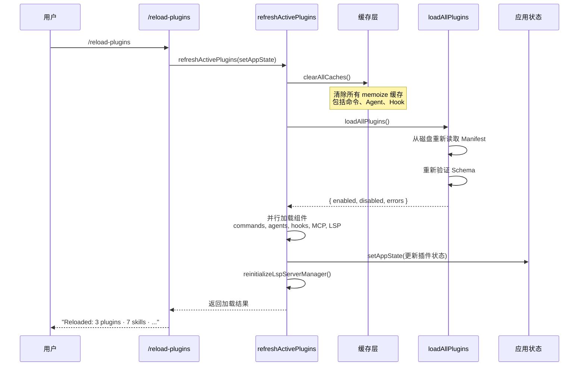

# 第 36 章：插件系统——第三方扩展机制

## 36.1 插件系统解决什么问题

一个 AI Agent 平台的生命力取决于它的生态。Claude Code 的核心能力——代码编辑、终端操作、Git 管理——是 Anthropic 团队精心打磨的。但没有任何一个团队能预见所有用户场景。金融行业的用户需要合规检查工具，生命科学团队需要基因组数据处理技能，每个企业都有自己的内部工作流。

插件系统就是 Claude Code 的生态接口。它让第三方开发者能够在不修改 Claude Code 核心代码的前提下，为 Agent 添加新的能力。

但插件系统也带来了一个根本性的架构挑战：**如何让不受信任的第三方代码安全地运行在系统内部，同时不影响系统的稳定性？**

Claude Code 的回答是一套精心设计的分层架构：从插件的发现、安装、沙箱隔离到运行时安全边界，每一层都有明确的职责和防御措施。

更深一层，这一章讨论的不是"能不能扩展"，而是**系统愿意把哪一层开放给外部世界**。真正成熟的平台不会把整个内部结构都暴露给插件，而是主动构造一个狭窄、稳定、可治理的扩展面。扩展面越窄，生态越容易长久；扩展面越宽，插件越强，但平台越难演化。

## 36.2 插件能做什么：五大扩展点

首先让我们理解插件系统的能力边界。Claude Code 的插件不是通用插件——它们不能随意修改 UI、不能拦截网络请求、不能访问任意系统资源。插件的能力被限制在五个明确定义的扩展点（`types/plugin.ts` 中的 `PluginComponent` 类型）：

```typescript
export type PluginComponent =
  | 'commands'     // 自定义斜杠命令
  | 'agents'       // 自定义 AI Agent
  | 'skills'       // 技能定义
  | 'hooks'        // 生命周期钩子
  | 'output-styles' // 输出样式
```

这五个扩展点覆盖了 AI Agent 的核心交互面。让我们看看每个扩展点的具体含义。

这里最重要的思想，是 Claude Code 没有把插件定义成"可以做任何事的代码注入点"，而是定义成"可以向系统声明某类能力的包"。这意味着平台保留了最终调度权、渲染权和安全裁决权。换句话说，插件提供的是**能力声明**，不是**主权转移**。

### 自定义命令（Commands）

插件可以在 `commands/` 目录下放置 Markdown 文件，每个文件自动成为一个斜杠命令。命令的内容就是提示词模板——当用户或模型调用这个命令时，Markdown 内容被展开为提示词注入到对话中。

```
my-plugin/
  commands/
    deploy.md       → /deploy 命令
    staging.md      → /staging 命令
```

### 自定义 Agent（Agents）

插件可以在 `agents/` 目录下定义专用的 AI Agent，这些 Agent 有自己的系统提示词、工具约束和执行上下文。

### 技能（Skills）

技能是命令的增强版本，支持更丰富的元数据（描述、参数提示、工具约束等）。插件通过 `skills/` 目录或 manifest 中的 `skills` 字段注册技能。

### 生命周期钩子（Hooks）

这是插件最强大的扩展点。通过 `hooks/hooks.json` 或 manifest 中的 `hooks` 字段，插件可以在 Claude Code 的关键生命周期事件中注入自定义逻辑：

- **PreToolUse**：在工具执行前运行自定义检查
- **PostToolUse**：在工具执行后执行后处理
- **Notification**：在系统通知时执行操作
- **Stop**：在 Agent 停止时执行清理

### MCP 服务器和 LSP 服务器

插件还可以注册 MCP（Model Context Protocol）服务器和 LSP（Language Server Protocol）服务器，让 Agent 能够访问外部工具和语言智能。

## 36.3 插件的生命周期

一个插件从"存在于市场"到"活跃在用户会话中"，需要经过一个明确的多阶段生命周期。

```mermaid
graph TD
    A[Marketplace 发现] --> B[安装到本地缓存]
    B --> C[Manifest 验证]
    C --> D{验证通过?}
    D -->|否| E[记录错误<br/>跳过此插件]
    D -->|是| F[注册到 settings.json]
    F --> G{用户启用?}
    G -->|否| H[标记为 disabled]
    G -->|是| I[加载组件]
    I --> J[commands → 命令注册表]
    I --> K[agents → Agent 定义]
    I --> L[hooks → Hook 注册表]
    I --> M[mcpServers → MCP 连接管理器]
    I --> N[lspServers → LSP 管理器]

    O[/reload-plugins] --> P[清除所有缓存]
    P --> Q[重新加载全部插件]
    Q --> I

    style A fill:#e1f5fe
    style C fill:#fff3e0
    style I fill:#e8f5e9
    style O fill:#fce4ec
```

### 阶段一：发现与安装

插件通过 Marketplace 发现。Claude Code 支持多种 Marketplace 来源（`utils/plugins/schemas.ts` 中的 `MarketplaceSourceSchema`）：

- **GitHub 仓库**：`{ source: 'github', repo: 'owner/repo' }`
- **Git URL**：`{ source: 'git', url: 'https://...' }`
- **NPM 包**：`{ source: 'npm', package: 'my-plugin' }`
- **本地目录**：`{ source: 'directory', path: '/path/to/plugin' }`
- **设置内嵌**：`{ source: 'settings', plugins: [...] }`

安装过程由 `pluginLoader.ts` 中的 `loadAllPlugins` 协调，它会：
1. 从配置中读取已安装的插件列表（`settings.json` 中的 `enabledPlugins`）
2. 解析 Marketplace 信息，获取插件的 Git 仓库或 NPM 包地址
3. 将插件下载/克隆到本地缓存目录（`~/.claude/plugins/installed/`）
4. 读取并验证 `plugin.json` Manifest

### 阶段二：Manifest 验证

每一个插件必须通过严格的 Schema 验证（`utils/plugins/schemas.ts`）。这个验证使用了 Zod Schema，覆盖了插件的每个字段：

```typescript
export const PluginManifestSchema = lazySchema(() =>
  z.object({
    ...PluginManifestMetadataSchema().shape,   // 名称、版本、描述
    ...PluginManifestHooksSchema().partial().shape,     // 钩子
    ...PluginManifestCommandsSchema().partial().shape,  // 命令
    ...PluginManifestAgentsSchema().partial().shape,    // Agent
    ...PluginManifestSkillsSchema().partial().shape,    // 技能
    ...PluginManifestMcpServerSchema().partial().shape, // MCP 服务器
    ...PluginManifestLspServerSchema().partial().shape, // LSP 服务器
    ...PluginManifestUserConfigSchema().partial().shape,// 用户配置
    ...PluginManifestChannelsSchema().partial().shape,  // 消息通道
  }),
)
```

注意验证的粒度：顶层字段是宽松的（`partial()`），允许未来扩展。但嵌套的配置对象（如 `userConfig` 中的选项、`channels` 中的声明）是 strict 的——未知的键会导致验证失败。这种设计平衡了前向兼容性和安全性。

### 阶段三：组件加载

验证通过的插件，其各个组件会被并行加载到对应的系统中。这个过程由 `utils/plugins/refresh.ts` 中的 `refreshActivePlugins` 函数协调：

```typescript
export async function refreshActivePlugins(
  setAppState: SetAppState,
): Promise<RefreshActivePluginsResult> {
  clearAllCaches()              // 清除所有缓存
  const pluginResult = await loadAllPlugins()  // 加载所有插件
  const [pluginCommands, agentDefinitions] = await Promise.all([
    getPluginCommands(),         // 并行加载命令
    getAgentDefinitionsWithOverrides(getOriginalCwd()), // 并行加载 Agent
  ])
  // ... 加载 MCP/LSP 服务器、Hooks
}
```

## 36.4 安全边界：多层防御

插件系统最核心的设计挑战是安全。第三方插件是不可信的——它们可能包含错误代码、恶意意图，或者只是与当前系统版本不兼容。Claude Code 通过多层防御来隔离这些风险。

### 第一层：Marketplace 安全校验

Claude Code 维护了官方 Marketplace 名称的白名单（`schemas.ts`）：

```typescript
export const ALLOWED_OFFICIAL_MARKETPLACE_NAMES = new Set([
  'claude-code-marketplace',
  'anthropic-marketplace',
  // ...
])
```

并且有一个模式检测器防止冒充官方市场：

```typescript
export const BLOCKED_OFFICIAL_NAME_PATTERN =
  /(?:official[^a-z0-9]*(anthropic|claude)|(?:anthropic|claude)[^a-z0-9]*official|...)/i
```

还有 Unicode 同形字攻击（homograph attack）防护——禁止 Marketplace 名称中包含非 ASCII 字符，防止用西里尔字母 'a' 伪装拉丁字母 'a'。

### 第二层：企业策略控制

`utils/plugins/pluginPolicy.ts` 提供了企业级的策略控制：

```typescript
export function isPluginBlockedByPolicy(pluginId: string): boolean {
  const policyEnabled = getSettingsForSource('policySettings')?.enabledPlugins
  return policyEnabled?.[pluginId] === false
}
```

企业管理员可以通过 `managed-settings.json` 强制禁用任何插件。这个检查发生在安装和启用两个环节，确保策略变更能立即生效。

Marketplace 本身也可以被策略控制——`getBlockedMarketplaces` 和 `getStrictKnownMarketplaces` 允许企业限制插件只能来自指定的 Marketplace。

### 第三层：依赖解析与验证

插件可以声明对其他插件的依赖（`dependencies` 字段）。在加载时，系统会验证这些依赖是否满足：

```typescript
// schemas.ts 中的依赖声明
dependencies: z.array(DependencyRefSchema()).optional()
```

如果依赖不满足，插件会被标记为错误状态而不是崩溃——这是"优雅降级"原则的体现。

### 第四层：错误隔离

`types/plugin.ts` 定义了一个丰富的错误类型系统（`PluginError`），它是一个有 20 多种变体的 discriminated union：

```typescript
export type PluginError =
  | { type: 'manifest-parse-error'; source: string; parseError: string }
  | { type: 'mcp-config-invalid'; source: string; validationError: string }
  | { type: 'hook-load-failed'; source: string; reason: string }
  | { type: 'plugin-not-found'; source: string; pluginId: string }
  | // ... 更多类型
```

关键的设计原则是：**一个插件的加载失败不应该影响其他插件**。`loadAllPlugins` 返回的 `PluginLoadResult` 同时包含成功加载的插件列表和错误列表：

```typescript
export type PluginLoadResult = {
  enabled: LoadedPlugin[]
  disabled: LoadedPlugin[]
  errors: PluginError[]
}
```

这确保了即使一个插件的 Manifest 格式错误、MCP 配置无效或 Hook 加载失败，其他插件仍然正常工作。

从平台治理角度看，插件系统真正需要维持的是一个**窄腰（narrow waist）**：上面是千差万别的第三方需求，下面是不断演进的宿主实现，中间靠 manifest、约束好的组件类型和有限的生命周期事件来对接。只要这层窄腰设计稳定，平台就可以持续演进内部实现，而不把每次重构都变成生态灾难。

所以，这一章最值得学的不是如何解析 `plugin.json`，而是如何控制开放性的边界。一个可扩展系统的成熟，不体现在"第三方能接管多少内部细节"，而体现在"第三方能稳定获得哪些被明确定义的能力"。

### 第五层：沙箱化的执行环境

插件的命令（Markdown 提示词）不支持直接执行 Shell 命令，除非经过特殊的信任授权。对于 MCP 技能，系统明确禁止执行内联 Shell 命令：

```typescript
// loadSkillsDir.ts 中的安全检查
if (loadedFrom !== 'mcp') {
  // 只有非 MCP 来源的技能才能执行 shell 命令
  finalContent = await executeShellCommandsInPrompt(...)
}
```

这种"默认拒绝，显式允许"的安全策略，是防御恶意提示词注入的关键。

## 36.5 热重载机制

Claude Code 支持通过 `/reload-plugins` 命令在不重启会话的情况下重新加载所有插件。这个看似简单的功能背后是一个精心设计的缓存失效链。



热重载的关键挑战是**缓存一致性**。Claude Code 使用了 lodash 的 `memoize` 来缓存昂贵的 I/O 操作（如从磁盘读取插件列表），但这些缓存必须在重载时被正确地失效。

`clearAllCaches` 函数（通过 `refreshActivePlugins` 调用）执行了一系列精确的缓存清除操作：

1. 清除 `loadAllPlugins` 的 memoize 缓存
2. 清除 `getPluginCommands` 的缓存
3. 清除 `getAgentDefinitions` 的缓存
4. 清除 `loadPluginHooks` 的缓存
5. 清除孤立插件过滤器的缓存
6. 增加 `pluginReconnectKey` 以触发 MCP 连接重建

这种"级联失效"的设计确保了重载后的状态与全新启动的状态完全一致。

## 36.6 插件与内置功能的异同

Claude Code 区分了几种不同来源的扩展机制：

| 特性 | 内置命令 | Bundled 技能 | 内置插件 | 第三方插件 |
|------|---------|------------|---------|----------|
| 代码位置 | `commands/` | `skills/bundled/` | `plugins/bundled/` | Marketplace |
| 加载方式 | 静态 import | `registerBundledSkill()` | `registerBuiltinPlugin()` | 动态加载 |
| 用户可禁用 | 否 | 否 | 是 | 是 |
| 需要网络 | 否 | 否 | 否 | 可能需要 |
| 安全审查 | Anthropic 内部 | Anthropic 内部 | Anthropic 内部 | 无保证 |

内置插件（`plugins/builtinPlugins.ts`）是一个有趣的中间态——它们随 CLI 发布、经过 Anthropic 内部审查，但用户可以像管理第三方插件一样在 `/plugin` UI 中启用或禁用它们。这遵循了一个重要的设计原则：**即使是官方功能，也应该给用户关闭的权力。**

## 36.7 设计启示

Claude Code 的插件系统提供了几个值得借鉴的架构思路：

**能力白名单优于能力黑名单。** 插件只能做五类事情，而不是"除了 X 以外什么都能做"。白名单模型让安全边界清晰可审计，新增能力类型时也有明确的评审流程。

**优雅降级是系统稳定性的基石。** 插件加载失败不应该导致整个系统崩溃。通过 `PluginLoadResult` 同时返回成功列表和错误列表，系统可以部分地提供服务。

**Schema 即文档即校验。** Zod Schema 同时起到了文档（描述了每个字段的含义和约束）、运行时校验和类型推导三个作用。这种"单一真相源"的实践避免了文档与实现的不一致。

**热重载是开发体验的倍增器。** 对于插件开发者来说，能在不重启会话的情况下看到改动效果，极大地缩短了开发循环。这要求系统在设计之初就考虑缓存失效和状态重建。

**多层安全不是过度设计。** Marketplace 名称验证、Unicode 防护、企业策略控制、依赖解析、错误隔离——每一层单独看都像是防御性编程，但在真实的攻击场景中（恶意插件冒充官方市场、企业环境下的合规要求），每一层都有它的价值。
