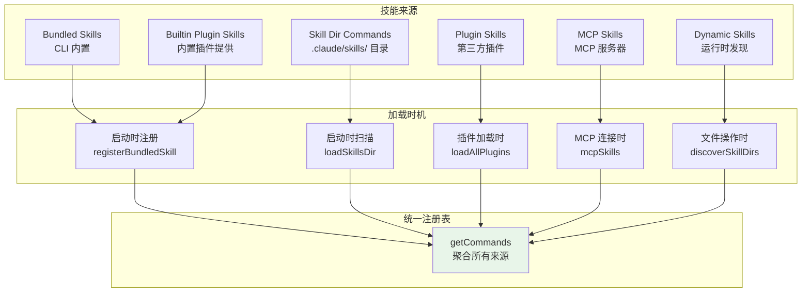

# 第 37 章：技能系统（Skills）

## 37.1 技能是什么：可复用的提示词模板

如果说命令是 Claude Code 的"执行器"，那么技能就是它的"知识库"。技能（Skills）是 Claude Code 中一个独特而强大的概念——它本质上是一个**结构化的、可复用的提示词模板**，配备了元数据描述、工具约束和执行上下文。

为什么需要技能这个概念？因为一个好的 AI Agent 交互，往往依赖于精心设计的提示词。例如，让 AI 做代码审查、生成提交信息、分析安全漏洞——每种任务都需要不同的引导策略。如果每个用户都要自己写这些提示词，那就是在重复造轮子。技能系统让这些最佳实践可以被定义一次、分享给所有人。

从技术角度看，技能就是 `Command` 类型中 `type === 'prompt'` 的一个实例。它们共享同一个类型系统，但技能在命令的基础上增加了更丰富的语义：

```typescript
type PromptCommand = {
  type: 'prompt'
  progressMessage: string
  allowedTools?: string[]          // 技能可以约束可用的工具集
  model?: string                   // 技能可以指定使用的模型
  context?: 'inline' | 'fork'     // 技能可以指定执行上下文
  agent?: string                   // fork 模式下使用的 Agent 类型
  hooks?: HooksSettings            // 技能可以注册临时钩子
  paths?: string[]                 // 技能可以绑定到特定文件路径
  whenToUse?: string               // 何时使用此技能的描述
  // ...
}
```

这些元数据让技能不仅仅是一段文本——它是一个完整的"任务规格书"，告诉 AI 在什么情况下、用什么工具、以什么方式来完成一个特定任务。

## 37.2 技能的多种来源

Claude Code 的技能来自六个不同的来源，每种来源有不同的发现和加载机制。



### Bundled Skills：随 CLI 发布的内置技能

这些技能在 `skills/bundled/` 目录下定义，通过 `registerBundledSkill()` 在启动时注册。它们是编译进 CLI 二进制文件的，所有用户默认都有。

以 `remember` 技能为例（`skills/bundled/remember.ts`）：

```typescript
export function registerRememberSkill(): void {
  registerBundledSkill({
    name: 'remember',
    description: 'Review auto-memory entries and propose promotions...',
    whenToUse: 'Use when the user wants to review, organize, or promote...',
    isEnabled: () => isAutoMemoryEnabled(),
    async getPromptForCommand(args) {
      let prompt = SKILL_PROMPT
      if (args) prompt += `\n## Additional context from user\n\n${args}`
      return [{ type: 'text', text: prompt }]
    },
  })
}
```

注意几个关键设计：

1. **`whenToUse` 字段**：这是一个专门给 AI 模型看的描述，告诉模型"在什么情况下应该考虑使用这个技能"。这让模型可以在 SkillTool 的工具列表中自主选择合适的技能。
2. **`isEnabled` 函数**：动态判断技能是否可用，这里检查自动记忆功能是否开启。
3. **`getPromptForCommand`**：延迟生成提示词，支持参数替换。

Bundled Skills 的注册还支持 Feature Flag 控制：

```typescript
// skills/bundled/index.ts
if (feature('KAIROS') || feature('KAIROS_DREAM')) {
  const { registerDreamSkill } = require('./dream.js')
  registerDreamSkill()
}
```

### Skill Dir Commands：用户自定义技能

用户可以在多个位置的 `.claude/skills/` 目录下创建自己的技能。技能的发现机制会扫描一个精心设计的层级：

```typescript
// loadSkillsDir.ts
const userSkillsDir = join(getClaudeConfigHomeDir(), 'skills')     // ~/.claude/skills/
const managedSkillsDir = join(getManagedFilePath(), '.claude', 'skills')  // 企业策略
const projectSkillsDirs = getProjectDirsUpToHome('skills', cwd)          // 项目目录
```

这种多层级设计意味着：企业管理员可以定义全员可用的技能（策略层），用户可以定义自己的技能（用户层），项目可以定义项目特定的技能（项目层）。三层技能通过去重机制合并，优先级为：策略 > 用户 > 项目。

### Dynamic Skills：运行时按需发现

这是技能系统最精巧的设计之一。不是所有技能都需要在启动时就加载。某些技能只在处理特定文件时才有意义。

`loadSkillsDir.ts` 实现了一个**基于文件路径的动态发现机制**：

```typescript
export async function discoverSkillDirsForPaths(
  filePaths: string[],
  cwd: string,
): Promise<string[]>
```

当 Agent 在执行文件操作（如 Read、Write、Edit）时，系统会检查被操作的文件路径附近是否存在 `.claude/skills/` 目录。如果发现新的技能目录，就动态加载并注册这些技能。

这种"按需发现"的设计有几个好处：

1. **减少启动时的 I/O 开销**：不需要在启动时扫描整个文件树。
2. **支持子目录级别的技能**：一个大型项目可以在不同子目录中定义不同的技能集。
3. **防止加载不信任的技能**：发现机制会跳过 `.gitignore` 忽略的目录（如 `node_modules/`），防止恶意技能通过依赖包注入。

### Conditional Skills：条件触发技能

技能还支持 `paths` frontmatter 字段，允许技能只在处理特定路径的文件时才被激活：

```yaml
---
paths:
  - "src/**/*.py"
  - "tests/**/*.py"
---
```

这种技能在启动时不会被加载到命令列表中，而是存储在一个特殊的 `conditionalSkills` Map 中。当 Agent 操作匹配 `paths` 模式的文件时，技能才会被"激活"并加入可用技能列表。

这种设计避免了技能列表的无限制膨胀——只有与当前操作相关的技能才会出现在模型的工具列表中。

## 37.3 技能的加载与执行流程

让我们跟踪一个技能从定义到执行的完整流程。

```mermaid
sequenceDiagram
    participant Disk as 文件系统
    participant Loader as loadSkillsDir
    participant Parser as Frontmatter 解析器
    participant Registry as 命令注册表
    participant Model as AI 模型
    participant Executor as getPromptForCommand

    Disk->>Loader: 读取 SKILL.md 文件
    Loader->>Parser: parseFrontmatter(content)
    Parser-->>Loader: { frontmatter, content }

    Note over Loader: 解析 frontmatter 字段：
    - description → 技能描述
    - allowed-tools → 工具约束
    - when_to_use → 使用场景
    - context → 执行上下文
    - paths → 条件路径

    Loader->>Registry: createSkillCommand({...})
    Note over Registry: 技能被注册为 Command 对象<br/>type: 'prompt'

    Note over Model: 模型在 SkillTool 列表中<br/>看到此技能的描述和 whenToUse

    Model->>Executor: 调用 /skill-name [args]
    Executor->>Executor: substituteArguments(content, args)
    Executor->>Executor: 替换 ${CLAUDE_SKILL_DIR}
    Executor->>Executor: 替换 ${CLAUDE_SESSION_ID}
    Executor->>Executor: 执行 Shell 命令（!`...`）
    Executor-->>Model: [{ type: 'text', text: finalPrompt }]
    Note over Model: 提示词被注入到对话上下文
```

### Frontmatter 解析

技能的元数据通过 YAML Frontmatter 定义在 Markdown 文件中。`parseSkillFrontmatterFields` 函数（`loadSkillsDir.ts`）解析这些字段：

- `description`：技能的简短描述
- `allowed-tools`：限制技能可以使用的工具列表
- `when_to_use`：详细的使用场景描述
- `arguments`：技能接受的参数名称列表
- `context`：执行上下文（`inline` 或 `fork`）
- `agent`：fork 模式下使用的 Agent 类型
- `effort`：推理努力级别
- `hooks`：技能执行时注册的临时钩子
- `user-invocable`：是否允许用户直接调用
- `disable-model-invocation`：是否禁止模型自主调用
- `paths`：条件触发的文件路径模式

### 参数替换

技能支持通过 `${ARG_NAME}` 语法引用参数。当用户或模型调用技能时，`substituteArguments` 函数会将这些占位符替换为实际参数值：

```typescript
finalContent = substituteArguments(
  finalContent,
  args,
  true,         // 是否允许位置参数
  argumentNames // frontmatter 中声明的参数名
)
```

此外，还有两个特殊的内置变量：
- `${CLAUDE_SKILL_DIR}`：技能文件所在的目录路径，让技能可以引用同目录下的辅助脚本
- `${CLAUDE_SESSION_ID}`：当前会话 ID

### Shell 命令注入

技能 Markdown 中可以嵌入动态的 Shell 命令，使用 `!`code`` 或 ```! ``` 语法：

```
Current git branch: !`git branch --show-current`
```

这些命令在技能被调用时实时执行，输出被嵌入到提示词中。但这个功能有明确的安全边界——MCP 来源的技能（远程、不可信）不允许执行内联 Shell 命令：

```typescript
if (loadedFrom !== 'mcp') {
  finalContent = await executeShellCommandsInPrompt(...)
}
```

## 37.4 技能与插件的异同

技能和插件经常被混淆，因为它们都能扩展 Claude Code 的能力。但它们在设计目标和实现机制上有本质区别。

| 维度 | 技能（Skill） | 插件（Plugin） |
|------|-------------|--------------|
| **核心定义** | 一个 Markdown 文件 | 一个包含 plugin.json 的目录 |
| **扩展方式** | 提示词模板 | 命令 + Agent + Hook + MCP + LSP |
| **安装方式** | 放入 .claude/skills/ 目录 | 通过 Marketplace 安装 |
| **隔离性** | 无代码执行（除 Shell 注入） | 可以启动独立进程（MCP/LSP 服务器） |
| **适用场景** | 定义"怎么引导 AI" | 定义"AI 能做什么" |
| **共享方式** | 文件复制或 Git | Marketplace 发布 |

简单来说：**技能教 AI "如何思考"，插件教 AI "能做什么"。**

一个最佳实践的例子是 `/remember` 技能——它不添加任何新的系统能力，只是教 AI 如何系统地审查和组织记忆文件。而一个"Jira 集成"插件则需要注册一个 MCP 服务器来与 Jira API 通信——这是插件才能做到的。

## 37.5 技能如何被模型"看到"

技能的价值只有在模型能看到并使用时才能体现。Claude Code 通过 `SkillTool`（`tools/SkillTool/`）将技能暴露给模型。

`getSkillToolCommands` 函数（`commands.ts`）负责筛选出模型可以调用的技能：

```typescript
export const getSkillToolCommands = memoize(
  async (cwd: string): Promise<Command[]> => {
    const allCommands = await getCommands(cwd)
    return allCommands.filter(
      cmd =>
        cmd.type === 'prompt' &&
        !cmd.disableModelInvocation &&
        cmd.source !== 'builtin' &&
        (cmd.loadedFrom === 'bundled' ||
          cmd.loadedFrom === 'skills' ||
          cmd.loadedFrom === 'commands_DEPRECATED' ||
          cmd.hasUserSpecifiedDescription ||
          cmd.whenToUse),
    )
  },
)
```

这个过滤逻辑揭示了一个重要的设计考量：**不是所有命令都应该被模型调用**。只有满足以下条件的命令才会出现在模型的技能列表中：

1. 必须是 `prompt` 类型——模型只能调用"提示词展开"类的命令
2. 没有被标记为 `disableModelInvocation`
3. 不是内置命令（`source !== 'builtin'`）——内置命令如 `/help`、`/clear` 不需要模型知道
4. 有足够的元数据（描述或 whenToUse）让模型理解它的用途

这种设计避免了模型被大量无意义的命令干扰，确保模型的注意力集中在真正有用的技能上。

## 37.6 设计启示

**Markdown 即代码。** 技能用 Markdown + Frontmatter 定义，这是一个人性化的选择。相比 JSON 或 YAML 配置文件，Markdown 让技能的作者可以在定义元数据的同时，直接在正文中用自然语言描述任务流程。这种"文档即配置"的设计大大降低了创建技能的门槛。

**按需加载是可扩展性的关键。** Conditional Skills 和 Dynamic Skills 的设计表明，在一个大型项目中，可能有成百上千的技能定义。如果全部加载，不仅会增加内存和 I/O 开销，还会让模型面临"选择过载"的问题。按需加载确保了只有相关的技能才出现在模型的视野中。

**去重是分布式系统的永恒话题。** 技能通过 `realpath` 解析符号链接来检测重复文件。这个看似简单的操作解决了多种边缘情况：项目目录通过符号链接被多个路径引用、用户目录和项目目录有重叠等。使用文件系统身份（而非字符串路径比较）来去重，是一个在分布式文件系统中被验证过的可靠策略。

**MCP Skill Builders 模式。** `skills/mcpSkillBuilders.ts` 展示了一个优雅的依赖注入模式——为了避免循环依赖，`loadSkillsDir.ts` 在模块初始化时将自己的 `createSkillCommand` 和 `parseSkillFrontmatterFields` 函数注册到一个叶子模块中，MCP 技能发现代码可以从这个叶子模块获取这些函数，而不需要直接 import `loadSkillsDir.ts`。这种"write-once registry"模式在解决循环依赖时非常有用。

**渐进式的能力暴露。** 技能系统不是一蹴而就的。从最初的 `/commands/` 目录（legacy，仅支持简单 Markdown 文件），到 `/skills/` 目录（支持目录结构和更丰富的 Frontmatter），再到 Bundled Skills、Plugin Skills 和 MCP Skills，每一层都向后兼容。这种渐进式的演进策略让系统可以在不破坏现有用户工作流的前提下不断进化。
