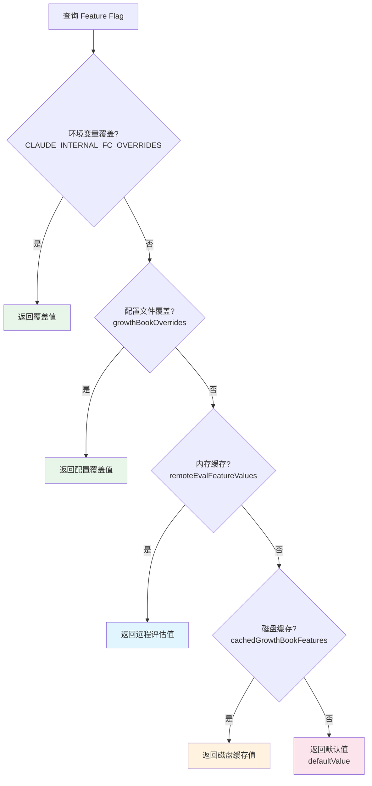
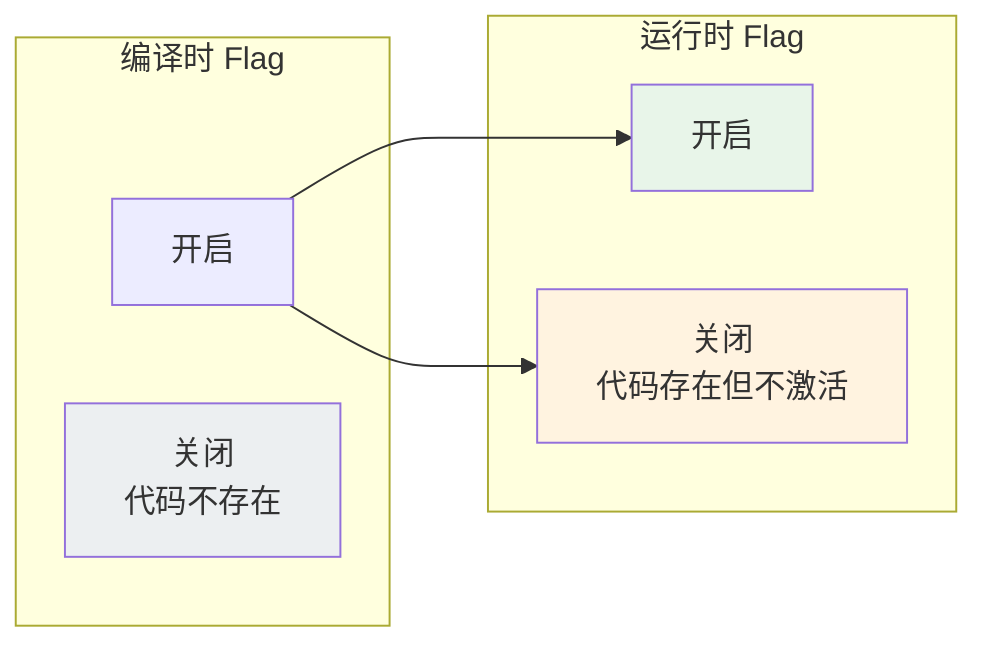

# 第 38 章：Feature Flag 与渐进式发布

## 38.1 为什么一个 AI Agent 需要 Feature Flag

想象这样一个场景：Claude Code 团队开发了一个新的"语音模式"功能。这个功能涉及新的 UI 组件、新的音频处理管道、新的 MCP 集成。团队希望：

- 先对内部用户（Anthropic 员工）开放测试
- 确认稳定后，对 5% 的外部用户灰度发布
- 发现问题可以立即回滚，不需要重新发布版本
- 某些企业客户可能有合规要求，需要完全关闭此功能

这就是 Feature Flag（功能标志）的经典应用场景。对于 Claude Code 这样一个被数百万人使用的 AI Agent，Feature Flag 不是一个"nice-to-have"，而是迭代管理的核心基础设施。

Claude Code 的 Feature Flag 系统由两个互补的机制组成：**编译时 Feature Flag**（通过 `bun:bundle` 的 `feature()` 函数）和**运行时 Feature Flag**（通过 GrowthBook 平台）。这两者的结合创造了一个强大而灵活的功能发布体系。

## 38.2 编译时 Feature Flag：`bun:bundle` 的 `feature()` 函数

Claude Code 使用 Bun 作为构建工具链。Bun 提供了一个独特的编译时 Feature Flag 机制——`feature()` 函数（从 `bun:bundle` 导入）。

这个函数在编译时求值。当 `feature('FLAG_NAME')` 返回 `false` 时，Bun 的打包器会将对应的代码分支标记为"死代码"并从最终的二进制文件中完全移除。

### 工作原理

在 `commands.ts` 中，我们可以看到大量编译时条件导入的例子：

```typescript
import { feature } from 'bun:bundle'

const voiceCommand = feature('VOICE_MODE')
  ? require('./commands/voice/index.js').default
  : null

const bridgeCommand = feature('BRIDGE_MODE')
  ? require('./commands/bridge/index.js').default
  : null

const workflowsCmd = feature('WORKFLOW_SCRIPTS')
  ? require('./commands/workflows/index.js').default
  : null
```

当 `VOICE_MODE` Flag 关闭时，`voiceCommand` 为 `null`，而 `require('./commands/voice/index.js')` 这行代码以及它引用的所有模块（包括音频处理库、语音识别 SDK 等）都不会出现在最终的二进制文件中。

### 死代码消除的层次

这种编译时消除在多个层面起作用：

**命令级别消除**：如上所述，整个命令模块被排除。

**技能级别消除**（`skills/bundled/index.ts`）：

```typescript
if (feature('KAIROS') || feature('KAIROS_DREAM')) {
  const { registerDreamSkill } = require('./dream.js')
  registerDreamSkill()
}

if (feature('BUILDING_CLAUDE_APPS')) {
  const { registerClaudeApiSkill } = require('./claudeApi.js')
  registerClaudeApiSkill()
}
```

**工具级别消除**：某些工具的定义也受 Feature Flag 控制。

**API 级别消除**（`constants/betas.ts`）：

```typescript
export const SUMMARIZE_CONNECTOR_TEXT_BETA_HEADER = feature('CONNECTOR_TEXT')
  ? 'summarize-connector-text-2026-03-13'
  : ''

export const AFK_MODE_BETA_HEADER = feature('TRANSCRIPT_CLASSIFIER')
  ? 'afk-mode-2026-01-31'
  : ''
```

当 Flag 关闭时，Beta Header 变为空字符串，这意味着对应的 API 功能不会被启用。

### 为什么编译时消除如此重要

对于 CLI 工具来说，二进制文件大小直接影响用户体验——下载和安装时间、磁盘占用、启动速度。Claude Code 的某些功能（如语音模式、Bridge 模式）涉及大量依赖，如果全部编译进二进制文件，会显著增加分发包的大小。

更重要的是，编译时消除提供了**零运行时开销**的保证。被消除的代码不占用内存、不注册任何钩子、不参与任何初始化流程。这是运行时 Feature Flag 无法做到的——即使运行时 Flag 关闭了某个功能，该功能的代码仍然存在于内存中，其模块初始化代码仍然会执行。

## 38.3 运行时 Feature Flag：GrowthBook 集成

编译时 Flag 解决了"这个功能是否存在于二进制文件中"的问题，但它无法回答"这个功能是否应该对当前用户开放"的问题。后者需要运行时的 Feature Flag 系统。

Claude Code 使用 GrowthBook 作为运行时 Feature Flag 平台（`services/analytics/growthbook.ts`）。

### Feature Flag 的解析链

当代码查询一个 Feature Flag 的值时，它经过一个精心设计的解析链：



这个解析链有五层，每一层都有明确的用途：

1. **环境变量覆盖**（`CLAUDE_INTERNAL_FC_OVERRIDES`）：用于内部测试和评估框架。这个 JSON 格式的环境变量可以覆盖任意 Feature Flag，主要用于自动化测试。

2. **配置文件覆盖**（`growthBookOverrides`）：通过 `/config` UI 的 Gates 标签页设置，仅限内部用户（`USER_TYPE === 'ant'`）。这允许 Anthropic 员工在不开代码的情况下快速测试特定 Flag 组合。

3. **内存缓存**（`remoteEvalFeatureValues`）：GrowthBook 远程评估的结果，在每次成功刷新后更新。这是运行时的主要数据源。

4. **磁盘缓存**（`cachedGrowthBookFeatures`）：上一个进程写入的远程评估结果。用于当前进程的 GrowthBook 初始化完成前的回退值——这意味着 Feature Flag 即使在离线状态下也能正常工作（使用上一次的缓存值）。

5. **默认值**（`defaultValue`）：代码中硬编码的回退值。只有在前四层都没有数据时才使用。

### 两类 Flag 读取函数

Claude Code 提供了两类 Feature Flag 读取函数，对应不同的使用场景：

**阻塞式读取**（已废弃，但仍在使用）：

```typescript
export async function getFeatureValue_DEPRECATED<T>(
  feature: string,
  defaultValue: T,
): Promise<T>
```

这个函数会等待 GrowthBook 初始化完成。适用于启动路径上必须获取准确 Flag 值的场景。缺点是如果 GrowthBook 服务慢或不可用，会显著延迟启动时间。

**非阻塞式读取**（推荐）：

```typescript
export function getFeatureValue_CACHED_MAY_BE_STALE<T>(
  feature: string,
  defaultValue: T,
): T
```

这个函数立即返回，不等待 GrowthBook 初始化。它使用磁盘缓存作为数据源——值可能是上一个进程启动时的快照（因此函数名中有 "MAY_BE STALE"）。适用于大多数运行时场景，因为它不会阻塞主线程。

这种"快照优先"的设计哲学值得深思：**一个快速但不完美的答案，通常比一个完美但缓慢的答案更有价值。** 对于 Feature Flag 来说，使用上一版本的值（可能稍有延迟）远比阻塞用户体验要可接受。

### 动态配置与实验

除了简单的 boolean Flag，GrowthBook 还支持动态配置——Flag 的值可以是任意 JSON 对象：

```typescript
export async function getDynamicConfig_BLOCKS_ON_INIT<T>(
  configName: string,
  defaultValue: T,
): Promise<T>
```

这让团队可以通过 Feature Flag 控制复杂的行为参数，如模型的温度值、最大 token 数、工具使用策略等，而不需要修改代码或重新发布。

GrowthBook 还支持 A/B 实验。当 Flag 配置了实验规则时，系统会记录曝光事件（`logExposureForFeature`），让团队可以通过数据分析评估实验效果。

## 38.4 Beta Header 机制

Feature Flag 不仅控制客户端行为，还控制 API 行为。Claude Code 通过 **Beta Header** 机制将 Feature Flag 的状态传递给 Anthropic API。

`constants/betas.ts` 定义了所有 Beta Header：

```typescript
export const CLAUDE_CODE_20250219_BETA_HEADER = 'claude-code-20250219'
export const INTERLEAVED_THINKING_BETA_HEADER = 'interleaved-thinking-2025-05-14'
export const CONTEXT_1M_BETA_HEADER = 'context-1m-2025-08-07'
export const TOOL_SEARCH_BETA_HEADER_1P = 'advanced-tool-use-2025-11-20'
export const EFFORT_BETA_HEADER = 'effort-2025-11-24'
```

每个 Beta Header 代表一个服务端功能。客户端通过在 API 请求中包含这些 Header 来启用对应的服务端功能。

有趣的是，某些 Beta Header 受 Feature Flag 控制：

```typescript
export const SUMMARIZE_CONNECTOR_TEXT_BETA_HEADER = feature('CONNECTOR_TEXT')
  ? 'summarize-connector-text-2026-03-13'
  : ''
```

这创造了一个端到端的 Feature Flag 链条：编译时 Flag 决定了 Beta Header 是否存在，Beta Header 决定了 API 是否启用对应功能。

### 跨平台的 Beta Header 管理

不同的 API 提供商（Claude API、AWS Bedrock、Google Vertex AI）对 Beta Header 的支持程度不同。Claude Code 通过精细化的 Header 管理来处理这种差异：

```typescript
export const BEDROCK_EXTRA_PARAMS_HEADERS = new Set([
  INTERLEAVED_THINKING_BETA_HEADER,
  CONTEXT_1M_BETA_HEADER,
  TOOL_SEARCH_BETA_HEADER_3P,  // 注意：3P 用不同的 Header！
])
```

同一个功能在不同平台上有不同的标识符——例如"工具搜索"在 Claude API 上是 `advanced-tool-use-2025-11-20`，在 Bedrock/Vertex 上是 `tool-search-tool-2025-10-19`。这种抽象确保了 Feature Flag 系统在不同基础设施上的可移植性。

## 38.5 两层 Flag 的协同工作

编译时 Flag 和运行时 Flag 不是互相替代的关系，而是协同工作的。它们的组合形成了四种不同的发布策略：



**编译时开启 + 运行时开启**：功能完全可用。这是大多数功能在生产环境中的状态。

**编译时开启 + 运行时关闭**：代码存在于二进制文件中，但功能被 Feature Flag 禁用。这是灰度发布和紧急回滚的场景——GrowthBook 可以即时关闭某个功能，无需重新发布版本。

**编译时关闭**：代码完全不存在。这是内部测试功能或未发布功能的状态。

**编译时开启 + 运行时灰度**：功能对部分用户可用。这是 GrowthBook 的实验和灰度发布能力——可以根据用户 ID、订阅类型、地域等属性来分配 Flag 值。

## 38.6 命令的 isEnabled：Feature Flag 的终端节点

Feature Flag 的效果最终体现在命令的 `isEnabled` 函数上。这是 Flag 系统的"终端节点"——用户看到的就是一个命令是否出现在自动补全列表中。

```typescript
export function isCommandEnabled(cmd: CommandBase): boolean {
  return cmd.isEnabled?.() ?? true
}
```

不同命令使用不同的 Flag 检查策略：

**环境变量检查**：
```typescript
isEnabled: () => !isEnvTruthy(process.env.DISABLE_COMPACT)
```

**GrowthBook Flag 检查**：
```typescript
isEnabled: () => isUltrareviewEnabled()  // 内部查询 GrowthBook
```

**Feature Flag + 条件组合**：
```typescript
isEnabled: () => feature('AGENT_TRIGGERS') && isKairosCronEnabled()
```

这种设计让命令成为 Feature Flag 系统的"智能终端"——每个命令可以定义自己的启用条件，而不需要一个中心化的 Flag 分发系统。

## 38.7 缓存与刷新策略

运行时 Feature Flag 的核心矛盾是**一致性 vs 可用性**。你希望 Flag 的变更能即时生效（一致性），但又不希望每次读取都发一次网络请求（可用性）。

Claude Code 的解决方案是**定期刷新 + 事件通知**：

```typescript
// GrowthBook 初始化时设置定期刷新
function setupPeriodicGrowthBookRefresh(): void {
  setInterval(async () => {
    await client.refreshFeatures()
    await processRemoteEvalPayload(client)
    syncRemoteEvalToDisk()
    refreshed.emit()  // 通知所有订阅者
  }, POLLING_INTERVAL_MS)
}
```

`refreshed` 是一个 Signal（`utils/signal.ts`），所有依赖 Feature Flag 的系统都可以订阅这个信号来响应 Flag 变更：

```typescript
export function onGrowthBookRefresh(
  listener: () => void | Promise<void>,
): () => void {
  return refreshed.subscribe(() => callSafe(listener))
}
```

这种设计意味着 Flag 的变更有一个**最终一致性**的窗口——在两次刷新之间，Flag 的值可能是旧的。但对于大多数场景来说，几分钟的延迟是完全可以接受的。

## 38.8 设计启示

**编译时和运行时不是非此即彼的选择。** Claude Code 的双层 Flag 系统表明，这两种机制是互补的。编译时 Flag 解决"这个功能是否应该出现在产品中"（安全性和二进制大小），运行时 Flag 解决"这个功能是否应该对当前用户开启"（灰度发布和紧急回滚）。

**"可能过时"比"可能阻塞"好。** `getFeatureValue_CACHED_MAY_BE_STALE` 的命名风格是一种值得学习的 API 设计哲学——函数名明确告知了它的局限（值可能过时），让调用者可以做出知情的选择。相比之下，一个隐式阻塞的函数（`getFeatureValue_DEPRECATED`）可能会在不知不觉中引入性能问题。

**API Beta Header 是 Feature Flag 的自然延伸。** 将客户端的 Flag 状态传递给服务端，创造了端到端的功能控制链。这在微服务架构中尤为重要——没有这种机制，客户端和服务端的 Flag 状态可能不一致，导致难以调试的行为差异。

**磁盘缓存是离线体验的基础。** Feature Flag 的磁盘缓存（`syncRemoteEvalToDisk`）确保了即使在完全离线的环境下，系统也能使用上一次已知的 Flag 值正常运行。这对 CLI 工具来说至关重要——用户可能在飞机上、在隧道里、在公司防火墙后面使用 Claude Code。

**Feature Flag 是系统架构的一部分，不是事后的补丁。** Claude Code 的 Flag 系统深入到了命令注册、技能加载、工具定义、API 调用等每一个层面。这种深度集成不是可以后来加上的——它需要在系统设计之初就被纳入架构考量。如果你的 Agent 系统正在增长，请尽早建立 Feature Flag 基础设施。
