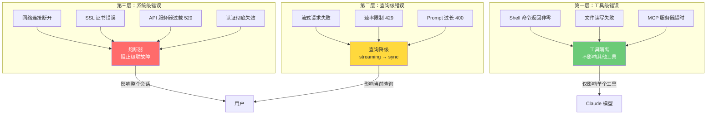
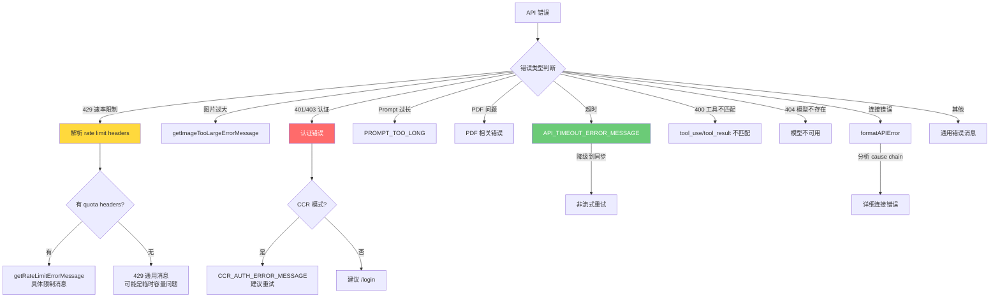
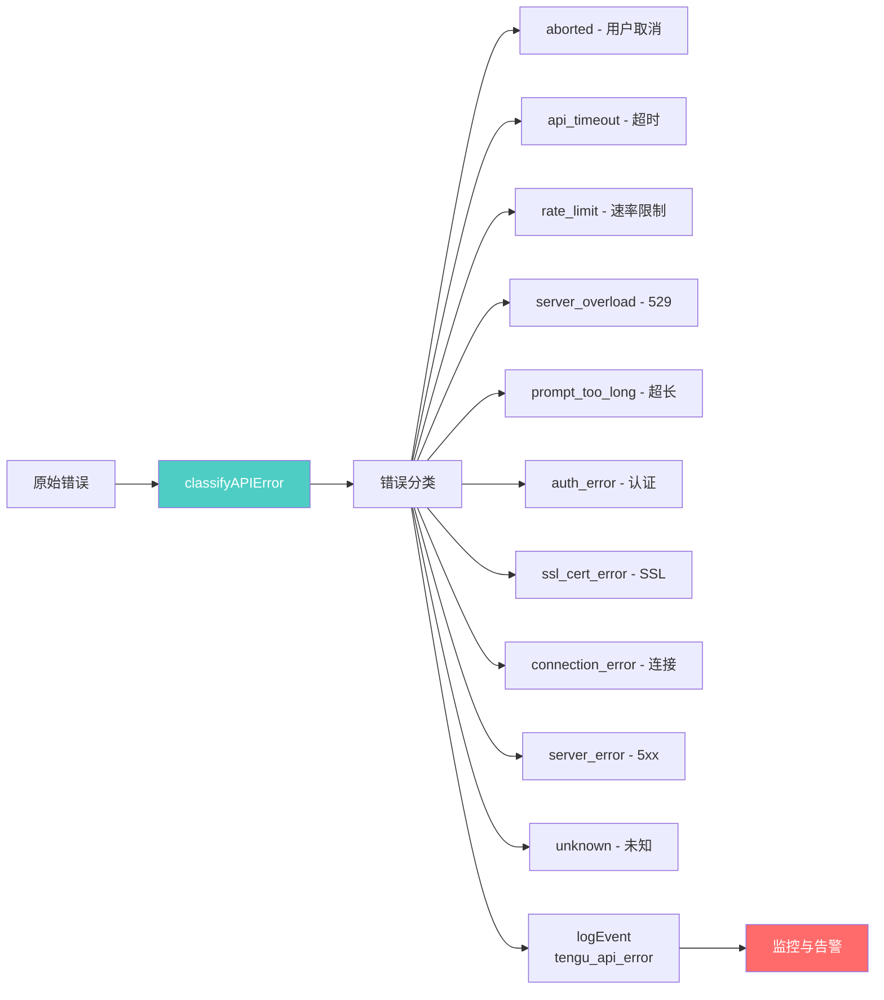
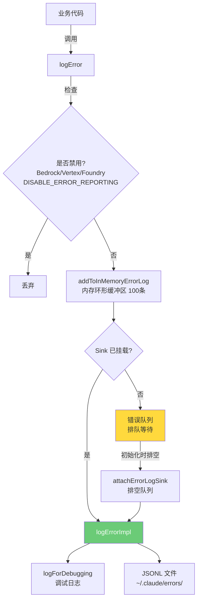
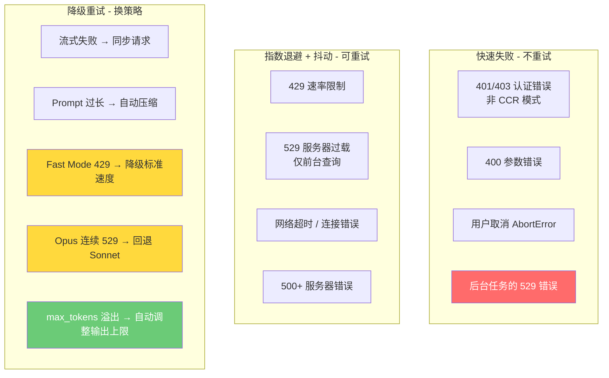

# 第 39 章：错误处理与重试策略

## 核心设计问题

> AI Agent 系统中的错误与普通应用有何不同？为什么不能简单地 try-catch 一切？

普通应用的错误处理是二元的：成功或失败。但 AI Agent 的错误是一个光谱——从"这个工具失败了，换一个试试"到"整个查询需要降级"再到"系统级故障，停止一切"。Claude Code 的错误处理架构正是围绕这个光谱设计的，形成了三层隔离、三种重试策略的分层防御体系。

## 错误处理的三层架构

Claude Code 将错误处理分为三个层级，每一层都有独立的职责边界和恢复策略。



### 第一层：工具级错误隔离

工具级错误是 Agent 系统中最常见的错误类型。一个 Shell 命令失败、一个文件不存在、一个 MCP 服务器超时——这些错误不应该影响 Agent 的其他工具调用或整个查询流程。

Claude Code 在 `utils/errors.ts` 中定义了专门的错误类型来区分不同场景：

```typescript
// utils/errors.ts
export class ShellError extends Error {
  constructor(
    public readonly stdout: string,
    public readonly stderr: string,
    public readonly code: number,
    public readonly interrupted: boolean,
  ) {
    super('Shell command failed')
    this.name = 'ShellError'
  }
}
```

`ShellError` 保留了对诊断至关重要的上下文信息：`stdout` 和 `stderr` 让 Claude 模型可以理解命令为什么失败，`code` 提供了退出码，`interrupted` 标记是否被用户中断。这些信息作为 `tool_result` 返回给模型，而不是作为异常向上抛出。

关键设计哲学：**工具错误不是异常，而是工具的输出**。Agent 将失败结果连同错误信息一起返回给模型，让模型决定下一步行动——是换一个命令、检查文件是否存在、还是告知用户。

另一个精妙的设计是 `shortErrorStack` 函数：

```typescript
// utils/errors.ts
export function shortErrorStack(e: unknown, maxFrames = 5): string {
  if (!(e instanceof Error)) return String(e)
  if (!e.stack) return e.message
  const lines = e.stack.split('\n')
  const header = lines[0] ?? e.message
  const frames = lines.slice(1).filter(l => l.trim().startsWith('at '))
  if (frames.length <= maxFrames) return e.stack
  return [header, ...frames.slice(0, maxFrames)].join('\n')
}
```

为什么不返回完整的堆栈？因为完整的堆栈可能有 500-2000 个字符，主要是内部无关的帧，会浪费 context tokens。只保留前 5 帧足以定位问题，同时节省宝贵的上下文空间。

### 第二层：查询级错误与降级

当 API 调用本身失败时，错误处理上升到查询级别。Claude Code 在 `services/api/errors.ts` 中实现了一个庞大的 `getAssistantMessageFromError` 函数，它是一个精心设计的错误分类器。



这个分类器的设计原则是：**给用户和模型最有用的错误信息，而不是原始的技术错误**。

例如，对于超时错误：

```typescript
// services/api/errors.ts
if (
  error instanceof APIConnectionTimeoutError ||
  (error instanceof APIConnectionError &&
    error.message.toLowerCase().includes('timeout'))
) {
  return createAssistantAPIErrorMessage({
    content: API_TIMEOUT_ERROR_MESSAGE,
    error: 'unknown',
  })
}
```

超时错误被转换为一条简洁的消息 "Request timed out"，而不是暴露底层的连接细节。这条消息作为 `AssistantMessage` 返回——对模型来说，它看起来就像 Claude 的一个正常回复，只是内容是错误信息。这让模型可以理解发生了什么并向用户解释。

查询级错误的另一个重要模式是**交互模式感知**。许多错误消息会根据 `getIsNonInteractiveSession()` 返回不同的文案：

```typescript
// 非交互模式（SDK/CI）："PDF too large (max 100 pages, 32MB).
// Try reading the file a different way."

// 交互模式（终端）："PDF too large (max 100 pages, 32MB).
// Double press esc to go back and try again."
```

这反映了 Agent 系统的双重身份：它既是一个开发者工具（终端交互），也是一个可编程的 SDK（非交互）。同一个错误需要根据使用场景提供不同的恢复建议。

### 第三层：系统级错误与熔断

系统级错误是那些影响整个会话的错误。`services/api/errorUtils.ts` 中的 `extractConnectionErrorDetails` 函数通过遍历错误 cause 链来提取根因：

```typescript
// services/api/errorUtils.ts
export function extractConnectionErrorDetails(
  error: unknown,
): ConnectionErrorDetails | null {
  let current: unknown = error
  const maxDepth = 5
  let depth = 0

  while (current && depth < maxDepth) {
    if (
      current instanceof Error &&
      'code' in current &&
      typeof current.code === 'string'
    ) {
      const code = current.code
      const isSSLError = SSL_ERROR_CODES.has(code)
      return { code, message: current.message, isSSLError }
    }
    if (current instanceof Error && 'cause' in current) {
      current = current.cause
      depth++
    } else {
      break
    }
  }
  return null
}
```

这个设计特别关注企业用户的场景——企业防火墙（如 Zscaler）会拦截 HTTPS 连接，导致 SSL 证书错误。`formatAPIError` 函数为每种 SSL 错误码提供了具体的中文友好提示，而不是一个笼统的"连接失败"。

系统级错误的"熔断"体现在错误分类器对重复 529 错误的处理：

```typescript
export const REPEATED_529_ERROR_MESSAGE = 'Repeated 529 Overloaded errors'
```

当 API 持续过载时，Claude Code 不会无限重试，而是识别出这是一个系统级问题，向用户报告并停止尝试。

## 错误分类与分析系统

`classifyAPIError` 函数将每个错误映射到一个标准化字符串，用于遥测分析：



这些分类通过 `logEvent('tengu_api_error', ...)` 发送到分析系统，让团队可以追踪每种错误的频率和趋势。

## 错误日志管线

Claude Code 的错误日志系统采用了**队列 + Sink** 的解耦架构：



这个设计的精妙之处在于：**Sink 可能还未初始化，但错误不能丢失**。

```typescript
// utils/log.ts
const errorQueue: QueuedErrorEvent[] = []
let errorLogSink: ErrorLogSink | null = null

export function logError(error: unknown): void {
  // ... 守卫检查 ...
  addToInMemoryErrorLog(errorInfo)

  if (errorLogSink === null) {
    errorQueue.push({ type: 'error', error: err })
    return
  }
  errorLogSink.logError(err)
}
```

在应用启动初期，错误日志的 Sink 还没有挂载。此时所有错误都被推入队列，当 Sink 初始化完成后，队列中的事件被一次性排空。同样的模式也用在了分析事件系统中——这是 Claude Code 中反复出现的解耦模式。

## 重试引擎：withRetry AsyncGenerator

重试逻辑的核心是 `services/api/withRetry.ts` 中的 `withRetry` 函数。与错误分类器不同，它不是普通的函数，而是一个 **AsyncGenerator**：

```typescript
export async function* withRetry<T>(
  getClient: () => Promise<Anthropic>,
  operation: (client: Anthropic, attempt: number, context: RetryContext) => Promise<T>,
  options: RetryOptions,
): AsyncGenerator<SystemAPIErrorMessage, T>
```

为什么用 AsyncGenerator？因为在长时间的重试等待中（可能持续数分钟），调用者需要向用户展示重试进度。`yield createSystemAPIErrorMessage(...)` 让 UI 可以实时显示"正在重试，第 N 次，等待 X 秒"，而不是冻结在空白屏幕。

### 重试策略的分类

不同层级的错误需要不同的重试策略：



### 前台与后台的差异化重试

`withRetry` 中最精妙的设计之一是**前台/后台查询的差异化处理**。529（服务器过载）错误在容量级联期间每次重试都会产生 3-10 倍的网关放大效应。如果所有查询都重试，会雪崩式地加剧过载：

```typescript
const FOREGROUND_529_RETRY_SOURCES = new Set<QuerySource>([
  'repl_main_thread',  // 用户正在等待的主查询
  'sdk',               // SDK 调用
  'agent:default',     // 子 Agent
  'compact',           // 上下文压缩
  'auto_mode',         // 安全分类器
  // ... 后台任务（摘要、标题、建议）不在此列表中
])

function shouldRetry529(querySource: QuerySource | undefined): boolean {
  return querySource === undefined || FOREGROUND_529_RETRY_SOURCES.has(querySource)
}
```

用户正在等待的前台查询会重试 529 错误，而后台任务（生成摘要、标题、建议等）直接放弃——用户看不到这些失败，但重试会加剧过载。

### 指数退避与抖动

退避策略采用经典的指数退避 + 随机抖动：

```typescript
export function getRetryDelay(attempt: number, retryAfterHeader?: string | null, maxDelayMs = 32000): number {
  if (retryAfterHeader) {
    const seconds = parseInt(retryAfterHeader, 10)
    if (!isNaN(seconds)) return seconds * 1000
  }
  const baseDelay = Math.min(BASE_DELAY_MS * Math.pow(2, attempt - 1), maxDelayMs)
  const jitter = Math.random() * 0.25 * baseDelay
  return baseDelay + jitter
}
```

三个关键设计点：(1) 优先遵守服务器的 `Retry-After` 头部——服务器最清楚什么时候能恢复；(2) 指数退避上限 32 秒，避免无意义的长时间等待；(3) 25% 的随机抖动防止多个客户端在同一时刻重试（雷鸣群效应）。

### 快速失败

认证错误（401/403）通常不会重试，因为重试同样的凭证注定会得到同样的结果。但有一个例外——CCR（Claude Code Remote）模式下，认证由基础设施提供的 JWT 处理，401/403 更可能是暂态的网络抖动，因此仍然重试：

```typescript
// CCR 模式下，401/403 是暂态错误，绕过 x-should-retry 头
if (isEnvTruthy(process.env.CLAUDE_CODE_REMOTE) && (error.status === 401 || error.status === 403)) {
  return true
}
```

这个例外说明了"设计原则需要有明确的上下文条件"——同样的错误码在不同部署模式下可能有不同的语义。

### Fast Mode 降级

Fast Mode（加速模式）在遇到 429/529 时有一套专门的降级逻辑，核心目标是**保护 Prompt Cache**：

```typescript
if (wasFastModeActive && error instanceof APIError && (error.status === 429 || is529Error(error))) {
  const retryAfterMs = getRetryAfterMs(error)
  if (retryAfterMs !== null && retryAfterMs < 20_000) {
    // 短暂等待 → 保持 Fast Mode 重试（同一模型名，cache 命中）
    await sleep(retryAfterMs, options.signal, { abortError })
    continue
  }
  // 长时间等待 → 进入冷却期，切换到标准速度
  triggerFastModeCooldown(Date.now() + cooldownMs, cooldownReason)
  retryContext.fastMode = false  // 降级
  continue
}
```

短暂的限制（<20s）保持 Fast Mode 重试以利用缓存；长时间的限制自动降级到标准速度。这种"cache-aware retry"是 Agent 系统中成本感知重试的高级技巧。

### 模型回退

当 Opus 模型连续遭遇 529 错误（MAX_529_RETRIES = 3）时，系统触发模型回退：

```typescript
if (consecutive529Errors >= MAX_529_RETRIES) {
  if (options.fallbackModel) {
    throw new FallbackTriggeredError(options.model, options.fallbackModel)
  }
}
```

`FallbackTriggeredError` 被上层捕获后，用 `fallbackModel`（通常是 Sonnet）重新发起请求。这个设计体现了"可用性优先于最优性"——Opus 虽然更强，但 Sonnet 能用就比完全不可用要好。

### 自修复：max_tokens 溢出调整

一个容易被忽略但非常有价值的降级重试是 `max_tokens` 上下文溢出的自动修复：

```typescript
if (overflowData) {
  const { inputTokens, contextLimit } = overflowData
  const safetyBuffer = 1000
  const availableContext = Math.max(0, contextLimit - inputTokens - safetyBuffer)
  retryContext.maxTokensOverride = Math.max(FLOOR_OUTPUT_TOKENS, availableContext, minRequired)
  continue  // 用调整后的 max_tokens 重试
}
```

当 API 返回 "input length and max_tokens exceed context limit" 时，系统不是简单地压缩上下文再试，而是精确计算剩余空间并调整输出上限。这是一种**精确降级**——不做不必要的压缩，只压缩恰好足够的量。

### Prompt 过长的精确降级

Prompt 过长错误的处理是另一个经典的降级重试模式。`getPromptTooLongTokenGap` 函数从错误消息中解析出超出的 token 数量：

```typescript
export function parsePromptTooLongTokenCounts(rawMessage: string): {
  actualTokens: number | undefined
  limitTokens: number | undefined
} {
  const match = rawMessage.match(/prompt is too long[^0-9]*(\d+)\s*tokens?\s*>\s*(\d+)/i)
  return {
    actualTokens: match ? parseInt(match[1]!, 10) : undefined,
    limitTokens: match ? parseInt(match[2]!, 10) : undefined,
  }
}
```

这个差距信息被传递给响应式压缩（Reactive Compact）机制，让它可以一次性跳过多个分组，而不是一层层地逐个尝试。

## TelemetrySafeError：隐私与遥测的边界

一个特别值得学习的错误类是 `TelemetrySafeError_I_VERIFIED_THIS_IS_NOT_CODE_OR_FILEPATHS`：

```typescript
// utils/errors.ts
export class TelemetrySafeError_I_VERIFIED_THIS_IS_NOT_CODE_OR_FILEPATHS extends Error {
  readonly telemetryMessage: string

  constructor(message: string, telemetryMessage?: string) {
    super(message)
    this.name = 'TelemetrySafeError'
    this.telemetryMessage = telemetryMessage ?? message
  }
}
```

这个类的命名本身就是一种代码审查机制——任何使用这个类的人都必须显式确认错误消息不包含敏感数据（文件路径、URL、代码片段）。它支持两种消息：完整消息给日志和用户，脱敏消息给遥测。这是"通过类型系统强制安全实践"的优秀范例。

## 设计启示

### 1. 错误是 Agent 的感知器官

在传统软件中，错误是需要避免的坏事。但在 Agent 系统中，错误是 Agent 感知环境的重要信息——命令失败告诉模型参数不对，文件不存在告诉模型路径错误。Claude Code 将工具错误作为 `tool_result` 返回给模型，让模型自主决定下一步。

### 2. 分层隔离比统一处理更重要

不同层级的错误需要不同的处理策略。如果用同一个 try-catch 处理所有错误，要么会让工具错误导致整个查询失败，要么会让系统级错误被静默吞掉。三层架构让每一层只处理自己关心的错误。

### 3. 重试策略不是一刀切

前台查询和后台任务对 529 错误的处理完全不同。前台重试是因为用户在等待，后台放弃是因为重试会加剧过载。Fast Mode 的 429 处理考虑了 Prompt Cache 的保持。CCR 模式下的 401 被视为暂态错误。每一条规则的背后都是对"这个错误在这个上下文中意味着什么"的深入理解。

### 4. 降级比重试更优雅

面对可恢复的错误，降级到次优方案往往比盲目重试更有效。流式失败就切换到同步，Prompt 过长就精确压缩上下文，图片过大就去掉图片，Opus 过载就回退 Sonnet，Fast Mode 被限流就降级标准速度。这种"优雅降级"的思想是构建健壮 Agent 的核心。

### 5. 队列-Sink 模式解决初始化时序问题

在应用启动阶段，基础设施可能还没有完全初始化。队列-Sink 模式确保了即使在 Sink 不可用时，事件也不会丢失，同时又不会阻塞启动流程。这种模式在 Claude Code 的错误日志、分析事件、MCP 调试日志中反复出现。
