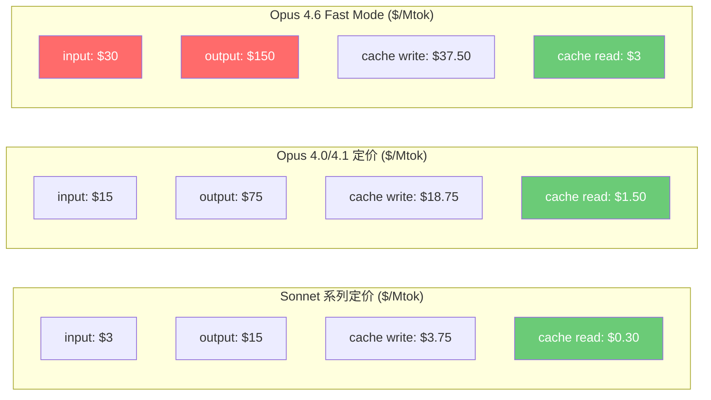
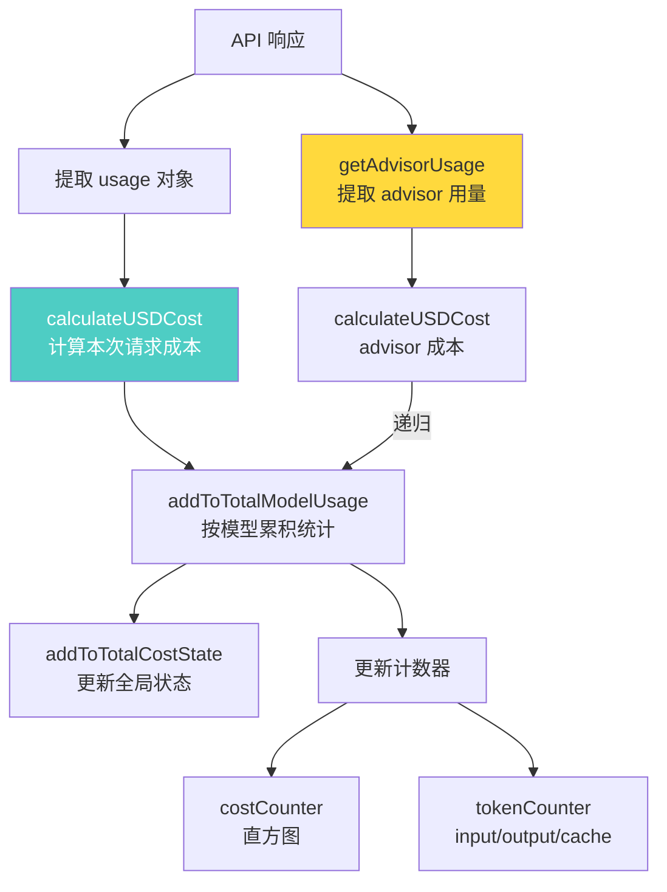
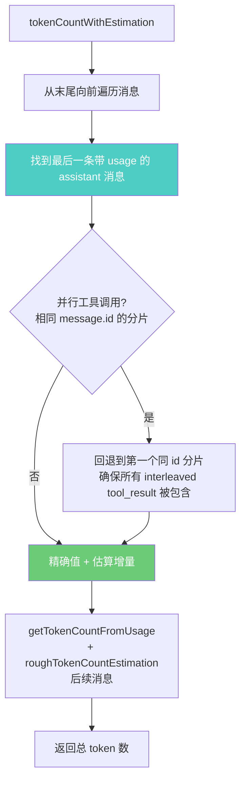
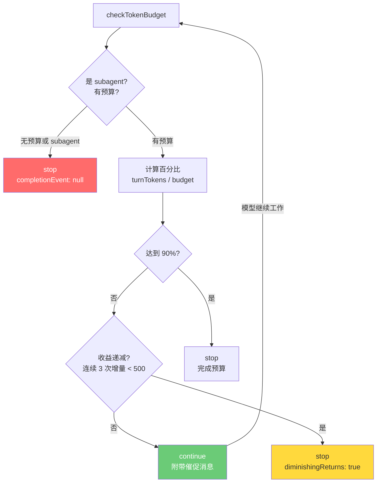
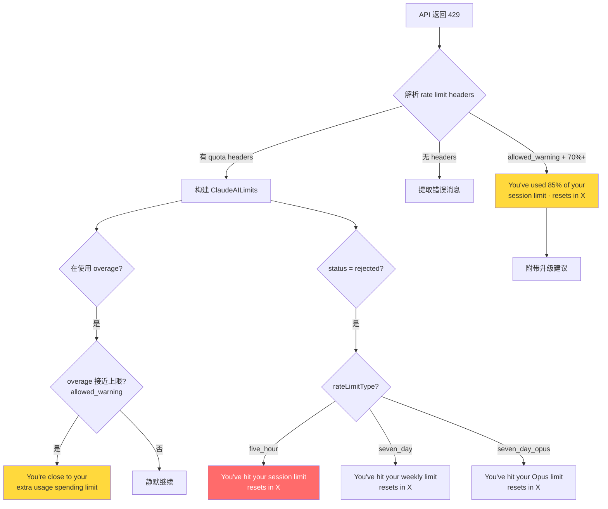

# 第 40 章：成本控制与速率限制

## 核心设计问题

> AI Agent 的经济学与传统软件有何本质区别？如何在保持 Agent 能力的同时控制成本？

传统软件的边际成本趋近于零——多一个用户的请求几乎不增加成本。但 AI Agent 每一次推理都要消耗 token，每百万 token 的成本从几美分到几十美元不等。更关键的是，Agent 的自主性意味着它可能在用户不知情的情况下花费大量 token：一个多步骤的代码重构可能消耗数百万 token，一个无限循环的工具调用可能耗尽整个 API 预算。

Claude Code 的成本控制系统回答了这个问题：**将不可见的 token 消耗转化为可感知的成本信号，在多个阈值点上让用户保持知情**。

## 成本控制管线总览

```mermaid
flowchart TB
    subgraph "1. 模型定价层"
        PRICING[modelCost.ts<br/>每个模型的定价表]
        PRICING --> COST_TIER[COST_TIER_3_15<br/>COST_TIER_15_75<br/>COST_TIER_5_25<br/>COST_HAIKU_35<br/>...]
    end

    subgraph "2. 请求成本计算层"
        USAGE[API Usage<br/>input/output/cache tokens] --> CALC[calculateUSDCost]
        PRICING --> CALC
        CALC --> COST_USD[每次请求的 USD 成本]
    end

    subgraph "3. 累计追踪层"
        COST_USD --> TRACKER[cost-tracker.ts<br/>addToTotalSessionCost]
        TRACKER --> STATE[bootstrap/state<br/>全局成本状态]
        TRACKER --> MODEL_USAGE[按模型统计<br/>ModelUsage]
    end

    subgraph "4. 持久化层"
        STATE --> SAVE[saveCurrentSessionCosts<br/>进程退出时保存]
        SAVE --> CONFIG[projectConfig<br/>lastCost, lastModelUsage]
    end

    subgraph "5. 用户展示层"
        STATE --> DISPLAY[formatTotalCost<br/>终端输出]
        STATE --> THRESHOLD[CostThresholdDialog<br/>$5 阈值警告]
        STATE --> CMD[/cost 命令<br/>用户主动查询]
    end

    subgraph "6. 速率限制层"
        API_RESPONSE[API 响应 Headers] --> RATE_HEADERS[anthropic-ratelimit-*]
        RATE_HEADERS --> RATE_MSG[getRateLimitErrorMessage]
        RATE_HEADERS --> WARNING[getRateLimitWarning<br/>70% 利用率预警]
    end

    style CALC fill:#4ecdc4,color:#fff
    style THRESHOLD fill:#ffd93d,color:#333
    style RATE_MSG fill:#ff6b6b,color:#fff
```

## 模型定价体系

成本控制的第一步是知道每次 API 调用花了多少钱。Claude Code 在 `utils/modelCost.ts` 中维护了完整的定价表：

```typescript
// utils/modelCost.ts
export type ModelCosts = {
  inputTokens: number
  outputTokens: number
  promptCacheWriteTokens: number
  promptCacheReadTokens: number
  webSearchRequests: number
}
```

这个类型定义揭示了 API 计费的五个维度，每个维度有不同的单价。注意 `promptCacheReadTokens` 的价格通常只有 `inputTokens` 的十分之一——缓存命中的 token 便宜得多。这直接影响 Agent 的行为设计：**保持系统提示和工具定义稳定可以显著降低成本**，因为它们会被缓存。



一个关键的设计细节：Opus 4.6 的 Fast Mode 价格是正常模式的 6 倍。`getOpus46CostTier` 函数根据 `usage.speed === 'fast'` 来选择正确的定价等级：

```typescript
export function getOpus46CostTier(fastMode: boolean): ModelCosts {
  if (isFastModeEnabled() && fastMode) {
    return COST_TIER_30_150
  }
  return COST_TIER_5_25
}
```

当遇到未知模型时，系统不会崩溃，而是使用默认定价并记录一个遥测事件：

```typescript
const DEFAULT_UNKNOWN_MODEL_COST = COST_TIER_5_25

function trackUnknownModelCost(model: string, shortName: ModelShortName): void {
  logEvent('tengu_unknown_model_cost', { model, shortName })
  setHasUnknownModelCost()
}
```

`setHasUnknownModelCost` 会在成本显示中添加一条警告："costs may be inaccurate due to usage of unknown models"，确保用户知道成本数据可能不准确。

## 成本追踪管线

### 请求级成本计算

每次 API 响应返回的 `usage` 对象包含 token 使用详情。`calculateUSDCost` 将 token 数量转换为美元：

```typescript
// utils/modelCost.ts
function tokensToUSDCost(modelCosts: ModelCosts, usage: Usage): number {
  return (
    (usage.input_tokens / 1_000_000) * modelCosts.inputTokens +
    (usage.output_tokens / 1_000_000) * modelCosts.outputTokens +
    ((usage.cache_read_input_tokens ?? 0) / 1_000_000) *
      modelCosts.promptCacheReadTokens +
    ((usage.cache_creation_input_tokens ?? 0) / 1_000_000) *
      modelCosts.promptCacheWriteTokens +
    (usage.server_tool_use?.web_search_requests ?? 0) *
      modelCosts.webSearchRequests
  )
}
```

### 会话级成本累积

`cost-tracker.ts` 中的 `addToTotalSessionCost` 是成本累积的入口：



值得注意的是 advisor（内部顾问模型）的 token 使用也被追踪。一次主模型调用可能触发多次 advisor 调用，每个 advisor 调用的成本都被单独计算并累加。

### 模型级使用统计

成本追踪不仅记录总成本，还按模型细粒度统计：

```typescript
type ModelUsage = {
  inputTokens: number
  outputTokens: number
  cacheReadInputTokens: number
  cacheCreationInputTokens: number
  webSearchRequests: number
  costUSD: number
  contextWindow: number
  maxOutputTokens: number
}
```

`formatModelUsage` 函数将这些数据格式化为用户友好的输出：

```
Usage by model:
         claude-sonnet-4-6:  12,345 input, 3,456 output, 8,900 cache read, 1,200 cache write ($0.1234)
          claude-opus-4-6:  5,678 input, 2,345 output, 3,400 cache read, 800 cache write ($0.5678)
```

### 成本持久化与恢复

Agent 会话可能持续很长时间，甚至可能因为网络中断或用户切换而需要恢复。`cost-tracker.ts` 实现了成本的持久化与恢复机制：

```typescript
export function saveCurrentSessionCosts(fpsMetrics?: FpsMetrics): void {
  saveCurrentProjectConfig(current => ({
    ...current,
    lastCost: getTotalCostUSD(),
    lastAPIDuration: getTotalAPIDuration(),
    lastToolDuration: getTotalToolDuration(),
    lastDuration: getTotalDuration(),
    lastLinesAdded: getTotalLinesAdded(),
    lastLinesRemoved: getTotalLinesRemoved(),
    lastModelUsage: Object.fromEntries(
      Object.entries(getModelUsage()).map(([model, usage]) => [model, { ...usage }])
    ),
    lastSessionId: getSessionId(),
  }))
}
```

保存的不仅是成本，还有 API 调用时长、工具执行时长、代码修改行数等完整的会话统计。恢复时通过 `restoreCostStateForSession` 校验 sessionId 确保不会恢复错误的会话数据。

`costHook.ts` 利用 React 的 `useEffect` 在进程退出时自动保存：

```typescript
export function useCostSummary(getFpsMetrics?: () => FpsMetrics | undefined): void {
  useEffect(() => {
    const f = () => {
      if (hasConsoleBillingAccess()) {
        process.stdout.write('\n' + formatTotalCost() + '\n')
      }
      saveCurrentSessionCosts(getFpsMetrics?.())
    }
    process.on('exit', f)
    return () => { process.off('exit', f) }
  }, [])
}
```

## Token 计数的双重策略

Agent 系统需要在两个场景下知道 token 数量：精确计数（用于成本计算）和快速估算（用于上下文管理）。Claude Code 实现了两种策略。

### 精确计数：API 调用

`services/tokenEstimation.ts` 提供了通过 API 的精确 token 计数：

```typescript
export async function countMessagesTokensWithAPI(
  messages: Anthropic.Beta.Messages.BetaMessageParam[],
  tools: Anthropic.Beta.Messages.BetaToolUnion[],
): Promise<number | null>
```

这个函数甚至支持 Bedrock 和 Vertex 等第三方提供商，通过不同的 API 路径获取计数。但对于大量消息，API 调用本身也有延迟和成本。

### 快速估算：本地计算

本地估算使用经典的 "字符数 / 4" 方法，但针对不同内容类型做了优化：

```typescript
export function roughTokenCountEstimation(
  content: string,
  bytesPerToken: number = 4,
): number {
  return Math.round(content.length / bytesPerToken)
}

export function bytesPerTokenForFileType(fileExtension: string): number {
  switch (fileExtension) {
    case 'json':
    case 'jsonl':
    case 'jsonc':
      return 2  // JSON 有大量单字符 token
    default:
      return 4
  }
}
```

JSON 的 bytes-per-token 比率被设为 2 而不是 4，因为 JSON 中有大量单字符 token（`{`、`}`、`:`、`,`、`"`），真实的比率更接近 2。

对于图片和 PDF，估算使用固定的 2000 token 值（API 对图片的最大计费量）：

```typescript
if (block.type === 'image' || block.type === 'document') {
  return 2000
}
```

### 上下文窗口估算

`tokenCountWithEstimation` 是上下文管理的核心函数，它结合了精确计数和快速估算：



这个函数处理了一个微妙的问题：当模型发出并行工具调用时，流式代码会为每个 content block 生成一个单独的 `AssistantMessage` 记录，它们共享同一个 `message.id`。如果只看最后一个分片，会遗漏中间交错的 `tool_result` 消息，导致低估上下文大小。

## Token 预算与任务控制

`query/tokenBudget.ts` 实现了 token 预算机制，控制单个任务（subagent）的 token 消耗：



收益递减检测是这里最精妙的设计：

```typescript
const isDiminishing =
  tracker.continuationCount >= 3 &&
  deltaSinceLastCheck < DIMINISHING_THRESHOLD &&
  tracker.lastDeltaTokens < DIMINISHING_THRESHOLD
```

如果模型连续 3 次续跑，每次新增的 token 都不到 500，说明模型在做低价值的重复工作。此时即使还没达到预算上限，也会停止并报告 `diminishingReturns: true`。

## 速率限制的渐进式预警

`services/rateLimitMessages.ts` 实现了速率限制的分级消息系统：



早期预警系统不会在利用率低于 70% 时发出警告，避免在每周重置后出现误报：

```typescript
if (limits.utilization !== undefined && limits.utilization < WARNING_THRESHOLD) {
  return null  // 利用率低于 70%，不警告
}
```

## `/cost` 命令与成本可见性

`commands/cost/cost.ts` 是用户主动查询成本的入口。对于 Claude.ai 订阅用户，它区分了两种状态：

```typescript
if (currentLimits.isUsingOverage) {
  value = 'You are currently using your overages...'
} else {
  value = 'You are currently using your subscription...'
}
```

API Key 用户则看到详细的成本分解，包括每个模型的使用量和成本。这种差异化设计反映了两种用户群体的不同关注点：订阅用户关心配额，API 用户关心美元。

## 设计启示

### 1. 成本可见性是 Agent 可信度的基石

用户不会信任一个他们无法监控成本的 Agent。Claude Code 在每个层级都提供了成本可见性：实时 token 计数、会话结束时的总成本汇总、按模型的详细分解。这种透明度是构建用户信任的基础。

### 2. 缓存是成本控制的最大杠杆

从定价表可以看出，缓存命中的 token 价格只有非缓存的十分之一。这意味着 Agent 系统设计的最大成本优化不是减少调用次数，而是保持上下文的稳定性和可缓存性。

### 3. 渐进式预警优于一次性中断

速率限制的渐进式预警设计让用户可以在接近限制时调整行为，而不是在突然被中断时手足无措。70% 利用率开始预警，85% 提供升级建议，100% 才中断服务。这种渐进式设计对用户体验至关重要。

### 4. 收益递减检测是 Agent 成本控制的高级技巧

Token 预算的收益递减检测展示了一种超越简单上限检查的成本控制方法：不是"花够了就停"，而是"不再产生价值就停"。这对长时间运行的 Agent 任务尤其重要，可以避免模型陷入低效的重复循环。
