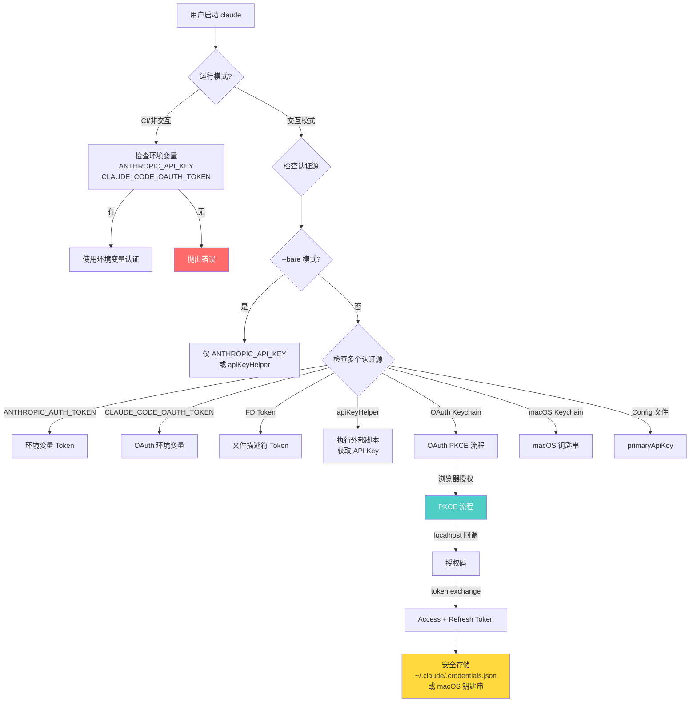
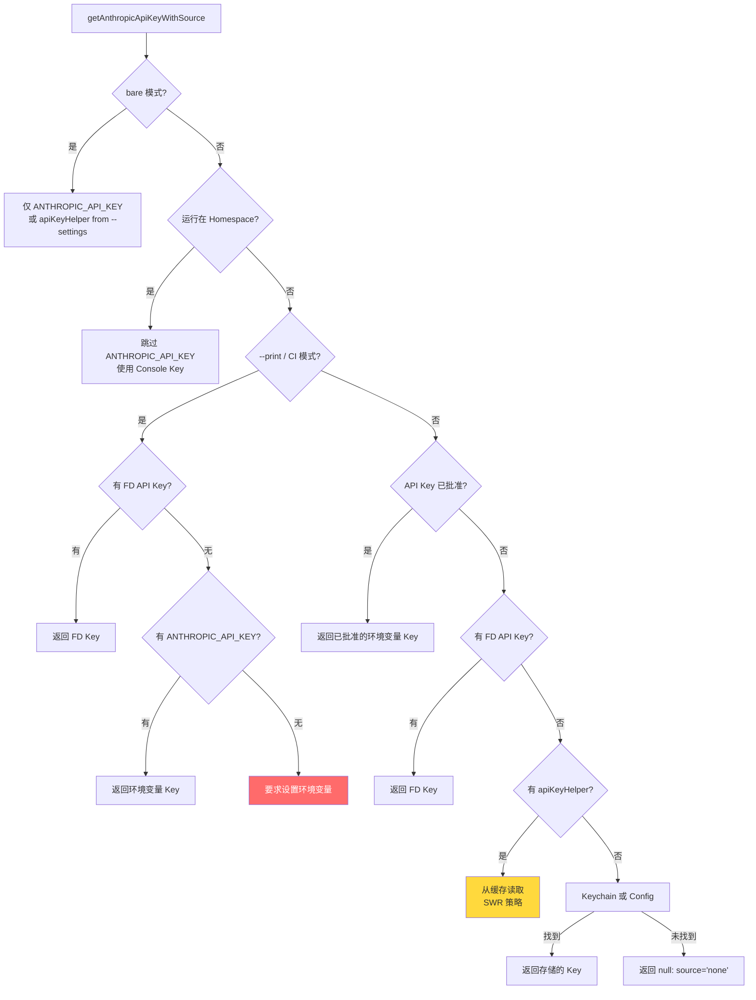
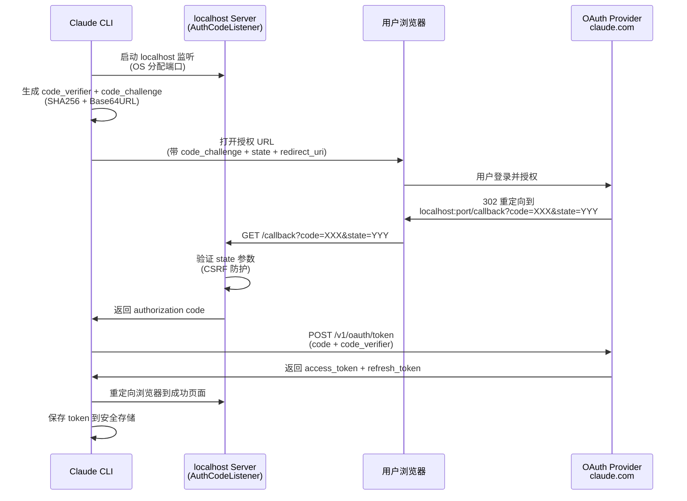
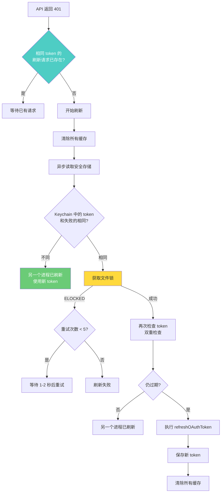
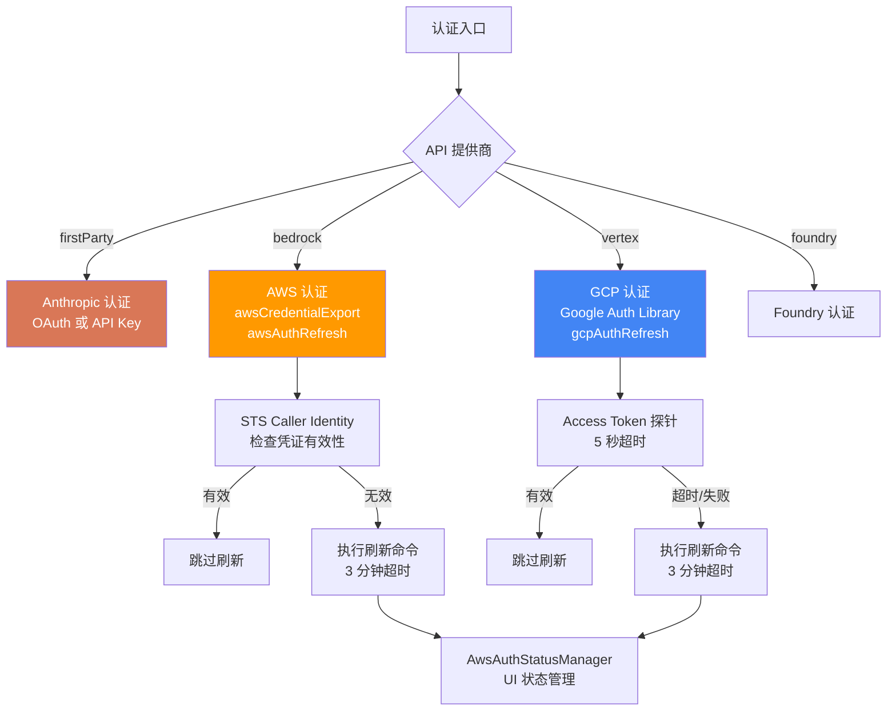

# 第 41 章：OAuth 与认证架构

## 核心设计问题

> Agent 系统的认证为什么比普通应用复杂得多？为什么"登录一次就够了"的假设在 Agent 系统中不成立？

普通应用的认证是二元操作：用户登录或登出。但 AI Agent 系统的认证是多维度的：用户需要被认证，每次敏感操作需要被授权，多个进程可能同时竞争同一个 token，第三方云提供商（Bedrock/Vertex）有自己的认证体系，企业用户可能需要通过组织的 OAuth 流程登录。

Claude Code 的认证架构需要同时满足这些需求，同时保持对开发者友好的简洁体验。

## 认证流程总览



## 多源认证的优先级链

`getAnthropicApiKeyWithSource` 函数实现了一个精心设计的认证源优先级链：



这个优先级链的设计逻辑是：

1. **环境变量优先**：CI/CD 场景需要通过环境变量注入认证
2. **文件描述符（FD）机制**：CCR（Claude Code Remote）和 Claude Desktop 通过 FD 传递 token，避免在命令行参数中暴露
3. **apiKeyHelper**：企业用户可以通过外部脚本动态获取 API Key
4. **安全存储**：macOS 钥匙串或 `.credentials.json` 文件存储 OAuth token

### apiKeyHelper 的 SWR 缓存

`apiKeyHelper` 的缓存设计采用了 Stale-While-Revalidate（SWR）策略：

```typescript
// utils/auth.ts
export async function getApiKeyFromApiKeyHelper(
  isNonInteractiveSession: boolean,
): Promise<string | null> {
  if (_apiKeyHelperCache) {
    if (Date.now() - _apiKeyHelperCache.timestamp < ttl) {
      return _apiKeyHelperCache.value  // 缓存命中，直接返回
    }
    // 缓存过期，后台刷新
    if (!_apiKeyHelperInflight) {
      _apiKeyHelperInflight = {
        promise: _runAndCache(isNonInteractiveSession, false, epoch),
        startedAt: null,  // 后台刷新不记录开始时间
      }
    }
    return _apiKeyHelperCache.value  // 返回过期值，等后台刷新
  }
  // 冷启动，阻塞等待
  _apiKeyHelperInflight = {
    promise: _runAndCache(isNonInteractiveSession, true, epoch),
    startedAt: Date.now(),
  }
  return _apiKeyHelperInflight.promise
}
```

SWR 的好处是：即使外部脚本的执行很慢（有些企业的密钥管理服务延迟可达数百毫秒），用户也不会感受到卡顿——过期的缓存值立即返回，新鲜值在后台异步获取。

### Epoch 机制防止缓存污染

当设置变更或认证失败时，`clearApiKeyHelperCache` 会递增 epoch：

```typescript
let _apiKeyHelperEpoch = 0

export function clearApiKeyHelperCache(): void {
  _apiKeyHelperEpoch++
  _apiKeyHelperCache = null
  _apiKeyHelperInflight = null
}
```

正在执行的异步操作会捕获当前的 epoch 值。如果操作完成时 epoch 已经改变（说明中间发生了缓存清除），操作结果会被丢弃：

```typescript
async function _runAndCache(isNonInteractiveSession, isCold, epoch) {
  try {
    const value = await _executeApiKeyHelper(isNonInteractiveSession)
    if (epoch !== _apiKeyHelperEpoch) return value  // epoch 变了，不更新缓存
    if (value !== null) {
      _apiKeyHelperCache = { value, timestamp: Date.now() }
    }
    return value
  } catch (e) {
    if (epoch !== _apiKeyHelperEpoch) return ' '
    // SWR 路径：暂态失败不应替换有效的过期值
    if (!isCold && _apiKeyHelperCache && _apiKeyHelperCache.value !== ' ') {
      _apiKeyHelperCache = { ..._apiKeyHelperCache, timestamp: Date.now() }
      return _apiKeyHelperCache.value
    }
    _apiKeyHelperCache = { value: ' ', timestamp: Date.now() }
    return ' '
  }
}
```

`' '` 是一个哨兵值，表示"apiKeyHelper 执行失败"。这不是 `null`——`null` 意味着"没有配置 apiKeyHelper"，会让调用方继续尝试其他认证源。`' '` 意味着"apiKeyHelper 配置了但失败了"，调用方不应该回退到其他源。

## OAuth PKCE 流程

Claude Code 使用 OAuth Authorization Code Flow with PKCE（Proof Key for Code Exchange）进行用户认证。



### AuthCodeListener：安全的本地回调

`services/oauth/auth-code-listener.ts` 中的 `AuthCodeListener` 是 OAuth 流程的关键组件：

```typescript
export class AuthCodeListener {
  private localServer: Server
  private port: number = 0
  private expectedState: string | null = null
  private pendingResponse: ServerResponse | null = null

  async start(port?: number): Promise<number> {
    return new Promise((resolve, reject) => {
      this.localServer.listen(port ?? 0, 'localhost', () => {
        const address = this.localServer.address() as AddressInfo
        this.port = address.port
        resolve(this.port)
      })
    })
  }
}
```

端口 0 让操作系统自动分配一个可用端口，避免了端口冲突。`expectedState` 参数实现 CSRF 防护——OAuth 提供者重定向回来时携带的 state 必须与发起时匹配。

`pendingResponse` 保存了浏览器的 HTTP 响应对象，用于在 token 交换完成后将浏览器重定向到成功页面。不同授权范围（Console vs Claude.ai）会重定向到不同的成功页面。

### OAuth Token 存储与多进程安全

Token 被存储在安全存储中，实现因平台而异：

```typescript
export function saveOAuthTokensIfNeeded(tokens: OAuthTokens): {
  success: boolean
  warning?: string
} {
  const secureStorage = getSecureStorage()
  const storageData = secureStorage.read() || {}
  const existingOauth = storageData.claudeAiOauth

  storageData.claudeAiOauth = {
    accessToken: tokens.accessToken,
    refreshToken: tokens.refreshToken,
    expiresAt: tokens.expiresAt,
    scopes: tokens.scopes,
    // 不会用 null 覆盖有效的订阅类型
    subscriptionType:
      tokens.subscriptionType ?? existingOauth?.subscriptionType ?? null,
    rateLimitTier:
      tokens.rateLimitTier ?? existingOauth?.rateLimitTier ?? null,
  }
  return secureStorage.update(storageData)
}
```

注意 `subscriptionType` 的处理：刷新 token 时的 profile 请求可能失败（网络错误），此时返回的 `subscriptionType` 是 `null`。如果直接覆盖，会丢失之前存储的有效订阅类型。所以使用 `??` 操作符回退到已有值。

## Token 刷新的并发控制

当多个 Claude Code 进程同时运行时（多终端、多窗口），token 刷新需要精心协调。



### 进程内去重

```typescript
const pending401Handlers = new Map<string, Promise<boolean>>()

export function handleOAuth401Error(failedAccessToken: string): Promise<boolean> {
  const pending = pending401Handlers.get(failedAccessToken)
  if (pending) return pending  // 去重

  const promise = handleOAuth401ErrorImpl(failedAccessToken).finally(() => {
    pending401Handlers.delete(failedAccessToken)
  })
  pending401Handlers.set(failedAccessToken, promise)
  return promise
}
```

同一个过期 token 的所有 401 错误都被合并为一个刷新操作。

### 跨进程文件锁

```typescript
release = await lockfile.lock(claudeDir)
```

获取到锁后，再次检查 token 是否仍然过期——另一个进程可能在我们等待锁的期间已经刷新了 token。

### 跨进程缓存失效

```typescript
async function invalidateOAuthCacheIfDiskChanged(): Promise<void> {
  try {
    const { mtimeMs } = await stat(join(getClaudeConfigHomeDir(), '.credentials.json'))
    if (mtimeMs !== lastCredentialsMtimeMs) {
      lastCredentialsMtimeMs = mtimeMs
      clearOAuthTokenCache()  // 磁盘文件变了，清除内存缓存
    }
  } catch {
    getClaudeAIOAuthTokens.cache?.clear?.()
  }
}
```

这是一个基于文件修改时间的简单但有效的跨进程通信机制：每个进程在每次 token 读取前检查 `.credentials.json` 的 mtime，如果发现变化就清除内存缓存。

## 认证源的安全考量

### 项目级设置的安全防护

`apiKeyHelper`、`awsAuthRefresh`、`gcpAuthRefresh` 等外部脚本可以从项目级设置中配置。这意味着一个恶意项目可以通过 `.claude/settings.json` 注入任意命令。

Claude Code 的防护策略是**信任门槛**：

```typescript
if (isApiKeyHelperFromProjectOrLocalSettings()) {
  const hasTrust = checkHasTrustDialogAccepted()
  if (!hasTrust && !isNonInteractiveSession) {
    const error = new Error(
      'Security: apiKeyHelper executed before workspace trust is confirmed.'
    )
    logAntError('apiKeyHelper invoked before trust check', error)
    logEvent('tengu_apiKeyHelper_missing_trust', {})
    return null  // 拒绝执行
  }
}
```

项目级的外部脚本只有在用户通过信任对话框确认后才能执行。非交互模式（CI）跳过这个检查，因为 CI 环境被认为是受控的。

### OAuth 配置的白名单机制

`CLAUDE_CODE_CUSTOM_OAUTH_URL` 允许覆盖 OAuth 端点，但只限于白名单中的 URL：

```typescript
const ALLOWED_OAUTH_BASE_URLS = [
  'https://beacon.claude-ai.staging.ant.dev',
  'https://claude.fedstart.com',
  'https://claude-staging.fedstart.com',
]

if (oauthBaseUrl) {
  const base = oauthBaseUrl.replace(/\/$/, '')
  if (!ALLOWED_OAUTH_BASE_URLS.includes(base)) {
    throw new Error('CLAUDE_CODE_CUSTOM_OAUTH_URL is not an approved endpoint.')
  }
}
```

这防止了 OAuth token 被发送到任意端点的风险。

### 组织强制登录

企业环境可以通过 `forceLoginOrgUUID` 设置要求用户必须登录到特定组织：

```typescript
export async function validateForceLoginOrg(): Promise<OrgValidationResult> {
  const profile = await getOauthProfileFromOauthToken(tokens.accessToken)
  if (!profile) {
    return { valid: false, message: 'Unable to verify organization...' }
  }
  const tokenOrgUuid = profile.organization.uuid
  if (tokenOrgUuid === requiredOrgUuid) {
    return { valid: true }
  }
  return { valid: false, message: '...wrong organization...' }
}
```

组织验证总是从服务器的 profile 端点获取权威数据，而不是信任本地缓存的组织 ID——因为本地配置文件是用户可写的。

## 多提供商认证架构

Claude Code 不仅支持 Anthropic 直连，还支持 AWS Bedrock、Google Vertex AI 和 Foundry：



每个提供商的认证刷新都遵循相同的模式：先探测当前凭证是否有效，只在失效时才执行刷新命令。这避免了对 SSO 流程的不必要触发。

## 设计启示

### 1. Agent 认证需要"零摩擦"

Agent 系统的认证频率远高于普通应用——每次对话、每个工具调用都可能触发认证检查。如果每次都需要用户手动操作，体验会极其糟糕。Claude Code 通过 SWR 缓存、后台刷新、跨进程协调实现了"登录一次，持续可用"的体验。

### 2. 多进程环境是认证的隐藏复杂性

多个 Claude Code 实例可能同时运行，它们共享同一个 OAuth token。如果不协调刷新，会出现"终端 A 刷新 token 导致终端 B 的 token 失效"的问题。文件锁 + mtime 检查 + 进程内去重的组合方案优雅地解决了这个问题。

### 3. 项目级信任是 Agent 安全的关键边界

Agent 在用户的项目目录中执行，而项目可能包含恶意的配置文件。将信任验证与认证源绑定，确保了外部脚本不会在用户不知情的情况下执行。

### 4. 哨兵值比 null 更有表达力

apiKeyHelper 使用 `' '` 而不是 `null` 表示失败，让调用方可以区分"没有配置"和"配置了但失败了"。这种精细的语义区分在认证链中至关重要——错误的回退可能导致使用不期望的认证源。
