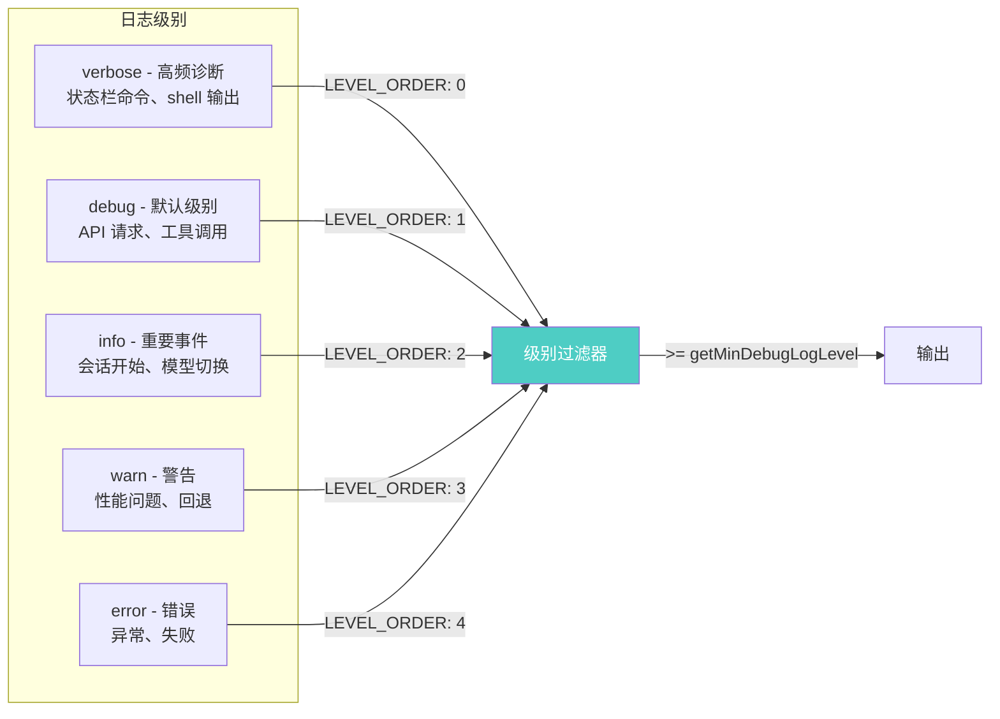
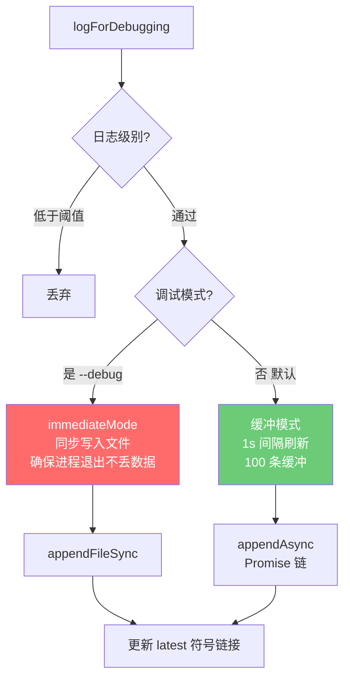
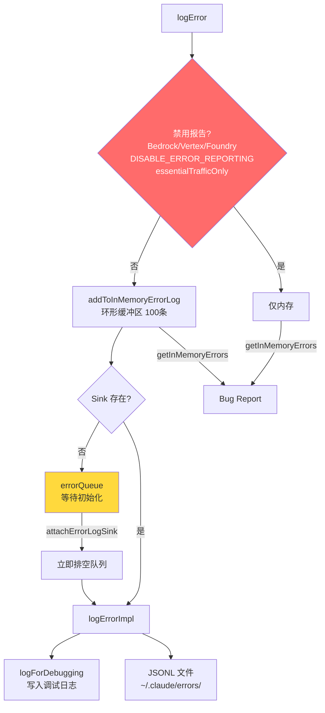
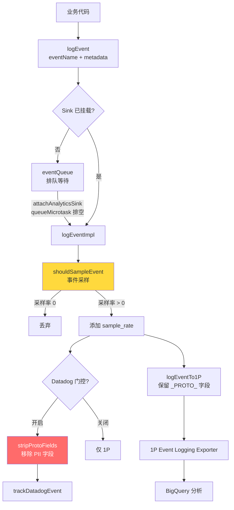
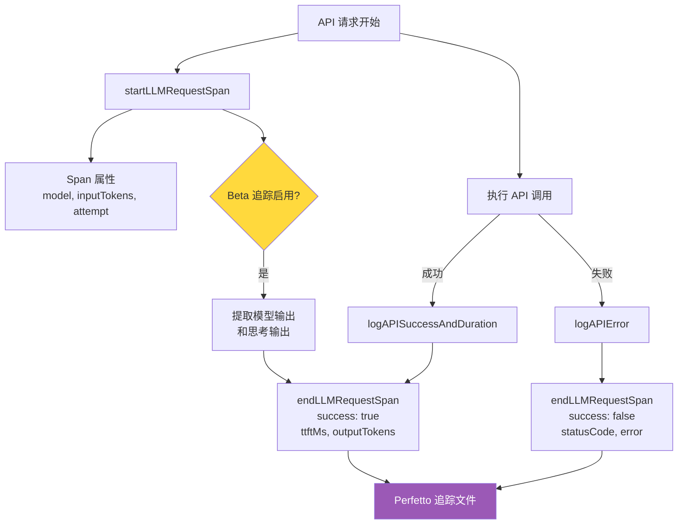
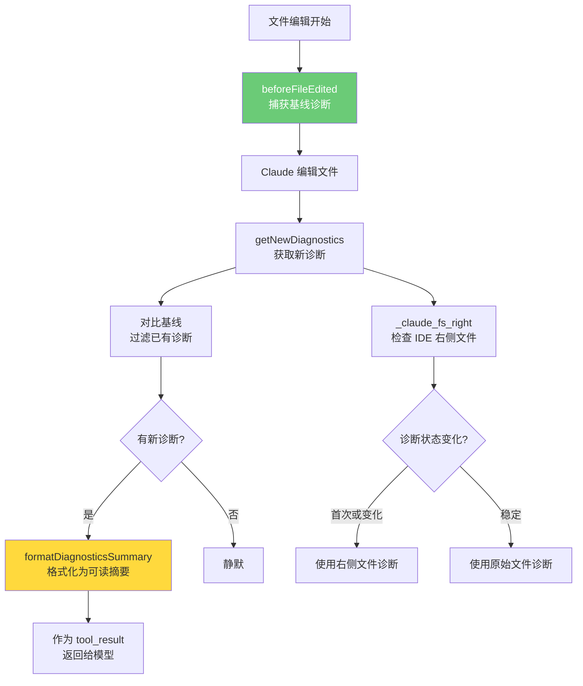
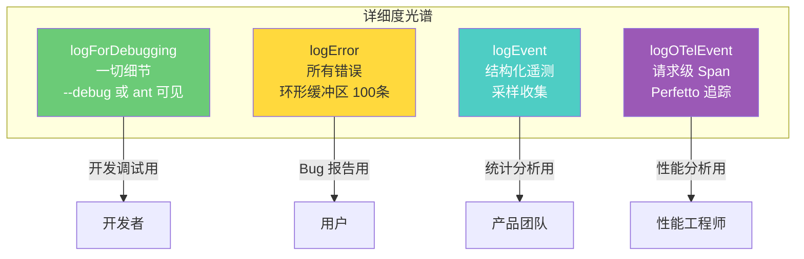

# 第 42 章：可观测性——日志、遥测与诊断

## 核心设计问题

> 为什么可观测性对 Agent 系统特别重要？为什么 Agent 系统被称为"黑箱"，以及如何为它开窗？

传统软件的行为是确定性的——相同的输入产生相同的输出，bug 可以通过重现步骤定位。但 AI Agent 的行为是非确定性的：同样的用户输入可能触发不同的工具调用序列，模型可能在某个步骤产生幻觉，工具的结果可能因环境不同而不同。更关键的是，Agent 的决策过程发生在神经网络内部，开发者无法直接"断点调试"。

Claude Code 的可观测性架构就是为这个"黑箱"开窗：通过分层日志、结构化遥测和交互式诊断工具，让开发者和用户能够理解、调试和优化 Agent 的行为。

## 可观测性架构总览

```mermaid
flowchart TB
    subgraph "数据采集层"
        L1[logForDebugging<br/>调试日志]
        L2[logError<br/>错误日志]
        L3[logEvent<br/>分析事件]
        L4[logOTelEvent<br/>OpenTelemetry Span]
        L5[logMCPError/logMCPDebug<br/>MCP 专用日志]
    end

    subgraph "传输层"
        L1 --> DW[BufferedWriter<br/>~1s 刷新间隔]
        L2 --> ES[ErrorLogSink<br/>队列+排空]
        L3 --> AS[AnalyticsSink<br/>Datadog + 1P]
        L4 --> OLTP[OTLP Exporter<br/>OpenTelemetry]
        L5 --> MCP_LOG[MCP 日志文件<br/>按服务器名分文件]
    end

    subgraph "存储层"
        DW --> LOG_FILE[~/.claude/debug/<br/>sessionId.txt]
        ES --> ERR_FILE[~/.claude/errors/<br/>sessionId.txt]
        AS --> DD[Datadog<br/>统计分析]
        AS --> FP[1P Event Logger<br/>BigQuery]
        OLTP --> PERF[Perfetto<br/>性能追踪]
        MCP_LOG --> MCP_FILES[~/.claude/mcp-logs/<br/>serverName.txt]
    end

    subgraph "诊断工具层"
        LOG_FILE --> CMD_DEBUG[/debug 命令<br/>读取最新日志]
        LOG_FILE --> CMD_SHARE[/share 命令<br/>打包发送]
        ERR_FILE --> IN_MEMORY[内存错误列表<br/>getInMemoryErrors]
        CMD_DEBUG --> DOCTOR[/doctor 命令<br/>环境诊断]
        DD --> ANTS[Ant 内部分析<br/>错误趋势]
    end

    subgraph "用户触达层"
        DOCTOR --> USER[用户终端]
        CMD_DEBUG --> USER
        CMD_SHARE --> SUPPORT[支持团队]
        ANTS --> MONITORING[监控告警]
    end

    style DW fill:#4ecdc4,color:#fff
    style ES fill:#ff6b6b,color:#fff
    style AS fill:#ffd93d,color:#333
    style PERF fill:#9b59b6,color:#fff
```

## 分层日志系统

### 调试日志：开发者的黑匣子

`utils/debug.ts` 中的 `logForDebugging` 是 Claude Code 最详细的日志通道。它记录了 Agent 运行的每一个关键步骤：API 请求、工具调用、状态变更、权限决策。



日志级别可以通过环境变量配置：

```typescript
export const getMinDebugLogLevel = memoize((): DebugLogLevel => {
  const raw = process.env.CLAUDE_CODE_DEBUG_LOG_LEVEL?.toLowerCase().trim()
  if (raw && Object.hasOwn(LEVEL_ORDER, raw)) {
    return raw as DebugLogLevel
  }
  return 'debug'  // 默认只记录 debug 及以上
})
```

### BufferedWriter：性能与可靠性的平衡

调试日志使用 `BufferedWriter` 实现，平衡了写入性能和日志可靠性：



为什么需要两种模式？在调试模式下，同步写入确保每条日志都立即落盘——因为调试时可能随时 `process.exit()`。但同步写入有性能开销，所以在非调试模式下使用缓冲写入，每秒刷新一次。

```typescript
debugWriter = createBufferedWriter({
  writeFn: content => {
    if (isDebugMode()) {
      getFsImplementation().appendFileSync(path, content)  // 同步
      return
    }
    pendingWrite = pendingWrite
      .then(appendAsync.bind(null, needMkdir, dir, path, content))
      .catch(noop)
  },
  flushIntervalMs: 1000,
  maxBufferSize: 100,
  immediateMode: isDebugMode(),
})
```

### 符号链接：快速定位最新日志

```typescript
const updateLatestDebugLogSymlink = memoize(async (): Promise<void> => {
  const latestSymlinkPath = join(debugLogsDir, 'latest')
  await unlink(latestSymlinkPath).catch(() => {})
  await symlink(debugLogPath, latestSymlinkPath)
})
```

`~/.claude/debug/latest` 始终指向当前会话的日志文件。开发者可以用 `tail -f ~/.claude/debug/latest` 实时查看日志，而不需要知道具体的 session ID。

### 错误日志：应用级 Sink 模式

错误日志（`utils/log.ts`）采用了与调试日志不同的架构——Sink 模式：

```typescript
// 内存环形缓冲区
const MAX_IN_MEMORY_ERRORS = 100
let inMemoryErrorLog: Array<{ error: string; timestamp: string }> = []

// Sink + 队列
let errorLogSink: ErrorLogSink | null = null
const errorQueue: QueuedErrorEvent[] = []

export function logError(error: unknown): void {
  // ... 守卫检查 ...
  addToInMemoryErrorLog(errorInfo)  // 始终写入内存

  if (errorLogSink === null) {
    errorQueue.push({ type: 'error', error: err })  // 排队
    return
  }
  errorLogSink.logError(err)  // 直接发送
}
```

错误日志的双重目的地设计值得关注：

1. **内存环形缓冲区**：最多保留 100 条错误，无依赖，用于 `getInMemoryErrors()` 和 bug 报告
2. **Sink 持久化**：写入 `~/.claude/errors/` 目录，仅对内部用户启用



隐私保护是错误日志的重要考量。对于 Bedrock/Vertex/Foundry 用户，错误报告默认禁用——因为这些用户的请求可能经过第三方，不应该将错误堆栈发送到 Anthropic 的服务器。

## 遥测事件系统

### 事件架构

`services/analytics/` 目录实现了完整的遥测事件系统，采用与错误日志相同的 Sink 模式：



### 事件采样

不是所有事件都需要全量收集。`shouldSampleEvent` 根据动态配置决定是否记录某个事件：

```typescript
function logEventImpl(eventName: string, metadata: LogEventMetadata): void {
  const sampleResult = shouldSampleEvent(eventName)
  if (sampleResult === 0) return  // 被采样掉

  const metadataWithSampleRate =
    sampleResult !== null
      ? { ...metadata, sample_rate: sampleResult }
      : metadata

  // ... 路由到各个后端 ...
}
```

采样是控制遥测成本的关键机制。高频事件（如每次 API 调用）可以以 1% 的采样率收集，低频但重要的事件（如错误）则以 100% 的采样率收集。

### 隐私保护：类型系统的强制审计

```typescript
export type AnalyticsMetadata_I_VERIFIED_THIS_IS_NOT_CODE_OR_FILEPATHS = never
```

这个类型是 `never`——它不能被直接实例化。任何使用它的人都必须通过 `as` 类型断言：

```typescript
logEvent('tengu_api_query', {
  model: model as AnalyticsMetadata_I_VERIFIED_THIS_IS_NOT_CODE_OR_FILEPATHS,
  messagesLength,
  temperature,
})
```

这行代码在编译时完全合法，但在代码审查时它是一个醒目的标记："我确认这个值不包含代码或文件路径"。如果有人写了：

```typescript
logEvent('my_event', {
  filePath: somePath  // 编译错误！不能把 string 赋给 never
})
```

TypeScript 会报错，因为 `string` 不能赋值给 `never`。必须显式添加 `as AnalyticsMetadata_I_VERIFIED_THIS_IS_NOT_CODE_OR_FILEPATHS`，这是一个被迫的审计点。

### PII 字段的双层路由

某些字段需要包含 PII（如用户邮箱），但只能存储在有权限控制的系统中：

```typescript
export type AnalyticsMetadata_I_VERIFIED_THIS_IS_PII_TAGGED = never
```

以 `_PROTO_` 前缀开头的字段会走不同的路由路径：

```typescript
export function stripProtoFields<V>(
  metadata: Record<string, V>,
): Record<string, V> {
  let result: Record<string, V> | undefined
  for (const key in metadata) {
    if (key.startsWith('_PROTO_')) {
      if (result === undefined) result = { ...metadata }
      delete result[key]
    }
  }
  return result ?? metadata
}
```

- **Datadog**：接收 `stripProtoFields` 后的数据，不包含 PII
- **1P BigQuery**：接收完整数据，包括 `_PROTO_` 前缀的 PII 字段

### API 调用的全链路遥测

每次 API 调用都记录了丰富的遥测数据。`services/api/logging.ts` 中的 `logAPISuccessAndDuration` 函数记录了：

```typescript
logEvent('tengu_api_success', {
  model,
  messageCount,              // 消息数量
  messageTokens,             // 消息 token 数
  inputTokens,               // 输入 token
  outputTokens,              // 输出 token
  cachedInputTokens,         // 缓存命中的 token
  uncachedInputTokens,       // 缓存未命中的 token
  durationMs,                // 请求耗时
  durationMsIncludingRetries,// 含重试的总耗时
  attempt,                   // 第几次尝试
  ttftMs,                    // Time To First Token
  costUSD,                   // 本次请求成本
  didFallBackToNonStreaming, // 是否降级到非流式
  stopReason,                // 停止原因
  textContentLength,         // 文本内容长度
  thinkingContentLength,     // 思考内容长度
  toolUseContentLengths,     // 工具调用内容长度（按工具名分组）
  connectorTextBlockCount,   // 连接器文本块数量
  queryChainId,              // 查询链 ID（追踪多轮对话）
  queryDepth,                // 查询深度
  fastMode,                  // 是否 fast mode
  isPostCompaction,          // 是否在压缩后
  timeSinceLastApiCallMs,    // 距上次 API 调用的时间
})
```

这个遥测数据的丰富程度令人印象深刻。它不仅记录了基本的 token 统计，还包括了 TTFT（首 token 延迟）、工具调用按名称的分布、压缩后的标记等高级指标。这些数据为性能优化、成本分析和用户体验改进提供了基础。

### 错误的网关检测

`detectGateway` 函数从 API 响应头中检测用户是否通过 AI 网关代理：

```typescript
const GATEWAY_FINGERPRINTS = {
  litellm: { prefixes: ['x-litellm-'] },
  helicone: { prefixes: ['helicone-'] },
  portkey: { prefixes: ['x-portkey-'] },
  'cloudflare-ai-gateway': { prefixes: ['cf-aig-'] },
  kong: { prefixes: ['x-kong-'] },
  braintrust: { prefixes: ['x-bt-'] },
}

const GATEWAY_HOST_SUFFIXES = {
  databricks: ['.cloud.databricks.com', '.azuredatabricks.net', '.gcp.databricks.com'],
}
```

网关检测有两个目的：
1. 在错误报告中标注网关类型，帮助区分 Anthropic API 问题和网关问题
2. 了解用户的使用模式，优化对常见网关的兼容性

## OpenTelemetry 集成

### Span 追踪

Claude Code 使用 OpenTelemetry 进行请求级别的性能追踪：



当 Beta 追踪启用时，Span 还会包含模型的实际输出和思考过程。这对于深度调试 Agent 行为非常有价值——你可以看到模型"想"了什么，然后做出了什么决定。

### 遥测属性基线化

`utils/telemetryAttributes.ts` 为所有遥测事件提供了一组基线属性：

```typescript
export function getTelemetryAttributes(): Attributes {
  const attributes: Attributes = {
    'user.id': userId,
  }

  if (shouldIncludeAttribute('OTEL_METRICS_INCLUDE_SESSION_ID')) {
    attributes['session.id'] = sessionId
  }
  if (shouldIncludeAttribute('OTEL_METRICS_INCLUDE_ACCOUNT_UUID')) {
    attributes['user.account_uuid'] = accountUuid
  }
  if (envDynamic.terminal) {
    attributes['terminal.type'] = envDynamic.terminal
  }
  return attributes
}
```

属性包含的控制开关（`OTEL_METRICS_INCLUDE_*`）允许在不同环境中调整指标的基数（cardinality）。高基数维度（如 session ID）在 Datadog 等后端可能导致存储爆炸，所以可以按需关闭。

## 诊断工具

### `/doctor` 命令：环境健康检查

`/doctor` 命令是用户的第一个诊断入口。`utils/doctorDiagnostic.ts` 中的 `getDoctorDiagnostic` 函数收集了全面的环境信息：

```mermaid
flowchart TD
    DOC[/doctor] --> INSTALL[getCurrentInstallationType<br/>npm-global/native/package-manager/...]
    DOC --> VERSION[版本号 MACRO.VERSION]
    DOC --> PATH[installationPath<br/>安装路径]
    DOC --> BINARY[invokedBinary<br/>调用的二进制文件]
    DOC --> MULTI[detectMultipleInstallations<br/>检测多个安装]
    DOC --> WARNINGS[detectConfigurationIssues<br/>配置问题检测]
    DOC --> RIPGREP[getRipgrepStatus<br/>Ripgrep 状态]
    DOC --> PKG_MGR[getPackageManager<br/>包管理器]

    WARNINGS --> W1[managed-settings.json<br/>格式验证]
    WARNINGS --> W2[PATH 配置检查]
    WARNINGS --> W3[安装方法不匹配]
    WARNINGS --> W4[残留安装检测]
    WARNINGS --> W5[自动更新权限]
    WARNINGS --> W6[Linux Glob 模式<br/>沙箱限制]

    style DOC fill:#4ecdc4,color:#fff
    style WARNINGS fill:#ffd93d,color:#333
```

`detectConfigurationIssues` 是最有价值的部分，它检测了六类常见问题：

1. **managed-settings.json 格式错误**：管理员可能输入了无效的 `strictPluginOnlyCustomization` 值
2. **PATH 配置缺失**：原生安装后 `~/.local/bin` 不在 PATH 中
3. **安装方法不匹配**：配置文件记录的安装方法与实际不一致
4. **残留安装**：同时存在 npm 全局安装和原生安装
5. **自动更新权限不足**：npm 全局安装可能需要 sudo 权限
6. **Linux 沙箱限制**：Linux 上 Edit/Read 规则中的 glob 模式不被支持

### `/debug` 技能：会话内调试

`skills/bundled/debug.ts` 中的 debug 技能是一个更高级的诊断工具，它让 Claude 自身读取并分析调试日志：

```typescript
export function registerDebugSkill(): void {
  registerBundledSkill({
    name: 'debug',
    description: process.env.USER_TYPE === 'ant'
      ? 'Debug your current Claude Code session by reading the session debug log.'
      : 'Enable debug logging for this session and help diagnose issues',
    allowedTools: ['Read', 'Grep', 'Glob'],
    disableModelInvocation: true,  // 必须用户显式调用
    userInvocable: true,
    async getPromptForCommand(args) {
      const wasAlreadyLogging = enableDebugLogging()
      // ... 读取最后 20 行日志 ...
      return [{ type: 'text', text: prompt }]
    },
  })
}
```

这个设计非常巧妙——它利用 Agent 自身的能力来分析 Agent 自己的日志。`allowedTools: ['Read', 'Grep', 'Glob']` 赋予 debug 技能读取文件的能力，让它可以搜索 `[ERROR]` 和 `[WARN]` 条目、检查完整的堆栈跟踪、分析失败模式。

对于非内部用户，debug 技能会在调用时才启用日志记录：

```typescript
const justEnabledSection = wasAlreadyLogging ? '' : `
## Debug Logging Just Enabled
Debug logging was OFF for this session until now.
Nothing prior to this /debug invocation was captured.
`
```

这是因为非内部用户默认不写调试日志（节省磁盘空间和性能），只在需要诊断时才启用。

### IDE 诊断追踪

`services/diagnosticTracking.ts` 实现了 IDE 诊断的基线对比：



这个系统解决了"Agent 的修改是否引入了新错误"的问题。它在编辑前捕获 IDE 的语言服务诊断（TypeScript 编译错误、lint 警告等），在编辑后只报告新增的诊断——让模型知道自己的修改是否引入了问题。

`_claude_fs_right` 协议支持让 Claude 读取 IDE 中"右侧"（修改后）的文件内容，对比修改前后的诊断变化。当右侧文件的诊断状态发生变化时，优先使用右侧诊断，因为它更准确地反映了编辑后的状态。

## 可观测性的设计哲学

### 1. 日志分层，各司其职



四种日志通道服务于不同的受众和目的。它们的数据有重叠（API 错误同时出现在调试日志和错误日志中），但格式、存储和访问方式各不相同。这种冗余不是浪费——它确保了每个受众都能以最适合自己的方式获取信息。

### 2. 队列-Sink 模式是启动安全的关键

无论是错误日志还是分析事件，都使用了相同的队列-Sink 模式。这不是巧合——它是解决"基础设施可能还未初始化"这个根本问题的标准模式。关键属性：

- **无损**：Sink 初始化前的事件被队列保留
- **非阻塞**：队列操作是同步的，不会延迟启动
- **一次性排空**：Sink 挂载时立即处理所有排队事件
- **幂等**：多次调用 `attachSink` 是安全的

### 3. 类型系统作为隐私审计工具

`AnalyticsMetadata_I_VERIFIED_THIS_IS_NOT_CODE_OR_FILEPATHS` 是一种"文档化约束"——它不阻止编译，但它在代码审查中创造了一个必须被注意和讨论的标记点。这种模式比运行时检查更轻量，比代码注释更强制，是类型系统在安全领域的巧妙应用。

### 4. Agent 自我诊断的可能性

`/debug` 技能展示了一个引人深思的方向：让 Agent 分析自己的行为日志。这比传统的"查看日志然后人工判断"模式高效得多——Agent 可以在数秒内扫描数千行日志，找到错误模式，给出修复建议。这种"Agent 诊断 Agent"的模式可能是未来 Agent 可观测性的主流方向。

## 设计启示

### 1. Agent 系统的可观测性不是可选的

传统软件可以在出问题时添加日志。但 Agent 系统的行为是不可重现的——同一个 bug 可能只在特定的上下文和模型状态下触发。如果没有足够的日志和遥测，很多 bug 将永远无法诊断。

### 2. 分层收集比全量收集更可持续

不是所有数据都需要以最高详细度收集。采样、级别过滤、门控开关——这些机制确保了可观测性系统自身的成本可控。一个让系统变慢的监控系统比没有监控系统更糟糕。

### 3. 隐私设计应该是架构性的，而不是补丁性的

Claude Code 的隐私保护不是在数据收集后过滤敏感信息，而是在数据进入系统的第一道关口就通过类型系统确保只有非敏感数据被记录。这种"设计时考虑隐私"（Privacy by Design）的方式比"事后脱敏"安全得多。

### 4. 诊断工具应该是可组合的

`/doctor`、`/debug`、`/cost` 等命令各自关注不同的维度，但它们共享同一套底层数据源。这种可组合的诊断工具设计让用户可以根据问题类型选择合适的工具，而不是面对一个庞大而令人困惑的"超级诊断命令"。
