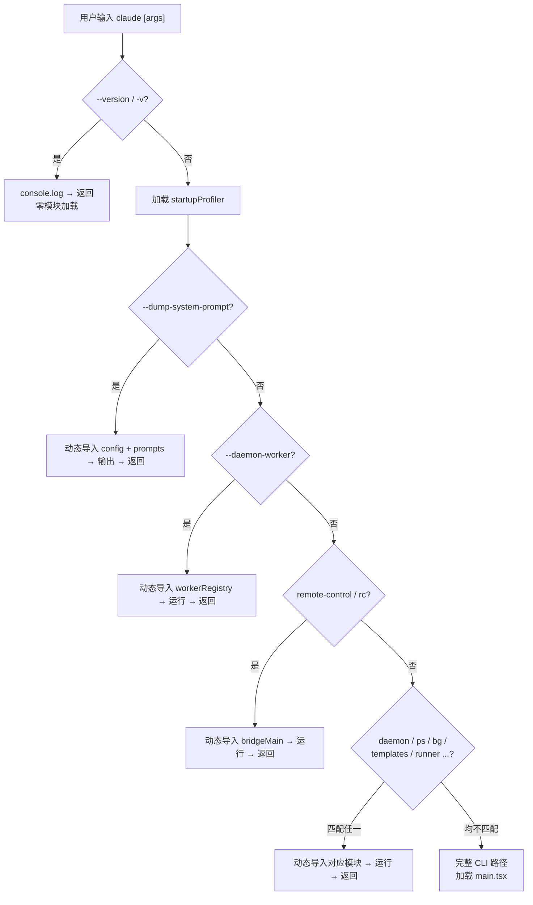
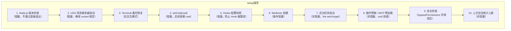
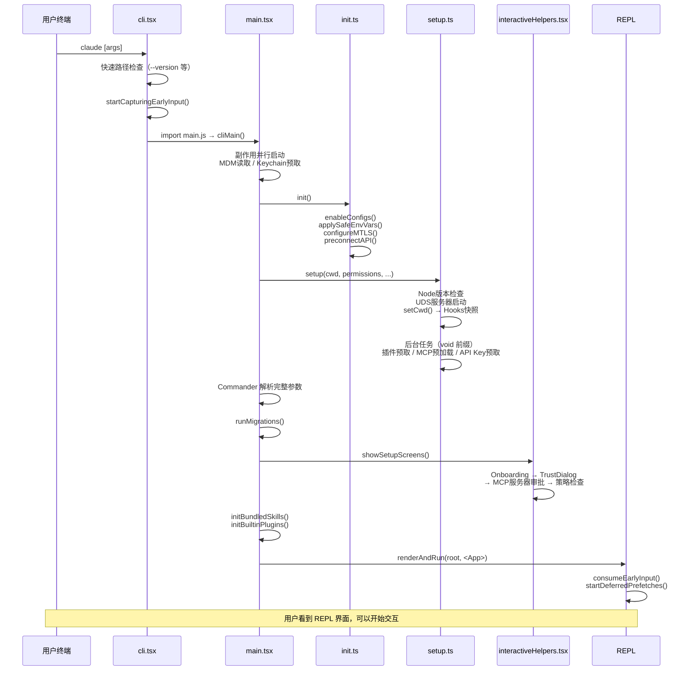

# 第 43 章：启动流程——从命令行到 Agent 就绪

## CLI 工具为什么必须在"瞬间"启动

终端用户的心理模型是命令式的：输入命令，立刻看到结果。Git 的 `--version` 在 50ms 内返回，`ls` 几乎不花时间。如果一个 CLI 工具启动需要 1 秒以上，用户就会觉得"卡"。这个感知阈值对于交互式 Agent 尤为致命——用户期望 `claude` 命令像 `git` 一样秒开，而不是像 IDE 一样加载进度条。

Claude Code 的启动路径承载了远超普通 CLI 的复杂度：需要检查 Node.js 版本、加载配置、初始化插件系统、建立 MCP 连接、预取 API Key、启动 UDS 消息服务器、验证权限模式、渲染 React TUI……如果这些工作全部串行完成后再显示界面，启动时间可能超过 2 秒。

设计者的核心策略是：**分层启动——快速路径直接返回，慢速路径延迟加载，关键路径并行执行**。下面我们逐层拆解。

但仅仅把启动理解成性能问题，还不够。对于 Claude Code 这类 Agent CLI，启动其实同时承担三件事：

- 建立**速度感**：用户要尽快看到系统活着。
- 建立**信任链**：系统不能在用户确认前擅自放大权限。
- 建立**可工作性**：界面一旦出现，就最好已经接近可交互。

因此，Claude Code 优化的不是单纯的 cold start，而是 **time to first safe interaction**：从启动到"用户可以安全开始工作"的最短时间。

## 43.1 快速路径：零负载的命令分流

启动的第一层是 `entrypoints/cli.tsx`。这个文件的设计哲学写在注释里：

> "Bootstrap entrypoint - checks for special flags before loading the full CLI. All imports are dynamic to minimize module evaluation for fast paths. Fast-path for --version has zero imports beyond this file."

最极端的快速路径是 `--version`：

```typescript
// Fast-path for --version/-v: zero module loading needed
if (args.length === 1 && (args[0] === '--version' || args[0] === '-v')) {
  console.log(`${MACRO.VERSION} (Claude Code)`)
  return
}
```

这段代码在 `main()` 函数的最顶部，甚至还没有加载启动分析器（`startupProfiler`）。MACRO.VERSION 是构建时内联的常量，所以整个分支零动态导入、零模块加载、零 I/O——返回速度等于 `console.log` 的速度。

其他快速路径包括：`--dump-system-prompt`（输出渲染后的系统提示词）、`--daemon-worker`（守护进程工作器）、`remote-control`（桥接模式）、`daemon`（长运行监控进程）、`ps|logs|attach|kill`（后台会话管理）、`new|list|reply`（模板任务）、`environment-runner`（BYOC 环境运行器）、`self-hosted-runner`（自托管运行器）。

这些快速路径的共同设计原则是：

1. **动态导入**：每个路径只加载自己需要的模块，不触发其他路径的代码加载。
2. **feature() 门控**：`feature('DAEMON')`、`feature('BRIDGE_MODE')` 等标志在构建时通过死代码消除（DCE）从外部构建中完全移除，连检查逻辑都不存在。
3. **尽早返回**：匹配后 `return`，不进入后续的完整 CLI 初始化。



这个分支结构的设计意图是：**大多数非交互式调用不应该承担交互式 REPL 的启动成本**。CI/CD 管道中的 `claude -p "explain this"` 走的是完全不同的代码路径。

## 43.2 关键路径：并行预取与延迟初始化

当命令行参数不匹配任何快速路径时，系统进入"完整 CLI"路径。这里的设计核心是 **尽早启动 I/O、延后等待结果**。

在 `main.tsx` 文件的最顶部，有一系列"副作用导入"——它们在模块加载阶段就开始并行执行：

```typescript
// 副作用 1: 启动 MDM 子进程读取（macOS 设备管理）
startMdmRawRead()  // 与后续 135ms 的模块导入并行

// 副作用 2: 启动 macOS Keychain 预取（OAuth + API Key）
startKeychainPrefetch()  // 两个 keychain 读取并行执行
```

这两个操作的耗时各约 50-100ms（子进程 + keychain I/O），但它们与模块加载过程完全重叠。到代码真正需要用到它们的值时，结果大概率已经就绪。

接着，`cli.tsx` 在进入完整 CLI 之前做了一个精妙的优化——**提前捕获用户输入**：

```typescript
const { startCapturingEarlyInput } = await import('../utils/earlyInput.js')
startCapturingEarlyInput()  // 开始捕获用户在启动期间键入的字符
```

`utils/earlyInput.ts` 的工作原理是：在 REPL 尚未就绪时，提前将 stdin 设置为 raw mode 并开始缓冲按键。当用户在 `claude` 命令后立即开始打字时，这些字符不会丢失，而是被收集到 `earlyInputBuffer` 中。REPL 渲染后，通过 `consumeEarlyInput()` 取出缓冲的文本，预填充到输入框中。

这个设计反映了一个深刻的用户体验洞察：**用户不会等程序准备好才行动**。

这类优化看似细枝末节，实际上非常体现 Agent 产品的性质。用户面对的是一个被拟人化的执行体，而不是一个传统程序。只要它显得迟钝，用户就会把这种迟钝归因为"它不够聪明"。因此启动优化的目标不只是少几百毫秒，而是保护系统的整体心理形象。

## 43.3 setup() 函数：环境准备的编排器

`setup.ts` 的 `setup()` 函数负责在 REPL 渲染前完成所有环境准备。它的设计遵循一个严格的优先级排序：



### 为什么 Hooks 快照必须阻塞？

`captureHooksConfigSnapshot()` 被设计为阻塞调用，位于 `setCwd()` 之后。它的作用是读取当前的 hooks 配置并冻结一份快照。之后如果有恶意代码试图修改 hooks 配置（通过修改 settings.json），系统可以通过 `updateHooksConfigSnapshot()` 检测到变化。

这是一个安全设计：**在用户信任确认之前，锁住 hooks 的状态**。如果这个调用不是阻塞的，就会存在一个时间窗口，攻击者可以在这个窗口内修改 hooks 配置而不被检测到。

### 后台任务的"非阻塞"模式

`setup()` 函数中大量使用了 `void` 前缀来启动后台任务：

```typescript
void getCommands(getProjectRoot())        // 预取命令注册表
void loadPluginHooks()                    // 预加载插件 hooks
void prefetchApiKeyFromApiKeyHelperIfSafe // 预取 API Key
void lockCurrentVersion()                 // 锁定当前版本
```

`void` 前缀的意思是"启动这个 Promise 但不等待它完成"。这些操作都是后续 REPL 渲染后需要用到的，但它们不需要在 REPL 渲染前就完成。通过将它们并行启动，系统确保了 REPL 能够尽快显示在用户面前。

### --bare 模式的优化

`--bare` 模式（对应 `CLAUDE_CODE_SIMPLE=1`）是脚本调用模式。它的设计哲学是"能跳过就跳过"：

```typescript
if (!isBareMode()) {
  initSessionMemory()
  // ... 上下文折叠初始化 ...
}
// 这些在 bare 模式下被跳过：
// - 版本锁定
// - 插件预取
// - 归属 hooks 注册
// - 会话文件访问分析
// - 团队内存同步
// - 发布说明检查
// - 最近活动数据获取
```

bare 模式跳过了所有面向交互式用户的功能，只保留核心的查询能力。这让 CI/CD 管道中的 `claude -p` 调用尽可能快。

## 43.4 main.tsx 的 init() 函数：系统级初始化

`entrypoints/init.ts` 的 `init()` 函数被 `memoize` 包装，确保只执行一次。它负责系统级初始化：

```typescript
export const init = memoize(async (): Promise<void> => {
  enableConfigs()                     // 启用配置系统
  applySafeConfigEnvironmentVariables() // 应用安全的环境变量（信任确认前）
  setupGracefulShutdown()             // 注册优雅退出处理
  configureGlobalMTLS()               // 配置 mTLS
  configureGlobalAgents()             // 配置代理和 HTTP 客户端
  preconnectAnthropicApi()            // 预连接 API（TCP+TLS 握手与后续工作并行）
  // ...
})
```

值得注意的是 `preconnectAnthropicApi()`——它在配置好网络之后立即发起 TCP + TLS 握手，与后续约 100ms 的 Commander 命令处理重叠。当用户真正发起第一次查询时，API 连接已经热准备好了。

另一个关键的安全设计是 **环境变量的两阶段应用**：

- `applySafeConfigEnvironmentVariables()`：在 `init()` 中调用，只应用不涉及安全风险的环境变量。
- `applyConfigEnvironmentVariables()`：在用户确认信任对话框之后调用，应用可能包含敏感信息的环境变量。

这个两阶段设计确保了：**在用户确认信任当前工作目录之前，来自配置文件的潜在危险环境变量不会被注入到进程中**。

如果把这一整章再抽象一层，Claude Code 的启动流程其实是在做一件事：**把"能早做的事"与"必须晚做的事"严格分开**。前者围绕并行和预取，后者围绕信任和安全。性能工程与安全工程经常被看成互相掣肘，但这套设计证明二者可以通过顺序编排同时成立。

## 43.5 启动性能分析基础设施

Claude Code 内建了一套精细的启动性能分析系统（`utils/startupProfiler.ts`），有两种工作模式：

1. **采样日志**：100% 的内部用户、0.5% 的外部用户——自动将各阶段耗时上报到分析平台。
2. **详细分析**：设置 `CLAUDE_CODE_PROFILE_STARTUP=1` 后，输出完整的检查点报告和内存快照。

系统定义了四个关键阶段：

| 阶段 | 起止检查点 | 含义 |
|------|-----------|------|
| import_time | cli_entry → main_tsx_imports_loaded | 模块加载耗时 |
| init_time | init_function_start → init_function_end | init() 函数耗时 |
| settings_time | eagerLoadSettings_start → eagerLoadSettings_end | 配置加载耗时 |
| total_time | cli_entry → main_after_run | 总启动耗时 |

采样率的设计也很巧妙：决策在模块加载时一次性做出，非采样用户不承担任何性能分析成本——`profileCheckpoint()` 在非采样情况下是空操作。

## 43.6 从 setup 到 REPL 的完整时序



## 43.7 设计启示

### 1. 快速路径是最重要的性能优化

不是因为快速路径本身有多快，而是因为它定义了系统的"成本边界"。每当添加一个新功能（如 daemon 模式、桥接模式），都应该在 `cli.tsx` 的快速路径中分流，而不是让它拖慢所有人的启动。这个设计让 `claude --version` 的体验与 `git --version` 一样快。

### 2. 并行化的黄金法则是"尽早启动、延后等待"

`startMdmRawRead()` 和 `startKeychainPrefetch()` 在模块加载阶段就开始执行 I/O，但它们的值直到几百毫秒后才被消费。这种"提前点火"模式将串行的"加载 → 执行 → 等待"变成了并行的"加载 + 执行 / 等待"。

### 3. 延迟初始化需要一个明确的"就绪线"

Claude Code 的"就绪线"是 `renderAndRun()` 调用。在这之前完成的工作必须足够显示一个可用的 UI；在这之后启动的工作可以慢慢来。`startDeferredPrefetches()` 函数就是这条线的标志——它在第一次渲染后才启动。

### 4. 安全性不能被性能优化牺牲

`captureHooksConfigSnapshot()` 必须在信任确认前阻塞完成。环境变量必须分两阶段应用。这些安全约束增加了启动时间，但它们是"不可谈判"的。好的架构是在安全约束内寻找并行化的机会，而不是绕过安全约束来提速。

### 5. 启动顺序本身就是安全策略

哪些模块先运行，哪些环境变量后注入，哪些检查在渲染前完成，这些都不是实现细节，而是系统安全模型的一部分。顺序错了，即使每个子模块单独看都安全，整体也可能不安全。

```
源码位置：
  entrypoints/cli.tsx         — 快速路径分流、早期输入捕获
  main.tsx                    — 完整 CLI 入口、副作用导入、Commander 命令定义
  entrypoints/init.ts         — 系统级初始化（memoize 包装）
  setup.ts                    — 环境准备编排器
  utils/startupProfiler.ts    — 启动性能分析
  utils/earlyInput.ts         — 早期输入捕获
  interactiveHelpers.tsx      — showSetupScreens / renderAndRun
  bootstrap/state.ts          — 全局状态单例
```
