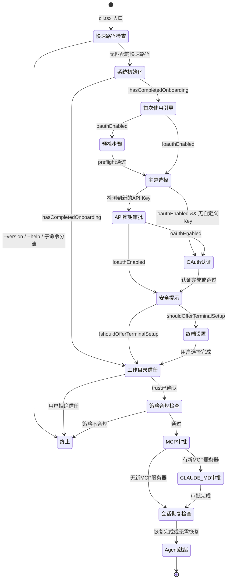
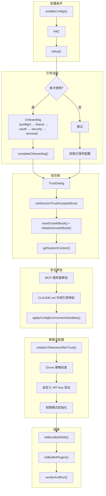
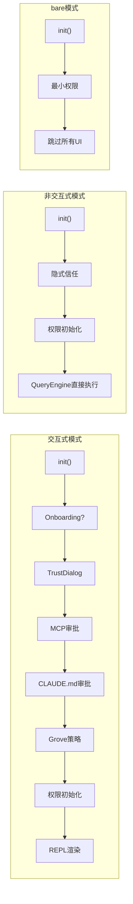

# 第 44 章：应用状态机——从引导到就绪

## 为什么需要状态机

一个 AI Agent 的启动不是"一步到位"的。用户可能是第一次使用，需要完成 OAuth 认证和主题选择；可能是老用户，只需要确认工作目录信任；可能带着 MCP 配置变更，需要审批新服务器；可能需要恢复上次的会话，弹出会话选择器。每一种场景对应不同的初始化路径，路径之间有依赖关系（信任确认必须在环境变量注入之前，OAuth 必须在 GrowthBook 刷新之前）。

如果用一堆 if-else 嵌套来管理这些路径，代码很快就会变成"面条式"的控制流。状态机提供了一种结构化的方式来描述"系统在什么状态下可以做什么操作，做完之后转换到什么状态"。

Claude Code 的启动流程虽然不是严格的有限状态机实现（没有显式的状态转换表），但它的整体结构清晰地体现了状态机的思想：**有序步骤、条件跳转、状态依赖**。

这一章最值得注意的是，启动状态机在 Claude Code 里不只是 UX 编排器，更是**安全顺序引擎**。谁先出现、谁后出现、什么条件下允许前进，本质上都在决定系统什么时候可以被信任、什么时候可以触碰更敏感的能力。

## 44.1 完整的 Bootstrap 状态流转



## 44.2 Onboarding 组件：引导步骤的动态编排

Onboarding 组件（`components/Onboarding.tsx`）是首次使用引导的核心。它的设计非常优雅——不是一个固定的步骤列表，而是根据运行时条件 **动态构建** 步骤数组：

```typescript
const steps: OnboardingStep[] = []

// 条件 1: OAuth 启用时，显示预检步骤
if (oauthEnabled) {
  steps.push({ id: 'preflight', component: preflightStep })
}

// 步骤 2: 主题选择（始终包含）
steps.push({ id: 'theme', component: themeStep })

// 条件 3: 检测到新的自定义 API Key 时
if (apiKeyNeedingApproval) {
  steps.push({ id: 'api-key', component: <ApproveApiKey ... /> })
}

// 条件 4: OAuth 启用时，显示认证流程
if (oauthEnabled) {
  steps.push({ id: 'oauth', component: <SkippableStep ...><ConsoleOAuthFlow /></SkippableStep> })
}

// 步骤 5: 安全提示（始终包含）
steps.push({ id: 'security', component: securityStep })

// 条件 6: 支持终端设置时
if (shouldOfferTerminalSetup()) {
  steps.push({ id: 'terminal-setup', component: terminalSetupStep })
}
```

这种"动态步骤数组"模式比传统的"步骤枚举 + 跳转条件"有几个优势：

1. **步骤顺序即代码顺序**：阅读代码时，步骤的执行顺序一目了然。
2. **无条件跳转逻辑**：不需要 `if (currentStep === 3 && skipOAuth) goto(5)` 这样的逻辑，因为不需要的步骤根本不在数组里。
3. **可测试性**：测试时可以直接构造不同的步骤数组来验证各种场景。

`SkippableStep` 组件处理了一个微妙的状态依赖：如果用户在 API Key 审批步骤中批准了自定义 Key，OAuth 步骤应该被跳过。它通过 React 的 `useEffect` 监听 `skip` 标志，在标志变为 true 时自动调用 `onSkip()`：

```typescript
export function SkippableStep({ skip, onSkip, children }) {
  useEffect(() => {
    if (skip) onSkip()
  }, [skip, onSkip])
  if (skip) return null
  return children
}
```

这是一个在 React 组件中实现"状态条件跳转"的优雅方案——不是通过命令式的路由导航，而是通过条件渲染和 effect 触发。

## 44.3 showSetupScreens：启动检查点的编排

`showSetupScreens()` 函数（`interactiveHelpers.tsx`）是启动状态机的总编排者。它串联了多个独立的对话框，每个对话框都是一个"状态转换点"：

### 转换 1: Onboarding → TrustDialog

```typescript
if (!config.theme || !config.hasCompletedOnboarding) {
  await showSetupDialog(root, done => <Onboarding onDone={() => {
    completeOnboarding()
    void done()
  }} />)
}
```

Onboarding 完成后，`completeOnboarding()` 将 `hasCompletedOnboarding` 和 `lastOnboardingVersion` 写入全局配置。这个持久化操作是一个"状态锚点"——下次启动时，系统会检查这个标志来决定是否跳过 Onboarding。

### 转换 2: TrustDialog → GrowthBook 刷新

```typescript
if (!checkHasTrustDialogAccepted()) {
  await showSetupDialog(root, done => <TrustDialog commands={commands} onDone={done} />)
}
setSessionTrustAccepted(true)
resetGrowthBook()
void initializeGrowthBook()
```

信任确认后立即触发三个动作：(1) 标记会话信任已接受，(2) 重置 GrowthBook（因为信任确认前 GrowthBook 没有认证头），(3) 用新的认证头重新初始化 GrowthBook。这个依赖链确保了 **GrowthBook 的特性标志决策基于认证后的用户身份**。

### 转换 3: 信任后 → MCP 服务器审批

```typescript
const { errors: allErrors } = getSettingsWithAllErrors()
if (allErrors.length === 0) {
  await handleMcpjsonServerApprovals(root)
}
```

只有在配置无错误时才执行 MCP 审批。这是一个"守卫条件"——如果配置有语法错误，先修配置再审批新的 MCP 服务器，避免在错误状态下做安全决策。

### 转换 4: 所有检查完成 → 应用完整环境变量

```typescript
applyConfigEnvironmentVariables()  // 全量环境变量（包含敏感的）
setImmediate(() => initializeTelemetryAfterTrust())
```

这是状态机中最重要的安全边界：**完整的配置环境变量（可能包含敏感的代理设置、证书路径等）只有在信任确认后才被注入**。紧接着初始化遥测系统（因为它依赖环境变量中的 OTEL 端点配置）。

## 44.4 状态依赖图

各启动步骤之间的依赖关系形成一个有向无环图（DAG）。理解这个 DAG 是理解整个启动流程的关键：



这个 DAG 中的每一条边都是一个"不可逆的依赖"——后面的步骤不能在前面的步骤完成之前执行。例如：

- GrowthBook 初始化必须在信任确认之后（否则没有认证头）
- MCP 审批必须在 GrowthBook 初始化之后（因为 GrowthBook 的特性标志控制着是否启用某些 MCP 功能）
- 环境变量注入必须在 MCP 审批之后（因为审批过程可能修改配置）

把它看成 DAG 很重要，因为这意味着 Claude Code 并没有把启动理解为一串随手排出来的步骤，而是理解为一组**必须满足偏序关系的承诺**。只要这种偏序关系清楚，具体实现可以是对话框、函数调用甚至未来的声明式引导器；但如果偏序关系本身不清楚，任何实现最后都会长成脆弱的条件分支森林。

## 44.5 全局状态：bootstrap/state.ts 的设计哲学

`bootstrap/state.ts` 是整个应用的全局状态单例。它不是用 Redux 或 Zustand 这样的状态管理库实现的，而是一个简单的模块级对象加上一组 getter/setter 函数：

```typescript
// DO NOT ADD MORE STATE HERE - BE JUDICIOUS WITH GLOBAL STATE

type State = {
  originalCwd: string
  projectRoot: string
  totalCostUSD: number
  sessionId: SessionId
  isInteractive: boolean
  registeredHooks: Partial<Record<HookEvent, RegisteredHookMatcher[]>> | null
  // ... 约 100 个字段
}

const STATE: State = getInitialState()

export function getSessionId(): SessionId { return STATE.sessionId }
export function getCwdState(): string { return STATE.cwd }
```

文件顶部有两句注释值得深思：

> "DO NOT ADD MORE STATE HERE - BE JUDICIOUS WITH GLOBAL STATE"

> "AND ESPECIALLY HERE"（指向 `const STATE: State = getInitialState()` 这一行）

这个设计选择有几个关键考量：

### 为什么不用状态管理库？

1. **启动时序**：状态管理库本身需要初始化。Claude Code 的全局状态必须在任何其他模块之前就可用（`bootstrap/state.ts` 是导入 DAG 的叶子节点，被几乎所有模块导入）。
2. **简单性**：这些状态不需要响应式更新、不需要订阅机制、不需要时间旅行调试。它们是"设一次、读多次"的配置状态。
3. **性能**：直接对象属性访问比通过 Proxy 或 getter 链更快。在热路径上（如每个 token 的渲染循环中读取 `totalCostUSD`），这个差异是有意义的。

更进一步说，`bootstrap/state.ts` 代表的是一种和 `AppState` 完全不同的状态观。`AppState` 面向交互与渲染，强调响应式；`bootstrap/state.ts` 面向进程级事实，强调可导入、可初始化、低成本读取。把这两类状态混在一起，会让启动流程既不安全，也不清晰。Claude Code 把它们分开，其实是在区分**进程真相**和**界面真相**。

### 为什么用 getter/setter 而不是直接导出对象？

因为 setter 可以包含 **不变量检查**。例如 `setSessionTrustAccepted()` 只接受 `true`——一旦信任被接受，就不能撤销：

```typescript
export function setSessionTrustAccepted(accepted: boolean): void {
  STATE.sessionTrustAccepted = accepted
}
```

更复杂的例子是 `switchSession()`，它原子地同时更新 `sessionId` 和 `sessionProjectDir`，防止两者不同步：

```typescript
export function switchSession(sessionId: SessionId, projectDir: string | null = null): void {
  STATE.planSlugCache.delete(STATE.sessionId)
  STATE.sessionId = sessionId
  STATE.sessionProjectDir = projectDir
  sessionSwitched.emit(sessionId)  // 通知订阅者
}
```

## 44.6 从交互式到非交互式的状态差异

非交互式模式（`-p` / `--print`）和 bare 模式（`--bare`）跳过了状态机中的大部分步骤：



非交互模式中，信任是隐式的（信任 CI/CD 环境），没有 UI 对话框，没有 MCP 审批——直接从 init() 跳到查询执行。bare 模式更进一步，连会话内存、上下文折叠等优化都跳过。

## 44.7 会话恢复：状态机的特殊分支

当用户使用 `--continue` 或 `--resume` 参数时，启动状态机增加一个特殊分支：

1. 在信任确认后，检查是否有指定恢复的会话。
2. 从 `.claude/projects/<cwd>/` 目录加载会话的 JSONL 文件。
3. 解析历史消息，恢复上下文（包括系统提示、工具结果等）。
4. 恢复费用状态（`setCostStateForRestore()`），使累计费用正确延续。
5. 生成新的 sessionId，但设置 parentSessionId 指向被恢复的会话。

这个分支的特殊之处在于它需要 **跨越状态机的边界**：恢复的状态（费用、模型设置、权限模式）会影响后续的 REPL 行为，但恢复操作本身发生在信任确认之后、REPL 渲染之前。

## 44.8 设计启示

### 1. 动态步骤数组优于步骤枚举

Onboarding 的动态步骤构建模式值得在任何多步骤引导流程中借鉴。它避免了"步骤 3 跳到步骤 5"这样的硬编码逻辑，让每个步骤的包含/排除由运行时条件自然决定。

### 2. 安全边界是状态机中最不可妥协的边

Claude Code 启动状态机中最核心的边是"信任确认 → 应用完整环境变量"。这条边将"用户还没说信任"和"系统开始执行可能危险的操作"严格分开。在设计任何涉及安全的状态机时，首先应该确定的就是这些"安全边界"。

### 3. 全局状态应该是导入 DAG 的叶子

`bootstrap/state.ts` 被几乎所有模块导入，但它自身几乎不导入任何模块（只导入了 `randomUUID` 和少数类型）。这确保了它在导入顺序上最先被初始化，不会产生循环依赖。如果你的系统需要全局状态，确保它位于依赖图的最底层。

### 4. 状态持久化是重启间的"记忆"

`hasCompletedOnboarding`、`migrationVersion`、`lastOnboardingVersion` 这些持久化标志是启动状态机的"记忆"。没有它们，每次启动都要重新走一遍所有步骤。好的状态机设计应该明确区分"会话内状态"（如 `sessionTrustAccepted`，进程退出就消失）和"持久化状态"（如 `hasCompletedOnboarding`，跨重启保留）。

```
源码位置：
  components/Onboarding.tsx         — 首次使用引导组件
  interactiveHelpers.tsx            — showSetupScreens 编排器
  bootstrap/state.ts                — 全局状态单例（约 100 个字段）
  entrypoints/cli.tsx               — 快速路径分流
  main.tsx                          — 完整 CLI 初始化主函数
  setup.ts                          — 环境准备
  entrypoints/init.ts               — 系统级初始化（memoize）
  projectOnboardingState.ts         — 项目级引导状态
  utils/earlyInput.ts               — 启动期间的用户输入缓冲
```
