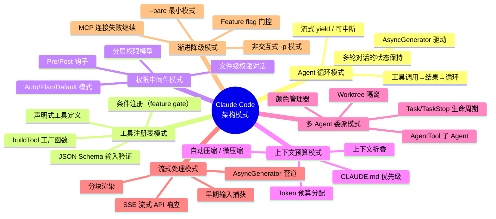

# 第 45 章：架构模式总结与启示

## 从源码中提炼设计智慧

经过全书 44 章的源码分析，我们从 Claude Code 这一代码库中提炼出了七个反复出现的核心架构模式。这些模式不是理论上的"设计模式教科书"分类，而是在大规模 AI Agent 系统中被验证过的工程实践。每一个模式都解决了 AI Agent 特有的一个设计问题——这些问题在传统软件中不存在或不突出，但在 Agent 系统中却是根本性的挑战。

如果只看局部实现，这七个模式像是七个分散的话题；但把它们放在一起，你会发现 Claude Code 真正反复在做的一件事，是把一个本来模糊、不稳定、容易越界的 LLM 执行体，逐步包进可管理的工程边界里。全书所有设计，几乎都在回答同一个问题：**如何让一个会思考但不稳定的系统，像可靠软件一样工作。**

## 45.1 设计模式全景图



## 45.2 模式一：Agent 循环模式

### 核心问题

AI Agent 的核心是一个可能执行零次或多次工具调用的循环。模型可能直接回答（零次工具调用），也可能连续调用多个工具（文件读取、代码修改、测试运行），每次工具调用的结果需要回传给模型，模型再决定下一步。这个循环什么时候结束、怎么中断、状态怎么保持，是整个系统最根本的设计问题。

### Claude Code 的解决方案

`query.ts` 中的 `query()` 函数是一个 **AsyncGenerator**。这个选择解决了三个子问题：

1. **流式传输**：API 的响应逐 token 到达，生成器在每个事件时 `yield`，UI 实时渲染。
2. **状态保持**：闭包天然保留了 `messages`、`toolUseContext` 等跨迭代状态，不需要外部状态管理。
3. **可中断性**：调用者可以通过 `.return()` 方法中断循环，内部的 `AbortController` 将取消信号传播到 API 调用和工具执行。

### 能学到什么

Agent 循环不应该是传统的 `while` 循环 + 回调，也不应该是 Promise 链。AsyncGenerator 提供了"流式输出 + 状态保持 + 可中断"三位一体的能力，是目前 JavaScript/TypeScript 生态中实现 Agent 循环的最佳原语。如果你的 Agent 系统使用 Python，等价的原语是 `async def agent_loop() -> AsyncGenerator[Event]`。

```
源码位置：
  query.ts                    — query() AsyncGenerator
  QueryEngine.ts              — 查询引擎，协调一次完整交互
```

## 45.3 模式二：工具注册表模式

### 核心问题

一个 AI Agent 的能力边界由它拥有的工具决定。工具不是静态的——MCP 服务器可以动态添加工具，插件系统可以注册新工具，条件编译可能排除某些工具。如何让工具的注册、发现、调度、输入验证成为一个统一的、可扩展的系统？

### Claude Code 的解决方案

工具注册表的核心是 `Tool.ts` 中的 **声明式工具定义**。每个工具通过 `buildTool()` 工厂函数创建，定义包含：

- **名称和描述**：模型用来决定何时调用这个工具
- **JSON Schema**：输入验证，既用于模型生成正确的参数，也用于运行时验证
- **执行函数**：实际的工具逻辑
- **权限要求**：这个工具需要什么级别的权限
- **进度回调**：长时间运行的工具如何报告进度

`tools.ts` 是工具注册表的入口，它通过条件导入（`feature()` 门控）实现工具的条件注册：

```typescript
const cronTools = feature('AGENT_TRIGGERS') ? [...] : []
const SleepTool = feature('PROACTIVE') ? require(...) : null
```

加上 MCP 动态工具（`getMcpToolsCommandsAndResources()`），最终的工具列表 = 内置工具 + 条件工具 + MCP 工具 + 插件工具。

### 能学到什么

工具注册表应该是 **声明式的、可组合的、可条件注册的**。不要硬编码 `if (toolName === 'bash') ...` 的分发表——让工具通过统一的接口自描述，让调度逻辑通过接口而非具体类型来工作。条件注册让同一个代码库可以构建不同能力的 Agent 变体（内部版 vs 外部版，完整版 vs bare 模式）。

```
源码位置：
  Tool.ts                     — buildTool() 工厂、工具类型定义
  tools.ts                    — 工具注册表入口
  services/mcp/client.ts      — MCP 动态工具加载
```

## 45.4 模式三：权限中间件模式

### 核心问题

AI Agent 可以执行任意代码、读写任意文件、访问网络。这些能力在带来强大功能的同时，也带来了严重的安全风险。如何在保持 Agent 灵活性的同时，给用户提供足够的安全控制？

### Claude Code 的解决方案

权限系统是一个 **多层中间件架构**：

1. **权限模式**（Permission Mode）：`default`（每次确认）、`plan`（只读）、`auto`（自动确认）、`bypass`（CI/CD 模式）。这是最粗粒度的安全控制。
2. **工具级权限**：每个工具声明自己需要的权限级别（`allowlist`、`auto-allow`、`confirm-every-time`）。
3. **文件级权限对话框**：对于文件写入工具（Edit、Write），按路径显示权限对话框，用户可以一次性批准整个目录。
4. **Hook 系统**：用户可以通过 `SessionStart`、`PreToolUse`、`PostToolUse` 等 Hook 注入自定义的安全逻辑。
5. **安全边界**：信任对话框（TrustDialog）是第一个安全门——在用户确认信任当前工作目录之前，配置文件中的环境变量不会被注入。

### 能学到什么

AI Agent 的权限系统应该是 **渐进式的**：从粗粒度（模式）到细粒度（工具、文件路径），从内置规则到用户自定义 Hook。不要试图一次性设计完美的权限系统——先有基础的保护，再通过 Hook 系统让用户按需扩展。安全的关键不是限制能力，而是让用户理解并控制正在发生什么。

```
源码位置：
  utils/permissions/           — 权限模式、工具权限
  components/TrustDialog/      — 工作目录信任
  utils/hooks/                 — Hook 系统
```

## 45.5 模式四：上下文预算模式

### 核心问题

大语言模型有上下文窗口限制（如 200K token）。一个长时间运行的 Agent 会话可能产生大量对话历史、工具输出、CLAUDE.md 指令、系统提示词等。如何在有限的上下文窗口内，最大化有用信息、最小化冗余？

### Claude Code 的解决方案

上下文管理是一个 **预算分配系统**：

1. **Token 预算计算**：根据模型和 beta 标志计算总上下文窗口，减去系统提示词和工具定义的开销，得到可用于对话的 token 数。
2. **优先级排序**：CLAUDE.md（项目指令）和最近的消息优先保留，早期的工具输出可以被压缩或折叠。
3. **自动压缩**（AutoCompact）：当上下文接近上限时，自动触发压缩——用一个摘要替换旧消息。
4. **微压缩**（MicroCompact）：更激进的压缩策略，保留最近 N 轮对话的完整内容，之前的全部摘要化。
5. **上下文折叠**（ContextCollapse）：将重复或低价值的消息折叠成可展开的摘要。

### 能学到什么

上下文预算是 AI Agent 系统独有的资源管理问题，类似于操作系统的内存管理。关键设计原则是 **分级策略**：不压缩（最佳质量）→ 自动压缩（平衡）→ 微压缩（延长会话寿命）→ 强制压缩或截断（防止崩溃）。让用户选择策略级别，但系统应该在默认配置下自动处理大部分情况。

```
源码位置：
  utils/context.ts             — 上下文预算计算
  services/contextCollapse/    — 上下文折叠
  query.ts                     — 自动压缩触发逻辑
```

## 45.6 模式五：多 Agent 委派模式

### 核心问题

单个 Agent 的能力有限——它一次只能处理一个任务，上下文窗口限制了它能"记住"的信息量。如何让多个 Agent 协作处理复杂任务？

### Claude Code 的解决方案

多 Agent 系统的设计采用了 **委派模式**：

1. **主 Agent**：运行在 REPL 中的主循环，负责与用户交互、任务分解。
2. **子 Agent**（AgentTool）：主 Agent 通过 `AgentTool` 创建子 Agent，每个子 Agent 有独立的上下文、独立的权限、独立的工具集。
3. **颜色管理**：`agentColorManager` 为每个子 Agent 分配唯一的颜色标识，在终端中区分不同 Agent 的输出。
4. **Worktree 隔离**：子 Agent 可以在独立的 Git Worktree 中工作，实现文件系统级别的隔离。
5. **生命周期管理**：`Task` 和 `TaskStop` 工具管理子 Agent 的创建和终止。

这个设计的核心洞察是：**子 Agent 不是共享内存的线程，而是通过消息传递通信的进程**。每个子 Agent 有自己的完整状态，主 Agent 通过任务描述和结果来管理它们。

### 能学到什么

多 Agent 系统应该遵循 **Actor 模型** 而非共享内存模型。每个 Agent 是一个独立的执行单元，有自己的上下文和生命周期。Agent 之间通过消息（任务描述、执行结果）而非共享状态来协调。这确保了系统的可扩展性——添加更多 Agent 不会增加单个 Agent 的复杂度。

同时也要看到，多 Agent 从来不是免费午餐。它扩大吞吐量，也扩大协调成本；它分散注意力，也制造一致性问题。因此，多 Agent 真正适合的是那些可以自然拆成多个责任边界的任务，而不是把一个本来就需要统一判断的问题硬拆成多人会议。

```
源码位置：
  tools/AgentTool/             — 子 Agent 工具
  tools/AgentTool/agentColorManager.ts — Agent 颜色管理
  tools/TaskOutputTool/        — 任务输出工具
  utils/worktree.ts            — Worktree 管理
```

## 45.7 模式六：流式处理模式

### 核心问题

大语言模型的 API 响应是流式的——token 一个一个到达。用户不应该等到所有 token 都到达才看到响应。如何设计一个从 API 到终端的端到端流式管道？

### Claude Code 的解决方案

流式处理是一个 **多层 AsyncGenerator 管道**：

1. **API 层**：SSE（Server-Sent Events）流，每个 token 作为一个独立的事件。
2. **解析层**：将 SSE 事件解析为结构化的 `StreamEvent`（TextDelta、ToolUse、ToolResult 等）。
3. **查询层**：`query()` AsyncGenerator yield 事件，保留流式性。
4. **渲染层**：Ink（React for CLI）的渲染循环在事件到达时立即更新 UI。

管道中的每一层都是"透传"的——它们不缓冲完整响应，而是在每个事件到达时立即处理并向下传递。

### 能学到什么

流式处理不应该只是在 API 层用 SSE，而应该是一个从数据源到 UI 的 **端到端管道**。管道中的每个环节都应该是流式的（AsyncGenerator 或 Observable）。缓冲应该是显式的、有意的，而不是因为某个中间层碰巧需要完整数据。

Claude Code 还在启动流程中实现了"流式"的思想——`startCapturingEarlyInput()` 在 REPL 还没渲染时就开始捕获用户输入，确保了从用户按下第一个键到系统响应的完整流式体验。

```
源码位置：
  query.ts                     — AsyncGenerator 流式管道
  utils/earlyInput.ts          — 早期输入捕获
  ink.ts                       — Ink 渲染引擎集成
```

## 45.8 模式七：渐进降级模式

### 核心问题

AI Agent 系统依赖大量外部服务——API、MCP 服务器、插件、OAuth 认证。任何一个都可能失败或不可用。如何确保系统在部分组件失败时仍能提供有价值的服务？

### Claude Code 的解决方案

渐进降级体现在多个层次：

1. **模式降级**：交互式 REPL → 非交互式 `-p` → `--bare` 最小模式。每一级都丢弃一些功能，但保留核心的查询能力。
2. **MCP 降级**：MCP 服务器连接失败不阻止启动——失败的 MCP 工具在工具列表中被标记为不可用，Agent 会收到错误消息并可以改用其他方案。
3. **Feature Flag 门控**：每个实验性功能通过 `feature()` 门控，构建时可以完全移除（DCE），运行时可以通过 GrowthBook 动态开关。
4. **配置错误容忍**：`settings.json` 中的语法错误不会阻止启动——系统会收集所有错误并展示给用户，但允许用户继续使用基本功能。

### 能学到什么

AI Agent 系统的健壮性不在于"所有组件都正常工作时多么强大"，而在于"部分组件失败时还能做什么"。设计每个功能时，都应该问：**如果这个功能的依赖不可用，系统应该怎么表现？** 答案通常是"降级到更基础的功能"而不是"完全失败"。

从系统观上说，渐进降级的意义不只是保底，而是定义主次关系。只有当你明确知道什么是核心能力、什么是增强能力，系统才能在受损时仍保持身份一致。Claude Code 能在复杂依赖下仍然可用，关键不是它失败得少，而是它知道先保什么。

```
源码位置：
  entrypoints/cli.tsx          — 快速路径 / bare 模式
  services/mcp/client.ts       — MCP 连接失败处理
  utils/settings/              — 配置错误收集与容忍
```

## 45.9 给未来 AI Agent 架构师的实践建议

基于对 Claude Code 源码的全面分析，以下是设计 AI Agent 系统时的实践建议：

### 1. 先设计 Agent 循环，再设计其他一切

Agent 循环是系统的骨架。先确定循环的原语（AsyncGenerator? 事件循环? 状态机?），再围绕它构建工具系统、权限系统、上下文管理。Claude Code 选择 AsyncGenerator 是一个深思熟虑的决定——如果你在设计 Python Agent，等价的 AsyncGenerator 同样适用。

### 2. 工具是 Agent 能力的边界，工具注册表是工具的宪法

不要让 Agent 通过字符串匹配来调用工具。构建一个声明式的工具注册表，让每个工具自描述（名称、参数 Schema、权限要求、进度报告），让调度逻辑统一、可测试、可扩展。

### 3. 安全是从第一行代码开始考虑的，不是事后补丁

Claude Code 的安全边界（TrustDialog → 环境变量注入 → 权限检查）从启动状态机的第一个状态就开始了。你的 Agent 系统应该在架构设计阶段就确定"信任边界在哪里"、"什么操作需要什么级别的授权"。

### 4. 上下文是有限资源，像管理内存一样管理它

大语言模型的上下文窗口是 AI Agent 系统中最稀缺的资源。设计分级的上下文管理策略（保留 → 压缩 → 折叠 → 截断），让系统在长时间运行时仍然有效。

### 5. 流式体验不是优化，是基本要求

用户不应该盯着空白屏幕等待 30 秒才看到第一个字。从 API 到 UI 的每个环节都应该是流式的。如果某个中间层必须缓冲完整数据，那应该有充分的理由。

### 6. 启动速度是用户留存的第一道关

CLI 工具的启动时间直接决定了用户是否愿意使用它。快速路径分流、并行预取、延迟初始化——这些技术的目标不是"快"，而是"让用户感觉快"。用户感知到的是"从按下回车到看到界面"的时间，而不是"系统初始化完成"的时间。

### 7. 多 Agent 是 Actor 模型，不是共享内存

子 Agent 应该是独立的执行单元，有自己的上下文、生命周期和故障域。Agent 之间通过消息传递协调，不共享可变状态。这确保了系统的可扩展性和容错性。

### 8. 把"可靠性"理解成边界管理，而不是模型更聪明

Claude Code 最深的启示，不是如何提示词写得更强，而是如何用状态、权限、上下文预算、恢复协议、插件边界和启动顺序，把一个不确定的模型放进确定的系统结构里。模型能力会继续变化，但边界管理能力才是真正可复用的架构资产。

## 45.10 当前架构的局限性

诚实地说，Claude Code 的架构也有一些值得讨论的局限性：

### 1. 全局状态单例的膨胀

`bootstrap/state.ts` 已经积累了约 100 个字段。虽然文件顶部有"DO NOT ADD MORE STATE HERE"的警告，但现实是每个新功能都需要一个地方存储会话状态。长期来看，可能需要按功能域拆分状态（如 `CostState`、`PermissionState`、`SessionState`），通过统一的接口访问。

### 2. main.tsx 的"上帝函数"

`main()` 函数有超过 3000 行，包含了命令行解析、初始化编排、多种模式的分支逻辑。这个函数的可读性和可维护性已经接近极限。一个可能的改进是将不同模式（交互式、非交互式、远程控制、Assistant）提取为独立的"入口策略"，通过策略模式替换当前的 if-else 分支。

### 3. 工具接口的多样性

`buildTool()` 工厂函数提供了统一的工具定义接口，但实际上不同工具的执行模式差异很大——有同步的文件操作、有长时间运行的子进程、有需要多次 API 调用的复合工具。这些差异目前通过内部的 `toolType` 字段区分，而不是通过类型系统的多态。

### 4. 测试的局部困难

全局状态单例和大量的副作用（环境变量修改、文件系统操作、子进程启动）使得某些模块的单元测试比较困难。`resetStateForTests()` 函数的存在说明全局状态确实需要在测试间重置，而这是全局可变状态的经典代价。

## 45.11 未来可能的方向

基于当前架构的趋势和 AI Agent 领域的发展，以下是一些可能的方向：

### 1. 从单进程到多进程架构

当前的 AgentTool 子 Agent 运行在同一个进程内的独立上下文中。更强大的多 Agent 协作可能需要真正的多进程隔离——每个 Agent 运行在独立的进程中，通过 IPC 通信。这提供了更好的故障隔离和资源控制，但也带来了通信成本。

### 2. 持久化 Agent 状态

当前的 Agent 状态（对话历史、工具结果、费用累计）在进程退出后就丢失了（除了通过 `--resume` 恢复的 JSONL 文件）。一个更持久的 Agent 状态层可以让 Agent 跨重启保持"记忆"，实现真正的长期运行 Agent。

### 3. 声明式 Agent 定义

当前的工具和 Agent 主要通过命令式代码定义。一个更声明式的方法可能是通过 YAML/JSON 配置定义 Agent 的行为（类似 Kubernetes 的 Operator 模式），让非开发者也能定制 Agent。

### 4. 更精细的上下文管理

当前的上下文压缩是一个"全有或全无"的操作——压缩一段历史就是用一个摘要完全替换它。更精细的方法可能是分层保留：关键决策永远保留，实现细节按需压缩，错误日志完全丢弃。

## 结语

设计一个 AI Agent 系统不是设计一个普通的应用程序。它需要你同时思考：大语言模型的能力边界、用户的安全需求、长时间运行的资源管理、流式交互的体验质量、多 Agent 协作的复杂性。Claude Code 的源码提供了一个经过大规模验证的参考实现——它不是完美的，但它的每一个设计选择背后都有清晰的工程推理。

希望这本书能帮助你在设计自己的 AI Agent 系统时，少走一些弯路。

```
核心源码文件索引：
  entrypoints/cli.tsx          — 启动入口与快速路径
  main.tsx                     — 完整 CLI 初始化
  setup.ts                     — 环境准备编排
  bootstrap/state.ts           — 全局状态单例
  query.ts                     — Agent 循环（AsyncGenerator）
  QueryEngine.ts               — 查询引擎
  Tool.ts                      — 工具定义与 buildTool 工厂
  tools.ts                     — 工具注册表
  components/Onboarding.tsx    — 首次使用引导
  interactiveHelpers.tsx       — 启动对话框编排
  utils/startupProfiler.ts     — 启动性能分析
  utils/permissions/           — 权限系统
  utils/context.ts             — 上下文预算
  services/mcp/client.ts       — MCP 动态工具
  tools/AgentTool/             — 多 Agent 委派
```
